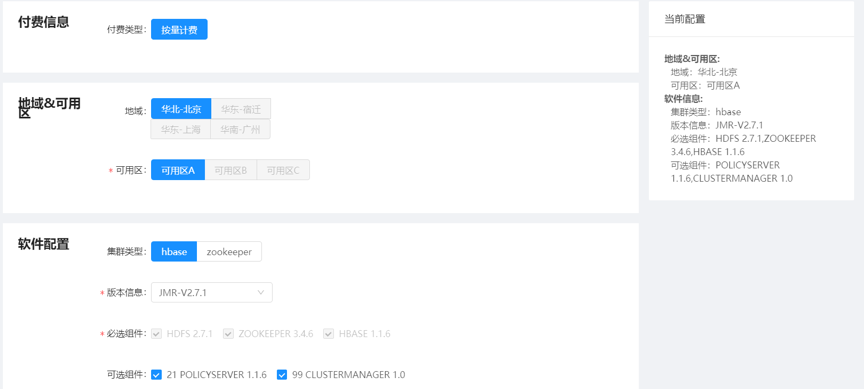
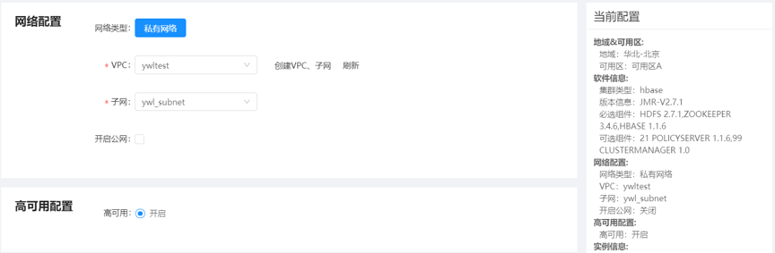
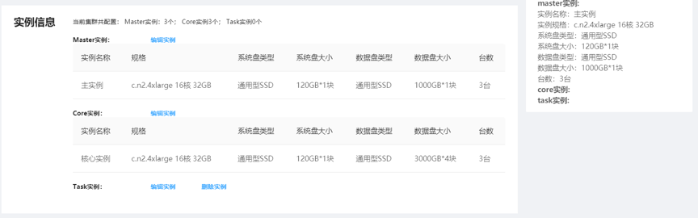
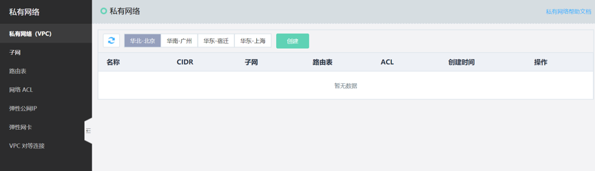
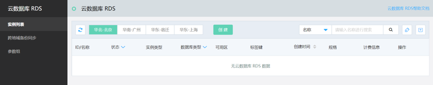
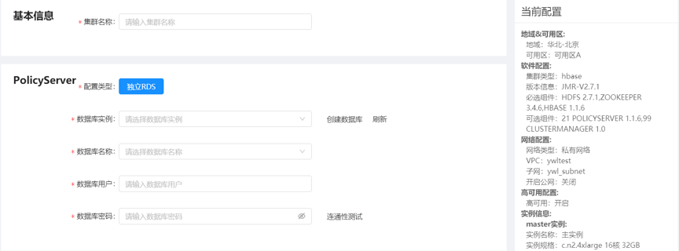

# 创建集群

本文介绍通过云数据库 JDNoSQL控制台创建集群。

## 前提条件

- 完成权限授权

## 操作步骤

1. 登录 [云数据库 JDNoSQL控制台]，默认进入集群列表页面。

2. 在集群列表页面，点击创建集群按钮。

    1）软件信息配置：付费信息、地域信息、软件配置
    
       地域&可用区：服务器所在区域
       
    

    2）硬件信息配置：网络信息、高可用信息、实例信息
    
       网络信息：私有网络VPC，子网，带宽配置
          
       网络信息配置依赖于京东云上私有网络产品，编辑网络信息时会校验该地域下是否已经创建好VPC，子网，如已经创建，则可直接使用。如还未创建，则跳转到私有网络产品中在该地域下创建上述信息，然后刷新并回显到本页面。
       
    

    

    

        高可用信息默认开启：开启后MASTER实例会由1台机器扩到3台，CORE实例无影响
        
        实例组配置：配置MASTER实例，CORE实例，Task实例资源信息
        
        主实例节点（Master）：部署管理服务（例如：HMaster、NameNode等）
        
        核心实例节点（Core）：部署存储服务（例如：DataNode）
        
        计算实例节点（Task）：只部署计算服务，不部署任何HDFS相关的服务
        
    3）基础信息配置：集群基本信息、policyserver数据信息、登陆信息

        policyserver数据类型目前只支持独立RDS，依赖于京东云上云数据库RDS产品，交互过程同私有网络配置流程。
        
    
    
    
    
    
    
    4) 确认信息：本页面会对之前步骤中编辑信息进行再次确认，确认无误后，正式发起集群创建流程。至此，集群创建过程完成，发起创建流程后，可去集群列表页实时跟踪集群创建情况

