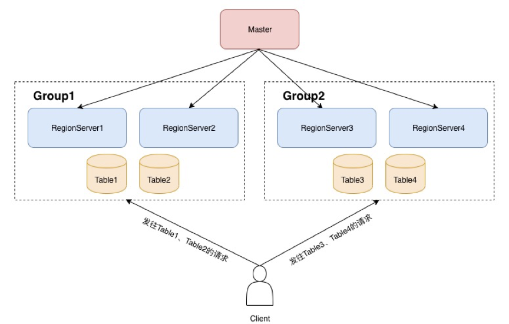
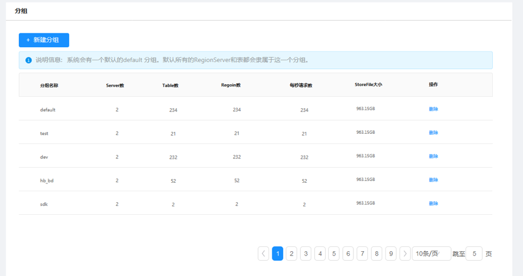
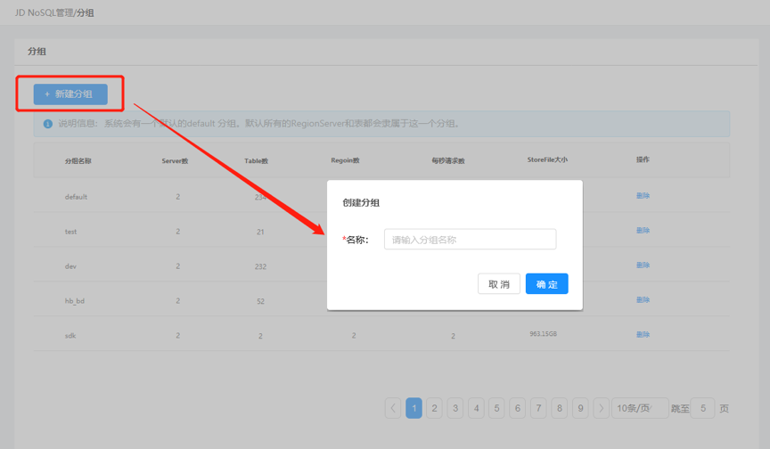
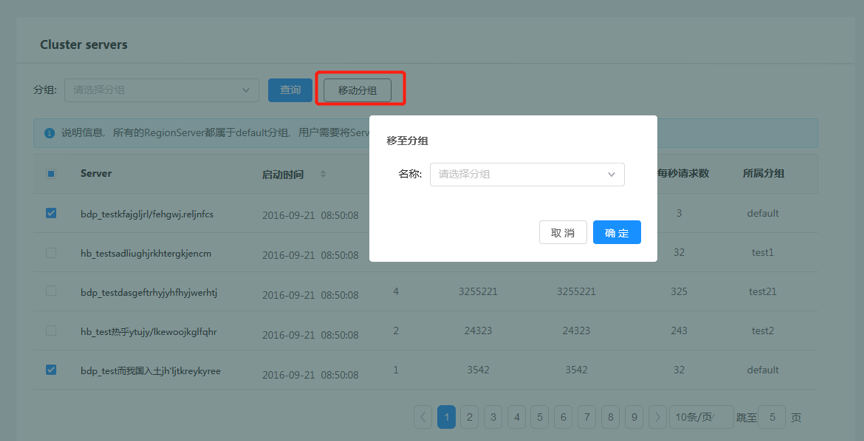

# 分组管理

当多个用户或者业务在使用同一个集群时，往往会存在资源争抢的问题。一些重要的在线业务的读写，可能会被离线业务批量读写所影响。分组功能提供解决多租户隔离问题的功能。通过把RegionServer划分到不同的分组，每个分组上host不同的表，从而达到资源隔离的目的。

## 查看分组信息

在集群管理界面的分组管理中，可以看到当前集群所有的分组信息。如果用户没有创建过任何分组，系统会有一个默认的default分组。所有的RegionServer和表都会隶属于这一个分组。

 

## 新建分组

在分组管理页面中，点击新建分组按钮，创建新的分组。创建新的分组后，这个分组内的server数量和表数量都会为0，后续需要用户将Server和表移动至这一个分组。

## 删除分组

在分组管理中，点击分组表对应行的“删除”，删除对应的分组。注意，只有当该分组中的所有表和Server都被移出的时候，分组才能被删除

## 移动RegionServer的所属分组

默认状态下，所有的RegionServer都属于default分组，用户需要将Server移动到对应的分组中才能使用。移动分组的使用方法如下：
集群管理概览中的cluster servers表中,勾选要移动的RegionServer,然后点击“移动分组”按钮.，在下拉框中选择目标分组，点击确定。
注意：未分配Regionserver的分组不允许将表移入当前分组

