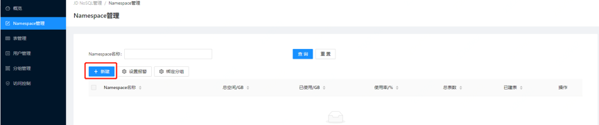
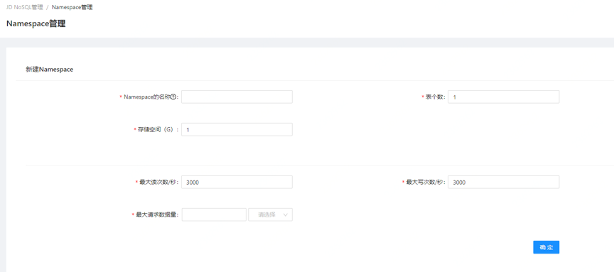
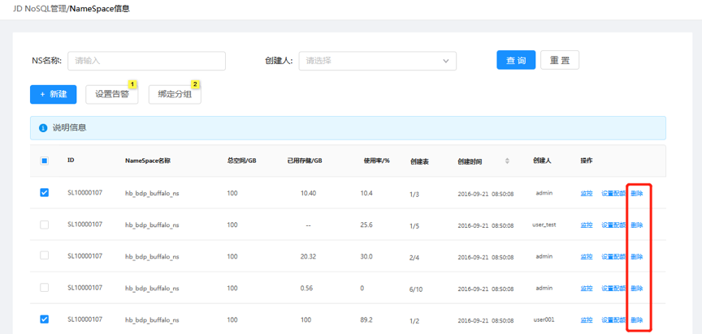
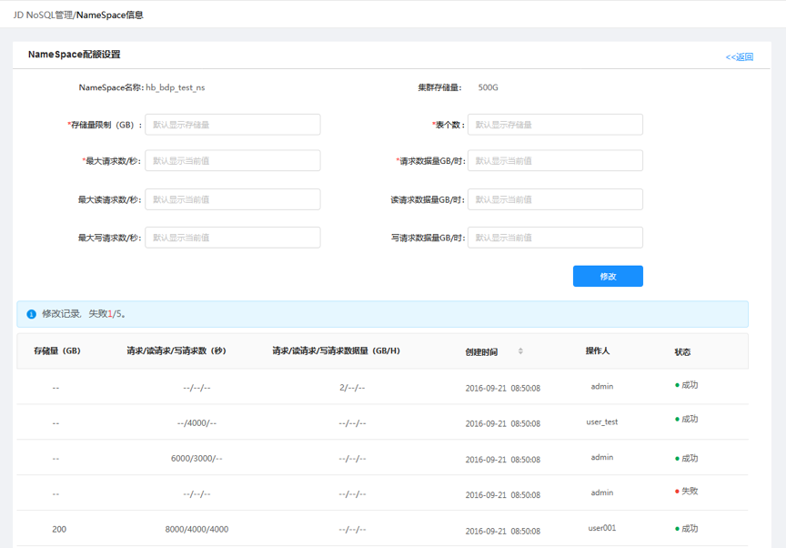
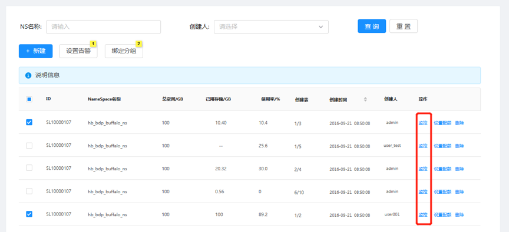
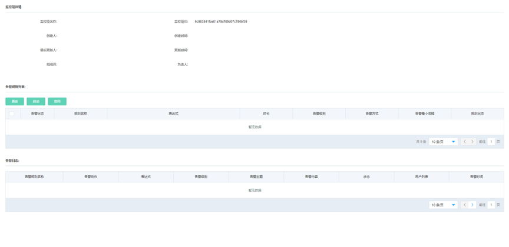

# Namespace管理

云数据库 JDNoSQL中的Namesapce相当于表的一个逻辑分组。不同的Namespace下面的表允许重名。不同的租户拥有不同的namespace，彼此无法看到和影响。即不同用户的namespace将看到不同的表集合。

## 创建NameSpace

* 1.在菜单中点击NameSpace管理，在管理界面点击新建。

* 2.在新建Namespace界面填写新建表单，确定后完成创建。

## 删除NameSpace

在Namepace信息页面，操作栏点击”删除”按钮，可删除对应的NameSpace。注：删除Namespace前请先将该Namespace下所有的表都删除，否则会删除失败

## 设置NameSpace配额

在Namepace信息页面，操作栏点击”设置配额”按钮，进入对应的NameSpace配额设置界面，修改配额设置表单完成配额设置。修改内容会在修改记录中显示。

## 绑定Namespace所属分组

在Namespace界面选中对应的Namespace，点击绑定分组，选择要绑定的分组名称。绑定Namespace所属分组可以将该Namespace下所有表自动关联到当前分组。

  
## Namespace监控

在Namepace信息页面，操作栏点击”监控”按钮，可查看对应的NameSpace的监控信息。

## Name设置告警

在Namespace界面选中对应的Namespace，点击设置告警，进入设置告警界面。

