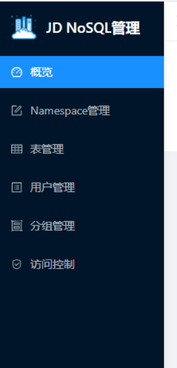

# 概览

JDNoSQL为用户提供了一个，集群管理系统，通过该系统可以查看集群的基础信息，Server信息等来查看集群的容量情况。还可以完成namespace管理、表管理、用户管理、ACL管理等功能。

在主页中，可以看到集群以下信息：

集群空间使用情况

在此部分用户可以看到自己集群的空间的使用情况，是否需要扩容集群的磁盘空间。

* 分组信息

在此部分用户可以看到集群中的所有分组，并可以对分组进行管理。关于分组的详细介绍，请参见分组管理 。

* Server列表

在此部分用户可以看到所有在线的RegionServer，以及一些Server的状态，如果单击Server的名字，还可以查看Server的详情，包括此RegionServer上的Region信息等。用户可以把RegionServer分配到不同的Group里从而达到请求隔离的目的 。

* 集群健康信息

如果有宕机的RegionServer，或者没有上线的Region，会在此部分展示。HBase在balance或者split Region时，Region会有短暂不在线，属于正常情况，如果存在长时间不在线的Region或者RegionServer，请提交工单。

* Namespace信息

在Namespace信息页面中，用户可以看到集群中所有的namespace，并对namespace进行管理。详细的namespace管理请参见Namespace管理 。

* 表信息

在表信息页面中，用户可以看到集群中所有的表，以及属性，当单击表名后，可以看到表的详细信息，所有Region信息等等。

* 用户管理

在用户管理页面中，用户可以看到当前集群中的用户，以及其所拥有的权限，用户可以进行创建用户，修改用户密码，删除用户等操作。详细的指南可以参见用户管理 。

* 访问控制

在访问控制页面中，用户可以添加白名单用户，可以通过添加IP来控制地址访问。详细的指南可以参见访问控制。