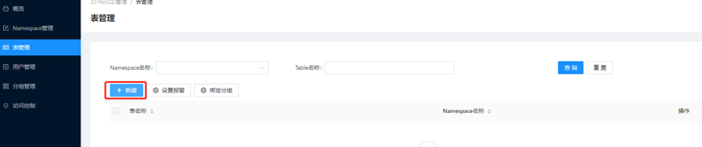
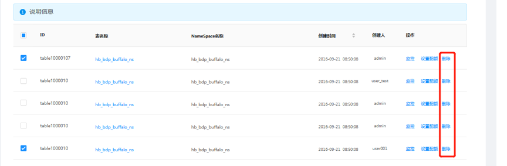
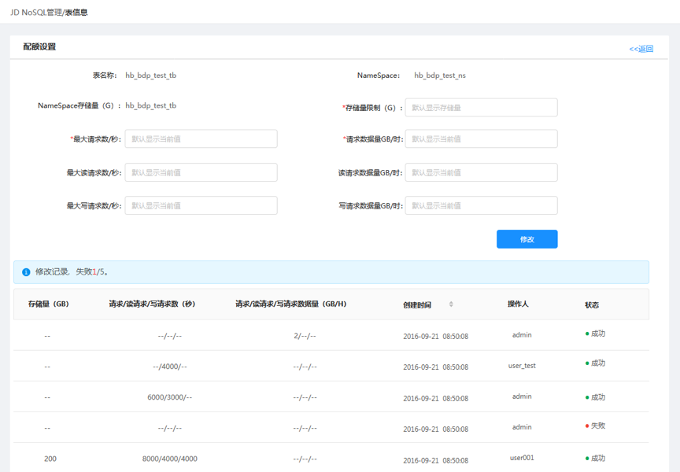
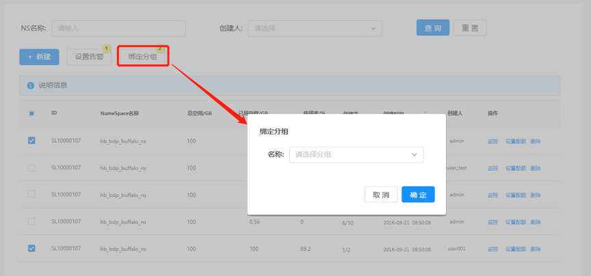
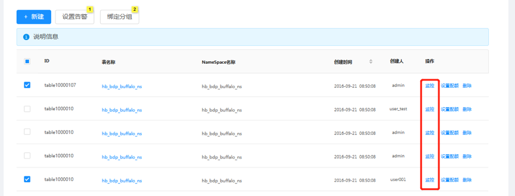

# 表管理

在表管理页面中，您可以看到集群中所有的表以及表属性。单击表名后，您可以看到表的详细信息。

## 筛选表

可以通过Namespace的筛选或表名称直接进行查询过滤对应的表

## 创建表

* 1.在菜单中点击表管理，在表管理界面点击新建。

* 2.在新建表界面填写新建表单，确定后完成创建。

## 删除表
  
在表信息页面，操作栏点击”删除”按钮，可删除对应的表。注：删除表会将表的数据永久删除，不可恢复。

## 设置表配额

在表信息页面，操作栏点击”设置配额”按钮，进入对应的表配额设置界面，修改配额设置表单完成配额设置。修改内容会在修改记录中显示。

## 绑定表所属分组

在表管理界面选中对应的表，点击绑定分组，选择要绑定的分组名称。绑定表所属分组可以将该表自动关联到当前分组。

## 表监控

在表信息页面，操作栏点击”监控”按钮，可查看对应的表的监控信息。

 
## 表设置告警

在表管理界面选中对应的表点击设置告警，进入设置告警界面。

