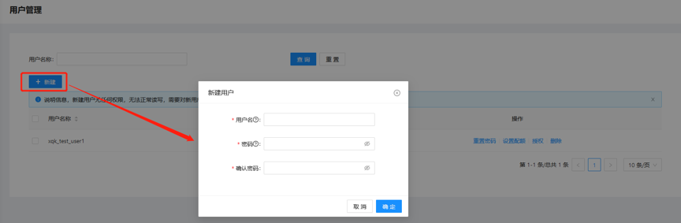
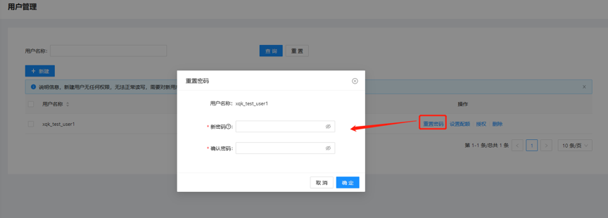
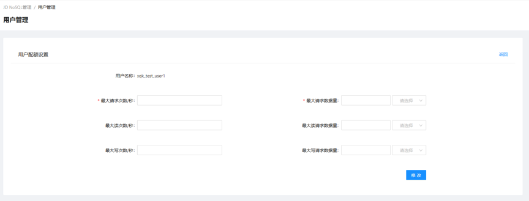
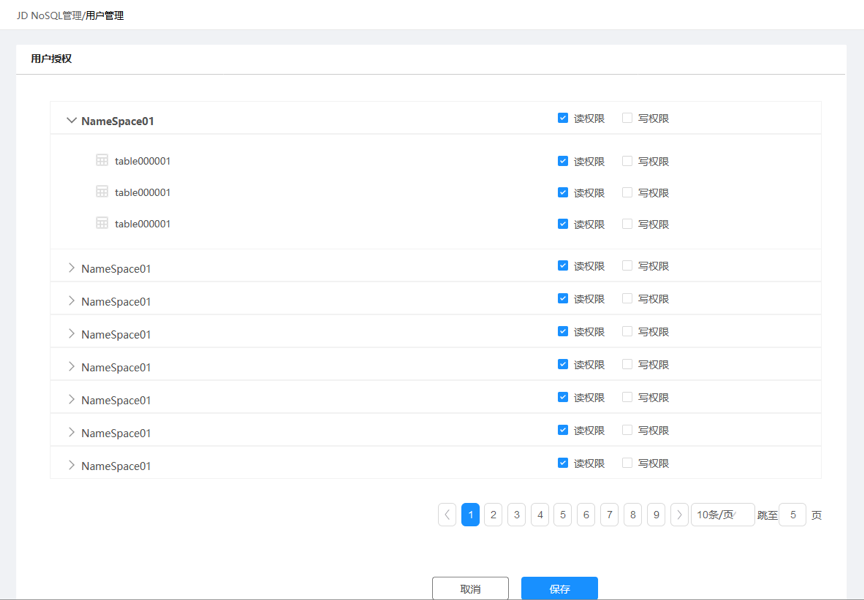

# 用户管理

JDNoSQL提供一套简单易用的用户和权限体系。用户的创建只需要在配置中简单的填写用户名密码即可。在集群管理页面的用户管理页面中。会列出当前集群内的所有用户列表。

## 创建用户

在用户管理界面点击新建创建用户，新建用户无任何权限，无法正常读写，需要对新用户进行授权。在弹框种输入用户名和密码，确定后创建完成。

## 重置密码

在用户列表操作栏点击重置密码，修改用户密码。

 
## 删除用户

## 用户配额设置

在用户列表操作栏，点击用户配额设置进入设置界面，通过对用户的配额设置，实现资源访问的合理管控。填写设置表单，确定后完成设置。

## 用户授权

在用户列表操作栏，点击用户授权设置进入授权界面，可以对Namespace和表进行授权，控制的权限包括读权限和写权限。勾选授权对象和方式，保存后完成设置。

