# 集群管理

集群信息维护，包括：实例组扩容，指定集群监控，集群服务配置，集群主机管理、服务外部链接信息查看等功能。

* 1.集群信息查询

集群信息：集群列表页以集群名称和ID为唯一标识，查看当前集群运行状态，运行总时长，创建时间，以及当前用户集群分类统计数量。

集群操作：集群状态刷新，集群详细信息查看，集群启动/停止/监控

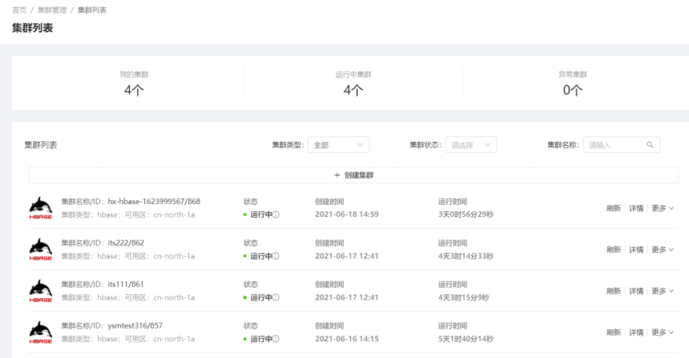

* 2.集群扩容

目前集群扩容支持手动扩容，暂不支持动态扩容，扩容对象为：CORE和TASK实例组，扩容方式为新增实例组和已有实例组机器扩容。

新增实例组：可以新增一个实例组，选择新的类型以及云主机规格、台数、大小等信息

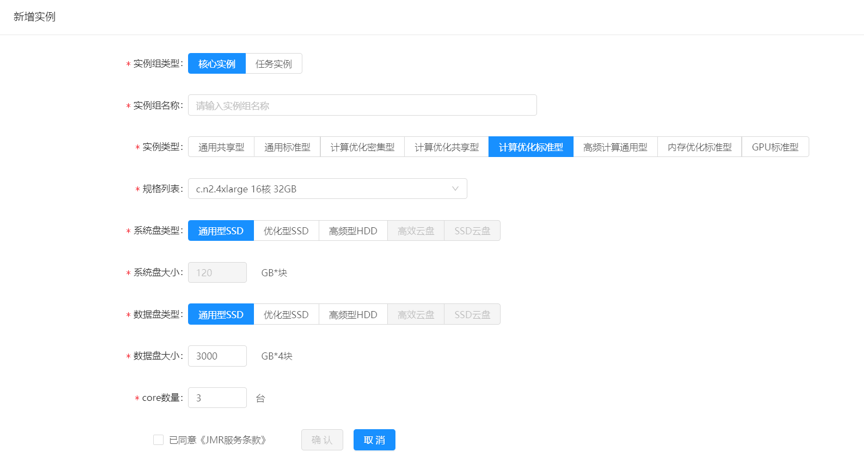

扩容台数：可以在原本已经创建好的实例组里增加云主机台数，规格同已有

 
* 3.集群缩容：支持云主机维度缩容功能，并可对缩容过程进行查看

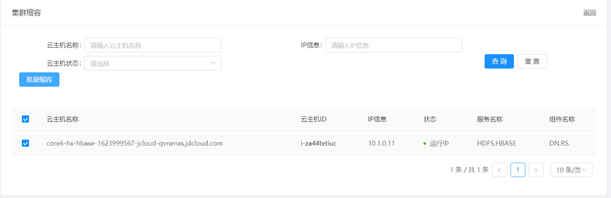

* 4.服务信息

    可对集群服务进行状态管理，以及对可选服务进行实时新增。并对服务子组件进行进行状态管理，配置文件编辑，快速部署，以及操作历史信息查看。
    
    服务信息：
    
    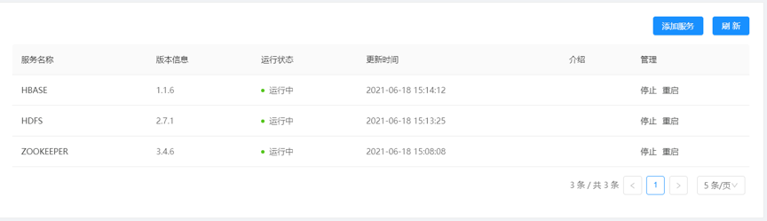
    
    添加服务：添加服务对象为创建集群时未选择的可选组件
    
    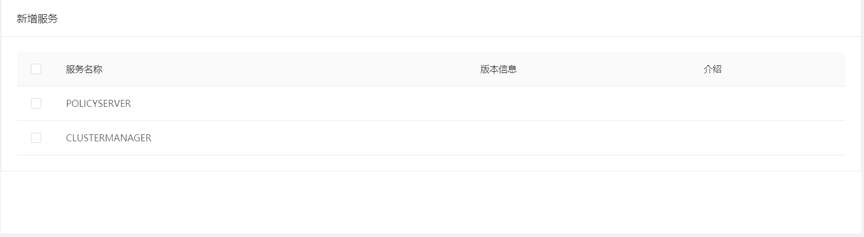
    
    组件信息：展示服务的组件层信息，并支持对组件进行启停、重启操作
    
    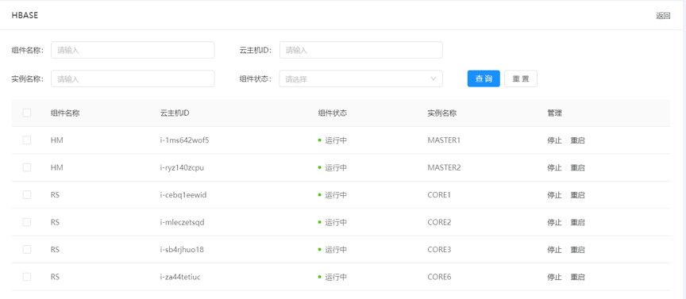

    配置文件：可对集群配置文件进行可视化维护，以服务-实例组划分配置文件的生效范围
    
    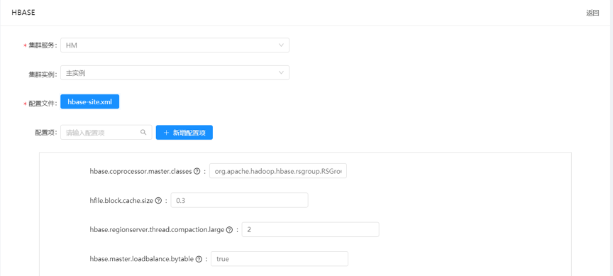
    
    集群日志：记录并查看当前集群的所有操作信息，包括操作名称，操作对象，操作人，过程时间以及操作状态
    
    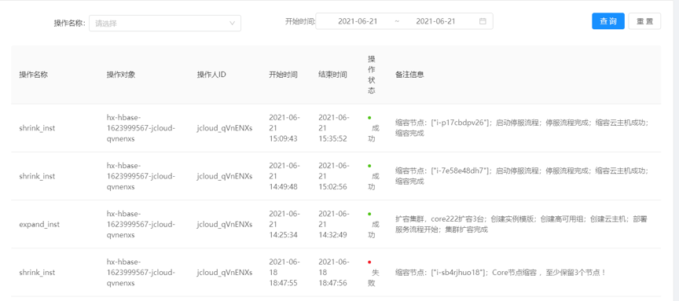

* 5.集群主机管理
    
    集群主机信息查看，主机状态管理，并可结合云主机监控平台查看云主机的详细运行状况 
    
    主页面：
    
    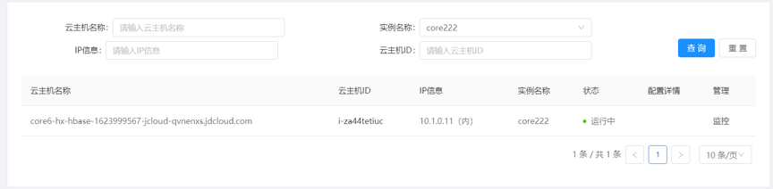

* 6.外部链接
    
    集群服务的外部链接信息，可查看服务的运行情况。

    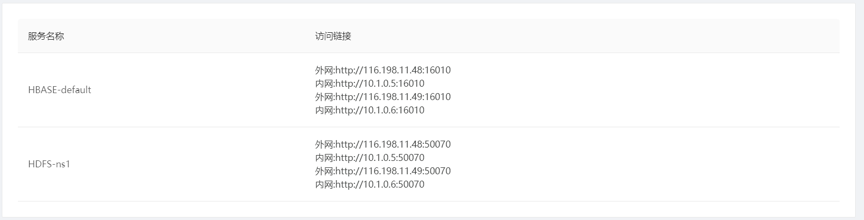

* 7.主备集群

    添加备机群
    
    
    
    选择集群 ，确定后创建自动化流程

    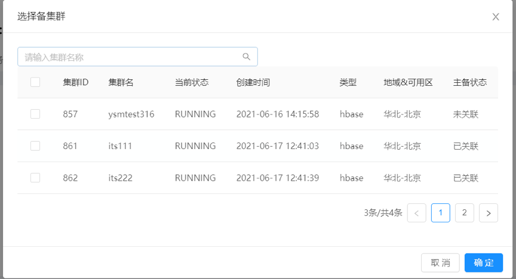