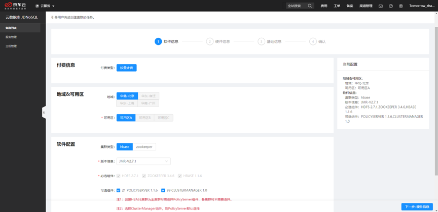
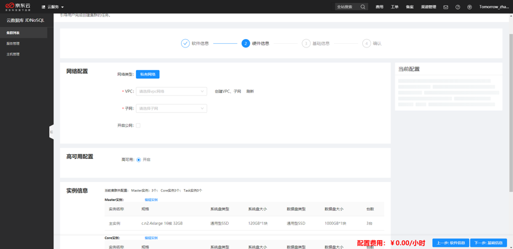

# 购买集群

本文主要介绍如何快速购买云数据库JDNoSQL集群。

* 1.进入云数据库JDNoSQL控制台，在集群列表页面，单击创建集群。

* 2.按照页面提示设置对应的购买参数。包括软件信息、硬件信息、集群基础信息。

    ①软件信息配置：付费信息、地域信息、软件配置

        地域&可用区：服务启所在区域
    
        软件信息：集群类型、 产品版本信息、必选组件、可选组件

   ②硬件信息配置：网络信息、高可用信息、实例配置
    
        网络信息：私有网络VPC，子网，带宽配置，开启公网
        
        网络信息配置依赖于京东云上私有网络产品，编辑网络信息时会校验该地域下是否已经创建好VPC，子网，如已经创建，则可直接使用。如还未创建，则跳转到私有网络产品中在该地域下创建上述信息，然后刷新并回显到本页面。

* 3.信息确认无误后，单击立即购买。在确认订单页面，勾选服务协议，单击完成支付。

* 4.集群购买后刷新集群列表页面，在集群列表页面即可看到创建的对应集群。

