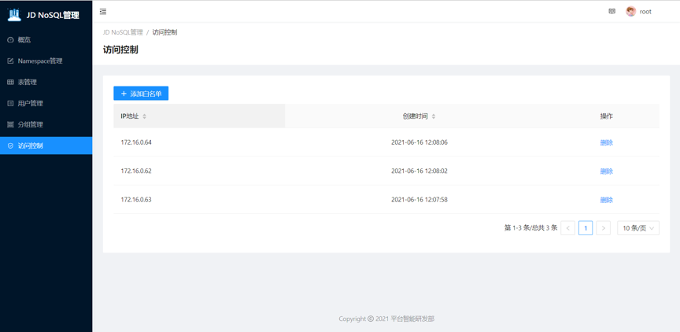
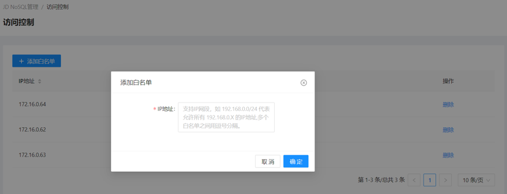

# 设置白名单

* JDNoSQL集群创建完成后，需要设置安全访问，添加访问白名单，允许外部设备访问该集群。新创建的集群为了安全性考虑，默认设置为无法访问，通过添加白名单后访问。

## 白名单设置介绍

* 1.登录JDNoSQL控制台，进入目标集群。
* 2.目标集群管理界面单击左侧导航栏中的访问控制。
* 3.单击添加白名单。
* 4.添加白名单IP地址，支持网段添加和IP地址批量添加。

