# 管理端基础操作

## 查看数据大屏列表

访问莫奈-数据可视化平台


点击数据可视化菜单，显示数据大屏列表，在这里我们可以看到当前这个用户所在的群组里所有用户创建的大屏，方便当前用户使用同一群组里其他用户创建的大屏。

用户可以在当前页面新建数据大屏，预览、修改、复制、重命名、删除已有的数据大屏，对未发布状态的大屏进行发布，对已发布的大屏取消发布，对已发布的大屏设置大屏访问权限等操作。发布状态的大屏拥有稳定的链接，而对大屏进行预览时只是生成了一个临时链接。

## 预览大屏


点击【预览】按钮，完成大屏的预览，对大屏进行预览时只是生成的一个临时链接，用于大屏制作者查看制作效果。

## 删除大屏


点击【删除】按钮，对不需要的大屏进行删除操作，用户确认删除后即可删除大屏。已发布的大屏需要取消发布才能删除。

## 复制大屏


在需要复制的大屏上，点击【复制】按钮，确认复制后，完成大屏的复制，复制的大屏里的配置信息与原始大屏完全一致。

## 修改大屏名称


点击大屏名称前的【修改】按钮图标，大屏名称进入可编辑状态，如下图所示。


修改大屏名称后，按回车键或点击其他空白区域完成大屏名称的修改。

## 发布大屏


在需要发布的大屏上，点击


开关，完成大屏的发布，发布后的大屏拥有稳定的访问链接，用户可以在任何地方访问此链接。

## 取消发布大屏


在需要取消发布的大屏上，点击


开关，完成大屏的取消发布，取消发布后，之前发布大屏生成的访问链接失效。。

## 导出大屏

.png)

点击大屏导出，可以将此大屏以压缩文件形式导出，用于跨环境的大屏迁移。

## 导入大屏

.png)

点击屏幕右上方的导入大屏，可以把已经导出到本地的大屏直接导入在本环境中。

## 设置已发布大屏的访问权限


在已发布的大屏上，点击【发布链接】按钮，查看已发布大屏的访问链接，点击链接可直接访问此大屏，在弹出窗口中可设置大屏的访问权限。


如上图所示，已发布的大屏在设置访问限制时有两种方式：访问密码和token验证。

访问密码：

如用户设置了访问密码，则已发布的大屏链接无法直接访问，需输入密码后才可见，如下图：


设置密码要求：密码长度只能6位，必须同时含有大写、小写字母和数字，不能以数字开头；

token验证：

前提要求：

大屏以Get的方式在URL中传递参数（直接在URL后面加参数）；

大屏URL中传递的参数要求不能被篡改；

如用户设置了token验证，则已发布的大屏链接无法直接访问，需通过莫奈提供的规则生成指定链接才可以访问，如下图：

规则如下：

http://monet.urban-computing.cn/#/screen?key={大屏uuid}&time={时间戳}&sign=md5({token}+{时间戳})

用户可通过此种方式将莫奈配置好的大屏嵌入其他系统中。

验证有效期：


验证有效期开启后，首次验证成功之后的一段时间内无需验证即可成功访问大屏，超过时间需要重新验证，关闭后，每次访问都需要通过验证；

## 修改大屏


点击大屏上方，如图红框区域，即可进入大屏配置页面，进行大屏的修改。

## 创建空白大屏

点击页面中的【新建可视化】按钮，页面跳转到选择大屏模板页。


选择空白大屏，输入大屏名称，完成空白大屏的创建。

## 基于大屏模板创建大屏

点击页面中的【新建可视化】按钮，页面跳转到选择大屏模板页。


选择一个大屏模板，输入大屏名称，基于此大屏模板，完成大屏的创建。

**通过大屏模板来创建大屏时，由于模板中已经把各种图表的配色调到最佳，我们只需要调整每个图表对应的数据，或者对图表进行简单的增加、修改和删除即可完成一个大屏的制作，极大缩短我们制作数据大屏的时间，对初学者是很友好的配置数据大屏的方法。但由于大屏模板只能满足有限的需求，当预置的大屏模板已经无法满足配置大屏的需求时，用户可以选择通过空白模板创建一个大屏。**

# 配置端基础操作


如图所示，大屏配置端分为四个区域：

- 1.  组件工具栏区；

- 2.  图层控制区；

- 3.  大屏画布区；

- 4.  属性配置区；

- 5.  页面控制区；

图层控制区：

图层控制区中会显示所有在大屏中的组件，并可在此区域中对组件进行图层的操作，包含“上移一层”，“下移一层”，“置于顶层”，“置于底层”等操作。

组件工具栏区：

组件工具栏区中包含所有可用的图表组件，并且可对当前数据大屏进行放大和缩小，以此来完整显示一个大屏。预览操作可对已经配置好的大屏进行预览。

大屏画布区：

大屏画布区则是图表的展示区域，其中黑色大屏部分是显示给用户的区域，在此区域中配置的图表均会展示给用户，若图表配置在黑色部分外，则无法展示出来。

此区域中包含两条横向对照线和三条竖向的对照线，方便进行图表配置时将两个图表进行对齐。

属性配置区：

属性配置区可以对大屏的属性和图表的属性进行配置，当前选中那个组件，则配置区中即会显示哪个图表的属性配置信息。对于大屏配置来讲，当前支持对大屏的尺寸进行设置，以满足在不同尺寸的终端上查看大屏的需求。对于图表配置来讲，当前包含对图表的样式配置和数据配置。样式配置用来调整图表样式，数据配置为图表提供数据源。

页面控制区：

页面控制区会显示一组大屏与页面的目录，并可在此区域对该组大屏及页面进行操作，包含切换大屏、拖拽排序、重命名、复制、删除的操作。

## 新增组件


点击“组件工具栏”中的组件分类，弹出组件列表，点击选择一个组件，该组件即可出现在大屏中。

## 删除组件


- 方法一：选中大屏中的一个组件（选中状态的组件边框含有蓝绿色虚线，如上图所示），通过键盘中的“delete”按键完成组件删除的操作


- 方法二：在图层控制区右键点击需要删除的组件，在弹出框中选择【删除】，确认删除后，即可完成删除操作。

## 复制组件

- 方式一：

Windows系统下，在中间画布区选中某个组件，在键盘中按住ctrl+C复制，ctrl+V粘贴；

Mac系统下，在中间画布区选中某个组件，在键盘中按住cmd+C复制，cmd+V粘贴；

- 方式二：在中间画布区选中某个组件，右键点击需要复制的组件，在弹出框中选择【复制】，即可完成复制组件操作


- 方法三：在图层控制区右键点击需要复制的组件，在弹出框中选择【复制】，即可完成复制组件操作。


## 多选组件

对组件多选有三种方式：

- 方式一：

Windows系统下，在左侧图层控制区中按住ctrl键，点击多个组件，完成组件的多选操作；

Mac系统下，在左侧图层控制区中按住cmd键，点击多个组件，完成组件的多选操作；


- 方式二：

Windows系统下，在中间画布区的大屏中按住ctrl键，点击多个组件，完成组件的多选操作；

Mac系统下，在中间画布区的大屏中按住cmd键，点击多个组件，完成组件的多选操作；


- 方式三：

在大屏配置端，按住鼠标左键（此为第一个点），拖动鼠标，直至用户松开鼠标左键（此为第二个点），以这两个点为长方形两个对角线的顶点，以这两个点出发的两条水平线和两条竖直线构成的鼠标选中区域，当一个图表完全包含在选中区域中时，此图表被选中。


鼠标放开，选中区域中**完全被包含**的组件。


## 组件成组或取消成组

当用户选中两个及以上的组件时，可将选中的组件归为一组，已成组的组件，移动时同时移动，已成组的组件可取消成组；
成组后组件后的操作说明：

成组后，选中某个组点击鼠标右键，可进行组件操作包括：上移一层，下移一层，置于顶层，置于底层，删除、复制、重命名、成组/取消成组，锁定/解锁，其上移一层、下移一层、至于顶层或底层时，原组件的层级关系不变，整组上移、下移、置顶或至底。删除、复制、成组/取消成组，锁定/解锁 操作针对所有组件。

当选中某个组时，右侧仅显示选中的多个组件组成的整体的图表尺寸和位置，以多个组件中最左最上点，和最右最下点为对角线的两个点，组成的长方形为尺寸和位置来显示。

组内的组件也可以被选中，并与其他正常组件一样做正常组件的所有操作。选中组内组件的方式有两种：1、在左侧图层控制区鼠标单击选中；2、在大屏中选中组件组后，单击组内任意位置后即可进行对组内组件的选中和编辑。也可以通过鼠标拖拽移动图层的方式，将组内的某个组件移出到组外，或将组外的某个组件移入组内。

## 组件收藏

为了方便大家重复调整相同组件的样式交互等，增加组件的复用性，莫奈支持收藏功能，收藏后的组件可以在我的收藏中看到。莫奈也为大家内置了一些大家利用率较高的组合组件，可以在猜你喜欢中看到。


可以收藏单个组件，也可以收藏多个组件；单个组件的话，直接右键单击就可以选择收藏，之后在弹框中输入收藏的组件的名称-确定，之后就可以在我的收藏中看到该组件。


对于多个组件的收藏，有两种方式：

方式一：同时选择多个组件，成组后，右键即可收藏，步骤和单个组件的收藏完全相同。

方式二：同时选中多个组件后，右键单击，即可看到“成组并收藏”这个选项，点击后输入收藏组件名，之后就可以在我的收藏中看到这个组合组件。


为了避免收藏组件过多而找不到的状况，在我的收藏中还可以通过模糊搜索的方式找到自己收藏的组件：


收藏组件删除：

在我的收藏中，已收藏组件右上角有一个删除按钮，点击删除，即可移除我的收藏中该收藏组件。


收藏组件管理

我的收藏下方位置有个管理，鼠标左键单击，就可进入管理界面。可以同时删除多个收藏组件。


## 组件重命名

对组件进行重命名有两种方式：

- 方式一：在左侧图层控制区中右键组件，在弹出框中选择【重命名】，组件名称变成可编辑状态，输入组件名称，按回车键或其他位置，完成保存。
  

- 方式二：在大屏中选中某个组件后点击鼠标右键，在弹出框中选择【重命名】，在左侧图层区可以看到组件名称变成可编辑状态，输入组件名称，按回车键或其他位置，完成保存。
  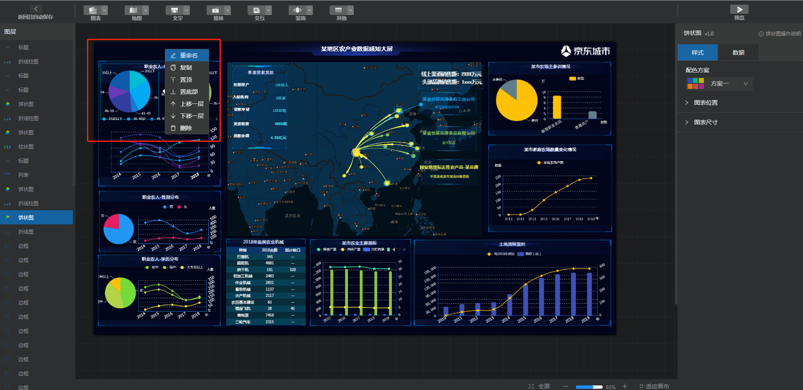

## 组件锁定和解锁

锁定后的组件，在画布中不能被不能选中，不能进行其他任何操作。

对组件进行锁定有两种方式：

方式一：在左侧图层控制区中选中一个或多个组件，点击鼠标右键，在弹出框中选择【锁定】，完成组件的锁定。
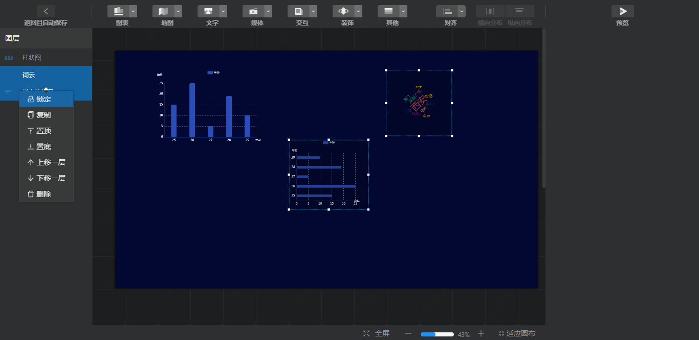

方式二：在大屏中选中一个或多个组件后点击鼠标右键，在弹出框中选择【锁定】，完成组件的锁定。


对组件进行解锁的方式：

在左侧图层控制区中选中被锁定的一个或多个组件，点击鼠标右键，在弹出框中选择【解锁】，完成组件的解锁；

点击已锁定的组件名称后的锁定图标，可实现一键解锁。


## 图层操作

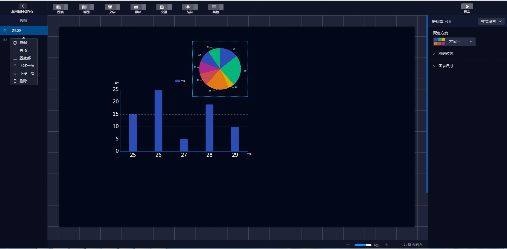

### 上移一层

- 方式一：在图层控制区中右键组件，在弹出框中选择【上移一层】，完成此操作。此组件所在图层上移一层。

- 方式二：在大屏中选中某个组件后点击鼠标右键，在弹出框中选择【上移一层】，完成此操作。此组件所在图层上移一层。

### 下移一层

- 方式一：在图层控制区右键组件，在弹出框中选择【下移一层】，完成此操作。此组件所在图层下移一层。

- 方式二：在大屏中选中某个组件后点击鼠标右键，在弹出框中选择【下移一层】，完成此操作。此组件所在图层上移一层。

### 置于顶层

- 方式一：在图层控制区右键组件，在弹出框中选择【置顶】，完成此操作。此组件将置于当前大屏所有组件的最上方。

- 方式二：在大屏中选中某个组件后点击鼠标右键，在弹出框中选择【置顶】，完成此操作。此组件所在图层上移一层。

### 置于底层

- 方式一：在图层控制区右键组件，在弹出框中选择【置底部】，完成此操作。此组件将置于当前大屏所有组件的最底部。

- 方式二：在大屏中选中某个组件后点击鼠标右键，在弹出框中选择【置底部】，完成此操作。此组件所在图层上移一层。

### 移动至任意图层

- 在图层控制区，选中一个组件，向上或向下拖动完成此组件的图层调整。（当前仅支持单个组件的进行拖动调整其图层）

## 移动组件

- 方式一：选中某个组件后，鼠标左键选中后拖动组件，完成组件在大屏中的位置移动；

- 方式二：选中某个组件后，点击键盘中的上、下、左、右键，完成组件在大屏中的位置移动；


## 组件对齐

当选中两个及以上组件后支持组件对齐功能，包含左对齐、左右居中、右对齐、上对齐、下对齐、上下居中。

选中两个及以上的组件，点击工具栏右上方的对齐，选择对齐方案，完成对齐操作。


- 左对齐：所有选中的图表以最左侧的边为基准进行对齐；

- 左右居中：所有选中的图表垂直中线在同一条直线上；

- 右对齐：所有选中的图表以最右侧的边为基准进行对齐；

- 上对齐：所有选中的图表以最上面的边为基准进行对齐；

- 上下居中：所有选中的图表水平中线在同一条直线上；

- 下对齐：所有选中的图表以最下面的边为基准进行对齐；

## 组件分布

当选中三个及三个以上组件，支持组件分布功能，包含 纵向分布、横向分布。

选中三个及以上的组件，点击工具栏右上方的横向分布，完成横向分布操作。


选中三个及以上的组件，点击工具栏右上方的纵向分布，完成纵向分布操作。


- 横向分布：以最左侧图表的左侧边和自右侧图表的右侧边为准线，选中的图表间距等分；

- 纵向分布：以最上侧图表的上侧边和自下侧图表的下侧边为准线，选中的图表间距等分；

## 组件格式刷

选中组件后启用格式刷功能，随后点击另一组件可以将组件中的 **公共样式配置项** 按照A的样式复制到B组件中（“公共样式配置项”是指：层级相同并且配置项名称相同）。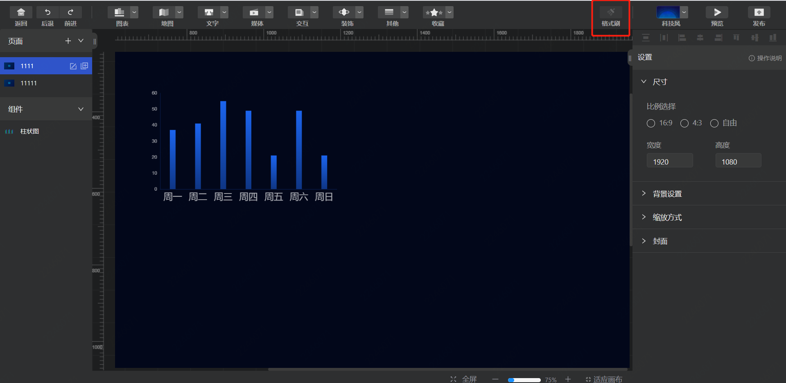

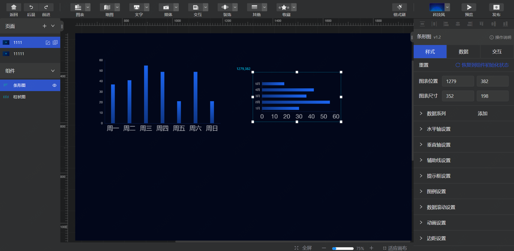


## 编辑页标尺功能

.png)

为了让用户更加方便地对组件位置进行调整，在大屏的横竖两侧，分别有标尺供用户进行参考。

.png)

在插入任意组件时，选中组件，便可以在组件左上方看到辅助基准对其的辅助线，用户可以借助辅助线对组件位置进行对齐。


## 页面操作

### 新增页面

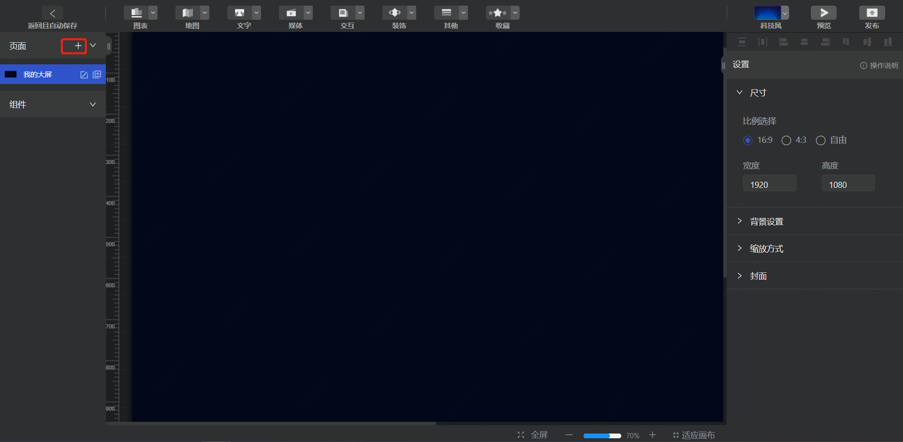

通过点击页面栏的“+”可以新增一个页面

### 重命名页面

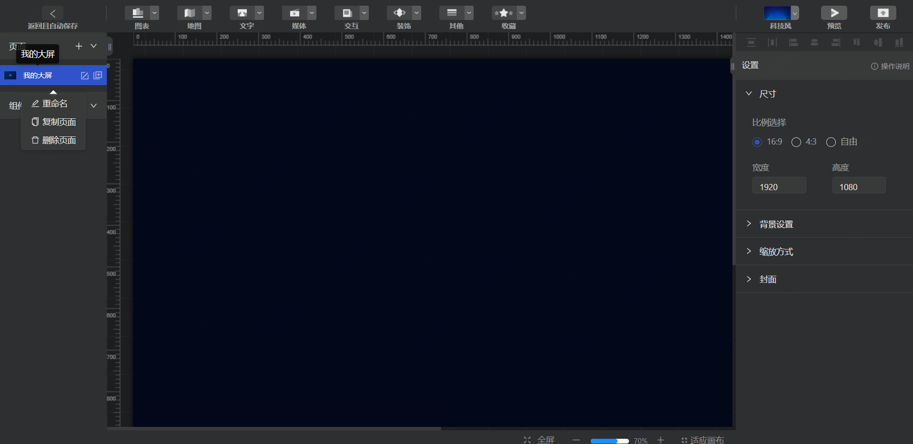

- 方式一：在相应页面名称之后，悬浮鼠标，通过点击重命名图标，页面名称变成可编辑状态，输入页面名称，按回车键或其他位置，完成保存。

- 方式二：在页面控制区中右键单击需要重命名的页面，在弹出框中选择【重命名】，页面名称变成可编辑状态，输入页面名称，按回车键或其他位置，完成保存。

### 复制页面


- 方式一：在相应页面名称之后，悬浮鼠标，通过点击复制页面图标，即可完成复制。

- 方式二：在页面控制区中右键单击需要复制的页面，在弹出框中选择【复制页面】，即可完成复制。

### 删除页面


- 在页面控制区中右键单击需要删除的页面，在弹出框中选择【删除页面】，在弹出框中选择【删除】，即可完成删除操作。

## 撤回和取消撤回操作

在大屏配置中，通过点击左上角的“后退”按钮对您上一次的操作进行撤销；通过点击左上角“前进”按钮对您上一次的撤回操作进行撤销。


同时，您也可以通过使用快捷键Ctrl+Z进行后退操作，也可以用Ctrl+Shift+Z进行取消撤回操作。

## 主题功能

通过右上角主题切换按钮，对当前大屏内组件的样式进行整体的调整，目前工具中预置了三种主题样式设置：科技风、商务风和简约风，以满足客户对不同业务场景的使用需求。

科技风：

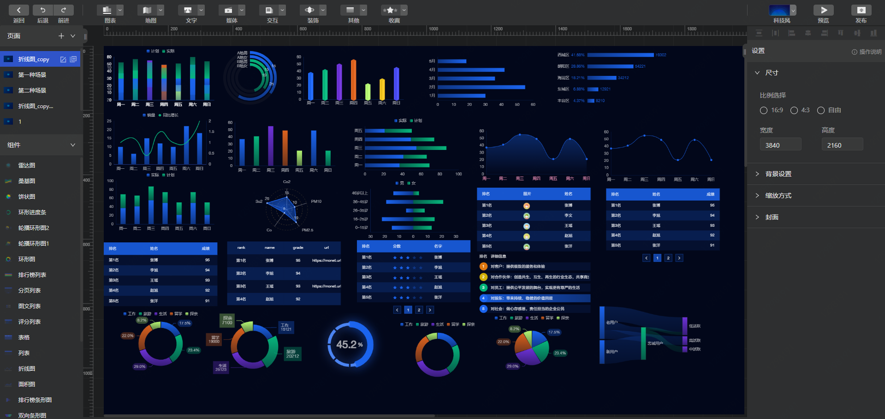

商务风：

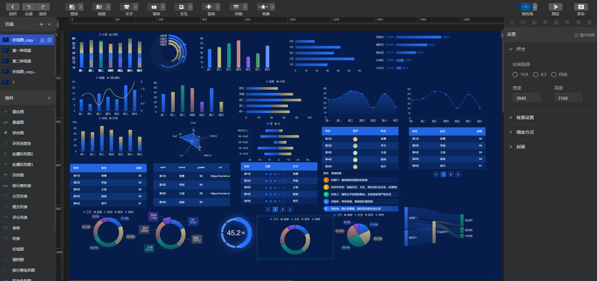

简约风：

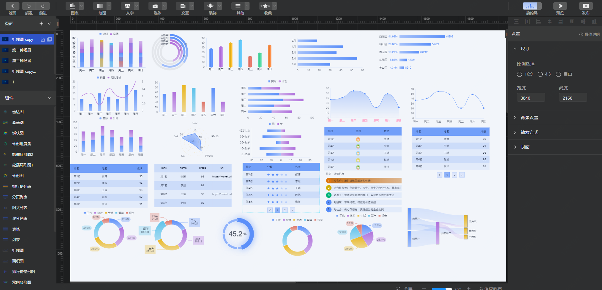

三种风格可在任意时候切换，且图表中如果有自定义样式设置，也可以通过点击“恢复到组件初始化状态”按钮让组件恢复到主题原有的样式设置上。

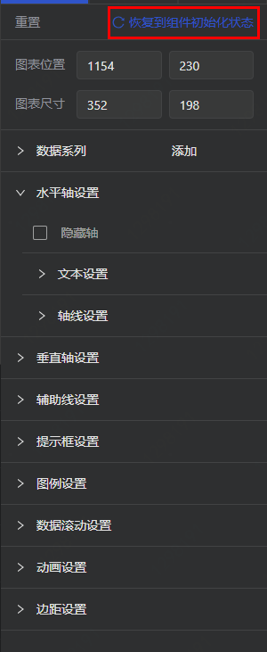

## 对齐功能

组件对齐提示，在组件拖拽过程中，可以分别通过组件的水平中线、垂直中线、上边框延伸线、左边框延伸线、右边框延伸线、下边框延伸线与其他组件之间进行对齐。在距离对齐基准线1px是增加吸附功能，方便用户操作。

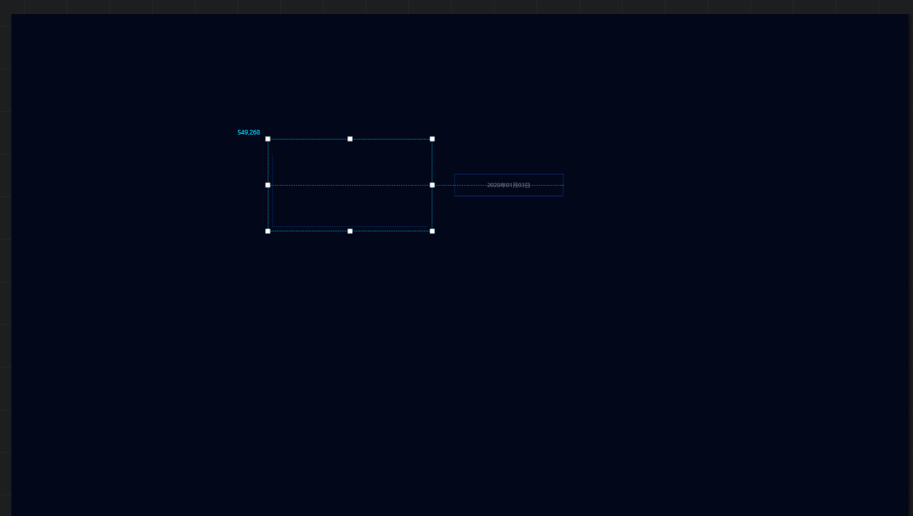

## 编辑器页面大屏拖拽操作

在编辑器页面按住space键对大屏编辑器开启拖拽功能，用户可以按住鼠标左边进行画布视窗拖拽。

# 大屏基本设置

在用户新建一个大屏时，首先需要对大屏的基本信息进行配置这其中包括尺寸设置、背景设置、大屏缩放方式设置、大屏封面设置及大屏的画布比例设置。

## 大屏尺寸设置

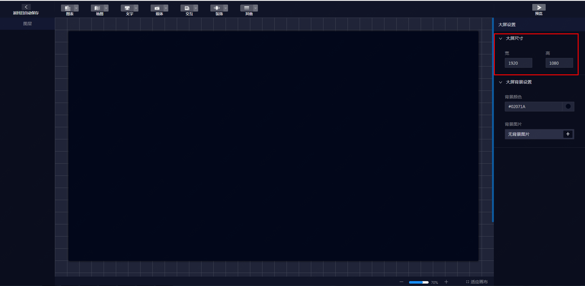

选中大屏背景，右侧出现大屏配置信息，用户可对大屏尺寸进行配置，以满足在不同终端中显示大屏的需求。单位为px。

## 大屏背景设置


选中大屏背景，右侧出现大屏配置信息，用户可对大屏的背景进行配置，支持设置大屏的背景颜色以及背景图片。并且系统预置了三个背景图片，便于用户选择，同时也支持用户上传图片，图片大小限制在1M以内，图片格式支持JPG/PNG/GIF文件，如下图。


## 大屏自适应设置（即大屏缩放方式）

大屏缩放方式即是对大屏自适应的设置，此功能为当屏幕尺寸与所配置的大屏尺寸不能吻合时，调整预览之后大屏铺满屏幕的适应方式。如不需自适应，则勾选“无”即可。

目前大屏支持以下三种自适应的方式：

- 等比缩放宽度铺满：按照实际屏幕宽度铺满全屏，高度按原大屏比例调节；

- 等比缩放高度铺满：按照实际屏幕高度铺满全屏，宽度按原大屏比例调节；

- 全屏铺满：按照实际屏幕铺满全屏，无视原大屏比例，可能造成大屏的拉伸或变形；

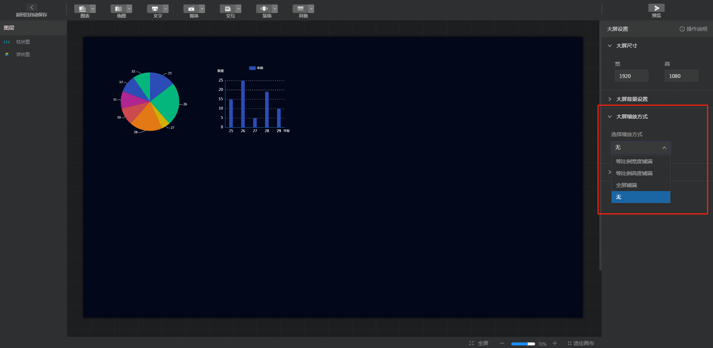

## 截取大屏封面（大屏封面设置）


选中大屏背景，右侧出现大屏配置信息，最下侧有“截取大屏封面”按钮，点击后，系统自动截取当前大屏快照作为大屏分封面显示在大屏列表中，管理端默认选择第一张大屏的封面作。

## 画布操作

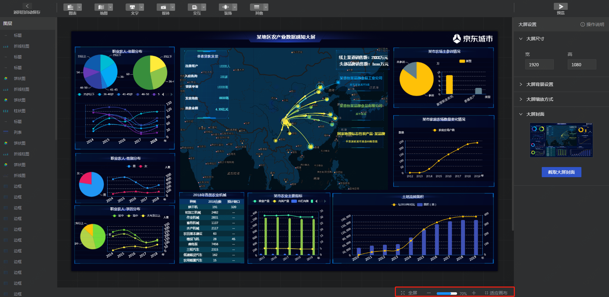

在大屏画布的最下方，有全屏、大屏当前的缩放比例（可进行放大和缩小），以及适应画布三类操作。
点击【全屏】按钮，系统会隐藏左右两侧的工具栏，操作空间增大。
点击【取消全屏】按钮，左右两侧工具栏显示在原位置。


点击缩放比例左侧的减号，整体大屏缩小；
点击缩放比例右侧的加号，整体大屏放大；
此处的放大和缩小不影响预览和发布状态的大屏的尺寸。

（大屏的画布缩放还可以通过按住ctrl键后滑滚动鼠标滚轮实现；同时按住空格键后用鼠标左键可以进行画布拖拽）

**点击【适应画布】大屏会根据当前屏幕的尺寸以最合适的比例显示出来。**


## 大屏风格设置

.png)

点击风格设置下拉框，一共有三种大屏风格可供选择：

科技风动感时尚，商务风低调奢华，简约风干净大气，均不失为用户配置大屏合适的选择。

# 数据源配置

组件的数据源为组件提供数据，当前莫奈产品中共支持以下三种类型的数据源。

## 静态数据


选中组件，右侧出现次组件的数据配置框，组件数据源的静态数据支持json格式的静态数据。按照选中组件要求的数据格式书写或者将已经处理好的数据粘贴进来即可。

## API


选中组件，右侧出现本组件的数据配置框，切换数据源类型为API，将API的链接粘贴到输入框中即可。

::: tip 注意

API类数据源支持嵌套的参数，
例如：api返回的数据为

``` js
{
	a: "我是第一层数据",
	b: {
		c: "我是第二层数据P",
		d: "我是第二层数据Q"
	}
}

```

如果用户需要取c的结果作为图表的字段，则可使用"b.c"作为映射字段即可。

:::

::: tip 注意

API默认支持域名或公网IP的URL，若想使用内网IP的URL，请联系管理员或客户经理添加白名单。

:::

可选择是否自动更新数据，以及自动更新数据的频率，假定选中自动更新数据，每5秒更新一次，择莫奈将会每5秒请求一次填入的接口来获取数据。

## 数据库

组件的数据源中对数据库的支持当前包含六类数据库，MySQL、Oracle、SQLServer、DB2、PostgreSQL、CSV、EXCEL、ClickHouse、基于城市操作系统的MySQL库和Hive库。除城市操作系统中的MySQL库和hive库外，其他数据库均需要在数据源中进行单独配置。

### 配置数据源

.png)

上图中展示的为莫奈中的数据源列表，组件如果选择了通过数据库方式获取数据，则只有在此配置好数据库才能在大屏配置中展示正确的数据。本页面列表支持按照数据源类型以及数据源名称进行模糊搜索，同时支持添加、编辑和删除操作。

数据源类型显示此数据源的文件类型。

归属显示此数据源所属的大屏名称。

- 添加数据源

.png)


在数据源列表中右上方，点击【添加数据源】按钮，页面跳转至数据源类型选择页面，如下图：


以MySQL数据源的配置为例，在上图中填写数据源的必要信息，完成数据库的配置。

- 编辑数据源


在数据源列表中，鼠标滑过某个数据源，会出现编辑按钮，点击【编辑】按钮，可进行数据源的编辑操作。注意，编辑时，无法进行数据源密码的编辑。

- 删除数据源


在数据源列表中，鼠标滑过某个数据源，会出现删除按钮，点击【删除】按钮，弹出删除确认提示，点击确定，完成数据源的删除操作。

- 下载数据源


  .png)

  点击下载，即可下载数据源


### MySQL


选中组件，右侧出现次组件的数据配置框，切换数据源类型为数据库，选择MySQL，选择在数据源中配置的MySQL库名，即可链接到MySQL库。在输入框中输入要查询申请SQL语句，完成数据的查询。SQL语句返回的数据格式要能组成组件要求的数据源格式，莫奈会自动通过接口将数据库查询出的结果转为json格式。

同时，莫奈平台还可支持选择是否自动更新数据，以及自动更新数据的频率，假定选中自动更新数据，每5秒更新一次，则莫奈将会每5秒通过SQL语句查询一次数据库来获取数据，进行对数据的更新。

### Oracle


选中组件，右侧出现次组件的数据配置框，切换数据源类型为数据库，选择Oracle，选择在数据源中配置的Oracle库名，即可链接到Oracle库。在输入框中输入要查询的语句，完成数据的查询。查询语句返回的数据格式要能组成组件要求的数据源格式，莫奈会自动通过接口将数据库查询出的结果转为json格式。

同时，莫奈平台还可支持选择是否自动更新数据，以及自动更新数据的频率，假定选中自动更新数据，每5秒更新一次，则莫奈将会每5秒通过SQL语句查询一次数据库来获取数据，进行对数据的更新。

### SQL Server


选中组件，右侧出现次组件的数据配置框，切换数据源类型为数据库，选择SQL Server，选择在数据源中配置的SQL Server库名，即可链接到SQL Server库。在输入框中输入要查询的语句，完成数据的查询。查询语句返回的数据格式要能组成组件要求的数据源格式，莫奈会自动通过接口将数据库查询出的结果转为json格式。

同时，莫奈平台还可支持选择是否自动更新数据，以及自动更新数据的频率，假定选中自动更新数据，每5秒更新一次，则莫奈将会每5秒通过SQL语句查询一次数据库来获取数据，进行对数据的更新。

### DB2


选中组件，右侧出现次组件的数据配置框，切换数据源类型为数据库，选择DB2，选择在数据源中配置的DB2库名，即可链接到DB2库。在输入框中输入要查询的语句，完成数据的查询。查询语句返回的数据格式要能组成组件要求的数据源格式，莫奈会自动通过接口将数据库查询出的结果转为json格式。

同时，莫奈平台还可支持选择是否自动更新数据，以及自动更新数据的频率，假定选中自动更新数据，每5秒更新一次，则莫奈将会每5秒通过SQL语句查询一次数据库来获取数据，进行对数据的更新。

### PostgreSQL


选中组件，右侧出现次组件的数据配置框，切换数据源类型为数据库，选择PostgreSQL，选择在数据源中配置的PostgreSQL库名，即可链接到PostgreSQL库。在输入框中输入要查询的语句，完成数据的查询。查询语句返回的数据格式要能组成组件要求的数据源格式，莫奈会自动通过接口将数据库查询出的结果转为json格式。

同时，莫奈平台还可支持选择是否自动更新数据，以及自动更新数据的频率，假定选中自动更新数据，每5秒更新一次，则莫奈将会每5秒通过SQL语句查询一次数据库来获取数据，进行对数据的更新。

### Hive for UCP


选中组件，右侧出现次组件的数据配置框，切换数据源类型为数据库，选择Hive for UCP，选择在城市操作系统中对应的hive库名，即可链接到城市操作系统中的hive库。在输入框中输入要查询的语句，完成数据的查询。查询语句返回的数据格式要能组成组件要求的数据源格式，莫奈会自动通过接口将数据库查询出的结果转为json格式。

同时，莫奈平台还可支持选择是否自动更新数据，以及自动更新数据的频率，假定选中自动更新数据，每5秒更新一次，则莫奈将会每5秒通过SQL语句查询一次数据库来获取数据，进行对数据的更新。

### MySQL for UCP

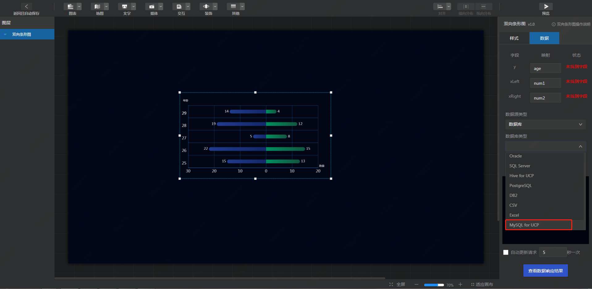

选中组件，右侧出现次组件的数据配置框，切换数据源类型为数据库，选择MySQL for UCP，选择在城市操作系统中对应的MySQL库名，即可链接到城市操作系统中的MySQL库。在输入框中输入要查询的语句，完成数据的查询。查询语句返回的数据格式要能组成组件要求的数据源格式，莫奈会自动通过接口将数据库查询出的结果转为json格式。

同时，莫奈平台还可支持选择是否自动更新数据，以及自动更新数据的频率，假定选中自动更新数据，每5秒更新一次，则莫奈将会每5秒通过SQL语句查询一次数据库来获取数据，进行对数据的更新。

### CSV


选中组件，右侧出现次组件的数据配置框，切换数据源类型为数据库，选择CSV，选择在数据源配置中填写的数据源名，即可链接上传的CSV文件。在输入框中输入要查询的SQL语句，完成数据的查询。查询语句返回的数据格式要能组成组件要求的数据源格式，莫奈会自动通过接口将数据库查询出的结果转为json格式。

同时，莫奈平台还可支持选择是否自动更新数据，以及自动更新数据的频率，假定选中自动更新数据，每5秒更新一次，则莫奈将会每5秒通过SQL语句查询一次数据库来获取数据，进行对数据的更新。

::: tip 注意

1、上传CSV文件后，系统会使用CSV的文件名称作为表名称；

2、查询语句的样式应该与此类似：select "列名","列名" from "csv的文件名"；

:::

### EXCEL

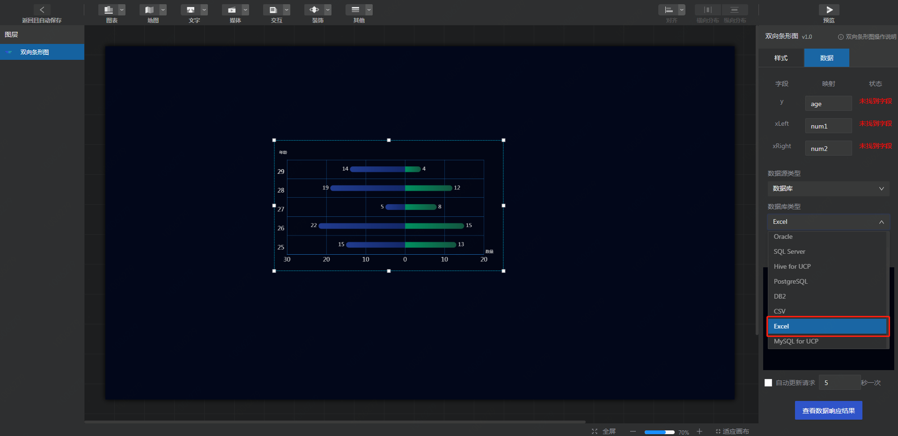

选中组件，右侧出现次组件的数据配置框，切换数据源类型为数据库，选择EXCEL，选择在数据源配置中填写的数据源名，即可链接上传的EXCEL文件。在输入框中输入要查询的SQL语句，完成数据的查询。查询语句返回的数据格式要能组成组件要求的数据源格式，莫奈会自动通过接口将数据库查询出的结果转为json格式。

同时，莫奈平台还可支持选择是否自动更新数据，以及自动更新数据的频率，假定选中自动更新数据，每5秒更新一次，则莫奈将会每5秒通过SQL语句查询一次数据库来获取数据，进行对数据的更新。

::: tip 注意

1、上传excel文件后，系统会将excel中的所有sheet均映射成对应的表，并以sheet的名称分别作为表名称；

2、查询语句的样式应该与此类似：select "列名A","列名B" from "excel的第一个sheet页名称" ，select "列名C","列名D" from "excel的第二个sheet页名称"；

:::


::: tip 注意
此处支持的hive for UCP库为城市操作系统中的hive库;
此处支持的MySQL for UCP库为城市操作系统中的MySQL库;
:::

# 数据过滤器

用户可以使用数据过滤器完成数据的过滤，数据字段的格式调整等操作。

新增一个组件后，打开组件是数据设置，当用户选择数据源类型为API或者数据库类型时，将会看到“开启数据过滤”的选项以及“配置数据过滤器”的按钮，如图所示：

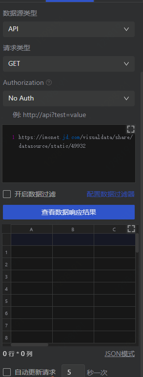

当用户获取源数据后仍需要做进一步处理时，即可使用数据过滤器功能，该功能给用户提供了对已经获取的数据进行进一步修饰的能力。

我们以列表为例，首先打开一个列表，选择API方式获取数据，点击“查看数据响应结果”，如下图所示：

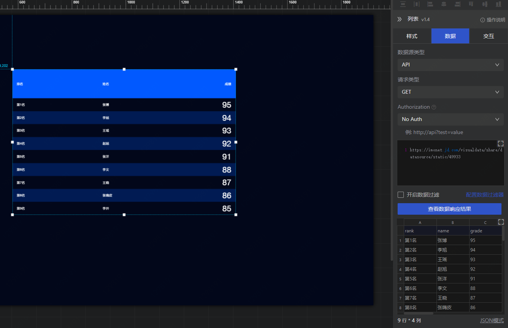

如图所示，列表中已经显示出原始API中获取的数据，现在我们配置一个新的数据过滤器：

点击“配置数据过滤器”按钮：

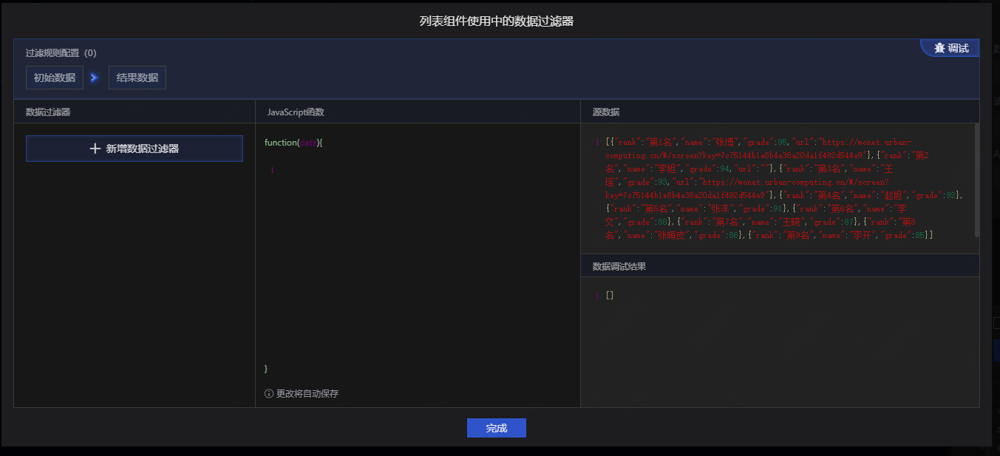

点击“新增数据过滤器”，在函数中我们已经看到了预设的几个函数，用户也可以通过自己编写JS代码实现其他功能。

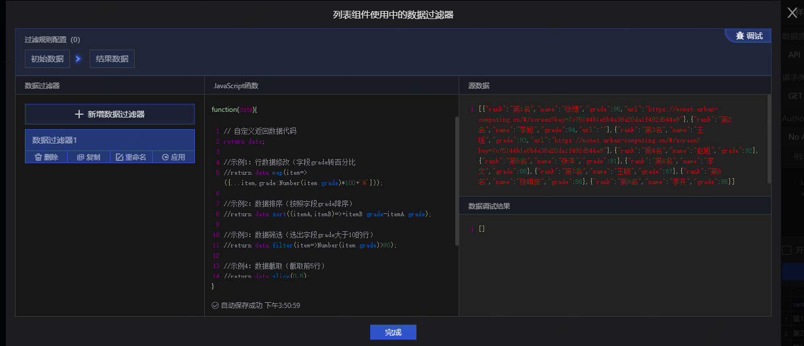

简单举例，我们希望实现在刚才的列表中，只展示分数在90分以上的学生信息，则可以写入代码：


``` js
return data.filter(item=>Number(item.grade)>90);
return data
```

则一个对grade进行数据筛选的数据过滤器就制作完成，我们点击应用，并点击调试，在数据调试结果中看到已经筛选完成，我们点击完成：

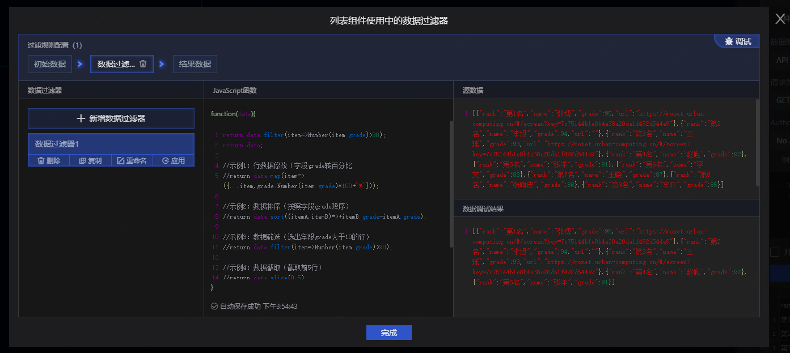

勾选“开启数据过滤”选项，我们获得了数据过滤后的数据：

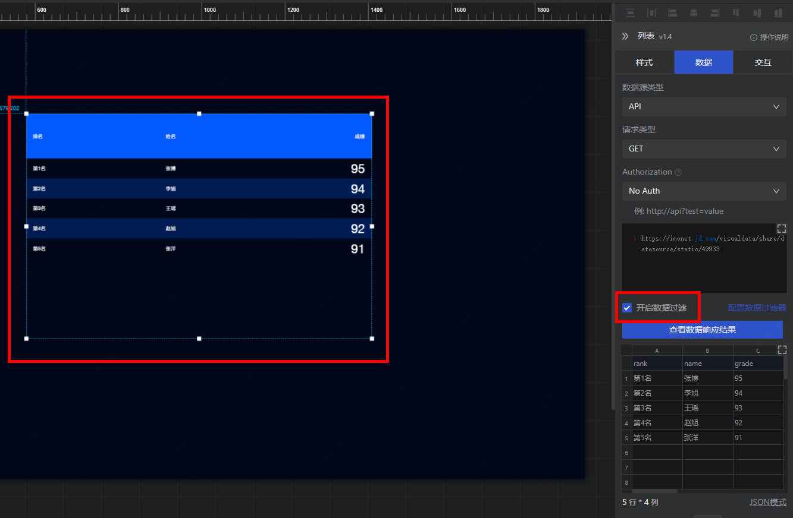

# 组件基础操作

## 公共设置

在新建大屏并设置好大屏基本参数后，就可以开始按照设计或者原型对大屏进行配置，其中最关键的部分就是对组件进行设置。在所有组件中有一些设置是公用的，这些设置包含组件的图表位置和图标尺寸。

### 图表位置


以柱状图为例，选中组件，右侧样式设置中出现图表的位置信息，默认显示图表左上角的位置坐标。

方法一：可在输入框中输入位置信息调整。画布中大屏的左上角的位置为（0,0）。最小可调整单位为0.5px，若不足0.5则会采用四舍五入的方式确定坐标位置；

方法二：拖拽组件放于指定位置。

### 图表尺寸

以柱状图为例，选中组件，右侧样式设置中出现图表的尺寸信息。

方法一：可在输入框中输入位置信息调整。最小可调整单位为1px；

方法二：选中组件，鼠标悬停于组件的右下角，选中后可放大或缩小组件，调整组件大小。


# 图表组件

在数字化大屏中，能够直观反映数据间的比例变化及变化趋势的是图表组件，也是大屏中最常用的基础组件。目前莫奈可视化平台支持柱状图，折线图，环形图，列表，条形图，其它六大类图表组件，并且支持在默认显示全部图表时，具有模糊搜索功能。涵盖雷达图、词云、胶囊图、排行榜列表、图文列表、轮播环形图、双向条形图、环形图、条形图、面积图、多色柱图、进度条、上下条形图、桑葚图、折线柱图、3D词云，环形进度条、散点图、柱状图、堆叠条形图、折线图、关系图、极坐标堆叠、气泡图、饼状图、堆叠柱状图、列表、排行榜条形图、散点气泡图、分页列表这些基础组件，它们的具体适用场景及配置方式如下：

## 柱状图

适用场景：用于展示二维数据集，展示数据的分布情况，一个轴表示需要对比的分类维度，另一个轴代表相应的数值，比如：（月份：商品销量）；或者在一个维度上，对多个同质可比的指标进行比较，比如：（月份：苹果销量，桃子产量）。通常利用于较小的数据集分析。

### 样式设置


柱状图的样式设置包括：水平轴设置，垂直轴设置，辅助线设置，提示框设置，图例设置，数据滚动设置，动画设置，数据系列，图表位置和图表尺寸。

水平轴设置
.png)

点击隐藏轴开关，可以在大屏中隐藏水平轴

文本设置：

字体，支持微软雅黑、宋体、黑体、隶书、幼圆、楷体和系统默认字体；

字号：X轴的字号，可输入字号调整；

字体粗细：X轴字体的粗细，有正常、细体、粗体、更粗四个选项；

字体颜色：X轴字体的颜色，分为主题色，标准色，最近使用的颜色，以及更多颜色的选项，如果需要更快的选取页面中已有的颜色可以通过使用取色器功能，不需要取色时可以通过Esc键或点击取色器取消。

，

取色器以中央方格处选中颜色为准取色


旋转角度：X轴文字的旋转角度，可输入旋转角度进行调整；

智能隐藏：智能隐藏可将X轴过多的刻度文字进行隐藏，如需全部显示X轴刻度信息，则无需勾选，默认不勾选。
.png)

轴线设置：可以设置坐标轴的粗细，样式和颜色。样式中包括三种样式。

垂直轴设置
.png)

点击隐藏轴开关，可以在大屏中隐藏水平轴

文本设置：

字体，支持微软雅黑、宋体、黑体、隶书、幼圆、楷体和系统默认字体；

字号：X轴的字号，可输入字号调整；

字体粗细：X轴字体的粗细，有正常、细体、粗体、更粗四个选项；

字体颜色：X轴字体的颜色，分为主题色，标准色，最近使用的颜色，以及更多颜色的选项，如果需要更快的选取页面中已有的颜色可以通过使用取色器功能，不需要取色时可以通过Esc键或点击取色器取消。

，

旋转角度：X轴文字的旋转角度，可输入旋转角度进行调整；

智能隐藏：智能隐藏可将X轴过多的刻度文字进行隐藏，如需全部显示X轴刻度信息，则无需勾选，默认不勾选。
.png)

轴线设置

可以设置坐标轴的粗细，样式和颜色。样式中包括三种样式。

辅助线设置

分为横向辅助线和纵向辅助线和标记线设置。可以选择辅助线是否显示，以及对辅助线粗细样式、颜色进行设置。

粗细：可以手动输入数字或者选择有粗细框右边的上下标一点点调节。

样式：支持三种形式，如下所示：

，


.png)

标记线设置中，还可以额外对标记线的标记值，文本进行设置。

提示框设置

.png)

适用情况：在预览界面时，鼠标滑过柱状区域，可以显示相应的信息。

可以对提示框的字体，字号，文字粗细以及文字颜色和背景颜色进行设置，如图所示


除此之外，还可以对提示框的边框颜色，粗细以及选中颜色进行设置。

图例设置

图例设置可以对是否显示图例，以及所显示图例的文本和布局进行设置。

文本：支持字体，字号，字体颜色以及字体粗细的修改。

布局：可以对图例的位置进行设置。

目前默认支持：顶部，底部，左侧，右侧的居左居中居右的设置，如下图所示：

支持自行设置图例位置：通过调整左右间距，和上下间距进行自主设置。

，

数据滚动设置

.png)

点击开启数据滚动，可以打开数据滚动设置。

通过设置数据滚动起点和重点，可以在图表中优先展示这部分数据，再通过滚动数据条的滚动，显示其他数据

在滚动条样式设置中，对滚动条宽度，填充颜色和边框颜色进行设置。

动画设置
.png)

在动画设置中，可以设置图表在提示框轮播时的自动动画轮播。包括动画的开关和间隔时间设置。


数据系列

数据系列设置中，可以添加删除各个数据系列，并设置系列名和系列值。

在形状设置中，可以设置柱子宽度，圆角设置，颜色设置以及显示柱子背景的开关和柱子背景颜色的设置。


文本设置中可以设置图表中每个数据系列中的显示数据文本。

图表位置

图表位置为图表左上角的位置坐标，通过横坐标和总左边的设置即可设置对应的图表位置。也可以通过选中图形后用鼠标拖曳到相应位置的方式设置图表位置。

，

图表尺寸

即显示的柱状图的宽和高，通过设置相应的数字，调节柱状图的大小。

，

### 数据设置

数据字段

柱状图的数据字段包括：X，Y，S

X：柱状图中数据在X轴上的值，需要将数据与图表进行映射；

Y：柱状图中数据在Y轴上的值，需要将数据与图表进行映射；

S：柱状图中的数据系列字段，需要将数据与图表进行映射；

数据源类型

支持静态数据，API和数据库三种类型。操作流程图整体如下所示：


静态数据：

在下方输入框中输入对应的数据即可进行设置。

数据格式

.png)

在下方表格中可输入或复制粘贴所需要的数据。其中，每一列数据对应一个数据字段，第一行为该列数据字段名，需要在上方进行映射设置。

目前，数据接入表格支持复制、粘贴、修改、删除数据。选中需要进行改动的数据后，可以点击右键进行操作，也可以使用ctrl+c等快捷键进行操作。当点击列序号或行序号是，会对该列或行全部选中，点击末尾的红色按钮可对该行或列进行删除操作，也可以点击右键对该行或列进行其他操作。

当点击红框内的放大按钮时，会出现如下图所示的输入窗口，方便用户进行操作。


在窗口中设置数据后，点击完成即可

点击下方的高级输入，可以切换到输入json格式数据模式。json数据样例如下。


``` js
[{"age":25,"number":15,"s":1},{"age":26,"number":25,"s":1},{"age":27,"number":5,"s":1},{"age":28,"number":19,"s":1},{"age":29,"number":10,"s":1}]
```

API

在下方输入框中输入相应的网址即可，如下图所示：

，

数据库

可以选择数据库类型，目前支持：MySQL, Oracle, SQL Server, Hive for UCP, PostgreSQL, DB2, CSV, Excel以及MySQL for UCP这九种数据库类型。选取相应的数据库类型后，选择对应数据库中的数据源名称。之后在下方输入框中输入简单的SQL语句即可实现数据的导入，之后查询数据响应结果，无误后确认设置即可。

，

### 交互


x字段有多个，一个个表示比较麻烦，因此我们可以设置一个中间变量，中间变量名称自定义，之后将x字段绑定到这个中间变量，之后就可以在当前大屏的其他组件中使用此中间变量。其他组件使用时就可在API和数据库配置时使用这个中间变量，通过“：中间变量名称”的方式使用中间变量，完成数据的动态展示。


## 堆叠柱状图

适用场景

将每个柱子进行分割以显示相同类型下各个数据的大小情况。它可以形象得展示一个大分类包含的每个小分类的数据，以及各个小分类的占比，显示的是单个项目与整体之间的关系。

每一根柱子上的值分别代表不同的数据大小，各层的数据总和代表整根柱子的高度。非常适用于比较每个分组的数据总量。

堆叠柱状图的一个缺点是当柱子上的堆叠太多时会导致数据很难区分对比，同时很难对比不同分类下相同维度的数据，因为它们不是按照同一基准线对齐的。

### 样式设置

.png)

堆叠柱状图的样式设置包括：数据系列，水平轴设置，垂直轴设置，辅助线设置，提示框设置，图例设置，数据滚动设置，动画设置，图表位置和图表尺寸。

数据系列


数据系列设置可以设置柱子宽度，柱子宽度支持自适应粗细，也支持自定义粗细，圆角值以及柱子的背景颜色。

.png)

每个数据系列里包括形状设置和文本设置。可以设置颜色以及文本内容。

水平轴设置
.png)

点击隐藏轴开关，可以在大屏中隐藏水平轴

文本设置：

字体，支持微软雅黑、宋体、黑体、隶书、幼圆、楷体和系统默认字体；

字号：X轴的字号，可输入字号调整；

字体粗细：X轴字体的粗细，有正常、细体、粗体、更粗四个选项；

字体颜色：X轴字体的颜色，分为主题色，标准色，最近使用的颜色，以及更多颜色的选项如果需要更快的选取页面中已有的颜色可以通过使用取色器功能，不需要取色时可以通过Esc键或点击取色器取消。

，

旋转角度：X轴文字的旋转角度，可输入旋转角度进行调整；

智能隐藏：智能隐藏可将X轴过多的刻度文字进行隐藏，如需全部显示X轴刻度信息，则无需勾选，默认不勾选。
.png)

轴线设置：可以设置坐标轴的粗细，样式和颜色。样式中包括三种样式。

垂直轴设置
.png)

点击隐藏轴开关，可以在大屏中隐藏水平轴

文本设置：

字体，支持微软雅黑、宋体、黑体、隶书、幼圆、楷体和系统默认字体；

字号：X轴的字号，可输入字号调整；

字体粗细：X轴字体的粗细，有正常、细体、粗体、更粗四个选项；

字体颜色：X轴字体的颜色，分为主题色，标准色，最近使用的颜色，以及更多颜色的选项，如果需要更快的选取页面中已有的颜色可以通过使用取色器功能，不需要取色时可以通过Esc键或点击取色器取消。

，

旋转角度：X轴文字的旋转角度，可输入旋转角度进行调整；

智能隐藏：智能隐藏可将X轴过多的刻度文字进行隐藏，如需全部显示X轴刻度信息，则无需勾选，默认不勾选。
.png)

轴线设置

可以设置坐标轴的粗细，样式和颜色。样式中包括三种样式。

辅助线设置

分为横向辅助线和纵向辅助线和标记线设置。可以选择辅助线是否显示，以及对辅助线粗细样式、颜色进行设置。

粗细：可以手动输入数字或者选择有粗细框右边的上下标一点点调节。

样式：支持三种形式，如下所示：

，


.png)

标记线设置中，还可以额外对标记线的标记值，文本进行设置。

提示框设置

.png)

适用情况：在预览界面时，鼠标滑过柱状区域，可以显示相应的信息。

可以对提示框的字体，字号，文字粗细以及文字颜色和背景颜色进行设置，如图所示


除此之外，还可以对提示框的边框颜色，粗细以及选中颜色进行设置。

图例设置

图例设置可以对是否显示图例，以及所显示图例的文本和布局进行设置。

文本：支持字体，字号，字体颜色以及字体粗细的修改。

布局：可以对图例的位置进行设置。

目前默认支持：顶部，底部，左侧，右侧的居左居中居右的设置，如下图所示：

支持自行设置图例位置：通过调整左右间距，和上下间距进行自主设置。

，

数据滚动设置

.png)

点击开启数据滚动，可以打开数据滚动设置。

通过设置数据滚动起点和重点，可以在图表中优先展示这部分数据，再通过滚动数据条的滚动，显示其他数据

在滚动条样式设置中，对滚动条宽度，填充颜色和边框颜色进行设置。

动画设置
.png)

在动画设置中，可以设置图表在提示框轮播时的自动动画轮播。包括动画的开关和间隔时间设置。


数据系列

数据系列设置中，可以添加删除各个数据系列，并设置系列名和系列值。

在形状设置中，可以改变每一个数据系列尺寸大小，圆角设置以及颜色设置

.png)

文本设置中可以设置图表中每个数据系列中的显示数据文本。

图表位置

图表位置为图表左上角的位置坐标，通过横坐标和总左边的设置即可设置对应的图表位置。也可以通过选中图形后用鼠标拖曳到相应位置的方式设置图表位置。

，

图表尺寸

即显示的柱状图的宽和高，通过设置相应的数字，调节柱状图的大小。

，

### 数据设置

数据字段


堆叠柱状图的数据字段包括：X，Y，S

X：堆叠柱状图中数据在X轴上的值，需要将数据与图表进行映射；

Y：堆叠柱状图中数据在Y轴上的值，需要将数据与图表进行映射；

S：堆叠柱状图中的数据系列字段，需要将数据与图表进行映射；

数据源类型

支持静态数据，API和数据库三种类型。操作流程图整体如下所示：


静态数据：

.png)

在下方表格中可输入或复制粘贴所需要的数据。其中，每一列数据对应一个数据字段，第一行为该列数据字段名，需要在上方进行映射设置。

目前，数据接入表格支持复制、粘贴、修改、删除数据。选中需要进行改动的数据后，可以点击右键进行操作，也可以使用ctrl+c等快捷键进行操作。当点击列序号或行序号是，会对该列或行全部选中，点击末尾的红色按钮可对该行或列进行删除操作，也可以点击右键对该行或列进行其他操作。

当点击红框内的放大按钮时，会出现如下图所示的输入窗口，方便用户进行操作。


在窗口中设置数据后，点击完成即可

点击下方的高级输入，可以切换到输入json格式数据模式。json数据样例如下。

``` js
[{"age":25,"number":15,"s":1},{"age":26,"number":25,"s":1},{"age":27,"number":5,"s":1},{"age":28,"number":19,"s":1},{"age":29,"number":10,"s":1}]
```

API

在下方输入框中输入相应的网址即可，如下图所示：

，

数据库

可以选择数据库类型，目前支持：MySQL, Oracle, SQL Server, Hive for UCP, PostgreSQL, DB2, CSV, Excel以及MySQL for UCP这九种数据库类型。选取相应的数据库类型后，选择对应数据库中的数据源名称。之后在下方输入框中输入简单的SQL语句即可实现数据的导入，之后查询数据响应结果，无误后确认设置即可。

，

### 交互


x字段有多个，一个个表示比较麻烦，因此我们可以设置一个中间变量，中间变量名称自定义，之后将x字段绑定到这个中间变量，之后就可以在当前大屏的其他组件中使用此中间变量。其他组件使用时就可在API和数据库配置时使用这个中间变量，通过“：中间变量名称”的方式使用中间变量，完成数据的动态展示。

## 多色柱状图

适用场景：在同一数据维度下，对不同的数据主体进行数值比较。

### 样式设置

.png)

多色柱状图的样式设置包括：数据系列，水平轴设置，垂直轴设置，辅助线设置，提示框设置，图例设置，数据滚动设置，动画设置，图表位置和图表尺寸。

数据系列

数据系列设置中，可以添加删除各个数据系列，并设置系列名和系列值。

在颜色设置中，可以改变每一个数据系列的颜色设置

.png)

文本设置中可以设置图表中每个数据系列中的显示数据文本。

水平轴设置
.png)

点击隐藏轴开关，可以在大屏中隐藏水平轴

文本设置：

字体，支持微软雅黑、宋体、黑体、隶书、幼圆、楷体和系统默认字体；

字号：X轴的字号，可输入字号调整；

字体粗细：X轴字体的粗细，有正常、细体、粗体、更粗四个选项；

字体颜色：X轴字体的颜色，分为主题色，标准色，最近使用的颜色，以及更多颜色的选项，如果需要更快的选取页面中已有的颜色可以通过使用取色器功能，不需要取色时可以通过Esc键或点击取色器取消。

，

旋转角度：X轴文字的旋转角度，可输入旋转角度进行调整；

智能隐藏：智能隐藏可将X轴过多的刻度文字进行隐藏，如需全部显示X轴刻度信息，则无需勾选，默认不勾选。
.png)

轴线设置：可以设置坐标轴的粗细，样式和颜色。样式中包括三种样式。

垂直轴设置
.png)

点击隐藏轴开关，可以在大屏中隐藏水平轴

文本设置：

字体，支持微软雅黑、宋体、黑体、隶书、幼圆、楷体和系统默认字体；

字号：X轴的字号，可输入字号调整；

字体粗细：X轴字体的粗细，有正常、细体、粗体、更粗四个选项；

字体颜色：X轴字体的颜色，分为主题色，标准色，最近使用的颜色，以及更多颜色的选项，如果需要更快的选取页面中已有的颜色可以通过使用取色器功能，不需要取色时可以通过Esc键或点击取色器取消。

，

旋转角度：X轴文字的旋转角度，可输入旋转角度进行调整；

智能隐藏：智能隐藏可将X轴过多的刻度文字进行隐藏，如需全部显示X轴刻度信息，则无需勾选，默认不勾选。
.png)

轴线设置

可以设置坐标轴的粗细，样式和颜色。样式中包括三种样式。

辅助线设置

分为横向辅助线和纵向辅助线和标记线设置。可以选择辅助线是否显示，以及对辅助线粗细样式、颜色进行设置。

粗细：可以手动输入数字或者选择有粗细框右边的上下标一点点调节。

样式：支持三种形式，如下所示：

，


.png)

标记线设置中，还可以额外对标记线的标记值，文本进行设置。

提示框设置

.png)

适用情况：在预览界面时，鼠标滑过柱状区域，可以显示相应的信息。

可以对提示框的字体，字号，文字粗细以及文字颜色和背景颜色进行设置，如图所示


除此之外，还可以对提示框的边框颜色，粗细以及选中颜色进行设置。

数据滚动设置

.png)

点击开启数据滚动，可以打开数据滚动设置。

通过设置数据滚动起点和重点，可以在图表中优先展示这部分数据，再通过滚动数据条的滚动，显示其他数据

在滚动条样式设置中，对滚动条宽度，填充颜色和边框颜色进行设置。

动画设置
.png)

在动画设置中，可以设置图表在提示框轮播时的自动动画轮播。包括动画的开关和间隔时间设置。


图表位置

图表位置为图表左上角的位置坐标，通过横坐标和总左边的设置即可设置对应的图表位置。也可以通过选中图形后用鼠标拖曳到相应位置的方式设置图表位置。

，

图表尺寸

即显示的柱状图的宽和高，通过设置相应的数字，调节柱状图的大小。

，

### 数据设置

多色柱状图的数据字段包括：X，Y

X：多色柱状图中数据在X轴上的值，需要将数据与图表进行映射；

Y：多色柱状图中数据在Y轴上的值，需要将数据与图表进行映射；


数据源类型

支持静态数据，API和数据库三种类型。操作流程图整体如下所示：


静态数据：


.png)

在下方表格中可输入或复制粘贴所需要的数据。其中，每一列数据对应一个数据字段，第一行为该列数据字段名，需要在上方进行映射设置。

目前，数据接入表格支持复制、粘贴、修改、删除数据。选中需要进行改动的数据后，可以点击右键进行操作，也可以使用ctrl+c等快捷键进行操作。当点击列序号或行序号是，会对该列或行全部选中，点击末尾的红色按钮可对该行或列进行删除操作，也可以点击右键对该行或列进行其他操作。

当点击红框内的放大按钮时，会出现如下图所示的输入窗口，方便用户进行操作。


在窗口中设置数据后，点击完成即可

点击下方的高级输入，可以切换到输入json格式数据模式。json数据样例如下。

``` js
[{"age":25,"number":15},{"age":26,"number":25},{"age":27,"number":5},{"age":28,"number":19},{"age":29,"number":10}]
```

API

在下方输入框中输入相应的网址即可，如下图所示：

，

数据库

可以选择数据库类型，目前支持：MySQL, Oracle, SQL Server, Hive for UCP, PostgreSQL, DB2, CSV, Excel以及MySQL for UCP这九种数据库类型。选取相应的数据库类型后，选择对应数据库中的数据源名称。之后在下方输入框中输入简单的SQL语句即可实现数据的导入，之后查询数据响应结果，无误后确认设置即可。

，


## 折线图

适用场景：主要用来展示数据随着时间推移的趋势或变化，折线图非常适合于展示一个连续的二维数据，如某网站访问人数或商品销量价格的波动。

### 样式设置

.png)

折线图的样式设置包括：水平轴设置，垂直轴设置，辅助线设置，提示框设置，图例设置，数据滚动设置，动画设置，数据系列，图表位置和图表尺寸。

水平轴设置
.png)

点击隐藏轴开关，可以在大屏中隐藏水平轴

文本设置：

字体，支持微软雅黑、宋体、黑体、隶书、幼圆、楷体和系统默认字体；

字号：X轴的字号，可输入字号调整；

字体粗细：X轴字体的粗细，有正常、细体、粗体、更粗四个选项；

字体颜色：X轴字体的颜色，分为主题色，标准色，最近使用的颜色，以及更多颜色的选项，如果需要更快的选取页面中已有的颜色可以通过使用取色器功能，不需要取色时可以通过Esc键或点击取色器取消。

，

旋转角度：X轴文字的旋转角度，可输入旋转角度进行调整；

智能隐藏：智能隐藏可将X轴过多的刻度文字进行隐藏，如需全部显示X轴刻度信息，则无需勾选，默认不勾选。
.png)

轴线设置：可以设置坐标轴的粗细，样式和颜色。样式中包括三种样式。

垂直轴设置
.png)

点击隐藏轴开关，可以在大屏中隐藏水平轴

文本设置：

字体，支持微软雅黑、宋体、黑体、隶书、幼圆、楷体和系统默认字体；

字号：X轴的字号，可输入字号调整；

字体粗细：X轴字体的粗细，有正常、细体、粗体、更粗四个选项；

字体颜色：X轴字体的颜色，分为主题色，标准色，最近使用的颜色，以及更多颜色的选项，如果需要更快的选取页面中已有的颜色可以通过使用取色器功能，不需要取色时可以通过Esc键或点击取色器取消。

，

旋转角度：X轴文字的旋转角度，可输入旋转角度进行调整；

智能隐藏：智能隐藏可将X轴过多的刻度文字进行隐藏，如需全部显示X轴刻度信息，则无需勾选，默认不勾选。
.png)

轴线设置

可以设置坐标轴的粗细，样式和颜色。样式中包括三种样式。

辅助线设置

分为横向辅助线和纵向辅助线和标记线设置。可以选择辅助线是否显示，以及对辅助线粗细样式、颜色进行设置。

粗细：可以手动输入数字或者选择有粗细框右边的上下标一点点调节。

样式：支持三种形式，如下所示：

，


.png)

标记线设置中，还可以额外对标记线的标记值，文本进行设置。

提示框设置

.png)

适用情况：在预览界面时，鼠标滑过柱状区域，可以显示相应的信息。

可以对提示框的字体，字号，文字粗细以及文字颜色和背景颜色进行设置，如图所示


除此之外，还可以对提示框的边框颜色，粗细以及选中颜色进行设置。

图例设置

图例设置可以对是否显示图例，以及所显示图例的文本和布局进行设置。

文本：支持字体，字号，字体颜色以及字体粗细的修改。

布局：可以对图例的位置进行设置。

目前默认支持：顶部，底部，左侧，右侧的居左居中居右的设置，如下图所示：

支持自行设置图例位置：通过调整左右间距，和上下间距进行自主设置。

，

数据滚动设置

.png)

点击开启数据滚动，可以打开数据滚动设置。

通过设置数据滚动起点和重点，可以在图表中优先展示这部分数据，再通过滚动数据条的滚动，显示其他数据

在滚动条样式设置中，对滚动条宽度，填充颜色和边框颜色进行设置。

动画设置
.png)

在动画设置中，可以设置图表在提示框轮播时的自动动画轮播。包括动画的开关和间隔时间设置。


数据系列


数据系列设置中，可以添加删除各个数据系列，并设置系列名和系列值。

.png)

在形状设置中，可以改变每一个数据系列折线图类型，线条宽度，线条类型以及线条颜色。

.png)

文本设置中可以设置图表中每个数据系列中的显示数据文本。

图表位置

图表位置为图表左上角的位置坐标，通过横坐标和总左边的设置即可设置对应的图表位置。也可以通过选中图形后用鼠标拖曳到相应位置的方式设置图表位置。

，

图表尺寸

即显示的折线图的宽和高，通过设置相应的数字，调节折线图的大小。

，

### 数据设置

数据字段


折线图的数据字段包括：X，Y，S

X：折线图中数据在X轴上的值，需要将数据与图表进行映射；

Y：折线图中数据在Y轴上的值，需要将数据与图表进行映射；

S：折线图中的数据系列字段，需要将数据与图表进行映射；

数据源类型

支持静态数据，API和数据库三种类型。操作流程图整体如下所示：


静态数据：

.png)

在下方表格中可输入或复制粘贴所需要的数据。其中，每一列数据对应一个数据字段，第一行为该列数据字段名，需要在上方进行映射设置。

目前，数据接入表格支持复制、粘贴、修改、删除数据。选中需要进行改动的数据后，可以点击右键进行操作，也可以使用ctrl+c等快捷键进行操作。当点击列序号或行序号是，会对该列或行全部选中，点击末尾的红色按钮可对该行或列进行删除操作，也可以点击右键对该行或列进行其他操作。

当点击红框内的放大按钮时，会出现如下图所示的输入窗口，方便用户进行操作。


在窗口中设置数据后，点击完成即可

点击下方的高级输入，可以切换到输入json格式数据模式。json数据样例如下。


``` js
[{"age":25,"number":15,"s":1},{"age":26,"number":25,"s":1},{"age":27,"number":5,"s":1},{"age":28,"number":19,"s":1},{"age":29,"number":10,"s":1}]
```

API

在下方输入框中输入相应的网址即可，如下图所示：

，

数据库

可以选择数据库类型，目前支持：MySQL, Oracle, SQL Server, Hive for UCP, PostgreSQL, DB2, CSV, Excel以及MySQL for UCP这九种数据库类型。选取相应的数据库类型后，选择对应数据库中的数据源名称。之后在下方输入框中输入简单的SQL语句即可实现数据的导入，之后查询数据响应结果，无误后确认设置即可。

，

## 面积图

适用场景：又叫区域图，主要用于传达趋势的大小，而不是确切的单个数据值。与折线图相近，可以用来展示数据随着时间推移的变化趋势。

与折线图区别：面积图在折线与类别数据的水平轴（X轴）之间填充颜色或者纹理，形成一个面表示数据体积，可以更好的引起人们对总值趋势的注意。

### 样式设置

.png)


面积图的样式设置包括：水平轴设置，垂直轴设置，辅助线设置，提示框设置，图例设置，数据滚动设置，动画设置，数据系列，图表位置和图表尺寸。

配色方案

系统预置三套配色方案，当选择配色方案时，系统会自动将选择的配色方案置入组件中，完成组件的配色。

水平轴设置
.png)

点击隐藏轴开关，可以在大屏中隐藏水平轴

文本设置：

字体，支持微软雅黑、宋体、黑体、隶书、幼圆、楷体和系统默认字体；

字号：X轴的字号，可输入字号调整；

字体粗细：X轴字体的粗细，有正常、细体、粗体、更粗四个选项；

字体颜色：X轴字体的颜色，分为主题色，标准色，最近使用的颜色，以及更多颜色的选项，如果需要更快的选取页面中已有的颜色可以通过使用取色器功能，不需要取色时可以通过Esc键或点击取色器取消。

，

旋转角度：X轴文字的旋转角度，可输入旋转角度进行调整；

智能隐藏：智能隐藏可将X轴过多的刻度文字进行隐藏，如需全部显示X轴刻度信息，则无需勾选，默认不勾选。
.png)

轴线设置：可以设置坐标轴的粗细，样式和颜色。样式中包括三种样式。

垂直轴设置
.png)

点击隐藏轴开关，可以在大屏中隐藏水平轴

文本设置：

字体，支持微软雅黑、宋体、黑体、隶书、幼圆、楷体和系统默认字体；

字号：X轴的字号，可输入字号调整；

字体粗细：X轴字体的粗细，有正常、细体、粗体、更粗四个选项；

字体颜色：X轴字体的颜色，分为主题色，标准色，最近使用的颜色，以及更多颜色的选项，如果需要更快的选取页面中已有的颜色可以通过使用取色器功能，不需要取色时可以通过Esc键或点击取色器取消。

，

旋转角度：X轴文字的旋转角度，可输入旋转角度进行调整；

智能隐藏：智能隐藏可将X轴过多的刻度文字进行隐藏，如需全部显示X轴刻度信息，则无需勾选，默认不勾选。
.png)

轴线设置

可以设置坐标轴的粗细，样式和颜色。样式中包括三种样式。

辅助线设置

分为横向辅助线和纵向辅助线和标记线设置。可以选择辅助线是否显示，以及对辅助线粗细样式、颜色进行设置。

粗细：可以手动输入数字或者选择有粗细框右边的上下标一点点调节。

样式：支持三种形式，如下所示：

，


.png)

标记线设置中，还可以额外对标记线的标记值，文本进行设置。

提示框设置

.png)

适用情况：在预览界面时，鼠标滑过柱状区域，可以显示相应的信息。

可以对提示框的字体，字号，文字粗细以及文字颜色和背景颜色进行设置，如图所示


除此之外，还可以对提示框的边框颜色，粗细以及选中颜色进行设置。

图例设置

图例设置可以对是否显示图例，以及所显示图例的文本和布局进行设置。

文本：支持字体，字号，字体颜色以及字体粗细的修改。

布局：可以对图例的位置进行设置。

目前默认支持：顶部，底部，左侧，右侧的居左居中居右的设置，如下图所示：

支持自行设置图例位置：通过调整左右间距，和上下间距进行自主设置。

，

数据滚动设置

.png)

点击开启数据滚动，可以打开数据滚动设置。

通过设置数据滚动起点和重点，可以在图表中优先展示这部分数据，再通过滚动数据条的滚动，显示其他数据

在滚动条样式设置中，对滚动条宽度，填充颜色和边框颜色进行设置。

动画设置
.png)

在动画设置中，可以设置图表在提示框轮播时的自动动画轮播。包括动画的开关和间隔时间设置。


数据系列


数据系列设置中，可以添加删除各个数据系列，并设置系列名和系列值。

.png)

在形状设置中，可以改变每一个数据系列折线图类型，线条宽度，线条类型以及线条颜色。

.png)

文本设置中可以设置图表中每个数据系列中的显示数据文本。

图表位置

图表位置为图表左上角的位置坐标，通过横坐标和总左边的设置即可设置对应的图表位置。也可以通过选中图形后用鼠标拖曳到相应位置的方式设置图表位置。

，

图表尺寸

即显示的面积图的宽和高，通过设置相应的数字，调节面积图的大小。

，

### 数据设置

数据字段

面积图的数据字段包括：X，Y，S

X：面积图中数据在X轴上的值，需要将数据与图表进行映射；

Y：面积图中数据在Y轴上的值，需要将数据与图表进行映射；

S：面积图中的数据系列字段，需要将数据与图表进行映射；


数据源类型

支持静态数据，API和数据库三种类型。操作流程图整体如下所示：


静态数据：


.png)

在下方表格中可输入或复制粘贴所需要的数据。其中，每一列数据对应一个数据字段，第一行为该列数据字段名，需要在上方进行映射设置。

目前，数据接入表格支持复制、粘贴、修改、删除数据。选中需要进行改动的数据后，可以点击右键进行操作，也可以使用ctrl+c等快捷键进行操作。当点击列序号或行序号是，会对该列或行全部选中，点击末尾的红色按钮可对该行或列进行删除操作，也可以点击右键对该行或列进行其他操作。

当点击红框内的放大按钮时，会出现如下图所示的输入窗口，方便用户进行操作。


在窗口中设置数据后，点击完成即可

点击下方的高级输入，可以切换到输入json格式数据模式。json数据样例如下。


``` js
[{"age":25,"number":15,"s":1},{"age":26,"number":25,"s":1},{"age":27,"number":5,"s":1},{"age":28,"number":19,"s":1},{"age":29,"number":10,"s":1}]
```

API

在下方输入框中输入相应的网址即可，如下图所示：

，

数据库

可以选择数据库类型，目前支持：MySQL, Oracle, SQL Server, Hive for UCP, PostgreSQL, DB2, CSV, Excel以及MySQL for UCP这九种数据库类型。选取相应的数据库类型后，选择对应数据库中的数据源名称。之后在下方输入框中输入简单的SQL语句即可实现数据的导入，之后查询数据响应结果，无误后确认设置即可。

，

## 折线柱图

适用场景：折线柱图是柱状图的一种，支持使用柱图和折线图分别来表示同一类目下的两个维度值，能够在有限的空间内，清晰智能地展示各类别之间和各类别内部的更多维度的数据差异。

### 样式设置

.png)

折线柱图的的样式设置包括：数据系列，水平轴设置，垂直轴设置，辅助线设置，提示框设置，图例设置，数据滚动设置，动画设置，图表位置和图表尺寸。

数据系列


数据系列设置中，可以添加删除各个数据系列，并设置系列名和系列值。

.png)

在形状设置中，可以改变每一个数据系列图形类型，柱子宽度，圆角设置，颜色设置，以及柱子背景颜色设置。

.png)

文本设置中可以设置图表中每个数据系列中的显示数据文本。


水平轴设置
.png)

点击隐藏轴开关，可以在大屏中隐藏水平轴

文本设置：

字体，支持微软雅黑、宋体、黑体、隶书、幼圆、楷体和系统默认字体；

字号：X轴的字号，可输入字号调整；

字体粗细：X轴字体的粗细，有正常、细体、粗体、更粗四个选项；

字体颜色：X轴字体的颜色，分为主题色，标准色，最近使用的颜色，以及更多颜色的选项，如果需要更快的选取页面中已有的颜色可以通过使用取色器功能，不需要取色时可以通过Esc键或点击取色器取消。

，

旋转角度：X轴文字的旋转角度，可输入旋转角度进行调整；

智能隐藏：智能隐藏可将X轴过多的刻度文字进行隐藏，如需全部显示X轴刻度信息，则无需勾选，默认不勾选。
.png)

轴线设置：可以设置坐标轴的粗细，样式和颜色。样式中包括三种样式。

垂直轴设置
.png)

点击隐藏轴开关，可以在大屏中隐藏水平轴

文本设置：

字体，支持微软雅黑、宋体、黑体、隶书、幼圆、楷体和系统默认字体；

字号：X轴的字号，可输入字号调整；

字体粗细：X轴字体的粗细，有正常、细体、粗体、更粗四个选项；

字体颜色：X轴字体的颜色，分为主题色，标准色，最近使用的颜色，以及更多颜色的选项，如果需要更快的选取页面中已有的颜色可以通过使用取色器功能，不需要取色时可以通过Esc键或点击取色器取消。

，

旋转角度：X轴文字的旋转角度，可输入旋转角度进行调整；

智能隐藏：智能隐藏可将X轴过多的刻度文字进行隐藏，如需全部显示X轴刻度信息，则无需勾选，默认不勾选。
.png)

轴线设置

可以设置坐标轴的粗细，样式和颜色。样式中包括三种样式。

辅助线设置

分为横向辅助线和纵向辅助线和标记线设置。可以选择辅助线是否显示，以及对辅助线粗细样式、颜色进行设置。

粗细：可以手动输入数字或者选择有粗细框右边的上下标一点点调节。

样式：支持三种形式，如下所示：

，


.png)

标记线设置中，还可以额外对标记线的标记值，文本进行设置。

提示框设置

.png)

适用情况：在预览界面时，鼠标滑过柱状区域，可以显示相应的信息。

可以对提示框的字体，字号，文字粗细以及文字颜色和背景颜色进行设置，如图所示


除此之外，还可以对提示框的边框颜色，粗细以及选中颜色进行设置。

图例设置

图例设置可以对是否显示图例，以及所显示图例的文本和布局进行设置。

文本：支持字体，字号，字体颜色以及字体粗细的修改。

布局：可以对图例的位置进行设置。

目前默认支持：顶部，底部，左侧，右侧的居左居中居右的设置，如下图所示：

支持自行设置图例位置：通过调整左右间距，和上下间距进行自主设置。

，

数据滚动设置

.png)

点击开启数据滚动，可以打开数据滚动设置。

通过设置数据滚动起点和重点，可以在图表中优先展示这部分数据，再通过滚动数据条的滚动，显示其他数据

在滚动条样式设置中，对滚动条宽度，填充颜色和边框颜色进行设置。

动画设置
.png)

在动画设置中，可以设置图表在提示框轮播时的自动动画轮播。包括动画的开关和间隔时间设置。

图表位置

图表位置为图表左上角的位置坐标，通过横坐标和总左边的设置即可设置对应的图表位置。也可以通过选中图形后用鼠标拖曳到相应位置的方式设置图表位置。

，

图表尺寸

即显示的折线柱图的宽和高，通过设置相应的数字，调节折线柱图的大小。

，

### 数据设置

数据字段

折线柱图的数据字段包括：X，Y，S

X：折线柱图中数据在X轴上的值，需要将数据与图表进行映射；

Y：折线柱图中数据在Y轴上的值，需要将数据与图表进行映射；

S：折线柱图中的数据系列字段，需要将数据与图表进行映射；


数据源类型

支持静态数据，API和数据库三种类型。操作流程图整体如下所示：


静态数据：


.png)

在下方表格中可输入或复制粘贴所需要的数据。其中，每一列数据对应一个数据字段，第一行为该列数据字段名，需要在上方进行映射设置。

目前，数据接入表格支持复制、粘贴、修改、删除数据。选中需要进行改动的数据后，可以点击右键进行操作，也可以使用ctrl+c等快捷键进行操作。当点击列序号或行序号是，会对该列或行全部选中，点击末尾的红色按钮可对该行或列进行删除操作，也可以点击右键对该行或列进行其他操作。

当点击红框内的放大按钮时，会出现如下图所示的输入窗口，方便用户进行操作。


在窗口中设置数据后，点击完成即可

点击下方的高级输入，可以切换到输入json格式数据模式。json数据样例如下。


``` js
[{"date":"2014.1","number":10,"s":0},{"date":"2014.1","number":1,"s":1},{"date":"2015.3","number":12,"s":0},{"date":"2015.3","number":1.2,"s":1},{"date":"2016.1","number":3,"s":0},{"date":"2016.1","number":0.3,"s":1},{"date":"2017.1","number":6,"s":0},{"date":"2017.1","number":1.5,"s":1},{"date":"2018.11","number":8,"s":0},{"date":"2018.11","number":1.2,"s":1}]
```

API

在下方输入框中输入相应的网址即可，如下图所示：

，

数据库

可以选择数据库类型，目前支持：MySQL, Oracle, SQL Server, Hive for UCP, PostgreSQL, DB2, CSV, Excel以及MySQL for UCP这九种数据库类型。选取相应的数据库类型后，选择对应数据库中的数据源名称。之后在下方输入框中输入简单的SQL语句即可实现数据的导入，之后查询数据响应结果，无误后确认设置即可。

，

## 饼状图

适用场景：饼图主要用于展现不同类别数值相对于总数的占比情况。图中每个分块（扇区）的弧长表示该类别的占比大小，所有分块数据总和为100%。

### 样式设置


当前饼状图的样式设置可设置图表位置、图表尺寸、扇形设置，提示框设置，动画设置，图例设置。

图表位置

图表位置为图表左上角的位置坐标，通过横坐标和总左边的设置即可设置对应的图表位置。也可以通过选中图形后

用鼠标拖曳到相应位置的方式设置图表位置。

,

图表尺寸

即显示的饼状图的宽和高，通过设置相应的数字，调节饼状图的大小。

,

扇形设置

扇形设置可设置扇形间隙以及间隙的等级

扇形间隙：可以选择有间隙和无间隙

间隙等级：可自定义设置数值


颜色设置

此功能为设置饼状图各个扇区的颜色，如果饼状图共有5个扇区，但此处只设置两种颜色，则会在显示颜色时按照数据的顺序循环展示；默认有五个颜色，如果需要增加颜色，可以在填充颜色下第一个颜色右边点击加号增加颜色。如果要删除颜色，可以在除第一行颜色外，其它颜色右方点击删除删掉删除键所在颜色。

，

中心点位置

此功能为设置饼状图的中心点距离图表上边界和左边界的位置。

文本设置

可以设置维度文本，数值文本，以及保留的小数（0-3位），文本格式，文本背景，以及默认样式和选中样式。

维度文本：显示或不显示

数值文本：可以设置，显示数值，显示百分比，显示数值+百分比以及不显示四种，如下图所示：

,

保留小数：数值文本会出现小数形式，这里可以设置0-3位小数

文本格式：可以选择换行，不换行

文本背景：可以显示，也可以隐藏

文本样式：可以自定义设置字体，字号，粗细以及颜色，也可以采用系统默认样式。


图例设置

图例设置可以对是否显示图例，以及所显示图例的文本和布局进行设置。

文本：支持字体，字号，字体颜色以及字体粗细的修改。

布局：可以对图例的位置进行设置。

目前默认支持：顶部，底部，左侧，右侧的居左居中居右的设置，如下图所示：

支持自行设置图例位置：通过调整左右间距，和上下间距进行自主设置。

,


### 数据设置

数据字段


饼状图的数据字段包括：name，value

name：数据代表的内容，即饼状图的图例所示内容名称，需要将数据与图表进行映射；

value：各个图例下具体的数据的值，需要将数据与图表进行映射；

数据源类型

支持静态数据，API和数据库三种类型。操作流程图整体如下所示：


静态数据：


.png)

在下方表格中可输入或复制粘贴所需要的数据。其中，每一列数据对应一个数据字段，第一行为该列数据字段名，需要在上方进行映射设置。

目前，数据接入表格支持复制、粘贴、修改、删除数据。选中需要进行改动的数据后，可以点击右键进行操作，也可以使用ctrl+c等快捷键进行操作。当点击列序号或行序号是，会对该列或行全部选中，点击末尾的红色按钮可对该行或列进行删除操作，也可以点击右键对该行或列进行其他操作。

当点击红框内的放大按钮时，会出现如下图所示的输入窗口，方便用户进行操作。


在窗口中设置数据后，点击完成即可

点击下方的高级输入，可以切换到输入json格式数据模式。json数据样例如下。


``` js
[{"age":25,"number":15},{"age":26,"number":20},{"age":27,"number":25},{"age":28,"number":19}]
```

API

在下方输入框中输入相应的网址即可，如下图所示：

,

数据库

可以选择数据库类型，目前支持：MySQL, Oracle, SQL Server, Hive for UCP, PostgreSQL, DB2, CSV, Excel以及MySQL for UCP这九种数据库类型。选取相应的数据库类型后，选择对应数据库中的数据源名称。之后在下方输入框中输入简单的SQL语句即可实现数据的导入，之后查询数据响应结果，无误后确认设置即可。

,

### 交互


name字段有多个值，一个个表示比较麻烦，因此我们可以设置一个中间变量，中间变量名称自定义，将name字段绑定到这个中间变量，之后就可以在当前大屏的其他组件中使用此中间变量。其他组件使用时就可在API和数据库配置时使用这个中间变量，通过“：中间变量名称”的方式使用中间变量，完成数据的动态展示。

## 环形图

适用场景：

环形图是饼图的一种变形，主要用于展现不同类别数值相对于总数的占比情况。图中每个分块（扇区）的弧长表示该类别的占比大小，所有分块数据总和为100%。

### 样式设置：


当前环形图的样式设置可设置配色方案，颜色设置，圆环宽度，中心点位置，文本设置，图例位置，图表位置和图表尺寸。

颜色设置

此功能为设置环形图各个扇区的颜色，如果环形图共有5个扇区，但此处只设置两种颜色，则会在显示颜色时按照数据的顺序循环展示；默认有五个颜色，如果需要增加颜色，可以在填充颜色下第一个颜色右边点击加号增加颜色，如果要删除颜色，可以在除第一行颜色外，其它颜色右方点击删除删掉删除键所在颜色。

,

圆环宽度

可以设置内环占比：设置范围0%-65%.

中心点位置

此功能为设置环形图的中心点距离图表上边界和左边界的位置。

文本设置

维度文本：显示或不显示

数值文本：可以设置，显示数值，显示百分比，显示数值+百分比以及不显示四种，如下图所示：

,

保留小数：数值文本会出现小数形式，这里可以设置0-3位小数

文本格式：可以选择换行，不换行

文本背景：可以显示，也可以隐藏

文本样式：可以自定义设置字体，字号，粗细以及颜色，也可以采用系统默认样式。

图例设置

图例设置可以对是否显示图例，以及所显示图例的文本和布局进行设置。

文本：支持字体，字号，字体颜色以及字体粗细的修改。

布局：可以对图例的位置进行设置。

目前默认支持：顶部，底部，左侧，右侧的居左居中居右的设置，如下图所示：

支持自行设置图例位置：通过调整左右间距，和上下间距进行自主设置。

,,,

图表位置

图表位置为图表左上角的位置坐标，通过横坐标和总左边的设置即可设置对应的图表位置。也可以通过选中图形后用鼠标拖曳到相应位置的方式设置图表位置。

,

图表尺寸

即显示的环形图的宽和高，通过设置相应的数字，调节环形图的大小。

,

### 数据设置

数据字段


环形图的数据字段包括：name，value

name：数据代表的内容，即环形图的图例所示内容名称，需要将数据与图表进行映射；

value：各个图例下具体的数据的值，需要将数据与图表进行映射；

数据源类型

支持静态数据，API和数据库三种类型。操作流程图整体如下所示：


静态数据：


.png)

在下方表格中可输入或复制粘贴所需要的数据。其中，每一列数据对应一个数据字段，第一行为该列数据字段名，需要在上方进行映射设置。

目前，数据接入表格支持复制、粘贴、修改、删除数据。选中需要进行改动的数据后，可以点击右键进行操作，也可以使用ctrl+c等快捷键进行操作。当点击列序号或行序号是，会对该列或行全部选中，点击末尾的红色按钮可对该行或列进行删除操作，也可以点击右键对该行或列进行其他操作。

当点击红框内的放大按钮时，会出现如下图所示的输入窗口，方便用户进行操作。


在窗口中设置数据后，点击完成即可

点击下方的高级输入，可以切换到输入json格式数据模式。json数据样例如下。


``` js
[{"age":25,"number":15},{"age":26,"number":20},{"age":27,"number":25},{"age":28,"number":19}]
```

API

在下方输入框中输入相应的网址即可，如下图所示：

,

数据库

可以选择数据库类型，目前支持：MySQL, Oracle, SQL Server, Hive for UCP, PostgreSQL, DB2, CSV, Excel以及MySQL for UCP这九种数据库类型。选取相应的数据库类型后，选择对应数据库中的数据源名称。之后在下方输入框中输入简单的SQL语句即可实现数据的导入，之后查询数据响应结果，无误后确认设置即可。

,

## 轮播环形图1

适用场景：在使用环形图时同时希望加入凸显每一块大小的动画。轮播支持以轮播的方式展示各类别的占比或数值，支持自定义展示百分比值或实际数值，能够更加形象智地在大屏中展示数据的占比或变化情况。

### 样式设置


当前轮播环形图1的样式设置可设置圆环设置，提示框设置，动画设置，图例设置，图标位置，图表尺寸。

圆环设置

.png)

圆环设置包括设置圆环的内环占比，设置圆环有无间隙及间隙大小。


颜色设置包括：默认填充颜色和选中填充颜色

默认填充颜色：此功能为设置轮播环形图1中各个扇区的颜色，如果轮播环形图1共有6个扇区，但此处只设置两种颜色，则会在显示颜色时按照数据的顺序循环展示；默认有六个颜色，如果需要增加颜色，可以在填充颜色下第一个颜色右边点击加号增加颜色，如下图所示：

.png),

如果要删除颜色，可以在除第一行颜色外，其它颜色右方点击删除删掉删除键所在颜色。

选中填充颜色：在预览时，选中相应的区域后，相应区域显示的颜色，开启后进入预览界面，我们可以看一下效果，效果图如下面两个图所示：左图为未选中填充颜色时的状态：轮播到对应区域时显示的是扇形区域设置的颜色；右图为选中填充颜色后的效果：当轮播到相应区域时，相应区域显示的颜色为设置的选中填充颜色。

中心点位置

此功能为设置环形图的中心点距离图表上边界和左边界的位置。

文本设置

维度文本：显示或不显示

数值文本：可以设置，显示数值，显示百分比，显示数值+百分比以及不显示四种，如下图所示：

,

保留小数：数值文本会出现小数形式，这里可以设置0-3位小数

文本格式：可以选择换行，不换行

文本样式：可以自定义设置字体，字号，粗细以及颜色，也可以采用系统默认样式。

提示框设置
.png)

提示框设置中，可以对提示框的文本设置，包括字体，字号，粗细和颜色

还可以设置提示框背景颜色，提示框圆角设置，边框粗细颜色以及选中的颜色。

动画设置

可以设置循环播放或者播放一次后停止，以及设置每个扇形区域的停留时间，如下图所示：

,


图例设置

图例设置可以对是否显示图例，以及所显示图例的文本和布局进行设置。

文本：支持字体，字号，字体颜色以及字体粗细的修改。

布局：可以对图例的位置进行设置。

目前默认支持：顶部，底部，左侧，右侧的居左居中居右的设置，如下图所示：

支持自行设置图例位置：通过调整左右间距，和上下间距进行自主设置。

,,,

图表位置

图表位置为图表左上角的位置坐标，通过横坐标和总左边的设置即可设置对应的图表位置。也可以通过选中图形后用鼠标拖曳到相应位置的方式设置图表位置。

,

图表尺寸

即显示的轮播环形图的宽和高，通过设置相应的数字，调节轮播环形图的大小。

,

### 数据设置

数据字段


轮播环形图1数据字段包括：name，value

name：数据代表的内容，即环形图的图例所示内容名称，需要将数据与图表进行映射；

value：各个图例下具体的数据的值，需要将数据与图表进行映射；

数据源类型

支持静态数据，API和数据库三种类型。操作流程图整体如下所示：


静态数据：


.png)

在下方表格中可输入或复制粘贴所需要的数据。其中，每一列数据对应一个数据字段，第一行为该列数据字段名，需要在上方进行映射设置。

目前，数据接入表格支持复制、粘贴、修改、删除数据。选中需要进行改动的数据后，可以点击右键进行操作，也可以使用ctrl+c等快捷键进行操作。当点击列序号或行序号是，会对该列或行全部选中，点击末尾的红色按钮可对该行或列进行删除操作，也可以点击右键对该行或列进行其他操作。

当点击红框内的放大按钮时，会出现如下图所示的输入窗口，方便用户进行操作。


在窗口中设置数据后，点击完成即可

点击下方的高级输入，可以切换到输入json格式数据模式。json数据样例如下。

``` js
[{"type":"工作","number":15121},{"type":"旅游","number":20212},{"type":"生活","number":25123},{"type":"留学","number":19000},{"type":"探亲","number":1910}]
```

API

在下方输入框中输入相应的网址即可，如下图所示：

,

数据库

可以选择数据库类型，目前支持：MySQL, Oracle, SQL Server, Hive for UCP, PostgreSQL, DB2, CSV, Excel以及MySQL for UCP这九种数据库类型。选取相应的数据库类型后，选择对应数据库中的数据源名称。之后在下方输入框中输入简单的SQL语句即可实现数据的导入，之后查询数据响应结果，无误后确认设置即可。

,

## 轮播环形图2

适用场景：在使用环形图时同时希望加入凸显每一块大小的动画。轮播支持以轮播的方式展示各类别的占比或数值，支持自定义展示百分比值或实际数值，能够更加形象智地在大屏中展示数据的占比或变化情况。

### 样式设置：


当前轮播环形图2的样式设置可设置圆环设置，提示框设置，动画设置，图例设置，图标位置，图表尺寸。

圆环设置

.png)

圆环设置包括设置圆环的内环占比，设置圆环有无间隙及间隙大小。


颜色设置包括：默认填充颜色和选中填充颜色

默认填充颜色：此功能为设置轮播环形图1中各个扇区的颜色，如果轮播环形图1共有6个扇区，但此处只设置两种颜色，则会在显示颜色时按照数据的顺序循环展示；默认有六个颜色，如果需要增加颜色，可以在填充颜色下第一个颜色右边点击加号增加颜色，如下图所示：

.png),

如果要删除颜色，可以在除第一行颜色外，其它颜色右方点击删除删掉删除键所在颜色。

选中填充颜色：在预览时，选中相应的区域后，相应区域显示的颜色，开启后进入预览界面，我们可以看一下效果，效果图如下面两个图所示：左图为未选中填充颜色时的状态：轮播到对应区域时显示的是扇形区域设置的颜色；右图为选中填充颜色后的效果：当轮播到相应区域时，相应区域显示的颜色为设置的选中填充颜色。

中心点位置

此功能为设置环形图的中心点距离图表上边界和左边界的位置。

文本设置

维度文本：显示或不显示

数值文本：可以设置，显示数值，显示百分比，显示数值+百分比以及不显示四种，如下图所示：

,

保留小数：数值文本会出现小数形式，这里可以设置0-3位小数

文本格式：可以选择换行，不换行

文本样式：可以自定义设置字体，字号，粗细以及颜色，也可以采用系统默认样式。

提示框设置
.png)

提示框设置中，可以对提示框的文本设置，包括字体，字号，粗细和颜色

还可以设置提示框背景颜色，提示框圆角设置，边框粗细颜色以及选中的颜色。

动画设置

可以设置循环播放或者播放一次后停止，以及设置每个扇形区域的停留时间，如下图所示：

,

图例设置

图例设置可以对是否显示图例，以及所显示图例的文本和布局进行设置。

文本：支持字体，字号，字体颜色以及字体粗细的修改。

布局：可以对图例的位置进行设置。

目前默认支持：顶部，底部，左侧，右侧的居左居中居右的设置，如下图所示：

支持自行设置图例位置：通过调整左右间距，和上下间距进行自主设置。

,,,

图表位置

图表位置为图表左上角的位置坐标，通过横坐标和总左边的设置即可设置对应的图表位置。也可以通过选中图形后用鼠标拖曳到相应位置的方式设置图表位置。

,

图表尺寸

即显示的轮播环形图的宽和高，通过设置相应的数字，调节轮播环形图的大小。

,

### 数据设置

数据字段


轮播环形图2的数据字段包括：name，value

name：数据代表的内容，即环形图的图例所示内容名称，需要将数据与图表进行映射；

value：各个图例下具体的数据的值，需要将数据与图表进行映射；

数据源类型

支持静态数据，API和数据库三种类型。操作流程图整体如下所示：


静态数据：


.png)

在下方表格中可输入或复制粘贴所需要的数据。其中，每一列数据对应一个数据字段，第一行为该列数据字段名，需要在上方进行映射设置。

目前，数据接入表格支持复制、粘贴、修改、删除数据。选中需要进行改动的数据后，可以点击右键进行操作，也可以使用ctrl+c等快捷键进行操作。当点击列序号或行序号是，会对该列或行全部选中，点击末尾的红色按钮可对该行或列进行删除操作，也可以点击右键对该行或列进行其他操作。

当点击红框内的放大按钮时，会出现如下图所示的输入窗口，方便用户进行操作。


在窗口中设置数据后，点击完成即可

点击下方的高级输入，可以切换到输入json格式数据模式。json数据样例如下。


``` js
[{"type":"工作","number":15121},{"type":"旅游","number":20212},{"type":"生活","number":25123},{"type":"留学","number":19000},{"type":"探亲","number":1910}]
```

API

在下方输入框中输入相应的网址即可，如下图所示：

,

数据库

可以选择数据库类型，目前支持：MySQL, Oracle, SQL Server, Hive for UCP, PostgreSQL, DB2, CSV, Excel以及MySQL for UCP这九种数据库类型。选取相应的数据库类型后，选择对应数据库中的数据源名称。之后在下方输入框中输入简单的SQL语句即可实现数据的导入，之后查询数据响应结果，无误后确认设置即可。

,


## 列表

适用场景：在数据条目需要展示的信息量较大，且字段数较多时，可以选用列表，通过滚动动画对数据条目进行全盘展示。

### 样式设置


列表的样式设置包括表头配置，行配置，动画设置，弹窗设置，数据系列，图表位置和图表尺寸。

表头配置

可以设置显示表头与否，以及对表头的一些显示情况进行设置：表头行高，背景颜色以及表头文本的设置，包括字体，字号，字体粗细以及字体颜色的设置，如下图所示：

,

背景颜色包括主题色，标准色以及最近使用的颜色，如果没有找到自己需要的颜色的话，还可以点击更多颜色进行颜色的设置：

行配置

可以对列表中默认行，特殊行和选中行的样式进行调整。

.png)

默认行配置：指对列表中非选中行和特殊行的其他行进行设置，包括显示行数以及每行的颜色。

选中行配置：对列表中所选中的行进行样式颜色的设置。

特殊行配置：对列表中某一行进行样式颜色设置。

奇行背景色：列表奇行的背景颜色

偶行背景色：列表偶行的背景颜色

首列配置:可以对每一行的字体字号，字体粗细以及颜色进行设置

动画设置

溢出文本动画：有时候会出现列表中文字过多没有办法显示完全的情况，此时可以设置溢出文本动画滚动，或者不滚动；设置为滚动时，还可以对文本动画间隔时间进行设置

,

列表动画：可以设置开启和关闭，开启后，可以设置单行滚动或者翻页滚动，还可以对间隔时间进行设置。

展示效果：可以设置首页暂停或者右侧滑动

弹窗设置

弹窗设置可以对在预览界面点击列表中的数据所弹出的弹窗进行设置。其中包括弹窗尺寸，边框颜色粗细，背景颜色以及弹窗的位置。

数据系列


列表的数据系列代表着一列数据，如上图所示，“年龄”为一列数据，“男”为一列数据，“女”为一列数据。

新增数据系列：点击【添加】按钮，完成数据系列的添加；

列名：当前列数据的列名称；

字段名：当前这列数据与数据设置中设置的数据的对应关系；

列宽：当前这列数据占整个列表的宽度比率（百分比）；

文本设置：可以对列表中字体，字号，字体粗细以及字体颜色，对齐方式（左，右，中）进行设置

图表位置

图表位置为图表左上角的位置坐标，通过横坐标和总左边的设置即可设置对应的图表位置。也可以通过选中图形后用鼠标拖曳到相应位置的方式设置图表位置。

,

图表尺寸

即显示的列表的宽和高，通过设置相应的数字，调节列表的大小。

,

### 数据设置


数据源类型

支持静态数据，API和数据库三种类型。操作流程图整体如下所示：


静态数据：


.png)

在下方表格中可输入或复制粘贴所需要的数据。其中，每一列数据对应一个数据字段，第一行为该列数据字段名，需要在上方进行映射设置。

目前，数据接入表格支持复制、粘贴、修改、删除数据。选中需要进行改动的数据后，可以点击右键进行操作，也可以使用ctrl+c等快捷键进行操作。当点击列序号或行序号是，会对该列或行全部选中，点击末尾的红色按钮可对该行或列进行删除操作，也可以点击右键对该行或列进行其他操作。

当点击红框内的放大按钮时，会出现如下图所示的输入窗口，方便用户进行操作。


在窗口中设置数据后，点击完成即可

点击下方的高级输入，可以切换到输入json格式数据模式。json数据样例如下。


``` js
[{"age":"25岁","man":10,"women":5},{"age":"26岁","man":12,"women":13},{"age":"27岁","man":1,"women":4},{"age":"28岁","man":10,"women":9},{"age":"29岁","man":2,"women":8},{"age":"30岁","man":2,"women":8},{"age":"31岁","man":2,"women":8},{"age":"32岁","man":2,"women":8},{"age":"33岁","man":20,"women":18}]
```

API

在下方输入框中输入相应的网址即可，如下图所示：

,

数据库

可以选择数据库类型，目前支持：MySQL, Oracle, SQL Server, Hive for UCP, PostgreSQL, DB2, CSV, Excel以及MySQL for UCP这九种数据库类型。选取相应的数据库类型后，选择对应数据库中的数据源名称。之后在下方输入框中输入简单的SQL语句即可实现数据的导入，之后查询数据响应结果，无误后确认设置即可。

,

### 交互


value字段有多个值，一个个表示比较麻烦，因此我们可以设置一个中间变量，中间变量名称自定义，将value字段绑定到这个中间变量，之后就可以在当前大屏的其他组件中使用此中间变量。其他组件使用时就可在API和数据库配置时使用这个中间变量，通过“：中间变量名称”的方式使用中间变量，完成数据的动态展示。

## 表格

适用场景：表格组件与列表组件的展现形式类似，但是实现方式不一致，表格组件没有数据系列，它会从源数据中直接拿取表头、行、列等信息，无需用户对数据中字段进行映射。

### 样式设置

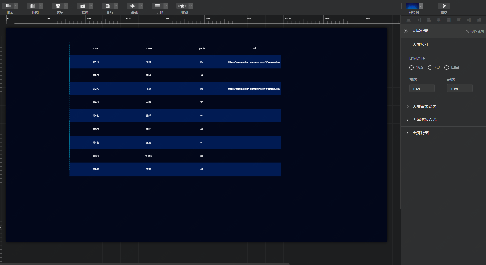

表格的样式设置包括列配置、行配置，单元格配置、动画设置，弹窗设置，数据转置、图表位置和图表尺寸。

行配置

可以对表格中默认行，特殊行的样式进行调整。

默认行配置：指对列表中非选中行和特殊行的其他行进行设置，包括显示行数以及每行的颜色。

特殊行配置：对列表中某一行进行样式颜色设置。

奇行背景色：列表奇行的背景颜色

偶行背景色：列表偶行的背景颜色

首列配置:可以对每一行的字体字号，字体粗细以及颜色进行设置

动画设置

溢出文本动画：有时候会出现列表中文字过多没有办法显示完全的情况，此时可以设置溢出文本动画滚动，或者不滚动；设置为滚动时，还可以对文本动画间隔时间进行设置

,

表格动画：可以设置开启和关闭，开启后，可以设置单行滚动或者翻页滚动，还可以对间隔时间进行设置。

展示效果：可以设置首页暂停或者右侧滑动

弹窗设置

弹窗设置可以对在预览界面点击列表中的数据所弹出的弹窗进行设置。其中包括弹窗尺寸，边框颜色粗细，背景颜色以及弹窗的位置。

列设置：

字段名：当前这列数据与数据设置中设置的数据的对应关系；

列宽：当前这列数据占整个列表的宽度比率（百分比）；

文本设置：可以对列表中字体，字号，字体粗细以及字体颜色，对齐方式（左，右，中）进行设置

图表位置

图表位置为图表左上角的位置坐标，通过横坐标和总左边的设置即可设置对应的图表位置。也可以通过选中图形后用鼠标拖曳到相应位置的方式设置图表位置。

,

图表尺寸

即显示的列表的宽和高，通过设置相应的数字，调节列表的大小。

,

### 数据设置


数据源类型

支持静态数据，API和数据库三种类型。操作流程图整体如下所示：


静态数据：


.png)

在下方表格中可输入或复制粘贴所需要的数据。其中，每一列数据对应一个数据字段，第一行为该列数据字段名，需要在上方进行映射设置。

目前，数据接入表格支持复制、粘贴、修改、删除数据。选中需要进行改动的数据后，可以点击右键进行操作，也可以使用ctrl+c等快捷键进行操作。当点击列序号或行序号是，会对该列或行全部选中，点击末尾的红色按钮可对该行或列进行删除操作，也可以点击右键对该行或列进行其他操作。

当点击红框内的放大按钮时，会出现如下图所示的输入窗口，方便用户进行操作。


在窗口中设置数据后，点击完成即可

点击下方的高级输入，可以切换到输入json格式数据模式。json数据样例如下。


``` js
[{"age":"25岁","man":10,"women":5},{"age":"26岁","man":12,"women":13},{"age":"27岁","man":1,"women":4},{"age":"28岁","man":10,"women":9},{"age":"29岁","man":2,"women":8},{"age":"30岁","man":2,"women":8},{"age":"31岁","man":2,"women":8},{"age":"32岁","man":2,"women":8},{"age":"33岁","man":20,"women":18}]
```

API

在下方输入框中输入相应的网址即可，如下图所示：

,

数据库

可以选择数据库类型，目前支持：MySQL, Oracle, SQL Server, Hive for UCP, PostgreSQL, DB2, CSV, Excel以及MySQL for UCP这九种数据库类型。选取相应的数据库类型后，选择对应数据库中的数据源名称。之后在下方输入框中输入简单的SQL语句即可实现数据的导入，之后查询数据响应结果，无误后确认设置即可。

,

### 交互

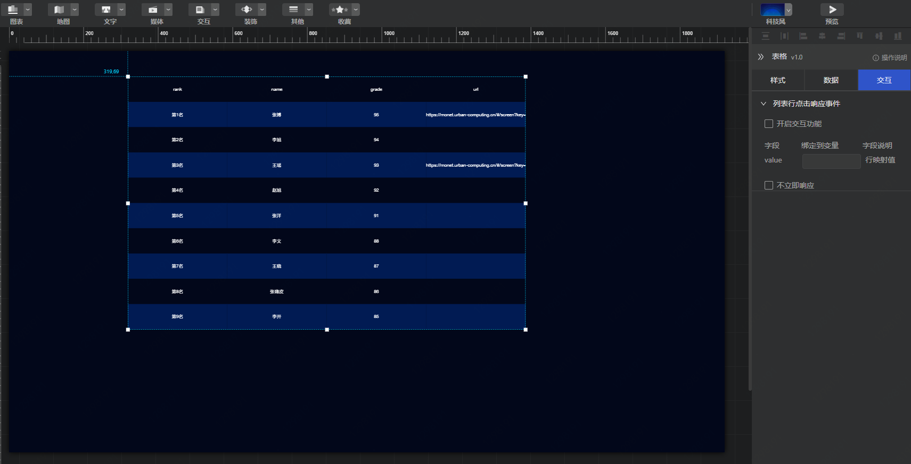

value字段有多个值，一个个表示比较麻烦，因此我们可以设置一个中间变量，中间变量名称自定义，将value字段绑定到这个中间变量，之后就可以在当前大屏的其他组件中使用此中间变量。其他组件使用时就可在API和数据库配置时使用这个中间变量，通过“：中间变量名称”的方式使用中间变量，完成数据的动态展示。

## 排行榜列表

适用场景：支持自定义文本的内容、颜色、段落样式等，能够在大屏中展示段落文本内容。本文档为您介绍多行文本各配置项的含义，帮助您快速准确地使用多行文本组件。

### 样式设置


排行榜列表的样式设置包括数据系列，表头配置，行配置，序号设置，动画设置，数据系列，图表位置和图表尺寸。


数据系列中可以添加表格的列并对每列进行设置。

可以设置列名，对应的字段名，列宽以及每列中的文本和对齐方式。

其中字段名为该数据系列映射数据文件中的字段名称。


表头配置：排行榜列表表头的配置。

.png)

显示表头：是否显示表头；

表头行高：表头行高的百分比配置；

背景颜色：表头背景色的配置；

文本设置：表头文字的设置；

.png)

行配置：

分别对默认行，选中行和特殊行进行配置。

默认行配置可以设置显示行数以及每行颜色。

奇行背景色和偶行背景色：列表奇行和偶行的背景颜色。


目前颜色选择支持主题色，标准色，最近使用的颜色，还可以选择更多颜色自定义选择自己喜欢的颜色，如果需要更快的选取页面中已有的颜色可以通过使用取色器功能，不需要取色时可以通过Esc键或点击取色器取消。

行选中配置

.png)

特殊行配置：可对列表中某特殊行进行单独配置。其中包含指定的行数，以及和默认配置一样的其他字段。系统支持添加多个特殊行。

序号配置

.png)


序号配置包括默认配置和特殊行配置。

默认配置可以设置默认行序号的图形宽度，颜色和样式。

特殊行配置可以任意指定设置的行号，对这一行的文本和颜色进行设置

该设置支持多个特殊行。

动画设置


轮播设置：进行动画轮播设置，可设置轮播一次后停止或者循环轮播，以及背景的动画间隔时间，单位为毫秒。

溢出文本滚动：可对列表中文字较多的内容进行滚动设置，并可设置文本的滚动时间，单位为毫秒。

图表位置

图表位置为图表左上角的位置坐标，通过横坐标和总左边的设置即可设置对应的图表位置。也可以通过选中图形后用鼠标拖曳到相应位置的方式设置图表位置。

，

图表尺寸

即显示的排行榜列表的宽和高，通过设置相应的数字，调节排行榜列表的大小。

，

### 数据设置


数据源类型

支持静态数据，API和数据库三种类型。操作流程图整体如下所示：


静态数据：


.png)

在下方表格中可输入或复制粘贴所需要的数据。其中，每一列数据对应一个数据字段，第一行为该列数据字段名，需要在上方进行映射设置。

目前，数据接入表格支持复制、粘贴、修改、删除数据。选中需要进行改动的数据后，可以点击右键进行操作，也可以使用ctrl+c等快捷键进行操作。当点击列序号或行序号是，会对该列或行全部选中，点击末尾的红色按钮可对该行或列进行删除操作，也可以点击右键对该行或列进行其他操作。

当点击红框内的放大按钮时，会出现如下图所示的输入窗口，方便用户进行操作。


在窗口中设置数据后，点击完成即可

点击下方的高级输入，可以切换到输入json格式数据模式。json数据样例如下。


``` js
[{"number":1,"info":"对客户：提供极致的服务和体验"},{"number":2,"info":"对合作伙伴：创造共生、互生、再生的行业生态，共享商业成功"},{"number":3,"info":"对员工：提供公平发展的舞台，实现更有尊严的生活"},{"number":4,"info":"对股东：带来持续、稳健的价值回报"},{"number":5,"info":"对社会：做心存感恩，责任担当的企业公民"}]
```

API

在下方输入框中输入相应的网址即可，如下图所示：

，

数据库

可以选择数据库类型，目前支持：MySQL, Oracle, SQL Server, Hive for UCP, PostgreSQL, DB2, CSV, Excel以及MySQL for UCP这九种数据库类型。选取相应的数据库类型后，选择对应数据库中的数据源名称。之后在下方输入框中输入简单的SQL语句即可实现数据的导入，之后查询数据响应结果，无误后确认设置即可。

，

## 图文列表

适用场景：在图文列表中，当信息展示中需要展示图片时使用此组件。

### 样式设置


图文列表的样式设置包括表头设置，行配置，动画设置，弹窗设置，数据系列，图表位置和图表尺寸。

表头配置：可以设置显示表头与否，以及对表头的一些显示情况进行设置：表头行高，背景颜色以及表头文本的设置，包括字体，字号，字体粗细以及字体颜色的设置。


显示表头：是否显示表头；

表头行高：表头行高的百分比配置；

背景颜色：背景颜色包括主题色，标准色以及最近使用的颜色，如果没有找到自己需要的颜色的话，还可以点击更多颜色进行颜色的设置：

文本设置：表头文字的设置；

行配置

可以对列表中默认行，特殊行和选中行的样式进行调整。

.png)

默认行配置：指对列表中非选中行和特殊行的其他行进行设置，包括显示行数以及每行的颜色。

选中行配置：对列表中所选中的行进行样式颜色的设置。

特殊行配置：对列表中某一行进行样式颜色设置。

奇行背景色：列表奇行的背景颜色

偶行背景色：列表偶行的背景颜色

首列配置:可以对每一行的字体字号，字体粗细以及颜色进行设置

动画配置

可以设置轮播设置为循环翻页或首页暂停，也可以对间隔时间进行设置

弹窗设置

弹窗设置可以对在预览界面点击列表中的数据所弹出的弹窗进行设置。其中包括弹窗尺寸，边框颜色粗细，背景颜色以及弹窗的位置。

数据系列

新增数据系列：点击【添加】按钮，完成数据系列的添加；

列名：当前列数据的列名称；

字段名：当前这列数据与数据设置中设置的数据的对应关系；

列宽：当前这列数据占整个列表的宽度比率（百分比）；

文本设置：可以对列表中字体，字号，字体粗细以及字体颜色，对齐方式（左，右，中）进行设置

图表位置

图表位置为图表左上角的位置坐标，通过横坐标和总左边的设置即可设置对应的图表位置。也可以通过选中图形后用鼠标拖曳到相应位置的方式设置图表位置。

，

图表尺寸

即显示的图文列表的宽和高，通过设置相应的数字，调节图文列表的大小。

，

### 数据设置


数据源类型

支持静态数据，API和数据库三种类型。操作流程图整体如下所示：


静态数据：


.png)

在下方表格中可输入或复制粘贴所需要的数据。其中，每一列数据对应一个数据字段，第一行为该列数据字段名，需要在上方进行映射设置。

目前，数据接入表格支持复制、粘贴、修改、删除数据。选中需要进行改动的数据后，可以点击右键进行操作，也可以使用ctrl+c等快捷键进行操作。当点击列序号或行序号是，会对该列或行全部选中，点击末尾的红色按钮可对该行或列进行删除操作，也可以点击右键对该行或列进行其他操作。

当点击红框内的放大按钮时，会出现如下图所示的输入窗口，方便用户进行操作。


在窗口中设置数据后，点击完成即可

点击下方的高级输入，可以切换到输入json格式数据模式。json数据样例如下。


``` js
[{"number":1,"info":"对客户：提供极致的服务和体验"},{"number":2,"info":"对合作伙伴：创造共生、互生、再生的行业生态，共享商业成功"},{"number":3,"info":"对员工：提供公平发展的舞台，实现更有尊严的生活"},{"number":4,"info":"对股东：带来持续、稳健的价值回报"},{"number":5,"info":"对社会：做心存感恩，责任担当的企业公民"}]
```

API

在下方输入框中输入相应的网址即可，如下图所示：

，

数据库

可以选择数据库类型，目前支持：MySQL, Oracle, SQL Server, Hive for UCP, PostgreSQL, DB2, CSV, Excel以及MySQL for UCP这九种数据库类型。选取相应的数据库类型后，选择对应数据库中的数据源名称。之后在下方输入框中输入简单的SQL语句即可实现数据的导入，之后查询数据响应结果，无误后确认设置即可。

，

## 条形图

适用场景：条形图是柱状图的一种，支持自定义x轴区间、多系列数据配置以及堆叠式的数据展示， 能够使人们一眼看出各个数据的大小，易于比较数据之间的差别，是统计图资料分析中最常用的图形。

### 样式设置


条形图的样式设置包括：水平轴设置，垂直轴设置，辅助线设置，提示框设置，图例设置，数据滚动设置，动画设置，数据系列，图表位置和图表尺寸。

配色方案

系统预置三套配色方案，当选择配色方案时，系统会自动将选择的配色方案置入组件中，完成组件的配色。

水平轴设置
.png)

点击隐藏轴开关，可以在大屏中隐藏水平轴

文本设置：

字体，支持微软雅黑、宋体、黑体、隶书、幼圆、楷体和系统默认字体；

字号：X轴的字号，可输入字号调整；

字体粗细：X轴字体的粗细，有正常、细体、粗体、更粗四个选项；

字体颜色：X轴字体的颜色，分为主题色，标准色，最近使用的颜色，以及更多颜色的选项，根据需要选择相应的颜色就好。

，

旋转角度：X轴文字的旋转角度，可输入旋转角度进行调整；

智能隐藏：智能隐藏可将X轴过多的刻度文字进行隐藏，如需全部显示X轴刻度信息，则无需勾选，默认不勾选。
.png)

轴线设置：可以设置坐标轴的粗细，样式和颜色。样式中包括三种样式。

垂直轴设置
.png)

点击隐藏轴开关，可以在大屏中隐藏水平轴

文本设置：

字体，支持微软雅黑、宋体、黑体、隶书、幼圆、楷体和系统默认字体；

字号：X轴的字号，可输入字号调整；

字体粗细：X轴字体的粗细，有正常、细体、粗体、更粗四个选项；

字体颜色：X轴字体的颜色，分为主题色，标准色，最近使用的颜色，以及更多颜色的选项，如果需要更快的选取页面中已有的颜色可以通过使用取色器功能，不需要取色时可以通过Esc键或点击取色器取消。

，

旋转角度：X轴文字的旋转角度，可输入旋转角度进行调整；

智能隐藏：智能隐藏可将X轴过多的刻度文字进行隐藏，如需全部显示X轴刻度信息，则无需勾选，默认不勾选。
.png)

轴线设置

可以设置坐标轴的粗细，样式和颜色。样式中包括三种样式。

辅助线设置

分为横向辅助线和纵向辅助线和标记线设置。可以选择辅助线是否显示，以及对辅助线粗细样式、颜色进行设置。

粗细：可以手动输入数字或者选择有粗细框右边的上下标一点点调节。

样式：支持三种形式，如下所示：

，


.png)

标记线设置中，还可以额外对标记线的标记值，文本进行设置。

提示框设置

适用情况：在预览界面时，鼠标滑过柱状区域，可以显示相应的信息。

可以对提示框的字体，字号，文字粗细以及文字颜色和背景颜色进行设置，如下图所示：


除此之外，还可以对提示框的边框颜色，粗细以及选中颜色进行设置。

图例设置

图例设置可以对是否显示图例，以及所显示图例的文本和布局进行设置。

文本：支持字体，字号，字体颜色以及字体粗细的修改。

布局：可以对图例的位置进行设置。

目前默认支持：顶部，底部，左侧，右侧的居左居中居右的设置，如下图所示：

支持自行设置图例位置：通过调整左右间距，和上下间距进行自主设置。

，

数据滚动设置

.png)

点击开启数据滚动，可以打开数据滚动设置。

通过设置数据滚动起点和重点，可以在图表中优先展示这部分数据，再通过滚动数据条的滚动，显示其他数据

在滚动条样式设置中，对滚动条宽度，填充颜色和边框颜色进行设置。

动画设置
.png)

在动画设置中，可以设置图表在提示框轮播时的自动动画轮播。包括动画的开关和间隔时间设置。


数据系列

.png)

数据系列设置中，可以添加删除各个数据系列，并设置系列名和系列值。

.png)

在形状设置中，可以设置柱子宽度，可以自适应粗细，也可以自定义粗细。设置柱子的圆角以及颜色设置。还可以选择显示柱子背景，以及显示的柱子背景的颜色。


文本设置中可以设置图表中每个数据系列中的显示数据文本。
图表位置

图表位置为图表左上角的位置坐标，通过横坐标和总左边的设置即可设置对应的图表位置。也可以通过选中图形后用鼠标拖曳到相应位置的方式设置图表位置。


图表尺寸

即显示的条形图的宽和高，通过设置相应的数字，调节条形图的大小。


### 数据设置

数据字段


条形图的数据字段包括：X，Y，S

X：条形图中数据在X轴上的值（一般为度量值），需要将数据与图表进行映射；

Y：条形图中数据在Y轴上的值（一般为维度），需要将数据与图表进行映射；

S：条形图中的数据系列字段，需要将数据与图表进行映射；

数据源类型

支持静态数据，API和数据库三种类型。操作流程图整体如下所示：


静态数据：


.png)

在下方表格中可输入或复制粘贴所需要的数据。其中，每一列数据对应一个数据字段，第一行为该列数据字段名，需要在上方进行映射设置。

目前，数据接入表格支持复制、粘贴、修改、删除数据。选中需要进行改动的数据后，可以点击右键进行操作，也可以使用ctrl+c等快捷键进行操作。当点击列序号或行序号是，会对该列或行全部选中，点击末尾的红色按钮可对该行或列进行删除操作，也可以点击右键对该行或列进行其他操作。

当点击红框内的放大按钮时，会出现如下图所示的输入窗口，方便用户进行操作。


在窗口中设置数据后，点击完成即可

点击下方的高级输入，可以切换到输入json格式数据模式。json数据样例如下。


``` js
[{"age":25,"number":15,"s":1},{"age":26,"number":25,"s":1},{"age":27,"number":5,"s":1},{"age":28,"number":19,"s":1},{"age":29,"number":10,"s":1}]
```

API

在下方输入框中输入相应的网址即可，如下图所示：


数据库

可以选择数据库类型，目前支持：MySQL, Oracle, SQL Server, Hive for UCP, PostgreSQL, DB2, CSV, Excel以及MySQL for UCP这九种数据库类型。选取相应的数据库类型后，选择对应数据库中的数据源名称。之后在下方输入框中输入简单的SQL语句即可实现数据的导入，之后查询数据响应结果，无误后确认设置即可。


## 双向条形图

适用场景：双向柱状图多用于展示包含相反含义的数据的对比。其中图表的一个轴显示正在比较的类别，而另一轴代表对应的刻度值。双向柱状图一般用于正负两份相反数据的对比。

### 样式设置


双向条形图的样式设置包括：水平轴设置，垂直轴设置，辅助线设置，提示框设置，图例设置，数据滚动设置，动画设置，数据系列，图表位置和图表尺寸。

数据系列


双向条形图数据系列设置包括柱子宽度设置，柱子背景颜色设置以及分别对左侧和右侧系列进行设置。柱子宽度设置支持自适应粗细和自定义粗细两种。

.png)

在每一个数据系列中，可以设置形状和文本，包括圆角设置，颜色设置以及文本的具体参数。

水平轴设置
.png)

点击隐藏轴开关，可以在大屏中隐藏水平轴

文本设置：

字体，支持微软雅黑、宋体、黑体、隶书、幼圆、楷体和系统默认字体；

字号：X轴的字号，可输入字号调整；

字体粗细：X轴字体的粗细，有正常、细体、粗体、更粗四个选项；

字体颜色：X轴字体的颜色，分为主题色，标准色，最近使用的颜色，以及更多颜色的选项，如果需要更快的选取页面中已有的颜色可以通过使用取色器功能，不需要取色时可以通过Esc键或点击取色器取消。

，

旋转角度：X轴文字的旋转角度，可输入旋转角度进行调整；

智能隐藏：智能隐藏可将X轴过多的刻度文字进行隐藏，如需全部显示X轴刻度信息，则无需勾选，默认不勾选。
.png)

轴线设置：可以设置坐标轴的粗细，样式和颜色。样式中包括三种样式。

垂直轴设置
.png)

点击隐藏轴开关，可以在大屏中隐藏水平轴

文本设置：

字体，支持微软雅黑、宋体、黑体、隶书、幼圆、楷体和系统默认字体；

字号：X轴的字号，可输入字号调整；

字体粗细：X轴字体的粗细，有正常、细体、粗体、更粗四个选项；

字体颜色：X轴字体的颜色，分为主题色，标准色，最近使用的颜色，以及更多颜色的选项，如果需要更快的选取页面中已有的颜色可以通过使用取色器功能，不需要取色时可以通过Esc键或点击取色器取消。

，

旋转角度：X轴文字的旋转角度，可输入旋转角度进行调整；

智能隐藏：智能隐藏可将X轴过多的刻度文字进行隐藏，如需全部显示X轴刻度信息，则无需勾选，默认不勾选。
.png)

轴线设置

可以设置坐标轴的粗细，样式和颜色。样式中包括三种样式。

辅助线设置

分为横向辅助线和纵向辅助线和标记线设置。可以选择辅助线是否显示，以及对辅助线粗细样式、颜色进行设置。

粗细：可以手动输入数字或者选择有粗细框右边的上下标一点点调节。

样式：支持三种形式，如下所示：

，


.png)

标记线设置中，还可以额外对标记线的标记值，文本进行设置。

提示框设置

.png)

适用情况：在预览界面时，鼠标滑过柱状区域，可以显示相应的信息。

可以对提示框的字体，字号，文字粗细以及文字颜色和背景颜色进行设置，如图所示


除此之外，还可以对提示框的边框颜色，粗细以及选中颜色进行设置。

图例设置

图例设置可以对是否显示图例，以及所显示图例的文本和布局进行设置。

文本：支持字体，字号，字体颜色以及字体粗细的修改。

布局：可以对图例的位置进行设置。

目前默认支持：顶部，底部，左侧，右侧的居左居中居右的设置，如下图所示：

支持自行设置图例位置：通过调整左右间距，和上下间距进行自主设置。

，

数据滚动设置

.png)

点击开启数据滚动，可以打开数据滚动设置。

通过设置数据滚动起点和重点，可以在图表中优先展示这部分数据，再通过滚动数据条的滚动，显示其他数据

在滚动条样式设置中，对滚动条宽度，填充颜色和边框颜色进行设置。

动画设置
.png)

在动画设置中，可以设置图表在提示框轮播时的自动动画轮播。包括动画的开关和间隔时间设置。


图表位置

图表位置为图表左上角的位置坐标，通过横坐标和总左边的设置即可设置对应的图表位置。也可以通过选中图形后用鼠标拖曳到相应位置的方式设置图表位置。


图表尺寸

即显示的双向条形图的宽和高，通过设置相应的数字，调节双向条形图的大小。


### 数据设置

数据字段


双向条形图的数据字段包括：Y，xLeft，xRight

Y：双向条形图中数据在Y轴上的值（一般为维度），需要将数据与图表进行映射；

xLeft：双向条形图中数据在左侧X轴上的值（一般为度量值），需要将数据与图表进行映射；

xRight：双向条形图中数据在右侧X轴上的值（一般为度量值），需要将数据与图表进行映射；

数据源类型

支持静态数据，API和数据库三种类型。操作流程图整体如下所示：


静态数据：


.png)

在下方表格中可输入或复制粘贴所需要的数据。其中，每一列数据对应一个数据字段，第一行为该列数据字段名，需要在上方进行映射设置。

目前，数据接入表格支持复制、粘贴、修改、删除数据。选中需要进行改动的数据后，可以点击右键进行操作，也可以使用ctrl+c等快捷键进行操作。当点击列序号或行序号是，会对该列或行全部选中，点击末尾的红色按钮可对该行或列进行删除操作，也可以点击右键对该行或列进行其他操作。

当点击红框内的放大按钮时，会出现如下图所示的输入窗口，方便用户进行操作。


在窗口中设置数据后，点击完成即可

点击下方的高级输入，可以切换到输入json格式数据模式。json数据样例如下。


``` js
[{"age":25,"num1":15,"num2":13},{"age":26,"num1":22,"num2":15},{"age":27,"num1":5,"num2":8},{"age":28,"num1":19,"num2":12},{"age":29,"num1":14,"num2":4}]
```

API

在下方输入框中输入相应的网址即可，如下图所示：


数据库

可以选择数据库类型，目前支持：MySQL, Oracle, SQL Server, Hive for UCP, PostgreSQL, DB2, CSV, Excel以及MySQL for UCP这九种数据库类型。选取相应的数据库类型后，选择对应数据库中的数据源名称。之后在下方输入框中输入简单的SQL语句即可实现数据的导入，之后查询数据响应结果，无误后确认设置即可。


## 堆叠条形图

适用场景：堆叠条形图可以用来直观说明同一组或同一类在不同的划分标准下的表现情况。

### 样式设置


堆叠条形图的样式设置包括：数据系列，水平轴设置，垂直轴设置，辅助线设置，提示框设置，图例设置，数据滚动设置，动画设置，图表位置和图表尺寸。

数据系列


数据系列设置可以设置柱子宽度，圆角值以及柱子的背景颜色。柱子宽度支持自适应粗细和自定义粗细两种。

.png)

每个数据系列里包括形状设置和文本设置。可以设置颜色以及文本内容。

水平轴设置
.png)

点击隐藏轴开关，可以在大屏中隐藏水平轴

文本设置：

字体，支持微软雅黑、宋体、黑体、隶书、幼圆、楷体和系统默认字体；

字号：X轴的字号，可输入字号调整；

字体粗细：X轴字体的粗细，有正常、细体、粗体、更粗四个选项；

字体颜色：X轴字体的颜色，分为主题色，标准色，最近使用的颜色，以及更多颜色的选项，如果需要更快的选取页面中已有的颜色可以通过使用取色器功能，不需要取色时可以通过Esc键或点击取色器取消。

，

旋转角度：X轴文字的旋转角度，可输入旋转角度进行调整；

智能隐藏：智能隐藏可将X轴过多的刻度文字进行隐藏，如需全部显示X轴刻度信息，则无需勾选，默认不勾选。
.png)

轴线设置：可以设置坐标轴的粗细，样式和颜色。样式中包括三种样式。

垂直轴设置
.png)

点击隐藏轴开关，可以在大屏中隐藏水平轴

文本设置：

字体，支持微软雅黑、宋体、黑体、隶书、幼圆、楷体和系统默认字体；

字号：X轴的字号，可输入字号调整；

字体粗细：X轴字体的粗细，有正常、细体、粗体、更粗四个选项；

字体颜色：X轴字体的颜色，分为主题色，标准色，最近使用的颜色，以及更多颜色的选项，如果需要更快的选取页面中已有的颜色可以通过使用取色器功能，不需要取色时可以通过Esc键或点击取色器取消。

，

旋转角度：X轴文字的旋转角度，可输入旋转角度进行调整；

智能隐藏：智能隐藏可将X轴过多的刻度文字进行隐藏，如需全部显示X轴刻度信息，则无需勾选，默认不勾选。
.png)

轴线设置

可以设置坐标轴的粗细，样式和颜色。样式中包括三种样式。

辅助线设置

分为横向辅助线和纵向辅助线和标记线设置。可以选择辅助线是否显示，以及对辅助线粗细样式、颜色进行设置。

粗细：可以手动输入数字或者选择有粗细框右边的上下标一点点调节。

样式：支持三种形式，如下所示：

，


.png)

标记线设置中，还可以额外对标记线的标记值，文本进行设置。

提示框设置

.png)

适用情况：在预览界面时，鼠标滑过柱状区域，可以显示相应的信息。

可以对提示框的字体，字号，文字粗细以及文字颜色和背景颜色进行设置，如图所示


除此之外，还可以对提示框的边框颜色，粗细以及选中颜色进行设置。

图例设置

图例设置可以对是否显示图例，以及所显示图例的文本和布局进行设置。

文本：支持字体，字号，字体颜色以及字体粗细的修改。

布局：可以对图例的位置进行设置。

目前默认支持：顶部，底部，左侧，右侧的居左居中居右的设置，如下图所示：

支持自行设置图例位置：通过调整左右间距，和上下间距进行自主设置。

，

数据滚动设置

.png)

点击开启数据滚动，可以打开数据滚动设置。

通过设置数据滚动起点和重点，可以在图表中优先展示这部分数据，再通过滚动数据条的滚动，显示其他数据

在滚动条样式设置中，对滚动条宽度，填充颜色和边框颜色进行设置。

动画设置
.png)

在动画设置中，可以设置图表在提示框轮播时的自动动画轮播。包括动画的开关和间隔时间设置。


数据系列

数据系列设置中，可以添加删除各个数据系列，并设置系列名和系列值。

在形状设置中，可以改变每一个数据系列尺寸大小，圆角设置以及颜色设置

.png)

文本设置中可以设置图表中每个数据系列中的显示数据文本。

图表位置

图表位置为图表左上角的位置坐标，通过横坐标和总左边的设置即可设置对应的图表位置。也可以通过选中图形后用鼠标拖曳到相应位置的方式设置图表位置。

，

图表尺寸

即显示的柱状图的宽和高，通过设置相应的数字，调节柱状图的大小。

，

### 数据设置

数据字段


堆叠条形图的数据字段包括：X，Y，S

X：堆叠条形图中数据在X轴上的值，需要将数据与图表进行映射；

Y：堆叠条形图中数据在Y轴上的值，需要将数据与图表进行映射；

S：堆叠条形图中的数据系列字段，需要将数据与图表进行映射；

数据源类型

支持静态数据，API和数据库三种类型。操作流程图整体如下所示：


静态数据：


.png)

在下方表格中可输入或复制粘贴所需要的数据。其中，每一列数据对应一个数据字段，第一行为该列数据字段名，需要在上方进行映射设置。

目前，数据接入表格支持复制、粘贴、修改、删除数据。选中需要进行改动的数据后，可以点击右键进行操作，也可以使用ctrl+c等快捷键进行操作。当点击列序号或行序号是，会对该列或行全部选中，点击末尾的红色按钮可对该行或列进行删除操作，也可以点击右键对该行或列进行其他操作。

当点击红框内的放大按钮时，会出现如下图所示的输入窗口，方便用户进行操作。


在窗口中设置数据后，点击完成即可

点击下方的高级输入，可以切换到输入json格式数据模式。json数据样例如下。


``` js
[{"age":25,"number":37,"s":1},{"age":26,"number":41,"s":1},{"age":27,"number":55,"s":1},{"age":28,"number":49,"s":1},{"age":25,"number":21,"s":2},{"age":26,"number":32,"s":2},{"age":27,"number":25,"s":2},{"age":28,"number":29,"s":2}]
```

API

在下方输入框中输入相应的网址即可，如下图所示：


数据库

可以选择数据库类型，目前支持：MySQL, Oracle, SQL Server, Hive for UCP, PostgreSQL, DB2, CSV, Excel以及MySQL for UCP这九种数据库类型。选取相应的数据库类型后，选择对应数据库中的数据源名称。之后在下方输入框中输入简单的SQL语句即可实现数据的导入，之后查询数据响应结果，无误后确认设置即可。


### 交互


y字段有多个值，一个个表示比较麻烦，因此我们可以设置一个中间变量，中间变量名称自定义，将y字段绑定到这个中间变量，之后就可以在当前大屏的其他组件中使用此中间变量。其他组件使用时就可在API和数据库配置时使用这个中间变量，通过“：中间变量名称”的方式使用中间变量，完成数据的动态展示。


## 雷达图

适用场景：又被叫做蜘蛛网图，适用于显示三个或更多的维度的变量。雷达图是以在同一点开始的轴上显示的三个或更多个变量的二维图表的形式来显示多元数据的方法，其中轴的相对位置和角度通常是无意义的。雷达图的每个变量都有一个从中心向外发射的轴线，所有的轴之间的夹角相等，同时每个轴有相同的刻度，将轴到轴的刻度用网格线链接作为辅助元素，连接每个变量在其各自的轴线的数据点成一条多边形。

### 样式设置


雷达图的样式设置，包括角度轴设置、图例设置、数据系列，图表位置和图表尺寸。

角度轴设置

角度轴设置可以对轴上的文字进行设置，包括字体、字号、字体颜色、字体粗细的设置

图例设置

图例设置可以对是否显示图例，以及所显示图例的文本和布局进行设置。

文本：支持字体，字号，字体颜色以及字体粗细的修改。

布局：可以对图例的位置进行设置。

目前默认支持：顶部，底部，左侧，右侧的居左居中居右的设置，如下图所示：

支持自行设置图例位置：通过调整左右间距，和上下间距进行自主设置。


数据系列

雷达图的数据系列代表着一组数据，如下图所示，蓝色代表一组数据。

新增数据系列：点击【添加】按钮，完成数据系列的添加；

系列名：当前这组数据的图例名称；

系列值：当前这组数据与数据设置中设置的数据的对应关系；

描边颜色：雷达面的边的颜色

描边粗细：雷达面的边的粗细

填充颜色：当前这组系列雷达面的颜色；


图表位置

图表位置为图表左上角的位置坐标，通过横坐标和总左边的设置即可设置对应的图表位置。也可以通过选中图形后用鼠标拖曳到相应位置的方式设置图表位置。


图表尺寸

即显示的雷达图的宽和高，通过设置相应的数字，调节雷达图的大小。


### 数据设置

数据字段


雷达图的数据字段包括：name，value，S

name：雷达图的维度字段，需要将数据与图表进行映射；

value：雷达图的度量字段，需要将数据与图表进行映射；

S：雷达图中的数据系列字段，需要将数据与图表进行映射；

数据源类型

支持静态数据，API和数据库三种类型。操作流程图整体如下所示：


静态数据：


.png)

在下方表格中可输入或复制粘贴所需要的数据。其中，每一列数据对应一个数据字段，第一行为该列数据字段名，需要在上方进行映射设置。

目前，数据接入表格支持复制、粘贴、修改、删除数据。选中需要进行改动的数据后，可以点击右键进行操作，也可以使用ctrl+c等快捷键进行操作。当点击列序号或行序号是，会对该列或行全部选中，点击末尾的红色按钮可对该行或列进行删除操作，也可以点击右键对该行或列进行其他操作。

当点击红框内的放大按钮时，会出现如下图所示的输入窗口，方便用户进行操作。


在窗口中设置数据后，点击完成即可

点击下方的高级输入，可以切换到输入json格式数据模式。json数据样例如下。


``` js
[{"name":"Co2","value":15,"s":"1"},{"name":"So2","value":25,"s":"1"},{"name":"Co","value":5,"s":"1"},{"name":"PM2.5","value":19,"s":"1"},{"name":"PM10","value":10,"s":"1"}]
```

API

在下方输入框中输入相应的网址即可，如下图所示：


数据库

可以选择数据库类型，目前支持：MySQL, Oracle, SQL Server, Hive for UCP, PostgreSQL, DB2, CSV, Excel以及MySQL for UCP这九种数据库类型。选取相应的数据库类型后，选择对应数据库中的数据源名称。之后在下方输入框中输入简单的SQL语句即可实现数据的导入，之后查询数据响应结果，无误后确认设置即可。


## 词云

适用场景：

又称文字云，是文本数据的视觉表示，由词汇组成类似云的彩色图形，用于展示大量文本数据。通常用于描述网站上的关键字元数据（标签），或可视化自由格式文本。 每个词的重要性以字体大小或颜色显示。 词云的作用：

快速感知最突出的文字

快速定位按字母顺序排列的文字中相对突出的部分

词云的本质是点图，是在相应坐标点绘制具有特定样式的文字的结果

### 样式设置

.png)

词云的样式设置，目前包括颜色设置，文本设置，形状设置，图表位置和图表尺寸。

配

颜色设置


颜色设置：可设置词云中文字的颜色，例如当有5种文字，仅设置2种颜色时，文字颜色会按照设置的颜色进行顺序循环变化；

文本设置

字号设置：可设置词云中最小的字号和最大的字号，剩余文字在此区间内线性变化；

字体设置：设置词云字体，包括微软雅黑、宋体、黑体等；

字体粗细：正常、粗体、更粗、细体；

文字旋转：词云中字体的旋转角度，包括自动、水平、水平+垂直；

形状设置

形状设置：可设置词云形状，包括园形、人形、方形、心形；

图表位置

图表位置为图表左上角的位置坐标，通过横坐标和总左边的设置即可设置对应的图表位置。也可以通过选中图形后用鼠标拖曳到相应位置的方式设置图表位置。


图表尺寸

即显示的词云的宽和高，通过设置相应的数字，调节词云的大小。


### 数据设置

数据字段


词云的数据字段包括：name，value

name：词云图的维度字段，需要将数据与图表进行映射；

value：词云图的度量字段，需要将数据与图表进行映射；

数据源类型

支持静态数据，API和数据库三种类型。操作流程图整体如下所示：


静态数据：


.png)

在下方表格中可输入或复制粘贴所需要的数据。其中，每一列数据对应一个数据字段，第一行为该列数据字段名，需要在上方进行映射设置。

目前，数据接入表格支持复制、粘贴、修改、删除数据。选中需要进行改动的数据后，可以点击右键进行操作，也可以使用ctrl+c等快捷键进行操作。当点击列序号或行序号是，会对该列或行全部选中，点击末尾的红色按钮可对该行或列进行删除操作，也可以点击右键对该行或列进行其他操作。

当点击红框内的放大按钮时，会出现如下图所示的输入窗口，方便用户进行操作。


在窗口中设置数据后，点击完成即可

点击下方的高级输入，可以切换到输入json格式数据模式。json数据样例如下。


``` js
[{"name":"上海","value":40},{"name":"深圳","value":35},{"name":"北京","value":131},{"name":"郑州","value":52},{"name":"广州","value":59},{"name":"台北","value":46},{"name":"海口","value":48},{"name":"澳门","value":51},{"name":"香港","value":120},{"name":"南京","value":60},{"name":"西安","value":129},{"name":"哈尔滨","value":48},{"name":"沈阳","value":41},{"name":"吉林","value":52},{"name":"呼和浩特","value":44},{"name":"拉萨","value":47},{"name":"乌鲁木齐","value":59},{"name":"银川","value":40},{"name":"兰州","value":42},{"name":"太原","value":44},{"name":"济南","value":51},{"name":"杭州","value":53},{"name":"天津","value":56},{"name":"石家庄","value":53},{"name":"长沙","value":58},{"name":"武汉","value":55},{"name":"昆明","value":56},{"name":"南昌","value":44},{"name":"福州","value":42},{"name":"南宁","value":45},{"name":"成都","value":54},{"name":"重庆","value":35},{"name":"贵阳","value":47},{"name":"合肥","value":57},{"name":"西宁","value":47}]
```

API

在下方输入框中输入相应的网址即可，如下图所示：


数据库

可以选择数据库类型，目前支持：MySQL, Oracle, SQL Server, Hive for UCP, PostgreSQL, DB2, CSV, Excel以及MySQL for UCP这九种数据库类型。选取相应的数据库类型后，选择对应数据库中的数据源名称。之后在下方输入框中输入简单的SQL语句即可实现数据的导入，之后查询数据响应结果，无误后确认设置即可。


## 胶囊图

适用场景：适用于在大屏中直观地展示工作任务的进度情况，也可以反映部分与整体之间的比例。

### 样式设置


胶囊图的样式设置，目前包括图表设置，图例设置。

图表设置：

.png)

图表设置：

图表设置包括设置胶囊的方向。

设置两侧的颜色以及文本设置和保留小数位数。

图例设置：

图例设置可以对是否显示图例，上方（或左侧）文本和下方（或右侧）文本的字体，字号，字体粗细以及字体颜色进行设置，以及对图例文字距离图表的像素值进行设置，如下图所示：


图表位置

图表位置为图表左上角的位置坐标，通过横坐标和总左边的设置即可设置对应的图表位置。也可以通过选中图形后用鼠标拖曳到相应位置的方式设置图表位置。


图表尺寸

即显示的胶囊图的宽和高，通过设置相应的数字，调节胶囊图的大小。


### 数据设置

数据字段


数据字段包括：name，value

name：维度字段，需要将数据与图表进行映射；

value：度量字段，需要将数据与图表进行映射；

数据源类型

支持静态数据，API和数据库三种类型。操作流程图整体如下所示：


静态数据：


.png)

在下方表格中可输入或复制粘贴所需要的数据。其中，每一列数据对应一个数据字段，第一行为该列数据字段名，需要在上方进行映射设置。

目前，数据接入表格支持复制、粘贴、修改、删除数据。选中需要进行改动的数据后，可以点击右键进行操作，也可以使用ctrl+c等快捷键进行操作。当点击列序号或行序号是，会对该列或行全部选中，点击末尾的红色按钮可对该行或列进行删除操作，也可以点击右键对该行或列进行其他操作。

当点击红框内的放大按钮时，会出现如下图所示的输入窗口，方便用户进行操作。


在窗口中设置数据后，点击完成即可

点击下方的高级输入，可以切换到输入json格式数据模式。json数据样例如下。


``` js
[{"gender":"女性","number":100},{"gender":"男性","number":120}]
```

API

在下方输入框中输入相应的网址即可，如下图所示：


数据库

可以选择数据库类型，目前支持：MySQL, Oracle, SQL Server, Hive for UCP, PostgreSQL, DB2, CSV, Excel以及MySQL for UCP这九种数据库类型。选取相应的数据库类型后，选择对应数据库中的数据源名称。之后在下方输入框中输入简单的SQL语句即可实现数据的导入，之后查询数据响应结果，无误后确认设置即可。

数据格式

## 排行榜条形图

适用情况：可以直观的显示出数据从高到低排列的结果。

### 样式设置


排行榜条形图的样式设置包括 数据系列，垂直轴设置，提示框设置，数据滚动设置，动画设置，图表位置和图表尺寸。

数据系列


数据系列设置包括形状设置，左侧文本设置和右侧文本设置。

形状设置可以设置条形图宽度，圆角和颜色以及背景颜色。

左右侧文本分别设置条形图左侧和右侧的文本，可以设置是否显示，文本类型和具体的文本设置。


垂直轴设置

.png)

垂直轴设置可以设置文本样式和旋转角度。


提示框设置

.png)

提示框设置包括文本样式设置，提示框背景颜色，圆角设置，边框粗细和颜色以及选中颜色。

数据滚动设置


.png)

点击开启数据滚动，可以打开数据滚动设置。

通过设置数据滚动起点和重点，可以在图表中优先展示这部分数据，再通过滚动数据条的滚动，显示其他数据

在滚动条样式设置中，对滚动条宽度，填充颜色和边框颜色进行设置。

动画设置
.png)

在动画设置中，可以设置图表在提示框轮播时的自动动画轮播。包括动画的开关和间隔时间设置。


点击开启数据滚动，可以打开数据滚动设置。

通过设置数据滚动起点和重点，可以在图表中优先展示这部分数据，再通过滚动数据条的滚动，显示其他数据


图表位置

图表位置为图表左上角的位置坐标，通过横坐标和总左边的设置即可设置对应的图表位置。也可以通过选中图形后用鼠标拖曳到相应位置的方式设置图表位置。


图表尺寸

即显示的排行榜条形图的宽和高，通过设置相应的数字，调节排行榜条形图的大小。


### 数据设置

数据字段


数据字段包括：X,Y

X：排行榜条形图中数据在X轴上的值（一般为度量值），需要将数据与图表进行映射；

Y：排行榜条形图中数据在Y轴上的值（一般为维度值），需要将数据与图表进行映射；

数据源类型

支持静态数据，API和数据库三种类型。操作流程图整体如下所示：


静态数据：


.png)

在下方表格中可输入或复制粘贴所需要的数据。其中，每一列数据对应一个数据字段，第一行为该列数据字段名，需要在上方进行映射设置。

目前，数据接入表格支持复制、粘贴、修改、删除数据。选中需要进行改动的数据后，可以点击右键进行操作，也可以使用ctrl+c等快捷键进行操作。当点击列序号或行序号是，会对该列或行全部选中，点击末尾的红色按钮可对该行或列进行删除操作，也可以点击右键对该行或列进行其他操作。

当点击红框内的放大按钮时，会出现如下图所示的输入窗口，方便用户进行操作。


在窗口中设置数据后，点击完成即可

点击下方的高级输入，可以切换到输入json格式数据模式。json数据样例如下。


``` js
[{"name":"东城区","number":12921},{"name":"西城区","number":78302},{"name":"朝阳区","number":54221},{"name":"丰台区","number":8210},{"name":"海淀区","number":34212},{"name":"大兴区","number":7233},{"name":"石景山区","number":29810},{"name":"通州区","number":2312},{"name":"昌平区","number":1231}]
```

API

在下方输入框中输入相应的网址即可，如下图所示：


数据库

可以选择数据库类型，目前支持：MySQL, Oracle, SQL Server, Hive for UCP, PostgreSQL, DB2, CSV, Excel以及MySQL for UCP这九种数据库类型。选取相应的数据库类型后，选择对应数据库中的数据源名称。之后在下方输入框中输入简单的SQL语句即可实现数据的导入，之后查询数据响应结果，无误后确认设置即可。


## 进度条

适用场景：适用于在大屏中直观地展示工作任务的进度情况，也可以反映部分与整体之间的比例。

### 样式设置


样式设置包括 颜色设置，文本设置、图表位置和图表尺寸。

颜色设置

.png)

颜色设置可设置进度条的底色和覆盖色。

文本设置

文本设置可设置文本的显示和隐藏，保留的小数位，数字的样式及百分号的样式；

图表位置

图表位置为图表左上角的位置坐标，通过横坐标和总左边的设置即可设置对应的图表位置。也可以通过选中图形后用鼠标拖曳到相应位置的方式设置图表位置。


图表尺寸

即显示的进度条的宽和高，通过设置相应的数字，调节进度条的大小。


### 数据设置

数据字段


数据字段包括：name，value

total：总数；

done：已完成数；

数据源类型

支持静态数据，API和数据库三种类型。操作流程图整体如下所示：


静态数据：


.png)

在下方表格中可输入或复制粘贴所需要的数据。其中，每一列数据对应一个数据字段，第一行为该列数据字段名，需要在上方进行映射设置。

目前，数据接入表格支持复制、粘贴、修改、删除数据。选中需要进行改动的数据后，可以点击右键进行操作，也可以使用ctrl+c等快捷键进行操作。当点击列序号或行序号是，会对该列或行全部选中，点击末尾的红色按钮可对该行或列进行删除操作，也可以点击右键对该行或列进行其他操作。

当点击红框内的放大按钮时，会出现如下图所示的输入窗口，方便用户进行操作。


在窗口中设置数据后，点击完成即可

点击下方的高级输入，可以切换到输入json格式数据模式。json数据样例如下。


``` js
[{"total":400,"done":300}]
```

API

在下方输入框中输入相应的网址即可，如下图所示：


数据库

可以选择数据库类型，目前支持：MySQL, Oracle, SQL Server, Hive for UCP, PostgreSQL, DB2, CSV, Excel以及MySQL for UCP这九种数据库类型。选取相应的数据库类型后，选择对应数据库中的数据源名称。之后在下方输入框中输入简单的SQL语句即可实现数据的导入，之后查询数据响应结果，无误后确认设置即可。


## 环形进度条

适用场景：用环状图展示工作任务的进度情况，也可以反映部分与整体之间的比例，适用于大屏空间较为富余的时候。

### 样式设置


样式设置包括 颜色设置，圆环设置、内文本设置、外文本设置、动画设置、图表位置和图表尺寸。

圆环设置

.png)

圆环设置可以设置内环占比，圆环间隙和等分分数。同时还有颜色设置和文本的设置。

文本设置包括内文本设置和外文本设置。


内文本设置

可以设置保留的小数位数

数字样式：包括字体字号，字体粗细，颜色的设置

可以设置单位样式：字体字号，字体粗细，颜色的设置

外文本设置

可以设置是否有线条展示

文本样式：字体字号，字体粗细，颜色的设置

动画设置

可以设置循环播放或者播放一次后停止，以及设置各个区域的停留时间，如下图所示：


图表位置

图表位置为图表左上角的位置坐标，通过横坐标和总左边的设置即可设置对应的图表位置。也可以通过选中图形后用鼠标拖曳到相应位置的方式设置图表位置。


图表尺寸

即显示的环形进度条的宽和高，通过设置相应的数字，调节环形进度条的大小。


### 数据设置

数据字段


数据字段包括：name，value

name：总数；

value：已完成数；

数据源类型

支持静态数据，API和数据库三种类型。操作流程图整体如下所示：


静态数据：


.png)

在下方表格中可输入或复制粘贴所需要的数据。其中，每一列数据对应一个数据字段，第一行为该列数据字段名，需要在上方进行映射设置。

目前，数据接入表格支持复制、粘贴、修改、删除数据。选中需要进行改动的数据后，可以点击右键进行操作，也可以使用ctrl+c等快捷键进行操作。当点击列序号或行序号是，会对该列或行全部选中，点击末尾的红色按钮可对该行或列进行删除操作，也可以点击右键对该行或列进行其他操作。

当点击红框内的放大按钮时，会出现如下图所示的输入窗口，方便用户进行操作。


在窗口中设置数据后，点击完成即可

点击下方的高级输入，可以切换到输入json格式数据模式。json数据样例如下。


``` js
[{"type":"总数","number":1000},{"type":"已完成数","number":712}]
```

API

在下方输入框中输入相应的网址即可，如下图所示：


数据库

可以选择数据库类型，目前支持：MySQL, Oracle, SQL Server, Hive for UCP, PostgreSQL, DB2, CSV, Excel以及MySQL for UCP这九种数据库类型。选取相应的数据库类型后，选择对应数据库中的数据源名称。之后在下方输入框中输入简单的SQL语句即可实现数据的导入，之后查询数据响应结果，无误后确认设置即可。


## 桑基图

适用场景：

桑基图(Sankey Diagram)，是一种特定类型的流图，用于描述一组值到另一组值的流向。

桑基图的特点如下：

起始流量和结束流量相同，所有主支宽度的总和与所有分出去的分支宽度总和相等，保持能量的平衡；

在内部，不同的线条代表了不同的流量分流情况，它的宽度成比例地显示此分支占有的流量；

节点不同的宽度代表了特定状态下的流量大小。

桑基图通常应用于能源、材料成分、金融等数据的可视化分析。

### 样式设置


样式设置包括 颜色设置，节点设置、动画设置、图表位置和图表尺寸。

颜色设置

.png)

颜色设置可设置节点颜色和线条颜色以及线条透明度。

节点颜色：可设置多个。

线条颜色：可设置为跟随节点，也可以自定义设置。

线条透明度：范围0-1，可以自定义设置。

节点设置


节点设置包含排列方向、节点宽度、节点间隔和节点描边线宽、节点描边颜色以及文本设置；

排列方向：可以设置为横向和纵向。

节点宽度：自行设置，单位为px

节点间隔：自行设置，单位为px

节点描边线宽：自行设置，单位为px

节点描边颜色：自行设置。

文本设置：包括字体，字号，字体粗细和字体颜色的设置。

动画设置

可以设置循环播放或者播放一次后停止，以及设置各个区域的停留时间，如下图所示：


图表位置

图表位置为图表左上角的位置坐标，通过横坐标和总左边的设置即可设置对应的图表位置。也可以通过选中图形后用鼠标拖曳到相应位置的方式设置图表位置。


图表尺寸

即显示的桑葚图的宽和高，通过设置相应的数字，调节桑葚图的大小。


### 数据设置

数据字段


数据字段包括：source,target和value

source：数据流出方；

target：数据流入方；

value：数据大小。

数据源类型

支持静态数据，API和数据库三种类型。操作流程图整体如下所示：


静态数据：


.png)

在下方表格中可输入或复制粘贴所需要的数据。其中，每一列数据对应一个数据字段，第一行为该列数据字段名，需要在上方进行映射设置。

目前，数据接入表格支持复制、粘贴、修改、删除数据。选中需要进行改动的数据后，可以点击右键进行操作，也可以使用ctrl+c等快捷键进行操作。当点击列序号或行序号是，会对该列或行全部选中，点击末尾的红色按钮可对该行或列进行删除操作，也可以点击右键对该行或列进行其他操作。

当点击红框内的放大按钮时，会出现如下图所示的输入窗口，方便用户进行操作。


在窗口中设置数据后，点击完成即可

点击下方的高级输入，可以切换到输入json格式数据模式。json数据样例如下。


``` js
[{"source":"a","target":"a1","value":5},{"source":"a","target":"a2","value":3},{"source":"b","target":"b1","value":8},{"source":"a","target":"b1","value":3},{"source":"b1","target":"a1","value":1},{"source":"b1","target":"c","value":2}]
```

API

在下方输入框中输入相应的网址即可，如下图所示：


数据库

可以选择数据库类型，目前支持：MySQL, Oracle, SQL Server, Hive for UCP, PostgreSQL, DB2, CSV, Excel以及MySQL for UCP这九种数据库类型。选取相应的数据库类型后，选择对应数据库中的数据源名称。之后在下方输入框中输入简单的SQL语句即可实现数据的导入，之后查询数据响应结果，无误后确认设置即可。


## 上下柱状图

适用场景：

上下柱状图多用于展示包含相反含义的数据的对比。其中图表的一个轴显示正在比较的类别，而另一轴代表对应的刻度值。上下条形图一般用于正负两份相反数据的对比。

### 样式设置


上下条形图样式设置包含：数据系列，水平轴设置，垂直轴设置，辅助线设置，提示框设置，图例设置，数据滚动设置，动画设置，图表位置，图表尺寸。

数据系列

数据系列设置中，可以设置柱子的宽度及背景颜色。

可以分别对上侧和下侧柱子进行样式的设置。

在形状设置中，可以改变每一个数据系列尺寸大小，圆角设置以及颜色设置

.png)

文本设置中可以设置图表中每个数据系列中的显示数据文本。
水平轴设置

.png)

点击隐藏轴开关，可以在大屏中隐藏水平轴

文本设置：

字体，支持微软雅黑、宋体、黑体、隶书、幼圆、楷体和系统默认字体；

字号：X轴的字号，可输入字号调整；

字体粗细：X轴字体的粗细，有正常、细体、粗体、更粗四个选项；

字体颜色：X轴字体的颜色，分为主题色，标准色，最近使用的颜色，以及更多颜色的选项如果需要更快的选取页面中已有的颜色可以通过使用取色器功能，不需要取色时可以通过Esc键或点击取色器取消。

，

旋转角度：X轴文字的旋转角度，可输入旋转角度进行调整；

智能隐藏：智能隐藏可将X轴过多的刻度文字进行隐藏，如需全部显示X轴刻度信息，则无需勾选，默认不勾选。
.png)

轴线设置：可以设置坐标轴的粗细，样式和颜色。样式中包括三种样式。

垂直轴设置
.png)

点击隐藏轴开关，可以在大屏中隐藏水平轴

文本设置：

字体，支持微软雅黑、宋体、黑体、隶书、幼圆、楷体和系统默认字体；

字号：X轴的字号，可输入字号调整；

字体粗细：X轴字体的粗细，有正常、细体、粗体、更粗四个选项；

字体颜色：X轴字体的颜色，分为主题色，标准色，最近使用的颜色，以及更多颜色的选项，如果需要更快的选取页面中已有的颜色可以通过使用取色器功能，不需要取色时可以通过Esc键或点击取色器取消。

，

旋转角度：X轴文字的旋转角度，可输入旋转角度进行调整；

智能隐藏：智能隐藏可将X轴过多的刻度文字进行隐藏，如需全部显示X轴刻度信息，则无需勾选，默认不勾选。
.png)

轴线设置

可以设置坐标轴的粗细，样式和颜色。样式中包括三种样式。


辅助线设置

分为横向辅助线和纵向辅助线和标记线设置。可以选择辅助线是否显示，以及对辅助线粗细样式、颜色进行设置。

粗细：可以手动输入数字或者选择有粗细框右边的上下标一点点调节。

样式：支持三种形式，如下所示：

，


.png)

标记线设置中，还可以额外对标记线的标记值，文本进行设置。

提示框设置

.png)

适用情况：在预览界面时，鼠标滑过柱状区域，可以显示相应的信息。

可以对提示框的字体，字号，文字粗细以及文字颜色和背景颜色进行设置，如图所示

除此之外，还可以对提示框的边框颜色，粗细以及选中颜色进行设置。
图例设置

图例设置可以对是否显示图例，以及所显示图例的文本和布局进行设置。

文本：支持字体，字号，字体颜色以及字体粗细的修改。

布局：可以对图例的位置进行设置。

目前默认支持：顶部，底部，左侧，右侧的居左居中居右的设置，如下图所示：

支持自行设置图例位置：通过调整左右间距，和上下间距进行自主设置。

，

数据滚动设置

.png)

点击开启数据滚动，可以打开数据滚动设置。

通过设置数据滚动起点和重点，可以在图表中优先展示这部分数据，再通过滚动数据条的滚动，显示其他数据

在滚动条样式设置中，对滚动条宽度，填充颜色和边框颜色进行设置。

动画设置
.png)

在动画设置中，可以设置图表在提示框轮播时的自动动画轮播。包括动画的开关和间隔时间设置。

图表位置

图表位置为图表左上角的位置坐标，通过横坐标和总左边的设置即可设置对应的图表位置。也可以通过选中图形后用鼠标拖曳到相应位置的方式设置图表位置。


图表尺寸

即显示的上下条形图的宽和高，通过设置相应的数字，调节上下条形图的大小。


### 数据设置

数据字段


数据字段包括：x,yTop和yBottom

x：x轴数据；

yTop：y轴上方数据；

yBottom：y轴下方数据。

数据源类型

支持静态数据，API和数据库三种类型。操作流程图整体如下所示：


静态数据：


.png)

在下方表格中可输入或复制粘贴所需要的数据。其中，每一列数据对应一个数据字段，第一行为该列数据字段名，需要在上方进行映射设置。

目前，数据接入表格支持复制、粘贴、修改、删除数据。选中需要进行改动的数据后，可以点击右键进行操作，也可以使用ctrl+c等快捷键进行操作。当点击列序号或行序号是，会对该列或行全部选中，点击末尾的红色按钮可对该行或列进行删除操作，也可以点击右键对该行或列进行其他操作。

当点击红框内的放大按钮时，会出现如下图所示的输入窗口，方便用户进行操作。


在窗口中设置数据后，点击完成即可

点击下方的高级输入，可以切换到输入json格式数据模式。json数据样例如下。


``` js
[{"age":25,"num1":15,"num2":13},{"age":26,"num1":22,"num2":15},{"age":27,"num1":5,"num2":8},{"age":28,"num1":19,"num2":12},{"age":29,"num1":14,"num2":4}]
```

API

在下方输入框中输入相应的网址即可，如下图所示：


数据库

可以选择数据库类型，目前支持：MySQL, Oracle, SQL Server, Hive for UCP, PostgreSQL, DB2, CSV, Excel以及MySQL for UCP这九种数据库类型。选取相应的数据库类型后，选择对应数据库中的数据源名称。之后在下方输入框中输入简单的SQL语句即可实现数据的导入，之后查询数据响应结果，无误后确认设置即可。


## 关系图

适用场景：

关系图是解决关系复杂，因素之间相互关联的原因与结果的单一问题或者多个问题的图示技术，是根据逻辑关系理清复杂关系，整理语言文字资料的一种方法。

### 样式设置


样式设置包括 节点样式，线条样式，弹框样式，交互设置，图表位置和图表尺寸。

节点样式


节点样式设置中包含节点颜色，节点尺寸以及字体的样式设置；

节点颜色的设置会与节点中的数值大小进行联动；

节点尺寸设置为最大值和最小值设置；

线条样式


线条样式包含线条颜色和线条粗细设置

线条颜色：通过数值大小的设置对线条颜色进行配置

线条粗细：最大值和最小值设置

弹窗样式

包含弹窗的文本设置，边框背景色，边框线条色以及边框线条粗细的设置。

文本设置：可以设置弹窗的字体，字号和字体粗细以及字体的颜色。

边框背景色：包含主题色，标准色以及最近使用颜色的设置，也可以选择更多颜色进行自定义设置。

边框线条色：包含主题色，标准色以及最近使用颜色的设置，也可以选择更多颜色进行自定义设置。

边框线条粗细：自行设置，单位为px。


交互设置

可以对弹窗进行设置：包含无弹窗，鼠标划过弹窗以及点击弹窗三种。

图表位置

图表位置为图表左上角的位置坐标，通过横坐标和总左边的设置即可设置对应的图表位置。也可以通过选中图形后用鼠标拖曳到相应位置的方式设置图表位置。


图表尺寸

即显示的关系图的宽和高，通过设置相应的数字，调节关系图的大小。


### 数据设置

数据字段


数据字段包括：name,value,info,type和target

name:关系图节点名称

value：关系图节点自带的数值大小，影响节点的大小

info：关系图节点自带信息，可以选择弹窗出现

type：节点的类型，是关联点还是边缘点

target：与该节点有关的下一个节点

数据源类型

支持静态数据，API和数据库三种类型。操作流程图整体如下所示：


静态数据：


.png)

在下方表格中可输入或复制粘贴所需要的数据。其中，每一列数据对应一个数据字段，第一行为该列数据字段名，需要在上方进行映射设置。

目前，数据接入表格支持复制、粘贴、修改、删除数据。选中需要进行改动的数据后，可以点击右键进行操作，也可以使用ctrl+c等快捷键进行操作。当点击列序号或行序号是，会对该列或行全部选中，点击末尾的红色按钮可对该行或列进行删除操作，也可以点击右键对该行或列进行其他操作。

当点击红框内的放大按钮时，会出现如下图所示的输入窗口，方便用户进行操作。


在窗口中设置数据后，点击完成即可

点击下方的高级输入，可以切换到输入json格式数据模式。json数据样例如下。


``` js
[{"name":"阿迪达斯","value":70,"info":"阿迪达斯info","type":"node","target":""},{"name":"阿迪达斯","value":1.2,"type":"edge","target":"耐克","info":""},{"name":"耐克","value":50,"info":"耐克info","type":"node","target":""},{"name":"耐克","value":0.9,"type":"edge","target":"李宁","info":""},{"name":"李宁","value":40,"info":"李宁info","type":"node","target":""},{"name":"李宁","value":1.3,"type":"edge","target":"安踏","info":""},{"name":"安踏","value":10,"info":"安踏info","type":"node","target":""}]
```

API

在下方输入框中输入相应的网址即可，如下图所示：


数据库

可以选择数据库类型，目前支持：MySQL, Oracle, SQL Server, Hive for UCP, PostgreSQL, DB2, CSV, Excel以及MySQL for UCP这九种数据库类型。选取相应的数据库类型后，选择对应数据库中的数据源名称。之后在下方输入框中输入简单的SQL语句即可实现数据的导入，之后查询数据响应结果，无误后确认设置即可。


## 多色柱状图

适用场景：在同一数据维度下，对不同的数据主体进行数值比较。

### 样式设置


多色柱状图的样式设置包括：数据系列，水平轴设置，垂直轴设置，辅助线设置，提示框设置，数据滚动设置，动画设置，图表位置和图表尺寸。

数据系列

可以对柱子宽度和圆角进行设置。以及对柱图的颜色和柱图上的数值文本进行设置：包括显示与否以及字号。


颜色设置：

每个柱子的颜色都可以在这里进行设置，可以设置成渐变色，按照设置颜色的顺序，柱子颜色从上到下渐变；默认为5根柱子，有多个柱子的话可以点击下方的添加按钮添加颜色。系统默认将多个颜色均匀的分布在柱子中。此处柱子颜色会根据数据量的多少进行顺序循环设置。


水平轴设置：（垂直轴设置同理）

单位：x轴单位，可为空

文本设置：

字体，支持微软雅黑、宋体、黑体、隶书、幼圆、楷体和系统默认字体；

字号：X轴的字号，可输入字号调整；

字体粗细：X轴字体的粗细，有正常、细体、粗体、更粗四个选项；

字体颜色：X轴字体的颜色，分为主题色，标准色，最近使用的颜色，以及更多颜色的选项，根据需要选择相应的颜色就好。


旋转角度：X轴文字的旋转角度，可输入旋转角度进行调整；

智能隐藏：智能隐藏可将X轴过多的刻度文字进行隐藏，如需全部显示X轴刻度信息，则无需勾选，默认不勾选。

提示框设置：

适用情况：在预览界面时，鼠标滑过柱状区域，可以显示相应的信息。

可以对提示框的字体，字号，文字粗细以及文字颜色和背景颜色进行设置。


辅助线设置

分为横向辅助线和纵向辅助线。可以选择辅助线是否显示，以及对辅助线粗细样式、颜色进行设置。

粗细：可以手动输入数字或者选择有粗细框右边的上下标一点点调节。

样式：支持三种形式，如下所示：


图表位置

图表位置为图表左上角的位置坐标，通过横坐标和总左边的设置即可设置对应的图表位置。也可以通过选中图形后用鼠标拖曳到相应位置的方式设置图表位置。


图表尺寸

即显示的多色柱状图的宽和高，通过设置相应的数字，调节多色柱状图的大小。


### 数据设置

数据字段


多色柱状图的数据字段包括：X，Y

X：多色柱状图中数据在X轴上的值，需要将数据与图表进行映射；

Y：多色柱状图中数据在Y轴上的值，需要将数据与图表进行映射；

数据源类型

支持静态数据，API和数据库三种类型。操作流程图整体如下所示：


静态数据：


.png)

在下方表格中可输入或复制粘贴所需要的数据。其中，每一列数据对应一个数据字段，第一行为该列数据字段名，需要在上方进行映射设置。

目前，数据接入表格支持复制、粘贴、修改、删除数据。选中需要进行改动的数据后，可以点击右键进行操作，也可以使用ctrl+c等快捷键进行操作。当点击列序号或行序号是，会对该列或行全部选中，点击末尾的红色按钮可对该行或列进行删除操作，也可以点击右键对该行或列进行其他操作。

当点击红框内的放大按钮时，会出现如下图所示的输入窗口，方便用户进行操作。


在窗口中设置数据后，点击完成即可

点击下方的高级输入，可以切换到输入json格式数据模式。json数据样例如下。


``` js
[{"name":"北京","number":220},{"name":"上海","number":182},{"name":"广州","number":191},{"name":"深圳","number":234},{"name":"香港","number":290},{"name":"厦门","number":330}]
```

API

在下方输入框中输入相应的网址即可，如下图所示：


数据库

可以选择数据库类型，目前支持：MySQL, Oracle, SQL Server, Hive for UCP, PostgreSQL, DB2, CSV, Excel以及MySQL for UCP这九种数据库类型。选取相应的数据库类型后，选择对应数据库中的数据源名称。之后在下方输入框中输入简单的SQL语句即可实现数据的导入，之后查询数据响应结果，无误后确认设置即可。


## 气泡图

适用场景：
气泡图（bubble chart）可用于展示三个变量之间的关系。绘制时将一个变量放在横轴，另一个变量放在纵轴，而第三个变量则用气泡的大小来表示。排列在工作表的列中的数据（第一列中列出 x 值，在相邻列中列出相应的 y 值和气泡大小的值）可以绘制在气泡图中。
气泡图与散点图相似，不同之处在于：气泡图允许在图表中额外加入一个表示大小的变量进行对比。

### 样式设置


样式设置包括文本设置、颜色设置、图表设置和图表尺寸。

文本设置

文本设置可以设置半径最小值和半径最大值，以及对文本的字体，字体粗细进行设置。


颜色设置

颜色设置可设置填充颜色，填充颜色可以自行设置，可以通过点击加号增加色系和删除按钮减少色系，如下图所示：

.png)


图表位置

图表位置为图表左上角的位置坐标，通过横坐标和总左边的设置即可设置对应的图表位置。也可以通过选中图形后用鼠标拖曳到相应位置的方式设置图表位置。


图表尺寸

即显示的气泡图的宽和高，通过设置相应的数字，调节气泡图的大小。


### 数据设置

数据字段


数据字段包括：name,value和centerNode

name：气泡图气泡的名称

value：气泡图气泡的数值大小

centerNode：定义该气泡图的中心气泡图

数据源类型

支持静态数据，API和数据库三种类型。操作流程图整体如下所示：


静态数据：


.png)

在下方表格中可输入或复制粘贴所需要的数据。其中，每一列数据对应一个数据字段，第一行为该列数据字段名，需要在上方进行映射设置。

目前，数据接入表格支持复制、粘贴、修改、删除数据。选中需要进行改动的数据后，可以点击右键进行操作，也可以使用ctrl+c等快捷键进行操作。当点击列序号或行序号是，会对该列或行全部选中，点击末尾的红色按钮可对该行或列进行删除操作，也可以点击右键对该行或列进行其他操作。

当点击红框内的放大按钮时，会出现如下图所示的输入窗口，方便用户进行操作。


在窗口中设置数据后，点击完成即可

点击下方的高级输入，可以切换到输入json格式数据模式。json数据样例如下。


``` js
[{"name":"阿迪达斯","value":50,"centerNode":""},
 {"name":"高中生","value":50,"centerNode":"阿迪达斯"},
 {"name":"大学生","value":40,"centerNode":"阿迪达斯"},
 {"name":"小学生","value":30,"centerNode":"阿迪达斯"},
 {"name":"幼儿园","value":20,"centerNode":"阿迪达斯"},
 {"name":"婴儿","value":10,"centerNode":"阿迪达斯"},
 {"name":"耐克","value":40,"centerNode":""},
 {"name":"高中生","value":20,"centerNode":"耐克"},
 {"name":"大学生","value":40,"centerNode":"耐克"},
 {"name":"小学生","value":70,"centerNode":"耐克"},
 {"name":"幼儿园","value":20,"centerNode":"耐克"},
 {"name":"婴儿","value":10,"centerNode":"耐克"},
 {"name":"李宁","value":30,"centerNode":""},
 {"name":"高中生","value":50,"centerNode":"李宁"},
 {"name":"大学生","value":40,"centerNode":"李宁"},
 {"name":"小学生","value":30,"centerNode":"李宁"},
 {"name":"安踏","value":20,"centerNode":""},
 {"name":"361度","value":10,"centerNode":""}]
```

API

在下方输入框中输入相应的网址即可，如下图所示：


数据库

可以选择数据库类型，目前支持：MySQL, Oracle, SQL Server, Hive for UCP, PostgreSQL, DB2, CSV, Excel以及MySQL for UCP这九种数据库类型。选取相应的数据库类型后，选择对应数据库中的数据源名称。之后在下方输入框中输入简单的SQL语句即可实现数据的导入，之后查询数据响应结果，无误后确认设置即可。


## 散点图

适用场景

散点图也叫 X-Y 图，它将所有的数据以点的形式展现在直角坐标系上，以显示变量之间的相互影响程度，点的位置由变量的数值决定。

通过观察散点图上数据点的分布情况，我们可以推断出变量间的相关性。如果变量之间不存在相互关系，那么在散点图上就会表现为随机分布的离散的点，如果存在某种相关性，那么大部分的数据点就会相对密集并以某种趋势呈现。数据的相关关系主要分为：正相关（两个变量值同时增长）、负相关（一个变量值增加另一个变量值下降）、不相关、线性相关、指数相关等。

散点图经常与回归线（就是最准确地贯穿所有点的线）结合使用，归纳分析现有数据以进行预测分析。

对于那些变量之间存在密切关系，但是这些关系又不像数学公式和物理公式那样能够精确表达的，散点图是一种很好的图形工具。但是在分析过程中需要注意，这两个变量之间的相关性并不等同于确定的因果关系，也可能需要考虑其他的影响因素。

### 样式设置


样式设置里包括数据系列的设置，水平轴设置，垂直轴设置，辅助线设置，提示框设置和图例设置。

数据系列

.png)

数据系列设置中，可以添加删除各个数据系列，并设置系列名和系列值。

.png)

形状设置可以设置每一个散点的大小，散点描边值，描边颜色和散点颜色。

.png)

文本设置中可以设置图表中每个数据系列中的显示数据文本。
散点图的样式设置包括 X轴，Y轴，辅助线设置，图例设置，数据系列，图表位置和图表尺寸。

水平轴设置
.png)

点击隐藏轴开关，可以在大屏中隐藏水平轴

文本设置：

字体，支持微软雅黑、宋体、黑体、隶书、幼圆、楷体和系统默认字体；

字号：X轴的字号，可输入字号调整；

字体粗细：X轴字体的粗细，有正常、细体、粗体、更粗四个选项；

字体颜色：X轴字体的颜色，分为主题色，标准色，最近使用的颜色，以及更多颜色的选项，如果需要更快的选取页面中已有的颜色可以通过使用取色器功能，不需要取色时可以通过Esc键或点击取色器取消。

，

旋转角度：X轴文字的旋转角度，可输入旋转角度进行调整；

智能隐藏：智能隐藏可将X轴过多的刻度文字进行隐藏，如需全部显示X轴刻度信息，则无需勾选，默认不勾选。
.png)

轴线设置：可以设置坐标轴的粗细，样式和颜色。样式中包括三种样式。

垂直轴设置
.png)

点击隐藏轴开关，可以在大屏中隐藏水平轴

文本设置：

字体，支持微软雅黑、宋体、黑体、隶书、幼圆、楷体和系统默认字体；

字号：X轴的字号，可输入字号调整；

字体粗细：X轴字体的粗细，有正常、细体、粗体、更粗四个选项；

字体颜色：X轴字体的颜色，分为主题色，标准色，最近使用的颜色，以及更多颜色的选项，如果需要更快的选取页面中已有的颜色可以通过使用取色器功能，不需要取色时可以通过Esc键或点击取色器取消。

，

旋转角度：X轴文字的旋转角度，可输入旋转角度进行调整；

智能隐藏：智能隐藏可将X轴过多的刻度文字进行隐藏，如需全部显示X轴刻度信息，则无需勾选，默认不勾选。
.png)

轴线设置

可以设置坐标轴的粗细，样式和颜色。样式中包括三种样式。

辅助线设置

分为横向辅助线和纵向辅助线和标记线设置。可以选择辅助线是否显示，以及对辅助线粗细样式、颜色进行设置。

粗细：可以手动输入数字或者选择有粗细框右边的上下标一点点调节。

样式：支持三种形式，如下所示：

，


.png)

标记线设置中，还可以额外对标记线的标记值，文本进行设置。

提示框设置

.png)

适用情况：在预览界面时，鼠标滑过柱状区域，可以显示相应的信息。

可以对提示框的字体，字号，文字粗细以及文字颜色和背景颜色进行设置，如图所示


除此之外，还可以对提示框的边框颜色，粗细以及选中颜色进行设置。

图例设置

图例设置可以对是否显示图例，以及所显示图例的文本和布局进行设置。

文本：支持字体，字号，字体颜色以及字体粗细的修改。

布局：可以对图例的位置进行设置。

目前默认支持：顶部，底部，左侧，右侧的居左居中居右的设置，如下图所示：

支持自行设置图例位置：通过调整左右间距，和上下间距进行自主设置。


图表位置

图表位置为图表左上角的位置坐标，通过横坐标和总左边的设置即可设置对应的图表位置。也可以通过选中图形后用鼠标拖曳到相应位置的方式设置图表位置。

，

图表尺寸

即显示的柱状图的宽和高，通过设置相应的数字，调节柱状图的大小。

，

图表位置

图表位置为图表左上角的位置坐标，通过横坐标和总左边的设置即可设置对应的图表位置。也可以通过选中图形后用鼠标拖曳到相应位置的方式设置图表位置。


图表尺寸

即显示的散点图的宽和高，通过设置相应的数字，调节散点图的大小。


### 数据设置

数据字段


散点图的数据字段包括：X，Y，S

X：散点图中数据在X轴上的值，需要将数据与图表进行映射；

Y：散点图中数据在Y轴上的值，需要将数据与图表进行映射；

S：散点图中的数据系列字段，需要将数据与图表进行映射；

数据源类型

支持静态数据，API和数据库三种类型。操作流程图整体如下所示：


静态数据：


.png)

在下方表格中可输入或复制粘贴所需要的数据。其中，每一列数据对应一个数据字段，第一行为该列数据字段名，需要在上方进行映射设置。

目前，数据接入表格支持复制、粘贴、修改、删除数据。选中需要进行改动的数据后，可以点击右键进行操作，也可以使用ctrl+c等快捷键进行操作。当点击列序号或行序号是，会对该列或行全部选中，点击末尾的红色按钮可对该行或列进行删除操作，也可以点击右键对该行或列进行其他操作。

当点击红框内的放大按钮时，会出现如下图所示的输入窗口，方便用户进行操作。


在窗口中设置数据后，点击完成即可

点击下方的高级输入，可以切换到输入json格式数据模式。json数据样例如下。


``` js
[{"age":17,"number":56,"s":1},{"age":18,"number":61,"s":1},{"age":20,"number":66,"s":1},{"age":21,"number":51,"s":1},{"age":22,"number":66,"s":1},{"age":23,"number":71,"s":1},{"age":24,"number":55,"s":1},{"age":25,"number":59,"s":1},{"age":25,"number":67,"s":1},{"age":26,"number":71,"s":1},{"age":27,"number":55,"s":1},{"age":28,"number":69,"s":1},{"age":15,"number":51,"s":2},{"age":16,"number":42,"s":2},{"age":17,"number":45,"s":2},{"age":19,"number":49,"s":2},{"age":20,"number":41,"s":2},{"age":23,"number":52,"s":2},{"age":22,"number":55,"s":2},{"age":24,"number":59,"s":2},{"age":25,"number":41,"s":2},{"age":26,"number":52,"s":2},{"age":27,"number":45,"s":2},{"age":26,"number":59,"s":2}]
```

API

在下方输入框中输入相应的网址即可，如下图所示：


数据库

可以选择数据库类型，目前支持：MySQL, Oracle, SQL Server, Hive for UCP, PostgreSQL, DB2, CSV, Excel以及MySQL for UCP这九种数据库类型。选取相应的数据库类型后，选择对应数据库中的数据源名称。之后在下方输入框中输入简单的SQL语句即可实现数据的导入，之后查询数据响应结果，无误后确认设置即可。


## 极坐标堆叠1

适用场景：

是在极坐标下绘制的柱状图，使用圆弧的半径长短表示数据的大小（数量的多少）。

- 由于半径和面积的关系是平方的关系，极坐标堆叠图会将数据比例大小夸大，尤其适合对比大小相近的数值。
- 由于圆形有周期的特性，所以极坐标堆叠图也适用于表示一个周期内的时间概念，比如星期、月份。

### 样式设置


极坐标堆叠图的样式设置包括：数据系列，水平轴设置，垂直轴设置，辅助线设置，提示框设置，图例设置，数据滚动设置，动画设置，图表位置和图表尺寸。

数据系列

.png)

数据系列设置可以设置每一个系列的系列名，系列值和颜色。

水平轴设置
.png)

点击隐藏轴开关，可以在大屏中隐藏水平轴

文本设置：

字体，支持微软雅黑、宋体、黑体、隶书、幼圆、楷体和系统默认字体；

字号：X轴的字号，可输入字号调整；

字体粗细：X轴字体的粗细，有正常、细体、粗体、更粗四个选项；

字体颜色：X轴字体的颜色，分为主题色，标准色，最近使用的颜色，以及更多颜色的选项，如果需要更快的选取页面中已有的颜色可以通过使用取色器功能，不需要取色时可以通过Esc键或点击取色器取消。

，

旋转角度：X轴文字的旋转角度，可输入旋转角度进行调整；

智能隐藏：智能隐藏可将X轴过多的刻度文字进行隐藏，如需全部显示X轴刻度信息，则无需勾选，默认不勾选。
.png)

轴线设置：可以设置坐标轴的粗细，样式和颜色。样式中包括三种样式。

垂直轴设置
.png)

点击隐藏轴开关，可以在大屏中隐藏水平轴

文本设置：

字体，支持微软雅黑、宋体、黑体、隶书、幼圆、楷体和系统默认字体；

字号：X轴的字号，可输入字号调整；

字体粗细：X轴字体的粗细，有正常、细体、粗体、更粗四个选项；

字体颜色：X轴字体的颜色，分为主题色，标准色，最近使用的颜色，以及更多颜色的选项，如果需要更快的选取页面中已有的颜色可以通过使用取色器功能，不需要取色时可以通过Esc键或点击取色器取消。

，

旋转角度：X轴文字的旋转角度，可输入旋转角度进行调整；

智能隐藏：智能隐藏可将X轴过多的刻度文字进行隐藏，如需全部显示X轴刻度信息，则无需勾选，默认不勾选。
.png)

轴线设置

可以设置坐标轴的粗细，样式和颜色。样式中包括三种样式。

辅助线设置

分为横向辅助线和纵向辅助线。可以选择辅助线是否显示，以及对辅助线粗细样式、颜色进行设置。

粗细：可以手动输入数字或者选择有粗细框右边的上下标一点点调节。

样式：支持三种形式，如下所示：

，

提示框设置

.png)

适用情况：在预览界面时，鼠标滑过柱状区域，可以显示相应的信息。

可以对提示框的字体，字号，文字粗细以及文字颜色和背景颜色进行设置，如图所示


除此之外，还可以对提示框的边框颜色，粗细以及选中颜色进行设置。

图例设置

图例设置可以对是否显示图例，以及所显示图例的文本和布局进行设置。

文本：支持字体，字号，字体颜色以及字体粗细的修改。

布局：可以对图例的位置进行设置。

目前默认支持：顶部，底部，左侧，右侧的居左居中居右的设置，如下图所示：

支持自行设置图例位置：通过调整左右间距，和上下间距进行自主设置。

，

数据滚动设置

.png)

点击开启数据滚动，可以打开数据滚动设置。

通过设置数据滚动起点和重点，可以在图表中优先展示这部分数据，再通过滚动数据条的滚动，显示其他数据

在滚动条样式设置中，对滚动条宽度，填充颜色和边框颜色进行设置。

动画设置
.png)

在动画设置中，可以设置图表在提示框轮播时的自动动画轮播。包括动画的开关和间隔时间设置。

图表位置

图表位置为图表左上角的位置坐标，通过横坐标和总左边的设置即可设置对应的图表位置。也可以通过选中图形后用鼠标拖曳到相应位置的方式设置图表位置。

，

图表尺寸

即显示的柱状图的宽和高，通过设置相应的数字，调节柱状图的大小。

，

### 数据设置

数据字段


极坐标堆叠柱图的数据字段包括：X，Y，S

X：极坐标堆叠柱图中数据在X轴上的值，需要将数据与图表进行映射；

Y：极坐标堆叠柱图中数据在Y轴上的值，需要将数据与图表进行映射；

S：极坐标堆叠柱图中的数据系列字段，需要将数据与图表进行映射；

数据源类型

支持静态数据，API和数据库三种类型。操作流程图整体如下所示：


静态数据：


.png)

在下方表格中可输入或复制粘贴所需要的数据。其中，每一列数据对应一个数据字段，第一行为该列数据字段名，需要在上方进行映射设置。

目前，数据接入表格支持复制、粘贴、修改、删除数据。选中需要进行改动的数据后，可以点击右键进行操作，也可以使用ctrl+c等快捷键进行操作。当点击列序号或行序号是，会对该列或行全部选中，点击末尾的红色按钮可对该行或列进行删除操作，也可以点击右键对该行或列进行其他操作。

当点击红框内的放大按钮时，会出现如下图所示的输入窗口，方便用户进行操作。


在窗口中设置数据后，点击完成即可

点击下方的高级输入，可以切换到输入json格式数据模式。json数据样例如下。


``` js
[{"age":25,"number":[500,1000],"s":1},{"age":26,"number":[460,950],"s":1},{"age":27,"number":[420,900],"s":1},{"age":28,"number":[380,850],"s":1},{"age":29,"number":[320,800],"s":1},{"age":30,"number":[260,750],"s":1},{"age":31,"number":[230,700],"s":1},{"age":32,"number":[200,650],"s":1},{"age":33,"number":[180,600],"s":1},{"age":34,"number":[160,550],"s":1},{"age":35,"number":[140,500],"s":1},{"age":36,"number":[120,450],"s":1},{"age":37,"number":[100,400],"s":1},{"age":38,"number":[80,350],"s":1},{"age":25,"number":[800,820],"s":2},{"age":26,"number":[750,770],"s":2},{"age":27,"number":[700,720],"s":2},{"age":28,"number":[650,670],"s":2},{"age":29,"number":[600,620],"s":2},{"age":30,"number":[550,570],"s":2},{"age":31,"number":[500,520],"s":2},{"age":32,"number":[450,470],"s":2},{"age":33,"number":[400,420],"s":2},{"age":34,"number":[350,370],"s":2},{"age":35,"number":[320,340],"s":2},{"age":36,"number":[280,300],"s":2},{"age":37,"number":[260,280],"s":2},{"age":38,"number":[230,250],"s":2}]
```

API

在下方输入框中输入相应的网址即可，如下图所示：


数据库

可以选择数据库类型，目前支持：MySQL, Oracle, SQL Server, Hive for UCP, PostgreSQL, DB2, CSV, Excel以及MySQL for UCP这九种数据库类型。选取相应的数据库类型后，选择对应数据库中的数据源名称。之后在下方输入框中输入简单的SQL语句即可实现数据的导入，之后查询数据响应结果，无误后确认设置即可。


## 极坐标堆叠2

适用场景：

是在极坐标下绘制的柱状图，使用圆弧的半径长短表示数据的大小（数量的多少）。

- 由于半径和面积的关系是平方的关系，极坐标堆叠图会将数据比例大小夸大，尤其适合对比大小相近的数值。
- 由于圆形有周期的特性，所以极坐标堆叠图也适用于表示一个周期内的时间概念，比如星期、月份。

### 样式设置


极坐标堆叠图的样式设置包括：数据系列，水平轴设置，垂直轴设置，辅助线设置，提示框设置，图例设置，数据滚动设置，动画设置，图表位置和图表尺寸。

数据系列


数据系列设置可以设置每一个系列的系列名，系列值和颜色。

水平轴设置
.png)

点击隐藏轴开关，可以在大屏中隐藏水平轴

文本设置：

字体，支持微软雅黑、宋体、黑体、隶书、幼圆、楷体和系统默认字体；

字号：X轴的字号，可输入字号调整；

字体粗细：X轴字体的粗细，有正常、细体、粗体、更粗四个选项；

字体颜色：X轴字体的颜色，分为主题色，标准色，最近使用的颜色，以及更多颜色的选项，如果需要更快的选取页面中已有的颜色可以通过使用取色器功能，不需要取色时可以通过Esc键或点击取色器取消。

，

旋转角度：X轴文字的旋转角度，可输入旋转角度进行调整；

智能隐藏：智能隐藏可将X轴过多的刻度文字进行隐藏，如需全部显示X轴刻度信息，则无需勾选，默认不勾选。
.png)

轴线设置：可以设置坐标轴的粗细，样式和颜色。样式中包括三种样式。

垂直轴设置
.png)

点击隐藏轴开关，可以在大屏中隐藏水平轴

文本设置：

字体，支持微软雅黑、宋体、黑体、隶书、幼圆、楷体和系统默认字体；

字号：X轴的字号，可输入字号调整；

字体粗细：X轴字体的粗细，有正常、细体、粗体、更粗四个选项；

字体颜色：X轴字体的颜色，分为主题色，标准色，最近使用的颜色，以及更多颜色的选项，如果需要更快的选取页面中已有的颜色可以通过使用取色器功能，不需要取色时可以通过Esc键或点击取色器取消。

，

旋转角度：X轴文字的旋转角度，可输入旋转角度进行调整；

智能隐藏：智能隐藏可将X轴过多的刻度文字进行隐藏，如需全部显示X轴刻度信息，则无需勾选，默认不勾选。
.png)

轴线设置

可以设置坐标轴的粗细，样式和颜色。样式中包括三种样式。


辅助线设置

分为横向辅助线和纵向辅助线。可以选择辅助线是否显示，以及对辅助线粗细样式、颜色进行设置。

粗细：可以手动输入数字或者选择有粗细框右边的上下标一点点调节。

样式：支持三种形式，如下所示：

，

提示框设置

.png)

适用情况：在预览界面时，鼠标滑过柱状区域，可以显示相应的信息。

可以对提示框的字体，字号，文字粗细以及文字颜色和背景颜色进行设置，如图所示


除此之外，还可以对提示框的边框颜色，粗细以及选中颜色进行设置。

图例设置

图例设置可以对是否显示图例，以及所显示图例的文本和布局进行设置。

文本：支持字体，字号，字体颜色以及字体粗细的修改。

布局：可以对图例的位置进行设置。

目前默认支持：顶部，底部，左侧，右侧的居左居中居右的设置，如下图所示：

支持自行设置图例位置：通过调整左右间距，和上下间距进行自主设置。

，

数据滚动设置

.png)

点击开启数据滚动，可以打开数据滚动设置。

通过设置数据滚动起点和重点，可以在图表中优先展示这部分数据，再通过滚动数据条的滚动，显示其他数据

在滚动条样式设置中，对滚动条宽度，填充颜色和边框颜色进行设置。

动画设置
.png)

在动画设置中，可以设置图表在提示框轮播时的自动动画轮播。包括动画的开关和间隔时间设置。

图表位置

图表位置为图表左上角的位置坐标，通过横坐标和总左边的设置即可设置对应的图表位置。也可以通过选中图形后用鼠标拖曳到相应位置的方式设置图表位置。

，

图表尺寸

即显示的柱状图的宽和高，通过设置相应的数字，调节柱状图的大小。

，

### 数据设置

数据字段


极坐标堆叠柱图的数据字段包括：X，Y，S

X：极坐标堆叠柱图中数据在X轴上的值，需要将数据与图表进行映射；

Y：极坐标堆叠柱图中数据在Y轴上的值，需要将数据与图表进行映射；

S：极坐标堆叠柱图中的数据系列字段，需要将数据与图表进行映射；

数据源类型

支持静态数据，API和数据库三种类型。操作流程图整体如下所示：


静态数据：


.png)

在下方表格中可输入或复制粘贴所需要的数据。其中，每一列数据对应一个数据字段，第一行为该列数据字段名，需要在上方进行映射设置。

目前，数据接入表格支持复制、粘贴、修改、删除数据。选中需要进行改动的数据后，可以点击右键进行操作，也可以使用ctrl+c等快捷键进行操作。当点击列序号或行序号是，会对该列或行全部选中，点击末尾的红色按钮可对该行或列进行删除操作，也可以点击右键对该行或列进行其他操作。

当点击红框内的放大按钮时，会出现如下图所示的输入窗口，方便用户进行操作。


在窗口中设置数据后，点击完成即可

点击下方的高级输入，可以切换到输入json格式数据模式。json数据样例如下。


``` js
[{"week":25,"number":37,"s":1},{"week":26,"number":41,"s":1},{"week":27,"number":55,"s":1},{"week":28,"number":49,"s":1},{"week":25,"number":21,"s":2},{"week":26,"number":32,"s":2},{"week":27,"number":25,"s":2},{"week":28,"number":29,"s":2},{"week":25,"number":21,"s":3},{"week":26,"number":32,"s":3},{"week":27,"number":25,"s":3},{"week":28,"number":29,"s":3}]
```

API

在下方输入框中输入相应的网址即可，如下图所示：


数据库

可以选择数据库类型，目前支持：MySQL, Oracle, SQL Server, Hive for UCP, PostgreSQL, DB2, CSV, Excel以及MySQL for UCP这九种数据库类型。选取相应的数据库类型后，选择对应数据库中的数据源名称。之后在下方输入框中输入简单的SQL语句即可实现数据的导入，之后查询数据响应结果，无误后确认设置即可。


## 3D词云

适用场景：3D词云是文字组件的一种，支持自定义文本的内容、颜色、绘制形状等，支持多系列颜色配置，支持根据权重值映射文本大小，能够以词云的形式在大屏中展示较多数量的文本。

### 样式设置


3D词云的样式设置，目前仅包括文本设置，动画设置，颜色设置，图表位置和图表尺寸。

配色方案

系统预置三套配色方案，当选择配色方案时，系统会自动将选择的配色方案置入组件中，完成组件的配色。

文本设置


字号设置：可设置词云中最小的字号和最大的字号，剩余文字在此区间内线性变化；

字体设置：设置词云字体，包括微软雅黑、宋体、黑体等；

字体粗细：正常、粗体、更粗、细体；文本设置

颜色设置

颜色设置可设置填充颜色，填充颜色可以自行设置，如下图所示：


动画设置


动画设置：包含词云旋转速度和默认旋转方向

词云旋转速度可以选择数值（1-5），数值越大旋转速度越快

默认旋转方向：可以选择横向顺时针，横向逆时针，纵向顺时针和纵向逆时针四种

图表位置

图表位置为图表左上角的位置坐标，通过横坐标和总左边的设置即可设置对应的图表位置。也可以通过选中图形后用鼠标拖曳到相应位置的方式设置图表位置。

,

图表尺寸

即显示的3D词云的宽和高，通过设置相应的数字，调节3D词云的大小。


### 数据设置

数据字段


词云的数据字段包括：name，value
name：词云图的维度字段，需要将数据与图表进行映射；

value：词云图的度量字段，需要将数据与图表进行映射；

数据源类型

支持静态数据，API和数据库三种类型。操作流程图整体如下所示：


静态数据：


.png)

在下方表格中可输入或复制粘贴所需要的数据。其中，每一列数据对应一个数据字段，第一行为该列数据字段名，需要在上方进行映射设置。

目前，数据接入表格支持复制、粘贴、修改、删除数据。选中需要进行改动的数据后，可以点击右键进行操作，也可以使用ctrl+c等快捷键进行操作。当点击列序号或行序号是，会对该列或行全部选中，点击末尾的红色按钮可对该行或列进行删除操作，也可以点击右键对该行或列进行其他操作。

当点击红框内的放大按钮时，会出现如下图所示的输入窗口，方便用户进行操作。


在窗口中设置数据后，点击完成即可

点击下方的高级输入，可以切换到输入json格式数据模式。json数据样例如下。


``` js
[{"name":"上海","value":40},{"name":"深圳","value":35},{"name":"北京","value":131},{"name":"郑州","value":52},{"name":"广州","value":59},{"name":"台北","value":46},{"name":"海口","value":48},{"name":"澳门","value":51},{"name":"香港","value":120},{"name":"南京","value":60},{"name":"西安","value":129},{"name":"哈尔滨","value":48},{"name":"沈阳","value":41},{"name":"吉林","value":52},{"name":"呼和浩特","value":44},{"name":"拉萨","value":47},{"name":"乌鲁木齐","value":59},{"name":"银川","value":40},{"name":"兰州","value":42},{"name":"太原","value":44},{"name":"济南","value":51},{"name":"杭州","value":53},{"name":"天津","value":56},{"name":"石家庄","value":53},{"name":"长沙","value":58},{"name":"武汉","value":55},{"name":"昆明","value":56},{"name":"南昌","value":44},{"name":"福州","value":42},{"name":"南宁","value":45},{"name":"成都","value":54},{"name":"重庆","value":35},{"name":"贵阳","value":47},{"name":"合肥","value":57},{"name":"西宁","value":47}]
```

API

在下方输入框中输入相应的网址即可，如下图所示：


数据库

可以选择数据库类型，目前支持：MySQL, Oracle, SQL Server, Hive for UCP, PostgreSQL, DB2, CSV, Excel以及MySQL for UCP这九种数据库类型。选取相应的数据库类型后，选择对应数据库中的数据源名称。之后在下方输入框中输入简单的SQL语句即可实现数据的导入，之后查询数据响应结果，无误后确认设置即可。


## 散点气泡图

适用场景

散点气泡图与散点图的适用场景类似，可以理解散点气泡图是散点图的升级版；不同之处在于散点气泡图允许在图表中额外加入一个表示大小的变量，组成3个数值进行对比，即XYZ轴，从而在图表中获取更多的信息。

### 样式设置


散点气泡图的样式设置包括：水平轴设置，垂直轴设置，辅助线设置，提示框设置，图例设置，数据滚动设置，动画设置，数据系列，图表位置和图表尺寸。

配色方案

系统预置三套配色方案，当选择配色方案时，系统会自动将选择的配色方案置入组件中，完成组件的配色。

水平轴设置
.png)

点击隐藏轴开关，可以在大屏中隐藏水平轴

文本设置：

字体，支持微软雅黑、宋体、黑体、隶书、幼圆、楷体和系统默认字体；

字号：X轴的字号，可输入字号调整；

字体粗细：X轴字体的粗细，有正常、细体、粗体、更粗四个选项；

字体颜色：X轴字体的颜色，分为主题色，标准色，最近使用的颜色，以及更多颜色的选项，如果需要更快的选取页面中已有的颜色可以通过使用取色器功能，不需要取色时可以通过Esc键或点击取色器取消。

，

旋转角度：X轴文字的旋转角度，可输入旋转角度进行调整；

智能隐藏：智能隐藏可将X轴过多的刻度文字进行隐藏，如需全部显示X轴刻度信息，则无需勾选，默认不勾选。
.png)

轴线设置：可以设置坐标轴的粗细，样式和颜色。样式中包括三种样式。

垂直轴设置
.png)

点击隐藏轴开关，可以在大屏中隐藏水平轴

文本设置：

字体，支持微软雅黑、宋体、黑体、隶书、幼圆、楷体和系统默认字体；

字号：X轴的字号，可输入字号调整；

字体粗细：X轴字体的粗细，有正常、细体、粗体、更粗四个选项；

字体颜色：X轴字体的颜色，分为主题色，标准色，最近使用的颜色，以及更多颜色的选项，如果需要更快的选取页面中已有的颜色可以通过使用取色器功能，不需要取色时可以通过Esc键或点击取色器取消。

，

旋转角度：X轴文字的旋转角度，可输入旋转角度进行调整；

智能隐藏：智能隐藏可将X轴过多的刻度文字进行隐藏，如需全部显示X轴刻度信息，则无需勾选，默认不勾选。
.png)

轴线设置

可以设置坐标轴的粗细，样式和颜色。样式中包括三种样式。

辅助线设置

分为横向辅助线和纵向辅助线和标记线设置。可以选择辅助线是否显示，以及对辅助线粗细样式、颜色进行设置。

粗细：可以手动输入数字或者选择有粗细框右边的上下标一点点调节。

样式：支持三种形式，如下所示：

，


.png)

标记线设置中，还可以额外对标记线的标记值，文本进行设置。

提示框设置

.png)

适用情况：在预览界面时，鼠标滑过柱状区域，可以显示相应的信息。

可以对提示框的字体，字号，文字粗细以及文字颜色和背景颜色进行设置，如图所示


除此之外，还可以对提示框的边框颜色，粗细以及选中颜色进行设置。

图例设置

图例设置可以对是否显示图例，以及所显示图例的文本和布局进行设置。

文本：支持字体，字号，字体颜色以及字体粗细的修改。

布局：可以对图例的位置进行设置。

目前默认支持：顶部，底部，左侧，右侧的居左居中居右的设置，如下图所示：

支持自行设置图例位置：通过调整左右间距，和上下间距进行自主设置。

，

数据滚动设置

.png)

点击开启数据滚动，可以打开数据滚动设置。

通过设置数据滚动起点和重点，可以在图表中优先展示这部分数据，再通过滚动数据条的滚动，显示其他数据

在滚动条样式设置中，对滚动条宽度，填充颜色和边框颜色进行设置。

动画设置
.png)

在动画设置中，可以设置图表在提示框轮播时的自动动画轮播。包括动画的开关和间隔时间设置。


数据系列


数据系列设置中，可以添加删除各个数据系列，并设置系列名和系列值。

.png)

在形状设置中，可以改变每一个数据系列中气泡尺寸的最小值和最大值，以及图形颜色。

.png)

文本设置中可以设置图表中每个数据系列中的显示数据文本。

图表位置

图表位置为图表左上角的位置坐标，通过横坐标和总左边的设置即可设置对应的图表位置。也可以通过选中图形后用鼠标拖曳到相应位置的方式设置图表位置。

,

图表尺寸

即显示的散点气泡图的宽和高，通过设置相应的数字，调节散点气泡图的大小。


### 数据设置

数据字段


散点气泡图的数据字段包括：Xtype，X，Y，S

Xtype ：散点气泡图中数据类别，即x轴上显示的标签名称，需要将数据与图表进行映射；

X：x值在图中不体现，指定气泡的位置，x大小不能超过数据类别的横坐标，需要将数据与图表进行映射；

Y：散点气泡图中数据在Y轴上的值，需要将数据与图表进行映射；

S：散点气泡图中的数据系列字段，需要将数据与图表进行映射；

------

数据源类型

支持静态数据，API和数据库三种类型。操作流程图整体如下所示：


静态数据：


.png)

在下方表格中可输入或复制粘贴所需要的数据。其中，每一列数据对应一个数据字段，第一行为该列数据字段名，需要在上方进行映射设置。

目前，数据接入表格支持复制、粘贴、修改、删除数据。选中需要进行改动的数据后，可以点击右键进行操作，也可以使用ctrl+c等快捷键进行操作。当点击列序号或行序号是，会对该列或行全部选中，点击末尾的红色按钮可对该行或列进行删除操作，也可以点击右键对该行或列进行其他操作。

当点击红框内的放大按钮时，会出现如下图所示的输入窗口，方便用户进行操作。


在窗口中设置数据后，点击完成即可

点击下方的高级输入，可以切换到输入json格式数据模式。json数据样例如下。


``` js
[{"type":"天津","x":4,"y":71,"s":1},{"type":"河北","x":14,"y":55,"s":1},{"type":"北京","x":25,"y":159,"s":1},{"type":"上海","x":35,"y":27,"s":1},{"type":"浙江","x":46,"y":188,"s":1},{"type":"天津","x":6,"y":121,"s":2},{"type":"河北","x":16,"y":95,"s":2},{"type":"北京","x":22,"y":49,"s":2},{"type":"上海","x":37,"y":171,"s":2},{"type":"浙江","x":42,"y":87,"s":2}]
```

API

在下方输入框中输入相应的网址即可，如下图所示：


数据库

可以选择数据库类型，目前支持：MySQL, Oracle, SQL Server, Hive for UCP, PostgreSQL, DB2, CSV, Excel以及MySQL for UCP这九种数据库类型。选取相应的数据库类型后，选择对应数据库中的数据源名称。之后在下方输入框中输入简单的SQL语句即可实现数据的导入，之后查询数据响应结果，无误后确认设置即可。


## 分页列表

适用场景：是列表的一个补充，适用于在数据条目需要展示的信息量较大，且字段数较多时，可以选用分页列表对数据条目进行全盘展示。

### 样式设置

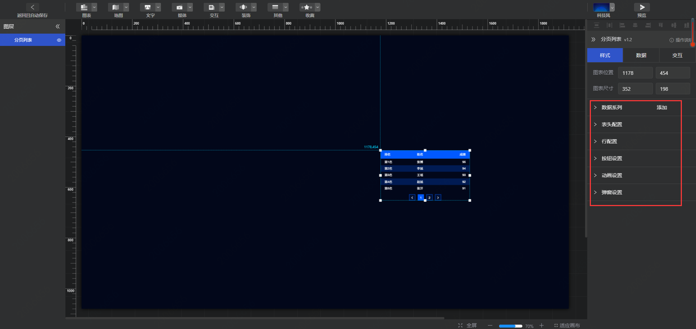

分页列表的样式设置包括表头配置，行配置，按钮设置，动画设置，弹窗设置，数据系列，图表位置和图表尺寸。

表头配置

可以设置显示表头与否，以及对表头的一些显示情况进行设置：表头行高，背景颜色以及表头文本的设置，包括字体，字号，字体粗细以及字体颜色的设置，如下图所示：


背景颜色包括主题色，标准色以及最近使用的颜色，如果没有找到自己需要的颜色的话，还可以点击更多颜色进行颜色的设置；如果需要更快的选取页面中已有的颜色可以通过使用取色器功能，不需要取色时可以通过Esc键或点击取色器取消。

，

行配置

可以对列表中默认行，特殊行和选中行的样式进行调整。

.png)

默认行配置：指对列表中非选中行和特殊行的其他行进行设置，包括显示行数以及每行的颜色。

选中行配置：对列表中所选中的行进行样式颜色的设置。

特殊行配置：对列表中某一行进行样式颜色设置。

奇行背景色：列表奇行的背景颜色

偶行背景色：列表偶行的背景颜色

首列配置:可以对每一行的字体字号，字体粗细以及颜色进行设置

按钮设置

按钮设置分为默认设置和选中设置。可以对分页列表中的按钮大小，文本，边框粗细，边框颜色以及背景颜色进行设置。

按钮大小：分页列表下方页面按钮的大小进行设置，单位为px

文本设置：对按钮的文本进行设置，包括字体，字号，字体粗细以及字体颜色进行设置。

边框粗细：设置按钮的边框粗细，单位px

边框颜色：可以自行对按钮的边框颜色进行设置，支持主题色，标准色，最近使用颜色以及更多颜色多种设置方式。

背景颜色：可以自行对按钮的背景颜色进行设置，支持主题色，标准色，最近使用颜色以及更多颜色多种设置方式。


动画设置

可以选择自动翻页和手动翻页；自动翻页时可以设翻页的间隔时间。

弹窗设置

弹窗设置可以对在预览界面点击列表中的数据所弹出的弹窗进行设置。其中包括弹窗尺寸，边框颜色粗细，背景颜色以及弹窗的位置。

数据系列


分页列表的数据系列代表着一列数据，如上图所示，“年龄”为一列数据，“男”为一列数据，“女”为一列数据。

新增数据系列：点击【添加】按钮，完成数据系列的添加；

列名：添加列表中的列名称；

字段名：当前这列数据与数据设置中设置的数据一一对应；

列宽：当前这列数据占整个列表的宽度比率（百分比）；

文本设置：可以对列表中字体，字号，字体粗细以及字体颜色，对齐方式（左，右，中）进行设置

图表位置

图表位置为图表左上角的位置坐标，通过横坐标和总左边的设置即可设置对应的图表位置。也可以通过选中图形后用鼠标拖曳到相应位置的方式设置图表位置。

,

图表尺寸

即显示的分页列表的宽和高，通过设置相应的数字，调节分页列表的大小。


### 数据设置

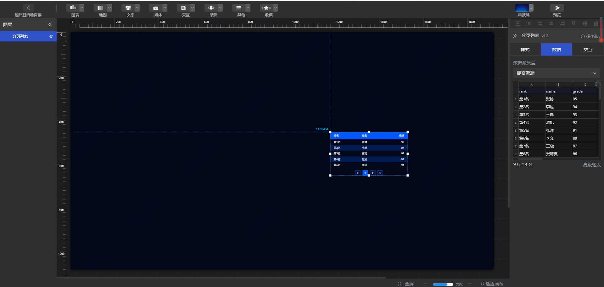

数据源类型

支持静态数据，API和数据库三种类型。操作流程图整体如下所示：


静态数据：


.png)

在下方表格中可输入或复制粘贴所需要的数据。其中，每一列数据对应一个数据字段，第一行为该列数据字段名，需要在上方进行映射设置。

目前，数据接入表格支持复制、粘贴、修改、删除数据。选中需要进行改动的数据后，可以点击右键进行操作，也可以使用ctrl+c等快捷键进行操作。当点击列序号或行序号是，会对该列或行全部选中，点击末尾的红色按钮可对该行或列进行删除操作，也可以点击右键对该行或列进行其他操作。

当点击红框内的放大按钮时，会出现如下图所示的输入窗口，方便用户进行操作。


在窗口中设置数据后，点击完成即可

点击下方的高级输入，可以切换到输入json格式数据模式。json数据样例如下。


``` js
[{"age":"25岁","man":10,"women":5},{"age":"26岁","man":12,"women":13},{"age":"27岁","man":1,"women":4},{"age":"28岁","man":10,"women":9},{"age":"29岁","man":2,"women":8},{"age":"30岁","man":2,"women":8},{"age":"31岁","man":2,"women":8},{"age":"32岁","man":2,"women":8},{"age":"33岁","man":20,"women":18}]
```

API

在下方输入框中输入相应的网址即可，如下图所示：


数据库

可以选择数据库类型，目前支持：MySQL, Oracle, SQL Server, Hive for UCP, PostgreSQL, DB2, CSV, Excel以及MySQL for UCP这九种数据库类型。选取相应的数据库类型后，选择对应数据库中的数据源名称。之后在下方输入框中输入简单的SQL语句即可实现数据的导入，之后查询数据响应结果，无误后确认设置即可。


### 交互设置

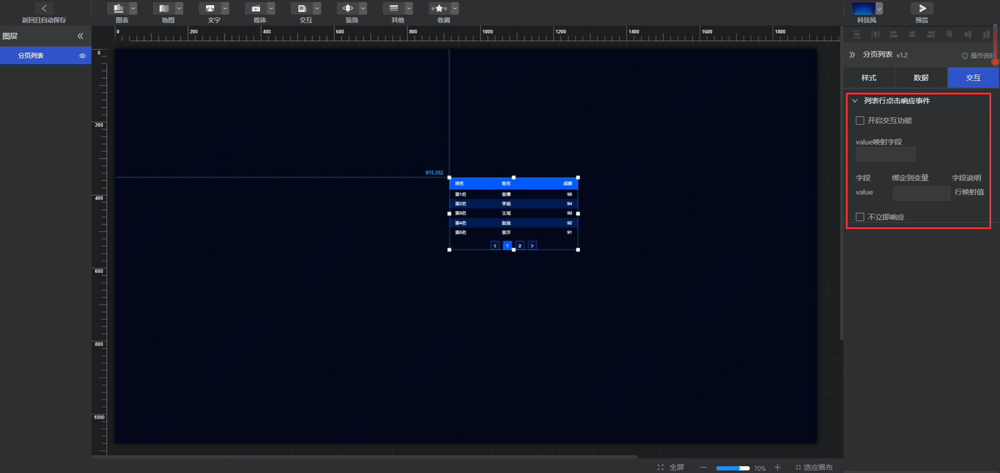
value字段有多个值，一个个表示比较麻烦，因此我们可以设置一个中间变量，中间变量名称自定义，将value字段绑定到这个中间变量，之后就可以在当前大屏的其他组件中使用此中间变量。其他组件使用时就可在API和数据库配置时使用这个中间变量，通过“：中间变量名称”的方式使用中间变量，完成数据的动态展示。


## 评分列表

适用场景：是列表的一个补充，适用于在数据条目需要展示的信息量较大，且需要评分展示时。

### 样式设置

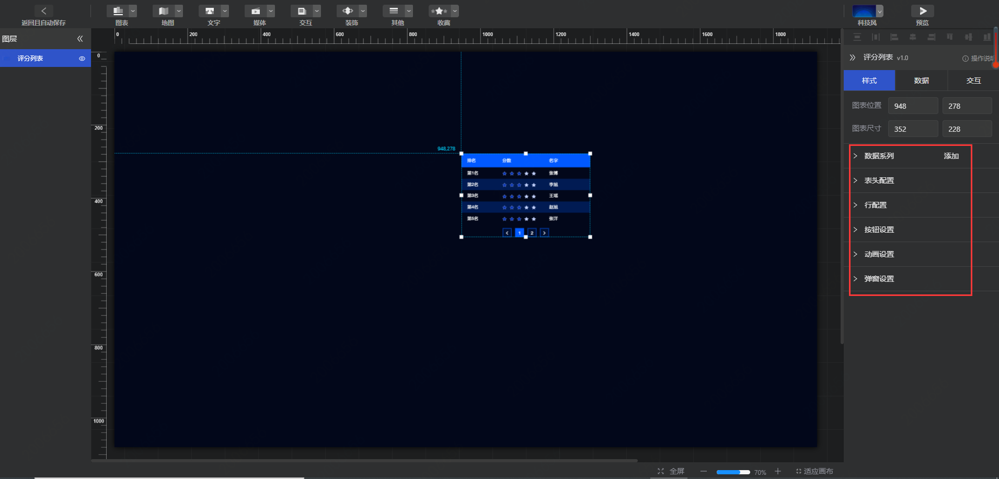

评分列表的样式设置包括数据系列，表头配置，行配置，按钮设置，动画设置，弹窗设置，图表位置和图表尺寸。

数据系列
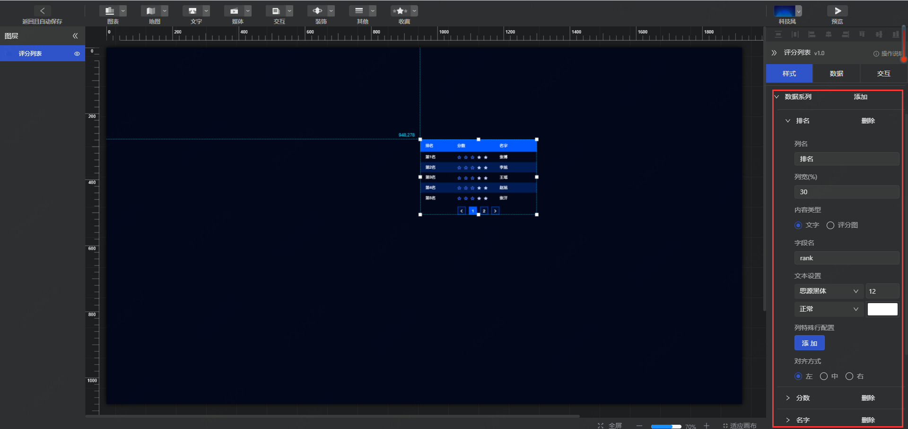

在每一个数据系列中可以设置列名，列宽，内容类型，字段名，文本设置，特殊行设置和对齐方式。

其中，内容类型有文字和评分图两种选择，文字类型为该数据系列为文本形式。

当选择为评分图样式时，可以设置该数据系列的最大值字段，得分字段以及图标样式。其中包括填充颜色，背景颜色，图标大小，展示方式，对齐方式等。

表头配置

可以设置显示表头与否，以及对表头的一些显示情况进行设置：表头行高，背景颜色以及表头文本的设置，包括字体，字号，字体粗细以及字体颜色的设置，如下图所示：


背景颜色包括主题色，标准色以及最近使用的颜色，如果没有找到自己需要的颜色的话，还可以点击更多颜色进行颜色的设置；如果需要更快的选取页面中已有的颜色可以通过使用取色器功能，不需要取色时可以通过Esc键或点击取色器取消。

，

行配置

可以对列表中默认行，特殊行和选中行的样式进行调整。


.png)

默认行配置：指对列表中非选中行和特殊行的其他行进行设置，包括显示行数以及每行的颜色。

选中行配置：对列表中所选中的行进行样式颜色的设置。

特殊行配置：对列表中某一行进行样式颜色设置。

奇行背景色：列表奇行的背景颜色

偶行背景色：列表偶行的背景颜色

首列配置:可以对每一行的字体字号，字体粗细以及颜色进行设置

按钮设置

按钮设置分为默认设置和选中设置。可以对分页列表中的按钮大小，文本，边框粗细，边框颜色以及背景颜色进行设置。

按钮大小：分页列表下方页面按钮的大小进行设置，单位为px

文本设置：对按钮的文本进行设置，包括字体，字号，字体粗细以及字体颜色进行设置。

边框粗细：设置按钮的边框粗细，单位px

边框颜色：可以自行对按钮的边框颜色进行设置，支持主题色，标准色，最近使用颜色以及更多颜色多种设置方式。

背景颜色：可以自行对按钮的背景颜色进行设置，支持主题色，标准色，最近使用颜色以及更多颜色多种设置方式。


动画设置

可以选择自动翻页和手动翻页；自动翻页时可以设翻页的间隔时间。

弹窗设置

弹窗设置可以对在预览界面点击列表中的数据所弹出的弹窗进行设置。其中包括弹窗尺寸，边框颜色粗细，背景颜色以及弹窗的位置。


图表位置

图表位置为图表左上角的位置坐标，通过横坐标和总左边的设置即可设置对应的图表位置。也可以通过选中图形后用鼠标拖曳到相应位置的方式设置图表位置。

,

图表尺寸

即显示的分页列表的宽和高，通过设置相应的数字，调节分页列表的大小。


### 数据设置

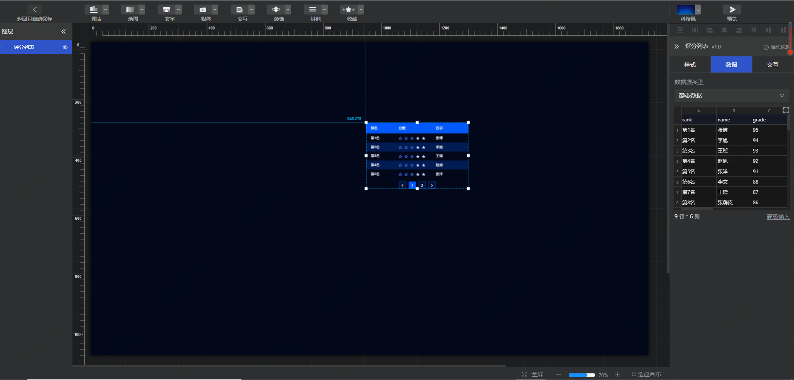

数据源类型

支持静态数据，API和数据库三种类型。操作流程图整体如下所示：


静态数据：


.png)

在下方表格中可输入或复制粘贴所需要的数据。其中，每一列数据对应一个数据字段，第一行为该列数据字段名，需要在上方进行映射设置。

目前，数据接入表格支持复制、粘贴、修改、删除数据。选中需要进行改动的数据后，可以点击右键进行操作，也可以使用ctrl+c等快捷键进行操作。当点击列序号或行序号是，会对该列或行全部选中，点击末尾的红色按钮可对该行或列进行删除操作，也可以点击右键对该行或列进行其他操作。

当点击红框内的放大按钮时，会出现如下图所示的输入窗口，方便用户进行操作。


在窗口中设置数据后，点击完成即可

点击下方的高级输入，可以切换到输入json格式数据模式。json数据样例如下。


``` js
[{"age":"25岁","man":10,"women":5},{"age":"26岁","man":12,"women":13},{"age":"27岁","man":1,"women":4},{"age":"28岁","man":10,"women":9},{"age":"29岁","man":2,"women":8},{"age":"30岁","man":2,"women":8},{"age":"31岁","man":2,"women":8},{"age":"32岁","man":2,"women":8},{"age":"33岁","man":20,"women":18}]
```

API

在下方输入框中输入相应的网址即可，如下图所示：


数据库

可以选择数据库类型，目前支持：MySQL, Oracle, SQL Server, Hive for UCP, PostgreSQL, DB2, CSV, Excel以及MySQL for UCP这九种数据库类型。选取相应的数据库类型后，选择对应数据库中的数据源名称。之后在下方输入框中输入简单的SQL语句即可实现数据的导入，之后查询数据响应结果，无误后确认设置即可。


### 交互设置

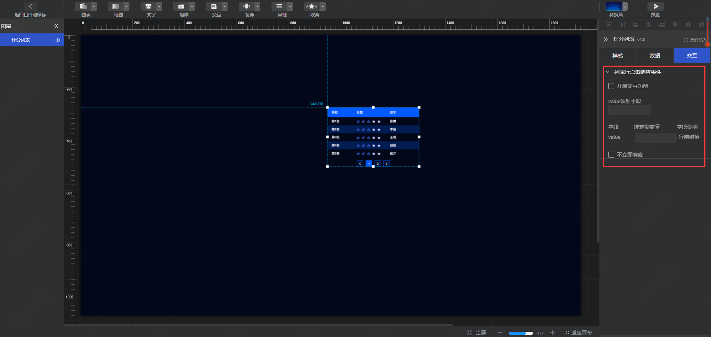
value字段有多个值，一个个表示比较麻烦，因此我们可以设置一个中间变量，中间变量名称自定义，将value字段绑定到这个中间变量，之后就可以在当前大屏的其他组件中使用此中间变量。其他组件使用时就可在API和数据库配置时使用这个中间变量，通过“：中间变量名称”的方式使用中间变量，完成数据的动态展示。

## 评分图

适用场景：评分组件支持图标样式、数量等的设置，实现星级评分、满意度展示等需求。

### 样式设置

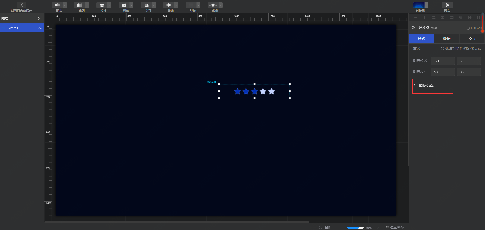

评分图的样式设置包括图标设置，图表位置和图表尺寸。

图标设置


图标样式：可以设置图标样式，目前支持18种。

填充颜色：自定义设置颜色，目前支持主题色，标准色，最近使用的颜色以及更多颜色中自定义设置，如果需要更快的选取页面中已有的颜色可以通过使用取色器功能，不需要取色时可以通过Esc键或点击取色器取消。

；


背景颜色：自定义设置颜色，目前支持主题色，标准色，最近使用的颜色以及更多颜色中自定义设置，如填充颜色。

图标大小：可以自定义设置图标的显示大小，数值越大显示的图标越大。

最大展示图标数量：自定义设置展示数量。

图表位置

图表位置为图表左上角的位置坐标，通过横坐标和总左边的设置即可设置对应的图表位置。也可以通过选中图形后用鼠标拖曳到相应位置的方式设置图表位置。

,

图表尺寸

即显示的评分图的宽和高，通过设置相应的数字，调节评分图的大小。


### 数据设置

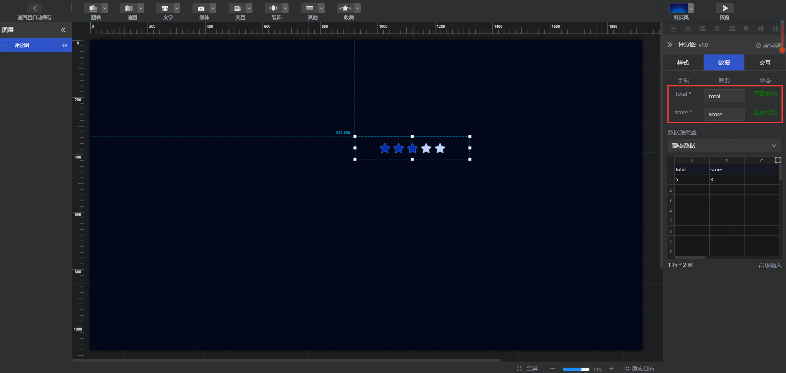

评分图的数据字段包括：total和score两个。

total ：评分图分成的份数，可以自定义设置总分，需要将数据与图表进行映射；

score：评分图所占总份数的份数，通过设置相应的值，自定义设置评分图的显示比例，需要将数据与图表进行映射

数据源类型

支持静态数据，API和数据库三种类型。操作流程图整体如下所示：


静态数据：


.png)

在下方表格中可输入或复制粘贴所需要的数据。其中，每一列数据对应一个数据字段，第一行为该列数据字段名，需要在上方进行映射设置。

目前，数据接入表格支持复制、粘贴、修改、删除数据。选中需要进行改动的数据后，可以点击右键进行操作，也可以使用ctrl+c等快捷键进行操作。当点击列序号或行序号是，会对该列或行全部选中，点击末尾的红色按钮可对该行或列进行删除操作，也可以点击右键对该行或列进行其他操作。

当点击红框内的放大按钮时，会出现如下图所示的输入窗口，方便用户进行操作。


在窗口中设置数据后，点击完成即可

点击下方的高级输入，可以切换到输入json格式数据模式。json数据样例如下。


``` js
[{"total":5,"score":3}]
```

API

在下方输入框中输入相应的网址即可，如下图所示：


数据库

可以选择数据库类型，目前支持：MySQL, Oracle, SQL Server, Hive for UCP, PostgreSQL, DB2, CSV, Excel以及MySQL for UCP这九种数据库类型。选取相应的数据库类型后，选择对应数据库中的数据源名称。之后在下方输入框中输入简单的SQL语句即可实现数据的导入，之后查询数据响应结果，无误后确认设置即可。


## 弧形柱状图

适用场景：用于展示二维数据集，展示数据的分布情况，一个轴表示需要对比的分类维度，另一个轴代表相应的数值，比如：（月份：商品销量）；或者在一个维度上，对多个同质可比的指标进行比较，比如：（月份：苹果销量，桃子产量）。通常利用于较小的数据集分析。

### 样式设置

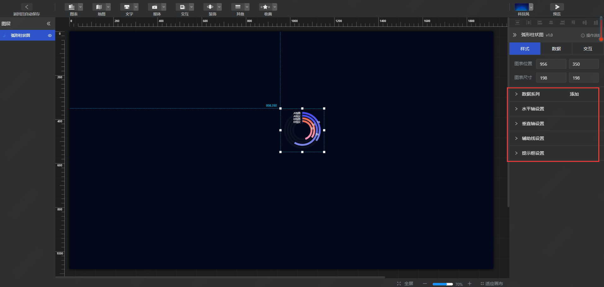

柱状图的样式设置包括：水平轴设置，垂直轴设置，辅助线设置，提示框设置，图例设置，动画设置，数据系列，图表位置和图表尺寸。

配色方案

系统预置三套配色方案，当选择配色方案时，系统会自动将选择的配色方案置入组件中，完成组件的配色。

水平轴设置
.png)

点击隐藏轴开关，可以在大屏中隐藏水平轴

文本设置：

字体，支持微软雅黑、宋体、黑体、隶书、幼圆、楷体和系统默认字体；

字号：X轴的字号，可输入字号调整；

字体粗细：X轴字体的粗细，有正常、细体、粗体、更粗四个选项；

字体颜色：X轴字体的颜色，分为主题色，标准色，最近使用的颜色，以及更多颜色的选项，如果需要更快的选取页面中已有的颜色可以通过使用取色器功能，不需要取色时可以通过Esc键或点击取色器取消。

，

旋转角度：X轴文字的旋转角度，可输入旋转角度进行调整；

智能隐藏：智能隐藏可将X轴过多的刻度文字进行隐藏，如需全部显示X轴刻度信息，则无需勾选，默认不勾选。
.png)

轴线设置：可以设置坐标轴的粗细，样式和颜色。样式中包括三种样式。

垂直轴设置
.png)

点击隐藏轴开关，可以在大屏中隐藏水平轴

文本设置：

.png)

字体，支持微软雅黑、宋体、黑体、隶书、幼圆、楷体和系统默认字体；

字号：X轴的字号，可输入字号调整；

字体粗细：X轴字体的粗细，有正常、细体、粗体、更粗四个选项；

字体颜色：X轴字体的颜色，分为主题色，标准色，最近使用的颜色，以及更多颜色的选项，如果需要更快的选取页面中已有的颜色可以通过使用取色器功能，不需要取色时可以通过Esc键或点击取色器取消。

，

智能隐藏：智能隐藏可将X轴过多的刻度文字进行隐藏，如需全部显示X轴刻度信息，则无需勾选，默认不勾选。

点击自定义刻度值上下线可以对垂直轴上下线进行设置。在下方输入刻度值上线和下线。


.png)

轴线设置

可以设置坐标轴的粗细，样式和颜色。样式中包括三种样式。

辅助线设置

分为横向辅助线和纵向辅助线和标记线设置。可以选择辅助线是否显示，以及对辅助线粗细样式、颜色进行设置。

粗细：可以手动输入数字或者选择有粗细框右边的上下标一点点调节。

样式：支持三种形式，如下所示：

，


.png)

标记线设置中，还可以额外对标记线的标记值，文本进行设置。

提示框设置

.png)

适用情况：在预览界面时，鼠标滑过柱状区域，可以显示相应的信息。

可以对提示框的字体，字号，文字粗细以及文字颜色和背景颜色进行设置，如图所示

除此之外，还可以对提示框的边框颜色，粗细以及选中颜色进行设置。
图例设置

图例设置可以对是否显示图例，以及所显示图例的文本和布局进行设置。

文本：支持字体，字号，字体颜色以及字体粗细的修改。

布局：可以对图例的位置进行设置。

目前默认支持：顶部，底部，左侧，右侧的居左居中居右的设置，如下图所示：

支持自行设置图例位置：通过调整左右间距，和上下间距进行自主设置。

，


动画设置
.png)

在动画设置中，可以设置图表在提示框轮播时的自动动画轮播。包括动画的开关和间隔时间设置。


数据系列

数据系列设置中，可以添加删除各个数据系列，并设置系列名和系列值。

在形状设置中，可以改变每一个数据系列尺寸大小，圆角设置以及颜色设置

.png)

文本设置中可以设置图表中每个数据系列中的显示数据文本。

图表位置

图表位置为图表左上角的位置坐标，通过横坐标和总左边的设置即可设置对应的图表位置。也可以通过选中图形后用鼠标拖曳到相应位置的方式设置图表位置。

，

图表尺寸

即显示的柱状图的宽和高，通过设置相应的数字，调节柱状图的大小。

，

### 数据设置

数据字段

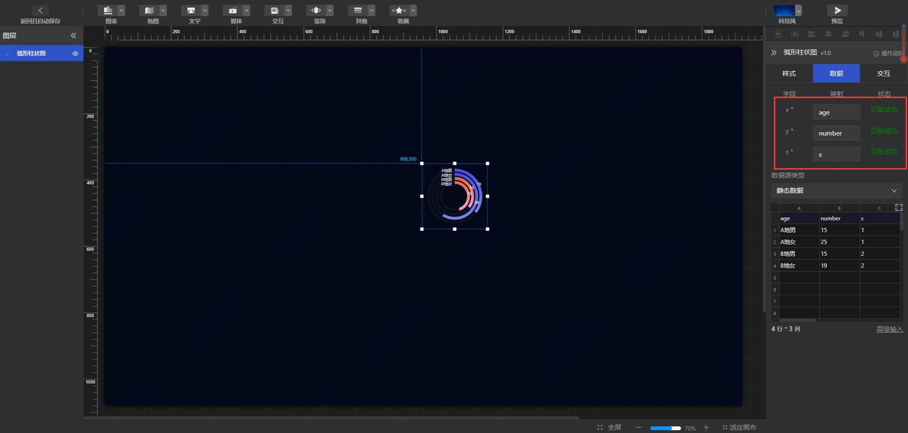

柱状图的数据字段包括：X，Y，S

X：柱状图中数据在X轴上的值，需要将数据与图表进行映射；

Y：柱状图中数据在Y轴上的值，需要将数据与图表进行映射；

S：柱状图中的数据系列字段，需要将数据与图表进行映射；

数据源类型

支持静态数据，API和数据库三种类型。操作流程图整体如下所示：


静态数据：


.png)

在下方表格中可输入或复制粘贴所需要的数据。其中，每一列数据对应一个数据字段，第一行为该列数据字段名，需要在上方进行映射设置。

目前，数据接入表格支持复制、粘贴、修改、删除数据。选中需要进行改动的数据后，可以点击右键进行操作，也可以使用ctrl+c等快捷键进行操作。当点击列序号或行序号是，会对该列或行全部选中，点击末尾的红色按钮可对该行或列进行删除操作，也可以点击右键对该行或列进行其他操作。

当点击红框内的放大按钮时，会出现如下图所示的输入窗口，方便用户进行操作。


在窗口中设置数据后，点击完成即可

点击下方的高级输入，可以切换到输入json格式数据模式。json数据样例如下。


``` js
[{"age":25,"number":15,"s":1},{"age":26,"number":25,"s":1},{"age":27,"number":5,"s":1},{"age":28,"number":19,"s":1},{"age":29,"number":10,"s":1}]
```

API

在下方输入框中输入相应的网址即可，如下图所示：

，

数据库

可以选择数据库类型，目前支持：MySQL, Oracle, SQL Server, Hive for UCP, PostgreSQL, DB2, CSV, Excel以及MySQL for UCP这九种数据库类型。选取相应的数据库类型后，选择对应数据库中的数据源名称。之后在下方输入框中输入简单的SQL语句即可实现数据的导入，之后查询数据响应结果，无误后确认设置即可。

，

## 立体柱状图

适用场景：使用垂直或水平的柱子显示类别之间的数值比较。其中一个轴表示需要对比的分类维度，另一个轴代表相应的数值。描述的是分类数据，回答的是每一个分类中『有多少？』这个问题。


### 样式设置

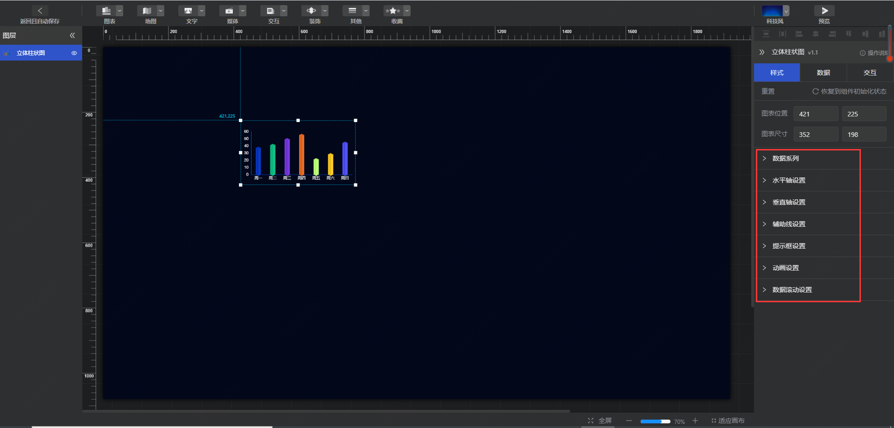

堆叠柱状图的样式设置包括：数据系列，水平轴设置，垂直轴设置，辅助线设置，提示框设置，图例设置，数据滚动设置，动画设置，图表位置和图表尺寸。

数据系列


数据系列设置可以设置柱子宽度以及柱子的颜色设置和文本设置。

每个数据系列里可以设置文本内容。

水平轴设置
.png)

点击隐藏轴开关，可以在大屏中隐藏水平轴

文本设置：

字体，支持微软雅黑、宋体、黑体、隶书、幼圆、楷体和系统默认字体；

字号：X轴的字号，可输入字号调整；

字体粗细：X轴字体的粗细，有正常、细体、粗体、更粗四个选项；

字体颜色：X轴字体的颜色，分为主题色，标准色，最近使用的颜色，以及更多颜色的选项，如果需要更快的选取页面中已有的颜色可以通过使用取色器功能，不需要取色时可以通过Esc键或点击取色器取消。

，

旋转角度：X轴文字的旋转角度，可输入旋转角度进行调整；

智能隐藏：智能隐藏可将X轴过多的刻度文字进行隐藏，如需全部显示X轴刻度信息，则无需勾选，默认不勾选。
.png)

轴线设置：可以设置坐标轴的粗细，样式和颜色。样式中包括三种样式。

垂直轴设置
.png)

点击隐藏轴开关，可以在大屏中隐藏水平轴

文本设置：

字体，支持微软雅黑、宋体、黑体、隶书、幼圆、楷体和系统默认字体；

字号：X轴的字号，可输入字号调整；

字体粗细：X轴字体的粗细，有正常、细体、粗体、更粗四个选项；

字体颜色：X轴字体的颜色，分为主题色，标准色，最近使用的颜色，以及更多颜色的选项，如果需要更快的选取页面中已有的颜色可以通过使用取色器功能，不需要取色时可以通过Esc键或点击取色器取消。

，

旋转角度：X轴文字的旋转角度，可输入旋转角度进行调整；

智能隐藏：智能隐藏可将X轴过多的刻度文字进行隐藏，如需全部显示X轴刻度信息，则无需勾选，默认不勾选。
.png)

轴线设置

可以设置坐标轴的粗细，样式和颜色。样式中包括三种样式。

辅助线设置

分为横向辅助线和纵向辅助线和标记线设置。可以选择辅助线是否显示，以及对辅助线粗细样式、颜色进行设置。

粗细：可以手动输入数字或者选择有粗细框右边的上下标一点点调节。

样式：支持三种形式，如下所示：

，


.png)

标记线设置中，还可以额外对标记线的标记值，文本进行设置。

提示框设置

.png)

适用情况：在预览界面时，鼠标滑过柱状区域，可以显示相应的信息。

可以对提示框的字体，字号，文字粗细以及文字颜色和背景颜色进行设置，如图所示


除此之外，还可以对提示框的边框颜色，粗细以及选中颜色进行设置。

图例设置

图例设置可以对是否显示图例，以及所显示图例的文本和布局进行设置。

文本：支持字体，字号，字体颜色以及字体粗细的修改。

布局：可以对图例的位置进行设置。

目前默认支持：顶部，底部，左侧，右侧的居左居中居右的设置，如下图所示：

支持自行设置图例位置：通过调整左右间距，和上下间距进行自主设置。

，

数据滚动设置

.png)

点击开启数据滚动，可以打开数据滚动设置。

通过设置数据滚动起点和重点，可以在图表中优先展示这部分数据，再通过滚动数据条的滚动，显示其他数据

在滚动条样式设置中，对滚动条宽度，填充颜色和边框颜色进行设置。

动画设置
.png)

在动画设置中，可以设置图表在提示框轮播时的自动动画轮播。包括动画的开关和间隔时间设置。


数据系列

数据系列设置中，可以添加删除各个数据系列，并设置系列名和系列值。

在形状设置中，可以改变每一个数据系列尺寸大小，圆角设置以及颜色设置

.png)

文本设置中可以设置图表中每个数据系列中的显示数据文本。

图表位置

图表位置为图表左上角的位置坐标，通过横坐标和总左边的设置即可设置对应的图表位置。也可以通过选中图形后用鼠标拖曳到相应位置的方式设置图表位置。

，

图表尺寸

即显示的柱状图的宽和高，通过设置相应的数字，调节柱状图的大小。

，

### 数据设置

数据字段

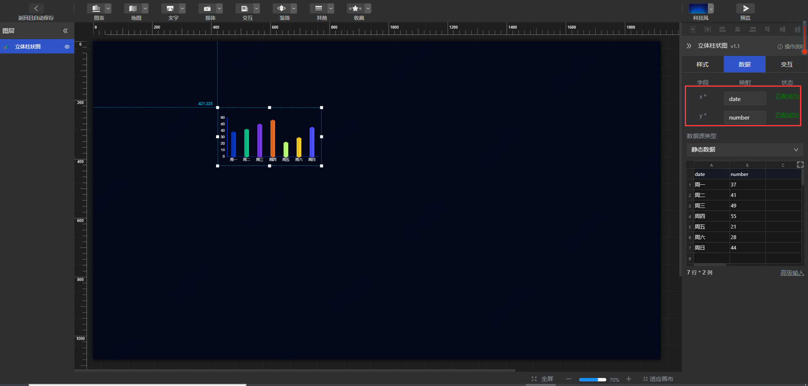

立体柱状图的数据字段包括：X，Y

X：立体柱状图中数据在X轴上的值，需要将数据与图表进行映射；

Y：立体柱状图中数据在Y轴上的值，需要将数据与图表进行映射；

数据源类型

支持静态数据，API和数据库三种类型。操作流程图整体如下所示：


静态数据：


.png)

在下方表格中可输入或复制粘贴所需要的数据。其中，每一列数据对应一个数据字段，第一行为该列数据字段名，需要在上方进行映射设置。

目前，数据接入表格支持复制、粘贴、修改、删除数据。选中需要进行改动的数据后，可以点击右键进行操作，也可以使用ctrl+c等快捷键进行操作。当点击列序号或行序号是，会对该列或行全部选中，点击末尾的红色按钮可对该行或列进行删除操作，也可以点击右键对该行或列进行其他操作。

当点击红框内的放大按钮时，会出现如下图所示的输入窗口，方便用户进行操作。


在窗口中设置数据后，点击完成即可

点击下方的高级输入，可以切换到输入json格式数据模式。json数据样例如下。


``` js
[{"age":25,"number":15,"s":1},{"age":26,"number":25,"s":1},{"age":27,"number":5,"s":1},{"age":28,"number":19,"s":1},{"age":29,"number":10,"s":1}]
```

API

在下方输入框中输入相应的网址即可，如下图所示：

，

数据库

可以选择数据库类型，目前支持：MySQL, Oracle, SQL Server, Hive for UCP, PostgreSQL, DB2, CSV, Excel以及MySQL for UCP这九种数据库类型。选取相应的数据库类型后，选择对应数据库中的数据源名称。之后在下方输入框中输入简单的SQL语句即可实现数据的导入，之后查询数据响应结果，无误后确认设置即可。

，


## 2D地图组

2D地图组中目前支持添加：底层图、区域热力层、热力图、散点图、飞线图，联动热力层，网格热力层和气泡图，支持配置地图的位置、颜色、鼠标交互事件等，能够多角度、多形式地渲染全国各城市地理位置的实时数据。

样式设置


地图组组件样式设置包括 子组件管理，地图基础配置，图表位置和图表尺寸。

子组件管理

新增子组件：点击子组件管理后的“+”
图标，弹出子组件窗口，选择一个子组件，即可完成子组件的添加；


删除子组件：鼠标悬停在子组件的名称上，出现删除按钮，点击即可删除子组件。

.png)

配置子组件：

点击子组件名称，进入子组件配置页面。

.png)

数据设置

该组件无数据设置

### 底图层

底图层也叫地图瓦片层，是基础平面地图的子组件，支持独立的样式和数据配置，包括底图层的瓦片类型或地址、颜色、滤镜等，能够使用自定义的瓦片服务来设置基础平面地图的背景。

样式设置

.png)

底图层的样式设置目前可进行地图风格的设置，地图风格包含12种，可选择进行切换。

数据设置

该组件无数据设置

### 热力层

热力层是基础平面地图的子组件，支持独立的样式和数据配置，包括热力点的大小、颜色、模糊程度以及经纬度等，能够使用热力点的形式表现地理位置上的点数据信息。

适用场景：热力层适用于要在地图上通过赋予不同颜色以权重来展示在不同位置上数据的值。比如：在地图上展示各地区人口密度情况，人口密度越高，颜色越偏红色；人口密度越低，颜色越偏绿色。

#### 样式设置

.png)

热力层的样式设置仅可设置热力点的半径。

#### 数据设置

数据字段

.png)

热力层的数据字段包括：lng，lat，intensity

lng：经度值，需要将数据与图表进行映射；

lat：纬度值，需要将数据与图表进行映射；

intensity：热力值，需要将数据与图表进行映射；

在下方表格中可输入或复制粘贴所需要的数据。其中，每一列数据对应一个数据字段，第一行为该列数据字段名，需要在上方进行映射设置。

目前，数据接入表格支持复制、粘贴、修改、删除数据。选中需要进行改动的数据后，可以点击右键进行操作，也可以使用ctrl+c等快捷键进行操作。当点击列序号或行序号是，会对该列或行全部选中，点击末尾的红色按钮可对该行或列进行删除操作，也可以点击右键对该行或列进行其他操作。

当点击红框内的放大按钮时，会出现放大输入窗口，方便用户进行操作。窗口内操作方式相同，修改数据完成后点击完成即可保存并进行后续字段映射。

当点击高级输入时，用户需在输入框中输入json格式的数据，数据格式如下。

数据格式

``` js
[
    {
        "lat":30.395141,
        "lng":104.180187,
        "count":87
    },
    {
        "lat":30.314268,
        "lng":104.033458,
        "count":58
    }
]
```

### 网格热力图层

网格热力层与热力层类似，也是通过不同颜色来表示不同位置的数据权重。不同之处在于，网格热力层将地图划分为大小一样的方格，以每一个方格为单位来进行颜色的划分。

适用场景：以小方格为单位，对全国人口密度进行展示。密度越大，颜色越深；密度越小，颜色越浅。

#### 样式设置

.png)

网格热力层的样式设置可设置边界粗细，边界颜色，填充颜色。

其中填充颜色可以根据数量的多少进行区别，以获得更为准确的数据展示效果。

同时，区域热力图也支持弹窗设置，目前支持：无弹窗、弹窗一直存在、鼠标悬浮弹窗和点击弹窗这四种模式，并可以由用户对弹窗中的文本进行自定义设置，对于弹窗的边框线条粗细，边框线条颜色和背景颜色都可以进行配置：


#### 数据设置

数据字段

.png)

网格热力图的数据字段包括：leftTop，RightBottom,Value和info

其中，lefttop和rightbottom是负责喧嚷网格大小的，他们分别是网格的左上和右下坐标。

Value是该网格数值大小，数值越大，颜色越深

Info是负责显示鼠标交互过程中展示的弹窗内容

在下方表格中可输入或复制粘贴所需要的数据。其中，每一列数据对应一个数据字段，第一行为该列数据字段名，需要在上方进行映射设置。

目前，数据接入表格支持复制、粘贴、修改、删除数据。选中需要进行改动的数据后，可以点击右键进行操作，也可以使用ctrl+c等快捷键进行操作。当点击列序号或行序号是，会对该列或行全部选中，点击末尾的红色按钮可对该行或列进行删除操作，也可以点击右键对该行或列进行其他操作。

当点击红框内的放大按钮时，会出现放大输入窗口，方便用户进行操作。窗口内操作方式相同，修改数据完成后点击完成即可保存并进行后续字段映射。

当点击高级输入时，用户需在输入框中输入json格式的数据，数据格式如下。

数据格式如下：

```js
[{"coords1":[96,30],"coords2":[97,31],"value":0,"id":650},{"coords1":[97,30],"coords2":[98,31],"value":3,"id":750},{"coords1":[98,30],"coords2":[99,31],"value":6,"id":146},{"coords1":[99,30],"coords2":[100,31],"value":9,"id":347},{"coords1":[100,30],"coords2":[101,31],"value":12,"id":225},{"coords1":[101,30],"coords2":[102,31],"value":15,"id":340},{"coords1":[102,30],"coords2":[103,31],"value":18,"id":999},{"coords1":[103,30],"coords2":[104,31],"value":21,"id":435},{"coords1":[104,30],"coords2":[105,31],"value":24,"id":808},{"coords1":[105,30],"coords2":[106,31],"value":27,"id":531},{"coords1":[106,30],"coords2":[107,31],"value":30,"id":153},{"coords1":[107,30],"coords2":[108,31],"value":33,"id":359},{"coords1":[108,30],"coords2":[109,31],"value":36,"id":566},{"coords1":[109,30],"coords2":[110,31],"value":39,"id":991},{"coords1":[110,30],"coords2":[111,31],"value":42,"id":222},{"coords1":[111,30],"coords2":[112,31],"value":45,"id":599},{"coords1":[112,30],"coords2":[113,31],"value":48,"id":844},{"coords1":[113,30],"coords2":[114,31],"value":51,"id":639},{"coords1":[114,30],"coords2":[115,31],"value":54,"id":298},{"coords1":[115,30],"coords2":[116,31],"value":57,"id":95},{"coords1":[96,31],"coords2":[97,32],"value":4,"id":842},{"coords1":[97,31],"coords2":[98,32],"value":7,"id":986},{"coords1":[98,31],"coords2":[99,32],"value":10,"id":15},{"coords1":[99,31],"coords2":[100,32],"value":13,"id":575},{"coords1":[100,31],"coords2":[101,32],"value":16,"id":512},{"coords1":[101,31],"coords2":[102,32],"value":19,"id":42},{"coords1":[102,31],"coords2":[103,32],"value":22,"id":813},{"coords1":[103,31],"coords2":[104,32],"value":25,"id":655},{"coords1":[104,31],"coords2":[105,32],"value":28,"id":599},{"coords1":[105,31],"coords2":[106,32],"value":31,"id":535},{"coords1":[106,31],"coords2":[107,32],"value":34,"id":932},{"coords1":[107,31],"coords2":[108,32],"value":37,"id":639},{"coords1":[108,31],"coords2":[109,32],"value":40,"id":455},{"coords1":[109,31],"coords2":[110,32],"value":43,"id":788},{"coords1":[110,31],"coords2":[111,32],"value":46,"id":109},{"coords1":[111,31],"coords2":[112,32],"value":49,"id":306},{"coords1":[112,31],"coords2":[113,32],"value":52,"id":961},{"coords1":[113,31],"coords2":[114,32],"value":55,"id":181},{"coords1":[114,31],"coords2":[115,32],"value":58,"id":262},{"coords1":[115,31],"coords2":[116,32],"value":61,"id":161},{"coords1":[96,32],"coords2":[97,33],"value":8,"id":599},{"coords1":[97,32],"coords2":[98,33],"value":11,"id":984},{"coords1":[98,32],"coords2":[99,33],"value":14,"id":365},{"coords1":[99,32],"coords2":[100,33],"value":17,"id":147},{"coords1":[100,32],"coords2":[101,33],"value":20,"id":126},{"coords1":[101,32],"coords2":[102,33],"value":23,"id":183},{"coords1":[102,32],"coords2":[103,33],"value":26,"id":642},{"coords1":[103,32],"coords2":[104,33],"value":29,"id":397},{"coords1":[104,32],"coords2":[105,33],"value":32,"id":880},{"coords1":[105,32],"coords2":[106,33],"value":35,"id":133},{"coords1":[106,32],"coords2":[107,33],"value":38,"id":748},{"coords1":[107,32],"coords2":[108,33],"value":41,"id":148},{"coords1":[108,32],"coords2":[109,33],"value":44,"id":240},{"coords1":[109,32],"coords2":[110,33],"value":47,"id":715},{"coords1":[110,32],"coords2":[111,33],"value":50,"id":1},{"coords1":[111,32],"coords2":[112,33],"value":53,"id":717},{"coords1":[112,32],"coords2":[113,33],"value":56,"id":657},{"coords1":[113,32],"coords2":[114,33],"value":59,"id":342},{"coords1":[114,32],"coords2":[115,33],"value":62,"id":332},{"coords1":[115,32],"coords2":[116,33],"value":65,"id":232},{"coords1":[96,33],"coords2":[97,34],"value":12,"id":242},{"coords1":[97,33],"coords2":[98,34],"value":15,"id":670},{"coords1":[98,33],"coords2":[99,34],"value":18,"id":996},{"coords1":[99,33],"coords2":[100,34],"value":21,"id":346},{"coords1":[100,33],"coords2":[101,34],"value":24,"id":582},{"coords1":[101,33],"coords2":[102,34],"value":27,"id":638},{"coords1":[102,33],"coords2":[103,34],"value":30,"id":296},{"coords1":[103,33],"coords2":[104,34],"value":33,"id":934},{"coords1":[104,33],"coords2":[105,34],"value":36,"id":853},{"coords1":[105,33],"coords2":[106,34],"value":39,"id":132},{"coords1":[106,33],"coords2":[107,34],"value":42,"id":242},{"coords1":[107,33],"coords2":[108,34],"value":45,"id":731},{"coords1":[108,33],"coords2":[109,34],"value":48,"id":746},{"coords1":[109,33],"coords2":[110,34],"value":51,"id":89},{"coords1":[110,33],"coords2":[111,34],"value":54,"id":805},{"coords1":[111,33],"coords2":[112,34],"value":57,"id":83},{"coords1":[112,33],"coords2":[113,34],"value":60,"id":755},{"coords1":[113,33],"coords2":[114,34],"value":63,"id":410},{"coords1":[114,33],"coords2":[115,34],"value":66,"id":17},{"coords1":[115,33],"coords2":[116,34],"value":69,"id":129},{"coords1":[96,34],"coords2":[97,35],"value":16,"id":691},{"coords1":[97,34],"coords2":[98,35],"value":19,"id":528},{"coords1":[98,34],"coords2":[99,35],"value":22,"id":483},{"coords1":[99,34],"coords2":[100,35],"value":25,"id":291},{"coords1":[100,34],"coords2":[101,35],"value":28,"id":227},{"coords1":[101,34],"coords2":[102,35],"value":31,"id":815},{"coords1":[102,34],"coords2":[103,35],"value":34,"id":511},{"coords1":[103,34],"coords2":[104,35],"value":37,"id":238},{"coords1":[104,34],"coords2":[105,35],"value":40,"id":299},{"coords1":[105,34],"coords2":[106,35],"value":43,"id":609},{"coords1":[106,34],"coords2":[107,35],"value":46,"id":282},{"coords1":[107,34],"coords2":[108,35],"value":49,"id":600},{"coords1":[108,34],"coords2":[109,35],"value":52,"id":527},{"coords1":[109,34],"coords2":[110,35],"value":55,"id":997},{"coords1":[110,34],"coords2":[111,35],"value":58,"id":94},{"coords1":[111,34],"coords2":[112,35],"value":61,"id":234},{"coords1":[112,34],"coords2":[113,35],"value":64,"id":619},{"coords1":[113,34],"coords2":[114,35],"value":67,"id":48},{"coords1":[114,34],"coords2":[115,35],"value":70,"id":372},{"coords1":[115,34],"coords2":[116,35],"value":73,"id":83},{"coords1":[96,35],"coords2":[97,36],"value":20,"id":978},{"coords1":[97,35],"coords2":[98,36],"value":23,"id":384},{"coords1":[98,35],"coords2":[99,36],"value":26,"id":529},{"coords1":[99,35],"coords2":[100,36],"value":29,"id":753},{"coords1":[100,35],"coords2":[101,36],"value":32,"id":262},{"coords1":[101,35],"coords2":[102,36],"value":35,"id":627},{"coords1":[102,35],"coords2":[103,36],"value":38,"id":161},{"coords1":[103,35],"coords2":[104,36],"value":41,"id":681},{"coords1":[104,35],"coords2":[105,36],"value":44,"id":563},{"coords1":[105,35],"coords2":[106,36],"value":47,"id":43},{"coords1":[106,35],"coords2":[107,36],"value":50,"id":194},{"coords1":[107,35],"coords2":[108,36],"value":53,"id":349},{"coords1":[108,35],"coords2":[109,36],"value":56,"id":972},{"coords1":[109,35],"coords2":[110,36],"value":59,"id":81},{"coords1":[110,35],"coords2":[111,36],"value":62,"id":79},{"coords1":[111,35],"coords2":[112,36],"value":65,"id":119},{"coords1":[112,35],"coords2":[113,36],"value":68,"id":908},{"coords1":[113,35],"coords2":[114,36],"value":71,"id":293},{"coords1":[114,35],"coords2":[115,36],"value":74,"id":173},{"coords1":[115,35],"coords2":[116,36],"value":77,"id":956},{"coords1":[96,36],"coords2":[97,37],"value":24,"id":415},{"coords1":[97,36],"coords2":[98,37],"value":27,"id":845},{"coords1":[98,36],"coords2":[99,37],"value":30,"id":472},{"coords1":[99,36],"coords2":[100,37],"value":33,"id":548},{"coords1":[100,36],"coords2":[101,37],"value":36,"id":544},{"coords1":[101,36],"coords2":[102,37],"value":39,"id":687},{"coords1":[102,36],"coords2":[103,37],"value":42,"id":363},{"coords1":[103,36],"coords2":[104,37],"value":45,"id":248},{"coords1":[104,36],"coords2":[105,37],"value":48,"id":328},{"coords1":[105,36],"coords2":[106,37],"value":51,"id":603},{"coords1":[106,36],"coords2":[107,37],"value":54,"id":201},{"coords1":[107,36],"coords2":[108,37],"value":57,"id":413},{"coords1":[108,36],"coords2":[109,37],"value":60,"id":910},{"coords1":[109,36],"coords2":[110,37],"value":63,"id":867},{"coords1":[110,36],"coords2":[111,37],"value":66,"id":19},{"coords1":[111,36],"coords2":[112,37],"value":69,"id":496},{"coords1":[112,36],"coords2":[113,37],"value":72,"id":602},{"coords1":[113,36],"coords2":[114,37],"value":75,"id":805},{"coords1":[114,36],"coords2":[115,37],"value":78,"id":348},{"coords1":[115,36],"coords2":[116,37],"value":81,"id":963},{"coords1":[96,37],"coords2":[97,38],"value":28,"id":152},{"coords1":[97,37],"coords2":[98,38],"value":31,"id":256},{"coords1":[98,37],"coords2":[99,38],"value":34,"id":736},{"coords1":[99,37],"coords2":[100,38],"value":37,"id":327},{"coords1":[100,37],"coords2":[101,38],"value":40,"id":694},{"coords1":[101,37],"coords2":[102,38],"value":43,"id":970},{"coords1":[102,37],"coords2":[103,38],"value":46,"id":50},{"coords1":[103,37],"coords2":[104,38],"value":49,"id":896},{"coords1":[104,37],"coords2":[105,38],"value":52,"id":498},{"coords1":[105,37],"coords2":[106,38],"value":55,"id":147},{"coords1":[106,37],"coords2":[107,38],"value":58,"id":909},{"coords1":[107,37],"coords2":[108,38],"value":61,"id":716},{"coords1":[108,37],"coords2":[109,38],"value":64,"id":165},{"coords1":[109,37],"coords2":[110,38],"value":67,"id":650},{"coords1":[110,37],"coords2":[111,38],"value":70,"id":496},{"coords1":[111,37],"coords2":[112,38],"value":73,"id":298},{"coords1":[112,37],"coords2":[113,38],"value":76,"id":136},{"coords1":[113,37],"coords2":[114,38],"value":79,"id":115},{"coords1":[114,37],"coords2":[115,38],"value":82,"id":849},{"coords1":[115,37],"coords2":[116,38],"value":85,"id":568},{"coords1":[96,38],"coords2":[97,39],"value":32,"id":186},{"coords1":[97,38],"coords2":[98,39],"value":35,"id":347},{"coords1":[98,38],"coords2":[99,39],"value":38,"id":472},{"coords1":[99,38],"coords2":[100,39],"value":41,"id":7},{"coords1":[100,38],"coords2":[101,39],"value":44,"id":947},{"coords1":[101,38],"coords2":[102,39],"value":47,"id":510},{"coords1":[102,38],"coords2":[103,39],"value":50,"id":684},{"coords1":[103,38],"coords2":[104,39],"value":53,"id":254},{"coords1":[104,38],"coords2":[105,39],"value":56,"id":735},{"coords1":[105,38],"coords2":[106,39],"value":59,"id":26},{"coords1":[106,38],"coords2":[107,39],"value":62,"id":813},{"coords1":[107,38],"coords2":[108,39],"value":65,"id":165},{"coords1":[108,38],"coords2":[109,39],"value":68,"id":747},{"coords1":[109,38],"coords2":[110,39],"value":71,"id":610},{"coords1":[110,38],"coords2":[111,39],"value":74,"id":71},{"coords1":[111,38],"coords2":[112,39],"value":77,"id":836},{"coords1":[112,38],"coords2":[113,39],"value":80,"id":141},{"coords1":[113,38],"coords2":[114,39],"value":83,"id":118},{"coords1":[114,38],"coords2":[115,39],"value":86,"id":856},{"coords1":[115,38],"coords2":[116,39],"value":89,"id":807},{"coords1":[96,39],"coords2":[97,40],"value":36,"id":929},{"coords1":[97,39],"coords2":[98,40],"value":39,"id":786},{"coords1":[98,39],"coords2":[99,40],"value":42,"id":843},{"coords1":[99,39],"coords2":[100,40],"value":45,"id":573},{"coords1":[100,39],"coords2":[101,40],"value":48,"id":355},{"coords1":[101,39],"coords2":[102,40],"value":51,"id":204},{"coords1":[102,39],"coords2":[103,40],"value":54,"id":565},{"coords1":[103,39],"coords2":[104,40],"value":57,"id":338},{"coords1":[104,39],"coords2":[105,40],"value":60,"id":898},{"coords1":[105,39],"coords2":[106,40],"value":63,"id":756},{"coords1":[106,39],"coords2":[107,40],"value":66,"id":742},{"coords1":[107,39],"coords2":[108,40],"value":69,"id":870},{"coords1":[108,39],"coords2":[109,40],"value":72,"id":284},{"coords1":[109,39],"coords2":[110,40],"value":75,"id":644},{"coords1":[110,39],"coords2":[111,40],"value":78,"id":63},{"coords1":[111,39],"coords2":[112,40],"value":81,"id":111},{"coords1":[112,39],"coords2":[113,40],"value":84,"id":582},{"coords1":[113,39],"coords2":[114,40],"value":87,"id":90},{"coords1":[114,39],"coords2":[115,40],"value":90,"id":885},{"coords1":[115,39],"coords2":[116,40],"value":93,"id":175}]
```


### 区域热力层

区域热力层是基础平面地图的子组件，支持独立的样式、数据和交互配置，包括区域的标注、颜色、边线、鼠标交互事件以及位置信息等，能够以热力区域的形式表现地理位置上的区域信息。

适用场景：在地图中通过赋予不同颜色以范围，展示某一自定义区域的数据

#### 样式设置


区域热力层的样式设置包含边界颜色、边界粗细，填充颜色范围，可设置其热力区域的最大值与最小值。

同时，区域热力图也支持弹窗设置，目前支持：无弹窗、弹窗一直存在、鼠标悬浮弹窗和点击弹窗这四种模式，并可以由用户对弹窗中的文本进行自定义设置，对于弹窗的边框线条粗细，边框线条颜色和背景颜色都可以进行配置：

.png)


#### 数据设置

.png)

数据字段

在下方表格中可输入或复制粘贴所需要的数据。其中，每一列数据对应一个数据字段，第一行为该列数据字段名，需要在上方进行映射设置。

目前，数据接入表格支持复制、粘贴、修改、删除数据。选中需要进行改动的数据后，可以点击右键进行操作，也可以使用ctrl+c等快捷键进行操作。当点击列序号或行序号是，会对该列或行全部选中，点击末尾的红色按钮可对该行或列进行删除操作，也可以点击右键对该行或列进行其他操作。

当点击红框内的放大按钮时，会出现放大输入窗口，方便用户进行操作。窗口内操作方式相同，修改数据完成后点击完成即可保存并进行后续字段映射。

当点击高级输入时，用户需在输入框中输入json格式的数据，数据格式如下。

数据格式

``` js
{
    "type":"FeatureCollection",
    "features":[
        {
            "type":"Feature",
            "properties":{
                "id":"65",
                "intensity":"550",
                "name":"新疆",
                "cp":[
                    84.9023,
                    42.148
                ],
                "childNum":18
            },
            "geometry":{
                "type":"Polygon",
                "coordinates":[
                    [
                        [
                            96.416,
                            42.7588
                        ],
                        [
                            96.416,
                            42.7148
                        ],
                        [
                            95.9766,
                            42.4951
                        ],
                        [
                            96.0645,
                            42.3193
                        ],
                        [
                            96.2402,
                            42.2314
                        ],
                        [
                            95.9766,
                            41.9238
                        ],
                        [
                            95.2734,
                            41.6162
                        ],
                        [
                            95.1855,
                            41.792
                        ],
                        [
                            94.5703,
                            41.4844
                        ],
                        [
                            94.043,
                            41.0889
                        ],
                        [
                            93.8672,
                            40.6934
                        ],
                        [
                            93.0762,
                            40.6494
                        ],
                        [
                            92.6367,
                            39.6387
                        ],
                        [
                            92.373,
                            39.3311
                        ],
                        [
                            92.373,
                            39.1113
                        ],
                        [
                            92.373,
                            39.0234
                        ],
                        [
                            90.1758,
                            38.4961
                        ],
                        [
                            90.3516,
                            38.2324
                        ],
                        [
                            90.6152,
                            38.3203
                        ],
                        [
                            90.5273,
                            37.8369
                        ],
                        [
                            91.0547,
                            37.4414
                        ],
                        [
                            91.3184,
                            37.0898
                        ],
                        [
                            90.7031,
                            36.7822
                        ],
                        [
                            90.791,
                            36.6064
                        ],
                        [
                            91.0547,
                            36.5186
                        ],
                        [
                            91.0547,
                            36.0791
                        ],
                        [
                            90.8789,
                            36.0352
                        ],
                        [
                            90,
                            36.2549
                        ],
                        [
                            89.9121,
                            36.0791
                        ],
                        [
                            89.7363,
                            36.0791
                        ],
                        [
                            89.209,
                            36.2988
                        ],
                        [
                            88.7695,
                            36.3428
                        ],
                        [
                            88.5938,
                            36.4746
                        ],
                        [
                            87.3633,
                            36.4307
                        ],
                        [
                            86.2207,
                            36.167
                        ],
                        [
                            86.1328,
                            35.8594
                        ],
                        [
                            85.6055,
                            35.6836
                        ],
                        [
                            85.0781,
                            35.7275
                        ],
                        [
                            84.1992,
                            35.376
                        ],
                        [
                            83.1445,
                            35.4199
                        ],
                        [
                            82.8809,
                            35.6836
                        ],
                        [
                            82.4414,
                            35.7275
                        ],
                        [
                            82.002,
                            35.332
                        ],
                        [
                            81.6504,
                            35.2441
                        ],
                        [
                            80.4199,
                            35.4199
                        ],
                        [
                            80.2441,
                            35.2881
                        ],
                        [
                            80.332,
                            35.1563
                        ],
                        [
                            80.2441,
                            35.2002
                        ],
                        [
                            79.8926,
                            34.8047
                        ],
                        [
                            79.8047,
                            34.4971
                        ],
                        [
                            79.1016,
                            34.4531
                        ],
                        [
                            79.0137,
                            34.3213
                        ],
                        [
                            78.2227,
                            34.7168
                        ],
                        [
                            78.0469,
                            35.2441
                        ],
                        [
                            78.0469,
                            35.5078
                        ],
                        [
                            77.4316,
                            35.4639
                        ],
                        [
                            76.8164,
                            35.6396
                        ],
                        [
                            76.5527,
                            35.8594
                        ],
                        [
                            76.2012,
                            35.8154
                        ],
                        [
                            75.9375,
                            36.0352
                        ],
                        [
                            76.0254,
                            36.4746
                        ],
                        [
                            75.8496,
                            36.6943
                        ],
                        [
                            75.498,
                            36.7383
                        ],
                        [
                            75.4102,
                            36.958
                        ],
                        [
                            75.0586,
                            37.002
                        ],
                        [
                            74.8828,
                            36.9141
                        ],
                        [
                            74.7949,
                            37.0459
                        ],
                        [
                            74.5313,
                            37.0898
                        ],
                        [
                            74.5313,
                            37.2217
                        ],
                        [
                            74.8828,
                            37.2217
                        ],
                        [
                            75.1465,
                            37.4414
                        ],
                        [
                            74.8828,
                            37.5732
                        ],
                        [
                            74.9707,
                            37.749
                        ],
                        [
                            74.8828,
                            38.4521
                        ],
                        [
                            74.3555,
                            38.6719
                        ],
                        [
                            74.1797,
                            38.6719
                        ],
                        [
                            74.0918,
                            38.54
                        ],
                        [
                            73.8281,
                            38.584
                        ],
                        [
                            73.7402,
                            38.8477
                        ],
                        [
                            73.8281,
                            38.9795
                        ],
                        [
                            73.4766,
                            39.375
                        ],
                        [
                            73.916,
                            39.5068
                        ],
                        [
                            73.916,
                            39.6826
                        ],
                        [
                            73.8281,
                            39.7705
                        ],
                        [
                            74.0039,
                            40.0342
                        ],
                        [
                            74.8828,
                            40.3418
                        ],
                        [
                            74.7949,
                            40.5176
                        ],
                        [
                            75.2344,
                            40.4297
                        ],
                        [
                            75.5859,
                            40.6494
                        ],
                        [
                            75.7617,
                            40.2979
                        ],
                        [
                            76.377,
                            40.3857
                        ],
                        [
                            76.9043,
                            41.001
                        ],
                        [
                            77.6074,
                            41.001
                        ],
                        [
                            78.1348,
                            41.2207
                        ],
                        [
                            78.1348,
                            41.3965
                        ],
                        [
                            80.1563,
                            42.0557
                        ],
                        [
                            80.2441,
                            42.2754
                        ],
                        [
                            80.1563,
                            42.627
                        ],
                        [
                            80.2441,
                            42.8467
                        ],
                        [
                            80.5078,
                            42.8906
                        ],
                        [
                            80.4199,
                            43.0664
                        ],
                        [
                            80.7715,
                            43.1982
                        ],
                        [
                            80.4199,
                            44.165
                        ],
                        [
                            80.4199,
                            44.6045
                        ],
                        [
                            79.9805,
                            44.8242
                        ],
                        [
                            79.9805,
                            44.9561
                        ],
                        [
                            81.7383,
                            45.3955
                        ],
                        [
                            82.0898,
                            45.2197
                        ],
                        [
                            82.5293,
                            45.2197
                        ],
                        [
                            82.2656,
                            45.6592
                        ],
                        [
                            83.0566,
                            47.2412
                        ],
                        [
                            83.6719,
                            47.0215
                        ],
                        [
                            84.7266,
                            47.0215
                        ],
                        [
                            84.9023,
                            46.8896
                        ],
                        [
                            85.5176,
                            47.0654
                        ],
                        [
                            85.6934,
                            47.2852
                        ],
                        [
                            85.5176,
                            48.1201
                        ],
                        [
                            85.7813,
                            48.4277
                        ],
                        [
                            86.5723,
                            48.5596
                        ],
                        [
                            86.8359,
                            48.8232
                        ],
                        [
                            86.748,
                            48.9551
                        ],
                        [
                            86.8359,
                            49.1309
                        ],
                        [
                            87.8027,
                            49.1748
                        ],
                        [
                            87.8906,
                            48.999
                        ],
                        [
                            87.7148,
                            48.9111
                        ],
                        [
                            88.0664,
                            48.7354
                        ],
                        [
                            87.9785,
                            48.6035
                        ],
                        [
                            88.5059,
                            48.3838
                        ],
                        [
                            88.6816,
                            48.1641
                        ],
                        [
                            89.1211,
                            47.9883
                        ],
                        [
                            89.5605,
                            48.0322
                        ],
                        [
                            89.7363,
                            47.8564
                        ],
                        [
                            90.0879,
                            47.8564
                        ],
                        [
                            90.3516,
                            47.6807
                        ],
                        [
                            90.5273,
                            47.2412
                        ],
                        [
                            90.8789,
                            46.9775
                        ],
                        [
                            91.0547,
                            46.582
                        ],
                        [
                            90.8789,
                            46.3184
                        ],
                        [
                            91.0547,
                            46.0107
                        ],
                        [
                            90.7031,
                            45.7471
                        ],
                        [
                            90.7031,
                            45.5273
                        ],
                        [
                            90.8789,
                            45.2197
                        ],
                        [
                            91.582,
                            45.0879
                        ],
                        [
                            93.5156,
                            44.9561
                        ],
                        [
                            94.7461,
                            44.3408
                        ],
                        [
                            95.3613,
                            44.2969
                        ],
                        [
                            95.3613,
                            44.0332
                        ],
                        [
                            95.5371,
                            43.9014
                        ],
                        [
                            95.8887,
                            43.2422
                        ],
                        [
                            96.3281,
                            42.9346
                        ],
                        [
                            96.416,
                            42.7588
                        ]
                    ]
                ]
            }
        }
    ]
}
```

### 2.5D地图

2.5D地图是区域热力图的升级，在区域热力图的基础上，通过SVG自动渲染具有立体效果的2.5D地图。

适用场景：在地图中通过赋予不同颜色以范围，展示某一自定义区域的数据。

#### 样式设置

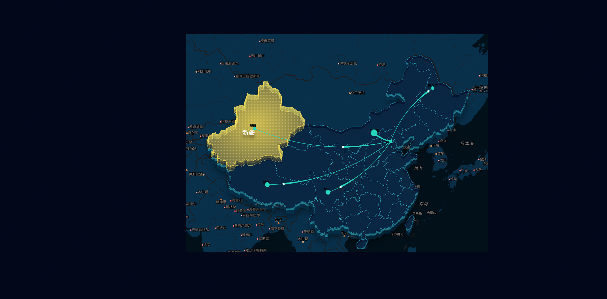

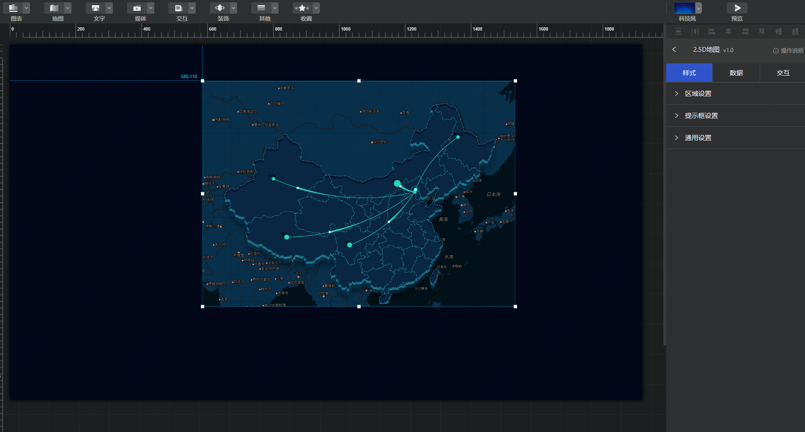

2.5D地图的样式设置包含边界颜色、边界粗细，填充颜色范围，可设置其热力区域的最大值与最小值。

同时，2.5D地图也支持弹窗设置，目前支持：无弹窗、弹窗一直存在、鼠标悬浮弹窗和点击弹窗这四种模式，并可以由用户对弹窗中的文本进行自定义设置，对于弹窗的边框线条粗细，边框线条颜色和背景颜色都可以进行配置：

.png)


#### 数据设置

.png)

数据字段

在下方表格中可输入或复制粘贴所需要的数据。其中，每一列数据对应一个数据字段，第一行为该列数据字段名，需要在上方进行映射设置。

目前，数据接入表格支持复制、粘贴、修改、删除数据。选中需要进行改动的数据后，可以点击右键进行操作，也可以使用ctrl+c等快捷键进行操作。当点击列序号或行序号是，会对该列或行全部选中，点击末尾的红色按钮可对该行或列进行删除操作，也可以点击右键对该行或列进行其他操作。

当点击红框内的放大按钮时，会出现放大输入窗口，方便用户进行操作。窗口内操作方式相同，修改数据完成后点击完成即可保存并进行后续字段映射。

当点击高级输入时，用户需在输入框中输入json格式的数据，数据格式如下。

数据格式

``` js
{
    "type":"FeatureCollection",
    "features":[
        {
            "type":"Feature",
            "properties":{
                "id":"65",
                "intensity":"550",
                "name":"新疆",
                "cp":[
                    84.9023,
                    42.148
                ],
                "childNum":18
            },
            "geometry":{
                "type":"Polygon",
                "coordinates":[
                    [
                        [
                            96.416,
                            42.7588
                        ],
                        [
                            96.416,
                            42.7148
                        ],
                        [
                            95.9766,
                            42.4951
                        ],
                        [
                            96.0645,
                            42.3193
                        ],
                        [
                            96.2402,
                            42.2314
                        ],
                        [
                            95.9766,
                            41.9238
                        ],
                        [
                            95.2734,
                            41.6162
                        ],
                        [
                            95.1855,
                            41.792
                        ],
                        [
                            94.5703,
                            41.4844
                        ],
                        [
                            94.043,
                            41.0889
                        ],
                        [
                            93.8672,
                            40.6934
                        ],
                        [
                            93.0762,
                            40.6494
                        ],
                        [
                            92.6367,
                            39.6387
                        ],
                        [
                            92.373,
                            39.3311
                        ],
                        [
                            92.373,
                            39.1113
                        ],
                        [
                            92.373,
                            39.0234
                        ],
                        [
                            90.1758,
                            38.4961
                        ],
                        [
                            90.3516,
                            38.2324
                        ],
                        [
                            90.6152,
                            38.3203
                        ],
                        [
                            90.5273,
                            37.8369
                        ],
                        [
                            91.0547,
                            37.4414
                        ],
                        [
                            91.3184,
                            37.0898
                        ],
                        [
                            90.7031,
                            36.7822
                        ],
                        [
                            90.791,
                            36.6064
                        ],
                        [
                            91.0547,
                            36.5186
                        ],
                        [
                            91.0547,
                            36.0791
                        ],
                        [
                            90.8789,
                            36.0352
                        ],
                        [
                            90,
                            36.2549
                        ],
                        [
                            89.9121,
                            36.0791
                        ],
                        [
                            89.7363,
                            36.0791
                        ],
                        [
                            89.209,
                            36.2988
                        ],
                        [
                            88.7695,
                            36.3428
                        ],
                        [
                            88.5938,
                            36.4746
                        ],
                        [
                            87.3633,
                            36.4307
                        ],
                        [
                            86.2207,
                            36.167
                        ],
                        [
                            86.1328,
                            35.8594
                        ],
                        [
                            85.6055,
                            35.6836
                        ],
                        [
                            85.0781,
                            35.7275
                        ],
                        [
                            84.1992,
                            35.376
                        ],
                        [
                            83.1445,
                            35.4199
                        ],
                        [
                            82.8809,
                            35.6836
                        ],
                        [
                            82.4414,
                            35.7275
                        ],
                        [
                            82.002,
                            35.332
                        ],
                        [
                            81.6504,
                            35.2441
                        ],
                        [
                            80.4199,
                            35.4199
                        ],
                        [
                            80.2441,
                            35.2881
                        ],
                        [
                            80.332,
                            35.1563
                        ],
                        [
                            80.2441,
                            35.2002
                        ],
                        [
                            79.8926,
                            34.8047
                        ],
                        [
                            79.8047,
                            34.4971
                        ],
                        [
                            79.1016,
                            34.4531
                        ],
                        [
                            79.0137,
                            34.3213
                        ],
                        [
                            78.2227,
                            34.7168
                        ],
                        [
                            78.0469,
                            35.2441
                        ],
                        [
                            78.0469,
                            35.5078
                        ],
                        [
                            77.4316,
                            35.4639
                        ],
                        [
                            76.8164,
                            35.6396
                        ],
                        [
                            76.5527,
                            35.8594
                        ],
                        [
                            76.2012,
                            35.8154
                        ],
                        [
                            75.9375,
                            36.0352
                        ],
                        [
                            76.0254,
                            36.4746
                        ],
                        [
                            75.8496,
                            36.6943
                        ],
                        [
                            75.498,
                            36.7383
                        ],
                        [
                            75.4102,
                            36.958
                        ],
                        [
                            75.0586,
                            37.002
                        ],
                        [
                            74.8828,
                            36.9141
                        ],
                        [
                            74.7949,
                            37.0459
                        ],
                        [
                            74.5313,
                            37.0898
                        ],
                        [
                            74.5313,
                            37.2217
                        ],
                        [
                            74.8828,
                            37.2217
                        ],
                        [
                            75.1465,
                            37.4414
                        ],
                        [
                            74.8828,
                            37.5732
                        ],
                        [
                            74.9707,
                            37.749
                        ],
                        [
                            74.8828,
                            38.4521
                        ],
                        [
                            74.3555,
                            38.6719
                        ],
                        [
                            74.1797,
                            38.6719
                        ],
                        [
                            74.0918,
                            38.54
                        ],
                        [
                            73.8281,
                            38.584
                        ],
                        [
                            73.7402,
                            38.8477
                        ],
                        [
                            73.8281,
                            38.9795
                        ],
                        [
                            73.4766,
                            39.375
                        ],
                        [
                            73.916,
                            39.5068
                        ],
                        [
                            73.916,
                            39.6826
                        ],
                        [
                            73.8281,
                            39.7705
                        ],
                        [
                            74.0039,
                            40.0342
                        ],
                        [
                            74.8828,
                            40.3418
                        ],
                        [
                            74.7949,
                            40.5176
                        ],
                        [
                            75.2344,
                            40.4297
                        ],
                        [
                            75.5859,
                            40.6494
                        ],
                        [
                            75.7617,
                            40.2979
                        ],
                        [
                            76.377,
                            40.3857
                        ],
                        [
                            76.9043,
                            41.001
                        ],
                        [
                            77.6074,
                            41.001
                        ],
                        [
                            78.1348,
                            41.2207
                        ],
                        [
                            78.1348,
                            41.3965
                        ],
                        [
                            80.1563,
                            42.0557
                        ],
                        [
                            80.2441,
                            42.2754
                        ],
                        [
                            80.1563,
                            42.627
                        ],
                        [
                            80.2441,
                            42.8467
                        ],
                        [
                            80.5078,
                            42.8906
                        ],
                        [
                            80.4199,
                            43.0664
                        ],
                        [
                            80.7715,
                            43.1982
                        ],
                        [
                            80.4199,
                            44.165
                        ],
                        [
                            80.4199,
                            44.6045
                        ],
                        [
                            79.9805,
                            44.8242
                        ],
                        [
                            79.9805,
                            44.9561
                        ],
                        [
                            81.7383,
                            45.3955
                        ],
                        [
                            82.0898,
                            45.2197
                        ],
                        [
                            82.5293,
                            45.2197
                        ],
                        [
                            82.2656,
                            45.6592
                        ],
                        [
                            83.0566,
                            47.2412
                        ],
                        [
                            83.6719,
                            47.0215
                        ],
                        [
                            84.7266,
                            47.0215
                        ],
                        [
                            84.9023,
                            46.8896
                        ],
                        [
                            85.5176,
                            47.0654
                        ],
                        [
                            85.6934,
                            47.2852
                        ],
                        [
                            85.5176,
                            48.1201
                        ],
                        [
                            85.7813,
                            48.4277
                        ],
                        [
                            86.5723,
                            48.5596
                        ],
                        [
                            86.8359,
                            48.8232
                        ],
                        [
                            86.748,
                            48.9551
                        ],
                        [
                            86.8359,
                            49.1309
                        ],
                        [
                            87.8027,
                            49.1748
                        ],
                        [
                            87.8906,
                            48.999
                        ],
                        [
                            87.7148,
                            48.9111
                        ],
                        [
                            88.0664,
                            48.7354
                        ],
                        [
                            87.9785,
                            48.6035
                        ],
                        [
                            88.5059,
                            48.3838
                        ],
                        [
                            88.6816,
                            48.1641
                        ],
                        [
                            89.1211,
                            47.9883
                        ],
                        [
                            89.5605,
                            48.0322
                        ],
                        [
                            89.7363,
                            47.8564
                        ],
                        [
                            90.0879,
                            47.8564
                        ],
                        [
                            90.3516,
                            47.6807
                        ],
                        [
                            90.5273,
                            47.2412
                        ],
                        [
                            90.8789,
                            46.9775
                        ],
                        [
                            91.0547,
                            46.582
                        ],
                        [
                            90.8789,
                            46.3184
                        ],
                        [
                            91.0547,
                            46.0107
                        ],
                        [
                            90.7031,
                            45.7471
                        ],
                        [
                            90.7031,
                            45.5273
                        ],
                        [
                            90.8789,
                            45.2197
                        ],
                        [
                            91.582,
                            45.0879
                        ],
                        [
                            93.5156,
                            44.9561
                        ],
                        [
                            94.7461,
                            44.3408
                        ],
                        [
                            95.3613,
                            44.2969
                        ],
                        [
                            95.3613,
                            44.0332
                        ],
                        [
                            95.5371,
                            43.9014
                        ],
                        [
                            95.8887,
                            43.2422
                        ],
                        [
                            96.3281,
                            42.9346
                        ],
                        [
                            96.416,
                            42.7588
                        ]
                    ]
                ]
            }
        }
    ]
}
```


### 联动热力图层

联动热力层与区域热力层类似，均为借助不用颜色展示不同区域数据值的大小，区别在于联动热力层使用adcode码展示坐标信息，而区域热力层则是借助经纬度坐标点完成各个区域地理位置信息的勾勒。除此之外，两种图层的适用场景相同。

#### 样式设置

.png)

基础设置
.png)
下钻层级可以选择在预览地图中我们是否会点击地图进行下钻以及下钻向下的最小层级。

联动热力层的样式设置可设置边界粗细，边界颜色，填充颜色。

其中填充颜色可以根据数量的多少进行区别，以获得更为准确的数据展示效果。

提示框设置

同时，联动热力层也支持提示框设置，目前支持：无提示框、提示框一直存在和鼠标划过提示框这三种模式，并可以由用户对提示框中的文本进行自定义设置，对于提示框的边框线条粗细，边框线条颜色和背景都可以进行配置，提示框背景支持颜色背景和图片背景两种设置，可以自主选择。

按钮设置
联动热力层也支持按钮设置，可以对按钮的文本和背景颜色进行设置。

#### 数据设置

数据字段

.png)

联动热力层的数据字段包括：adcode，value和tooltip

其中，adcode是国家行政区域划分标准码

value是该区域数值大小，数值大小可以根据样式设置中的颜色进行展示

tooltip是负责显示鼠标交互过程中展示的提示框内容

在下方表格中可输入或复制粘贴所需要的数据。其中，每一列数据对应一个数据字段，第一行为该列数据字段名，需要在上方进行映射设置。

目前，数据接入表格支持复制、粘贴、修改、删除数据。选中需要进行改动的数据后，可以点击右键进行操作，也可以使用ctrl+c等快捷键进行操作。当点击列序号或行序号是，会对该列或行全部选中，点击末尾的红色按钮可对该行或列进行删除操作，也可以点击右键对该行或列进行其他操作。

当点击红框内的放大按钮时，会出现放大输入窗口，方便用户进行操作。窗口内操作方式相同，修改数据完成后点击完成即可保存并进行后续字段映射。

当点击高级输入时，用户需在输入框中输入json格式的数据，数据格式如下。

```js
[{"adcode":150000,"value":40,"info":"弹窗信息对应数据info;可用英文分号换行"},{"adcode":610000,"value":20,"info":"根据区域adcode可配置弹窗和颜色"},{"adcode":610800,"value":20,"info":""},{"adcode":610802,"value":20,"info":""},{"adcode":110000,"value":30,"info":""}]
```

#### 交互设置


可以将adcode的值绑定到交互变量中，交互变量名称可自行设置，实现联动热力层和其它组件之间的交互。


### 飞线层

飞线层是基础平面地图的子组件，支持独立的样式和数据配置，能够以飞线的形式表现地理位置上两个点之间的OD数据

适用场景：可以用来展示两地之间的关联信息，如物流、交易等。

#### 样式设置


飞线层的样式设置包含默认设置和提示框设置。

默认设置中可以设置气泡的位置在目的地还是出发地，以及气泡尺寸的最大最小值，气泡的填充颜色。

同时，飞线层也支持提示框设置，目前支持：无提示和鼠标滑过提示这两种模式，并可以由用户对提示框中的文本进行自定义设置，对于提示框的边框线条粗细，边框线条颜色和背景颜色都可以进行配置：


#### 数据设置

数据字段

.png)

飞线层的数据字段包括：from，to，labels，value

from：飞线的起点经纬度信息，需要将数据与图表进行映射；

to：飞线的终点经纬度信息，需要将数据与图表进行映射；

labels：起终点的地点名称，需要将数据与图表进行映射；

value：飞线代表的值，需要将数据与图表进行映射；

tooltip：提示框内容，需要将数据与图表进行映射；

在下方表格中可输入或复制粘贴所需要的数据。其中，每一列数据对应一个数据字段，第一行为该列数据字段名，需要在上方进行映射设置。

目前，数据接入表格支持复制、粘贴、修改、删除数据。选中需要进行改动的数据后，可以点击右键进行操作，也可以使用ctrl+c等快捷键进行操作。当点击列序号或行序号是，会对该列或行全部选中，点击末尾的红色按钮可对该行或列进行删除操作，也可以点击右键对该行或列进行其他操作。

当点击红框内的放大按钮时，会出现放大输入窗口，方便用户进行操作。窗口内操作方式相同，修改数据完成后点击完成即可保存并进行后续字段映射。

当点击高级输入时，用户需在输入框中输入json格式的数据，数据格式如下。

```
[{"labels":"北京,新疆","from":"116.404844,39.91405","to":"84.9023,42.148","size":10,"tooltip":"我是tooltip"},{"labels":"北京,西藏","from":"116.404844,39.91405","to":"87.8695,31.6846","size":15,"tooltip":"我是西藏"},{"labels":"北京,内蒙古","from":"116.404844,39.9140","to":"112.5977,41.3408","size":20,"tooltip":"我是内蒙古"},{"labels":"北京,四川","from":"116.404844,39.91405","to":"101.9199,30.1904","size":15,"tooltip":"我是四川"},{"labels":"北京,黑龙江","from":"116.404844,39.91405","to":"126.1445,48.7156","size":10,"tooltip":"我是黑龙江"}]
```

### 散点层

散点层是基础平面地图的子组件，支持独立的样式、数据和交互配置，能够以散点的形式表现地理位置上的点数据信息。

适用场景：在地图上展现北京，上号，成都等主要城市的信息。

#### 样式设置


散点层的样式设置可设置 默认配置，提示框设置，弹窗样式。

默认设置

显示类型

.png)

散点层支持用户选择散点的类型，可以是系统预置的散点类型，也可以用户自主上传图标。

当用户选择系统预置的散点时，可进行如下设置：

散点类型

.png)

散点类型目前支持以上六种，选择某个类型，地图上的散点图标会有对应的变化。

散点颜色


散点颜色支持用户自定义设置。

并且可以根据数据中的value值进行不同value范围显示不同的散点颜色，如上图所示。

标注中心设置：可以自主选择以图标中心点或者图标底部中心两种设置。

散点尺寸

.png)

散点尺寸指在地图上的散点的尺寸在最小value值和最大value值之间线性变化，单位为px。

如上图所示，此处可设置散点的最小尺寸和最大尺寸。

当用户选择上传图标时，可进行如下设置：


图标图片：支持链接形式，或本地上传；

标注中心：指以图标的哪个点与经纬度对应，包含两个选择 图标中心点，图标底部中心点；

图标尺寸：指在地图上的图标的尺寸在最小value值和最大value值之间线性变化，单位为px。

如上图所示，此处可设置图标的最小尺寸和最大尺寸。

用户还可以自主设置自适应散点位置，可选择是或者否，以及设置适应边距。

聚合设置

.png)

用户可以选择是否使用聚合，聚合的范围以及图标的基础半径。设置鼠标划过时是否显示轮廓，并可对数字的文本样式进行设置。还可以通过链接的形式导入背景图片。

提示框设置
.png)

提示框设置可以设置提示框显示形式。

提示框内部文本设置，提示框边框粗细，边框颜色，以及对提示框背景进行设置。还可以对提示框的尺寸和位置进行设置。

弹窗设置


弹窗设置里包括，弹窗宽度，弹窗高度，边框线条，边框颜色和背景颜色的设置。

动作设置


可以设置单击时响应的结果：可选择无动作，或者单击实现页面跳转，或者单击出现的是弹窗三种方式。


#### 数据设置

数据字段

.png)

散点层的数据字段包括：

lng：必填项，经度值，需要将数据与图表进行映射；

lat：必填项，纬度值，需要将数据与图表进行映射；

id：数据的id值；

tooltip：提示框所显示的文本；

value：选填项，数值，需要将数据与图表进行映射；

info：选填项，弹窗中的文字；

link：选填项，点击散点后跳转的url链接；

iframe：选填项，点击后生成iframe的url链接。

在下方表格中可输入或复制粘贴所需要的数据。其中，每一列数据对应一个数据字段，第一行为该列数据字段名，需要在上方进行映射设置。

目前，数据接入表格支持复制、粘贴、修改、删除数据。选中需要进行改动的数据后，可以点击右键进行操作，也可以使用ctrl+c等快捷键进行操作。当点击列序号或行序号是，会对该列或行全部选中，点击末尾的红色按钮可对该行或列进行删除操作，也可以点击右键对该行或列进行其他操作。

当点击红框内的放大按钮时，会出现放大输入窗口，方便用户进行操作。窗口内操作方式相同，修改数据完成后点击完成即可保存并进行后续字段映射。

当点击高级输入时，用户需在输入框中输入json格式的数据，数据格式如下。

``` js
[{"lat":31.395141,"lng":100.180187,"id":"33","count":187,"text":"文字信息对应数据info;可用分号换行","url":"http://monet.urban-computing.cn/monet-doc/"},{"lat":37.314268,"lng":104.033458,"id":"34","count":58,"text":"散点支持弹窗交互","url":"http://monet.urban-computing.cn/monet-doc/"},{"lat":35.517994,"lng":112.050051,"count":31,"id":"35","text":"弹框","url":"http://monet.urban-computing.cn/monet-doc/"}]
```

#### 交互设置

.png)

标签点击响应事件默认开启。

>   可将散点的经纬度绑定到变量中，那么在当前大屏中则存在此经纬度变量，即可在当前大屏的其他组件使用此变量。其他组件使用时仅可在API和数据库配置时使用变量，通过
>   “：变量名称”的方式使用变量，完成数据的动态展示。

### 圈选层

圈选层是在地图组件的基础上，以某一位置为圆心，设定距离为半径在图中进行圈选。主要适用场景为：体现某一城市的指标向周边辐射的范围。

#### 样式设置

.png)

地图圈选层样式包含圈选样式和按钮样式；

圈选样式包含：背景颜色设置，边框颜色设置，边框宽度和边框样式设置

按钮样式包含：文本设置，背景颜色以及边框设置和按钮位置设置。

边框设置：对边框的线条粗细，线条颜色，线条样式，圆角设置进行设置。

按钮位置设置：可自行设置按钮的横纵坐标。


#### 数据设置

数据字段

圈选层的数据字段包含：lng，lat和distance

lng和lat是中心点的坐标

distance是圈选出来的距离

在下方表格中可输入或复制粘贴所需要的数据。其中，每一列数据对应一个数据字段，第一行为该列数据字段名，需要在上方进行映射设置。

目前，数据接入表格支持复制、粘贴、修改、删除数据。选中需要进行改动的数据后，可以点击右键进行操作，也可以使用ctrl+c等快捷键进行操作。当点击列序号或行序号是，会对该列或行全部选中，点击末尾的红色按钮可对该行或列进行删除操作，也可以点击右键对该行或列进行其他操作。

当点击红框内的放大按钮时，会出现放大输入窗口，方便用户进行操作。窗口内操作方式相同，修改数据完成后点击完成即可保存并进行后续字段映射。

当点击高级输入时，用户需在输入框中输入json格式的数据，数据格式如下。

```js
[{"lng":116,"lat":39,"distance":100}]
```

#### 交互设置


>   可将圈选层的经纬度以及距离绑定到变量上，那么在当前大屏中则存在此经纬度变量，即可在当前大屏的其他组件使用此变量。其他组件使用时仅可在API和数据库配置时使用变量，通过
>   ‘：变量名称’的方式使用变量，完成数据的动态展示。


### 呼吸气泡层

呼吸气泡层是2D地图的子组件，支持独立的样式、数据和交互配置，能够以呼吸气泡的形式表现地理位置上的点数据信息。

适用场景：以大小不同的气泡样式来体现某地区或区域数据的大小。例如，借助大小不同的气泡展现不同城市的人口数量。

#### 样式设置


呼吸气泡层的样式设置包含默认配置和提示框配置两种。

默认配置：可设置气泡类型，气泡颜色以及气泡的最大值和最小值。

气泡类型

气泡类型目前支持三种：实心，空心和圈点。选择某个类型，地图上的气泡图标会有对应的变化。

气泡颜色


气泡颜色支持用户自定义设置。

气泡尺寸

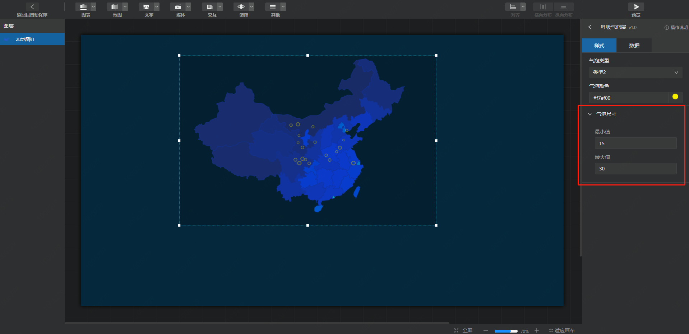

气泡尺寸指在地图上的散点的尺寸范围区间在最小值和最大值之间线性变化，单位为px。

提示框设置：


提示框设置中可以设置提示框展示方式，提示框的文本设置，边框粗细，边框颜色以及背景设置。

提示框展示方式：目前支持四种：无提示，提示一直存在，鼠标滑过提示和点击提示四种。

背景来源：包含颜色背景和图片背景两种。

颜色背景则选择对应的颜色即可，支持rgba颜色设置。

图片背景：支持自定义上传所需要的图片。

#### 数据设置

数据字段

呼吸气泡层的数据字段包括：lng，lat，value

lng：经度值，需要将数据与图表进行映射；

lat：纬度值，需要将数据与图表进行映射；

value：数值，需要将数据与图表进行映射；

tooltip：设置提示框内容，需要将数据与图表进行映射；

在下方表格中可输入或复制粘贴所需要的数据。其中，每一列数据对应一个数据字段，第一行为该列数据字段名，需要在上方进行映射设置。

目前，数据接入表格支持复制、粘贴、修改、删除数据。选中需要进行改动的数据后，可以点击右键进行操作，也可以使用ctrl+c等快捷键进行操作。当点击列序号或行序号是，会对该列或行全部选中，点击末尾的红色按钮可对该行或列进行删除操作，也可以点击右键对该行或列进行其他操作。

当点击红框内的放大按钮时，会出现放大输入窗口，方便用户进行操作。窗口内操作方式相同，修改数据完成后点击完成即可保存并进行后续字段映射。

当点击高级输入时，用户需在输入框中输入json格式的数据，数据格式如下。

``` js
[{"lat":30.395141,"lng":104.180187,"count":87,"tooltip":"文字信息对应数据tooltip;可用分号换行"},{"lat":31.314268,"lng":113.033458,"count":58},{"lat":32.517994,"lng":112.050051,"count":51},{"lat":33.509955,"lng":115.07636,"count":36},{"lat":34.308593,"lng":116.033371,"count":71},{"lat":35.698055,"lng":103.81029,"count":29},{"lat":36.443159,"lng":117.052512,"count":12},{"lat":37.512241,"lng":104.069421,"count":21},{"lat":38.513178,"lng":118.059847,"count":47},{"lat":39.755745,"lng":103.783377,"count":77},{"lat":39.395141,"lng":108.180187,"count":41},{"lat":31.314268,"lng":103.033458,"count":68},{"lat":30.509955,"lng":107.07636,"count":55},{"lat":30.308593,"lng":120.033371,"count":93},{"lat":39.698055,"lng":101.81029,"count":55},{"lat":34.443159,"lng":105.052512,"count":59},{"lat":31.512241,"lng":106.069421,"count":41},{"lat":31.513178,"lng":105.059847,"count":78},{"lat":35.755745,"lng":108.783377,"count":45}]
```

### 轨迹层

地租组件的字组件，在地图中，以线条形式展现某一事物运行轨迹。例如：在地图中展示某一物流产品输运过程中的轨迹。

#### 样式设置


轨迹层的样式设置可设置轨迹样式和重置按钮设置。

轨迹样式

可以对轨迹的线条颜色，线条宽度，线条样式以及轨迹显示的位置进行设置。默认只是在原来图层上加上轨迹，自适应居中则是在原来图层上加上轨迹后，轨迹还可以居于地图中央显示。

重置按钮设置

可以对按钮的文本，背景颜色，边框设置以及按钮位置进行设置。

边框设置：包含边框的粗细，线条，颜色进行设置。

按钮位置：可设置按钮的横纵坐标。

#### 数据设置

数据字段

.png)

区域联动层的数据字段包括：points

points就是组成轨迹层轨迹的点的集合

在下方表格中可输入或复制粘贴所需要的数据。其中，每一列数据对应一个数据字段，第一行为该列数据字段名，需要在上方进行映射设置。

目前，数据接入表格支持复制、粘贴、修改、删除数据。选中需要进行改动的数据后，可以点击右键进行操作，也可以使用ctrl+c等快捷键进行操作。当点击列序号或行序号是，会对该列或行全部选中，点击末尾的红色按钮可对该行或列进行删除操作，也可以点击右键对该行或列进行其他操作。

当点击红框内的放大按钮时，会出现放大输入窗口，方便用户进行操作。窗口内操作方式相同，修改数据完成后点击完成即可保存并进行后续字段映射。

当点击高级输入时，用户需在输入框中输入json格式的数据，数据格式如下。

``` js
[{"points":"122.68,45.51;122.43,37.77;123.43,34.77;125.43,36.77"},{"points":"124.68,43.51;126.43,33.77"}]
```

### 弹框散点层

弹框散点层是基础平面地图的子组件，支持独立的样式、数据和交互配置，能够以散点的形式表现地理位置上的点数据信息，同时支持点击时出现弹框显示补充信息。

适用场景：需要在地图中以不同大小图标展示不同位置数据大小的同时，还可以通过点击图标生成弹出框来展示额外信息。

#### 样式设置

.png)

散点层的样式设置可设置 默认配置，弹窗样式，交互设置。

默认设置

.png)

散点层支持用户选择散点的类型，可以是系统预置的散点类型，也可以用户自主上传图标。

当用户选择系统预置的散点时，可进行如下设置：

散点类型

散点类型目前支持六种，选择某个类型，地图上的散点图标会有对应的变化。

散点颜色

散点颜色支持用户自定义设置。

并且可以根据数据中的value值进行不同value范围显示不同的散点颜色，如上图所示。

散点尺寸

散点尺寸指在地图上的散点的尺寸在最小value值和最大value值之间线性变化，单位为px。

如上图所示，此处可设置散点的最小尺寸和最大尺寸。

图标图片：支持链接形式，或本地上传；

标注中心：指以图标的哪个点与经纬度对应，包含两个选择 图标中心点，图标底部中心点；

图标尺寸：指在地图上的图标的尺寸在最小value值和最大value值之间线性变化，单位为px。

如上图所示，此处可设置图标的最小尺寸和最大尺寸。

弹窗设置


弹窗设置：设置散点的弹窗样式，包括对弹出框的文本设置及边框的设置。

提示框设置


可对提示框内显示的文本进行字体，字号，粗细颜色的设置；可以设置提示框的背景颜色以及提示框的边框线条颜色及粗细。

交互设置


交互设置：点击或者操作散点时的交互设置，可出现弹窗，或者跳转到其他页面；

#### 数据设置

数据字段

.png)

散点层的数据字段包括：lng，lat，value

lng：必填项，经度值，需要将数据与图表进行映射；

lat：必填项，纬度值，需要将数据与图表进行映射；

value：选填项，数值，需要将数据与图表进行映射；

info：选填项，弹窗中的文字，支持使用<br>进行换行；

url：选填项，点击散点后跳转的url链接；

在下方表格中可输入或复制粘贴所需要的数据。其中，每一列数据对应一个数据字段，第一行为该列数据字段名，需要在上方进行映射设置。

目前，数据接入表格支持复制、粘贴、修改、删除数据。选中需要进行改动的数据后，可以点击右键进行操作，也可以使用ctrl+c等快捷键进行操作。当点击列序号或行序号是，会对该列或行全部选中，点击末尾的红色按钮可对该行或列进行删除操作，也可以点击右键对该行或列进行其他操作。

当点击红框内的放大按钮时，会出现放大输入窗口，方便用户进行操作。窗口内操作方式相同，修改数据完成后点击完成即可保存并进行后续字段映射。

当点击高级输入时，用户需在输入框中输入json格式的数据，数据格式如下。

```js
[{
	"lat": 31.395141,
	"lng": 100.180187,
	"count": 87,
	"text": "提示文字",
	"url": "http://monet.urban-computing.cn/monet-doc/"
}, {
	"lat": 33.314268,
	"lng": 102.033458,
	"count": 58,
	"text": "提示文字"
}, {
	"lat": 35.517994,
	"lng": 106.050051,
	"count": 51
}, {
	"lat": 37.509955,
	"lng": 108.07636,
	"count": 36
}, {
	"lat": 39.308593,
	"lng": 104.033371,
	"count": 71
}, {
	"lat": 30.698055,
	"lng": 110.81029,
	"count": 29
}, {
	"lat": 40.698055,
	"lng": 112.81029,
	"count": 29
}, {
	"lat": 41.443159,
	"lng": 114.052512,
	"count": 12
}, {
	"lat": 43.514083,
	"lng": 126.066373,
	"count": 73
}, {
	"lat": 25.516678,
	"lng": 114.059902,
	"count": 2
}, {
	"lat": 28.512241,
	"lng": 112.069421,
	"count": 21
}, {
	"lat": 29.513178,
	"lng": 103.059847,
	"count": 47
}, {
	"lat": 30.755745,
	"lng": 105.783377,
	"count": 77
}]

```

#### 交互设置

.png)

标签点击响应事件默认开启。

> 可将散点的经纬度绑定到变量中，那么在当前大屏中则存在此经纬度变量，即可在当前大屏的其他组件使用此变量。其他组件使用时仅可在API和数据库配置时使用变量，通过
> “：变量名称”的方式使用变量，完成数据的动态展示。


## 3D地球组

样式设置


3D地球组组件样式设置包括 子组件管理，地球基础配置，图表位置和图表尺寸。

子组件管理

新增子组件：点击子组件管理后的“+”
图标，弹出子组件窗口，选择一个子组件，即可完成子组件的添加；

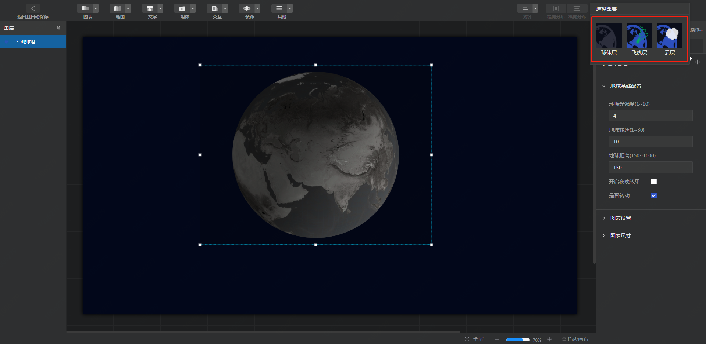

删除子组件：鼠标悬停在子组件的名称上，出现删除按钮，点击即可删除子组件。


配置子组件：

点击子组件名称，进入子组件配置页面。


地球基础配置管理


地球基础配置包含 环境光配置、地球转速、地球距离，是否开启夜晚效果，是否转动 五个基础配置。

数据设置

该组件无数据设置

### 3D球体层

样式设置


3D球体层的样式设置目前可进行球体风格的设置，地图风格包含3种，可选择进行切换。

数据设置

该组件无数据设置

### 飞线层

飞线层是3D地球层的子组件，用以在地球上展示某些轨迹。例如：展示国际航班航线。

#### 样式设置


飞线层的样式设置可设置飞线样式和尾迹样式。

飞线样式可设置飞线颜色和粗细；

尾迹样式可设置尾迹颜色，宽度和周期；

#### 数据设置

数据字段

.png)

飞线层的数据字段包括：from，to，labels，value

from：飞线的起点经纬度信息，需要将数据与图表进行映射；

to：飞线的终点经纬度信息，需要将数据与图表进行映射；

labels：起终点的地点名称，需要将数据与图表进行映射；

value：飞线代表的值，需要将数据与图表进行映射；

在下方表格中可输入或复制粘贴所需要的数据。其中，每一列数据对应一个数据字段，第一行为该列数据字段名，需要在上方进行映射设置。

目前，数据接入表格支持复制、粘贴、修改、删除数据。选中需要进行改动的数据后，可以点击右键进行操作，也可以使用ctrl+c等快捷键进行操作。当点击列序号或行序号是，会对该列或行全部选中，点击末尾的红色按钮可对该行或列进行删除操作，也可以点击右键对该行或列进行其他操作。

当点击红框内的放大按钮时，会出现放大输入窗口，方便用户进行操作。窗口内操作方式相同，修改数据完成后点击完成即可保存并进行后续字段映射。

当点击高级输入时，用户需在输入框中输入json格式的数据，数据格式如下。

``` js
[
    {
        "labels":[
            "北京",
            "新疆"
        ],
        "from":[
            116.404844,
            39.91405
        ],
        "to":[
            84.9023,
            42.148
        ],
        "value":84.9023
    },
    {
        "labels":[
            "北京",
            "西藏"
        ],
        "from":[
            116.404844,
            39.91405
        ],
        "to":[
            87.8695,
            31.6846
        ],
        "value":87.8695
    }
]
```

### 云层

3D地球字组件，用以在3D地球上方展示云层，起到装饰的作用。

#### 样式设置

.png)

云层的样式设置仅可以设置云层高度，范围是5-40 ，数值越大云层距离地球越远。

#### 数据设置

该组件无数据设置和交互设置。

# 文字组件

## 时间器

适用场景：


可以实时显示当前时间，精确到秒。适用于需要显示实时时间的页面。

### 样式设置

.png)

时间器显示的是当前时间，可调整时间格式，显示年月日时分秒，以及星期。

时间器的样式设置包括 时间格式，文本样式，图表位置，图表尺寸。

时间格式


时间格式包括 日期格式 和 星期格式。点击下拉框可进行选择。

文本样式

.png)

字体：支持微软雅黑、宋体、黑体、隶书、幼圆、楷体和系统默认字体；

字号：可输入字号调整；

字体粗细：字体的粗细，有正常、细体、粗体、更粗四个选项；

字体颜色：字体的颜色，鼠标悬停后出现颜色选择框，选择颜色即可，如下图：

.png)


目前颜色选择支持设置色值以及透明度，如上图所示，红框①处拖动可调整色值，红框②处拖动可调整透明度。

### 数据设置

该组件暂无数据设置。

## 普通文字

适用场景：

文字组件比较灵活，功能强大。可在页面中插入简短文字，也可以通过超链接配置或链接实现页面跳转等交互。

### 样式设置

.png)

普通文字的样式设置包括 文本样式，超链接设置，使用render,图表位置，图表尺寸。

文本样式

字体：支持微软雅黑、宋体、黑体、隶书、幼圆、楷体和系统默认字体；

字号：可输入字号调整；

字体粗细：字体的粗细，有正常、细体、粗体、更粗四个选项；

字体颜色：字体的颜色，鼠标悬停后出现颜色选择框，选择颜色即可，如下图：

.png)

目前颜色选择支持设置色值以及透明度，如上图所示，红框①处拖动可调整色值，红框②处拖动可调整透明度。

对齐方式：文字的对齐方式，有居左、居中、居右三个选项；

超链接配置

.png)

勾选在新窗口打开，则配置的超链接会在浏览器的新标签页打开。不勾选，则配置的超链接会在当前页面刷新。

### 数据设置

数据字段

.png)

>   text：文本内容，必填

>   url：当前文本的超链接，可不填

在下方表格中可输入或复制粘贴所需要的数据。其中，每一列数据对应一个数据字段，第一行为该列数据字段名，需要在上方进行映射设置。

目前，数据接入表格支持复制、粘贴、修改、删除数据。选中需要进行改动的数据后，可以点击右键进行操作，也可以使用ctrl+c等快捷键进行操作。当点击列序号或行序号是，会对该列或行全部选中，点击末尾的红色按钮可对该行或列进行删除操作，也可以点击右键对该行或列进行其他操作。

当点击红框内的放大按钮时，会出现放大输入窗口，方便用户进行操作。窗口内操作方式相同，修改数据完成后点击完成即可保存并进行后续字段映射。

当点击高级输入时，用户需在输入框中输入json格式的数据，数据格式如下。

``` js
[
    {
        "text":"我是文字",
        "url":""
    }
]
```


## 数字翻牌器

适用场景：

可以实时更新展示当前数据，在一些短时间内可以看到数据量大幅度攀升的场景下尤其适用，朴实直白的展示数据的急剧攀升情况，给人较深触动。

### 样式设置


数字翻牌器的样式设置包括组件风格、文本设置、动画设置、图表位置，图表尺寸。

组件风格

.jpg)

主题样式：纯色、立体、边框，并可设置主题颜色；

文本设置

文本设置包括数字设置，前缀设置和后缀设置。

.png)

数字设置

.png)

数字设置可以设置数字的文本样式，默认位数，小数保留以及数字间隔。

前缀设置和后缀设置分别对前缀和后缀的文本和内容进行设置。

动画设置


动画设置包括动画间隔、动画时长、始终动画 三个设置。

动画间隔：每隔多久出现一次动画效果；

动画时长：一次动画效果滚动多长时间；

始终动画：勾选后，无论数据是否变动，均按照设置的动画间隔和动画时长进行变化。不勾选时，只有数据有变化时才出现动画滚动效果。

前缀设置

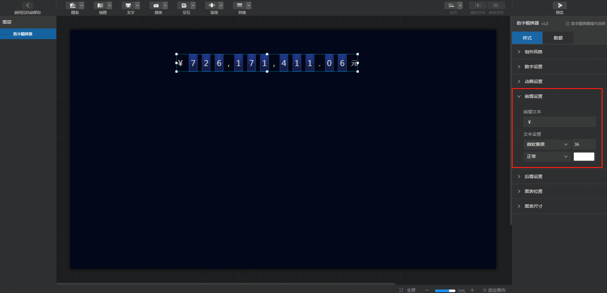

前缀设置包含前缀文本内容设置及文本的样式设置，文本内容不填则不显示。

后缀设置

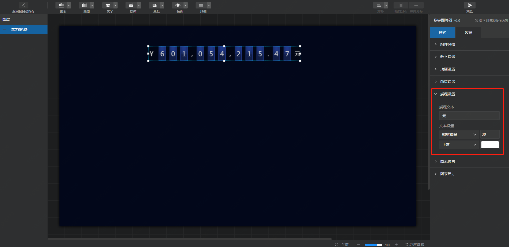

后缀设置包含后缀文本内容设置及文本的样式设置，文本内容不填则不显示。

### 数据设置

数据字段

.png)

数据字段需要输入value值，value值为数字翻牌器数字停止跳动时所显示的数值。

在下方表格中可输入或复制粘贴所需要的数据。其中，每一列数据对应一个数据字段，第一行为该列数据字段名，需要在上方进行映射设置。

目前，数据接入表格支持复制、粘贴、修改、删除数据。选中需要进行改动的数据后，可以点击右键进行操作，也可以使用ctrl+c等快捷键进行操作。当点击列序号或行序号是，会对该列或行全部选中，点击末尾的红色按钮可对该行或列进行删除操作，也可以点击右键对该行或列进行其他操作。

当点击红框内的放大按钮时，会出现放大输入窗口，方便用户进行操作。窗口内操作方式相同，修改数据完成后点击完成即可保存并进行后续字段映射。

当点击高级输入时，用户需在输入框中输入json格式的数据，数据格式如下。

``` js
[{"number":"2019618"}]
```

# 媒体组件

## 图片

适用场景

用户可自行导入自己需要的图片，满足大家功能及装饰上的需求。并可在图片中通过超链接配置等实现页面切换，跳转页面等复杂交互。

### 样式设置


图片的样式设置可设置图片的链接，或上传图片，并支持配置图片的超链接。

上传图片：支持从本地上传图片，将图片拖到右侧样式设置的图片上传区域，即可完成图片上传。或点击图片上传区域，上传图片。

删除图片：鼠标悬停在右侧样式设置的图片上传区域，会出现删除按钮，可进行图片的删除。

超链接设置：图片可设置超链接，直接将网址粘贴即可，如不配置，则无超链接。超链接可选择在新窗口打开，如勾选，则点击图片后的超链接会在新的浏览器标签页打开，如不勾选，则点击图片后的超链接会在当前页面打开。

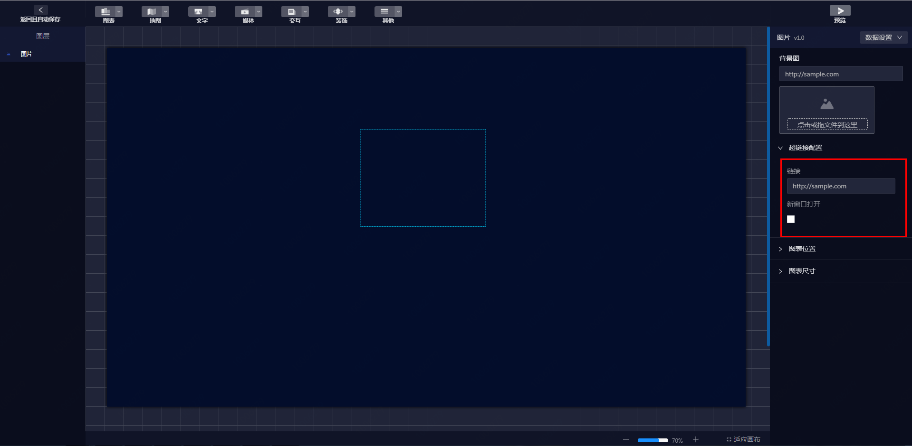

### 数据设置

.png)

数据设置可以设置hyperUrl字段和Url字段。

hyperUrl：图片超链接url

Url：图片本身的Url。

在下方表格中可输入或复制粘贴所需要的数据。其中，每一列数据对应一个数据字段，第一行为该列数据字段名，需要在上方进行映射设置。

目前，数据接入表格支持复制、粘贴、修改、删除数据。选中需要进行改动的数据后，可以点击右键进行操作，也可以使用ctrl+c等快捷键进行操作。当点击列序号或行序号是，会对该列或行全部选中，点击末尾的红色按钮可对该行或列进行删除操作，也可以点击右键对该行或列进行其他操作。

当点击红框内的放大按钮时，会出现放大输入窗口，方便用户进行操作。窗口内操作方式相同，修改数据完成后点击完成即可保存并进行后续字段映射。

当点击高级输入时，用户需在输入框中输入json格式的数据，数据格式如下。

``` js
[{"hyperUrl":"","url":""}]
```

## 视频

适用场景

视频相对于文字图片来说，展现形式更加直观，可以在短时间内捕获用户注意力。一些炫酷视频配合其他组件共同使用，使大屏更加立体生动。

### 样式设置


视频的样式设置可设置视频的地址链接，配置视频是否自动播放，循环播放以及是否显示控制条。

视频组件暂不支持本地上传。

### 数据设置

.png)

数据字段

视频组件的数据字段包括：url

url：视频的地址链接；

需要注意的是：如果数据设置和样式设置中同时配置了视频的URL，那么将以数据设置中的链接为准；

在下方表格中可输入或复制粘贴所需要的数据。其中，每一列数据对应一个数据字段，第一行为该列数据字段名，需要在上方进行映射设置。

目前，数据接入表格支持复制、粘贴、修改、删除数据。选中需要进行改动的数据后，可以点击右键进行操作，也可以使用ctrl+c等快捷键进行操作。当点击列序号或行序号是，会对该列或行全部选中，点击末尾的红色按钮可对该行或列进行删除操作，也可以点击右键对该行或列进行其他操作。

当点击红框内的放大按钮时，会出现放大输入窗口，方便用户进行操作。窗口内操作方式相同，修改数据完成后点击完成即可保存并进行后续字段映射。

当点击高级输入时，用户需在输入框中输入json格式的数据，数据格式如下。

``` js
[
    {
        "url":""
    }
]
```

## 实时视频

适用场景

实时视频指将组件绑定在实时进行的视频URL中，如直播等。相比较一般视频，实时视频更重要的特点是实时性，信息的同步性。适用于一些对视频时效性要求较高的情境。

### 样式设置

.png)

实时视频的样式设置可设置视频的地址链接，配置视频是否自动播放，循环播放以及是否显示控制条。

该组件暂不支持本地上传。

### 数据设置

.png)

数据字段

实时视频组件的数据字段包括：url

url：视频的地址链接；

需要注意的是：如果数据设置和样式设置中同时配置了视频的URL，那么将以数据设置中的链接为准；

在下方表格中可输入或复制粘贴所需要的数据。其中，每一列数据对应一个数据字段，第一行为该列数据字段名，需要在上方进行映射设置。

目前，数据接入表格支持复制、粘贴、修改、删除数据。选中需要进行改动的数据后，可以点击右键进行操作，也可以使用ctrl+c等快捷键进行操作。当点击列序号或行序号是，会对该列或行全部选中，点击末尾的红色按钮可对该行或列进行删除操作，也可以点击右键对该行或列进行其他操作。

当点击红框内的放大按钮时，会出现放大输入窗口，方便用户进行操作。窗口内操作方式相同，修改数据完成后点击完成即可保存并进行后续字段映射。

当点击高级输入时，用户需在输入框中输入json格式的数据，数据格式如下。

``` js
[{"url":""}]
```

# 交互组件

本章节统一使用数据源管理中interaction_tutorial_data1文件进行示例教学讲解，如图所示。用户可以在莫奈产品中调用该数据文件进行数据配置。

.png)

该数据csv文件文件名为interaction_tutorial_data.csv，数据文件结构如下图：
.png)

该数据展现某电商2006年第二季度至2007年第一季度的销售金额与成本情况。

>   注意：当数据文件为csv格式时，图表查询语句中表名应该为csv文件名；当数据文件为excel格式时，图表查询语句中表名应该为excel文件中的表名。

## 时间轴

时间轴交互组件是将不同时间节点显示在同一轴上，用户通过点击不同时间节点与数据进行交互。

适用场景：用户通过点击不同年份时间节点，对前年，去年以及今年的数据进行筛选。

时间轴使用示例教学视频如下：

<video width="740" controls="" preload="none" poster="http://storage.360buyimg.com/video-tutorial/video_screenshot/time_line.png">
      <source src="http://storage.360buyimg.com/video-tutorial/timeline.mp4">
      </video>


### 样式设置


时间轴组件的样式设置包含节点设置、轴设置、事件设置、时间设置、动画设置、图表位置和图表尺寸。

节点设置


排列方向：横向、纵向。

节点形状：菱形、圆形；

节点大小：单位为px（像素）；

默认颜色：节点的默认颜色；

默认颜色：节点的选中颜色；

轴设置

.png)

轴粗细：单位为px（像素）；

默认颜色：轴的默认颜色；

默认颜色：轴的选中颜色，可以添加渐变色；

事件设置


- 默认样式：默认状态下的事件样式

轴间距：事件距离轴的垂直距离，单位为px（像素）；

事件文字的相关设置：包括字号、字体、字体颜色、字体粗细；

- 选中样式：选中状态下的事件样式

轴间距：事件距离轴的垂直距离，单位为px（像素）；

事件文字的相关设置：包括字号、字体、字体颜色、字体粗细；

时间设置


- 默认样式：默认状态下的时间样式

轴间距：时间距离轴的垂直距离，单位为px（像素）；

时间文字的相关设置：包括字号、字体、字体颜色、字体粗细；

- 选中样式：选中状态下的时间样式

轴间距：时间距离轴的垂直距离，单位为px（像素）；

时间文字的相关设置：包括字号、字体、字体颜色、字体粗细；

动画设置


轮播设置：循环轮播、轮播一次后停止轮播；

间隔时间：从一个节点到下一个节点的间隔时间；

停留时间：在一个节点上的停留时间；

### 数据设置


数据字段

.png)

时间轴的数据字段包括：timeName，event，timeValue

timeName：时间的显示内容；

event：事件的内容；

timeValue：时间的编码值；

在下方表格中可输入或复制粘贴所需要的数据。其中，每一列数据对应一个数据字段，第一行为该列数据字段名，需要在上方进行映射设置。

目前，数据接入表格支持复制、粘贴、修改、删除数据。选中需要进行改动的数据后，可以点击右键进行操作，也可以使用ctrl+c等快捷键进行操作。当点击列序号或行序号是，会对该列或行全部选中，点击末尾的红色按钮可对该行或列进行删除操作，也可以点击右键对该行或列进行其他操作。

当点击红框内的放大按钮时，会出现放大输入窗口，方便用户进行操作。窗口内操作方式相同，修改数据完成后点击完成即可保存并进行后续字段映射。

当点击高级输入时，用户需在输入框中输入json格式的数据，数据格式如下。

``` js
[
{
	"time": "2000年",
	"event": "事件1",
	"value": 2000
}, {
	"time": "2001年",
	"event": "事件2",
	"value": 2001
}, {
	"time": "2004年",
	"event": "事件3",
	"value": 2004
}
]
```

### 交互设置


节点选中响应事件

>   可将时间轴组件选择的时间字段绑定到变量中，那么在当前大屏中则存在此变量，即可在当前大屏的其他组件使用此变量。其他组件使用时仅可在API和数据库配置时使用变量，通过
>   “：变量名称”的方式使用变量，完成数据的动态展示。

## 日期选择器交互组件

日期选择器交互组件是用来选择某一时间范围的交互组件，用户可以选择某两个具体日期的日期区间来对数据进行筛选，例如：用户选择2020年1月1日到2020年6月18日的销售数据来查看公司上半年的销售情况；也可以分别选择两个以当前日期为标准 T+n 的日期区间来筛选，例如：用户选择2021年1月1日到当前日期+0，即今天的最新日期来动态展示更新到最新的公司销售情况。

日期选择器交互组件使用示例教学视频如下：


<video width="740" controls="" preload="none" poster="http://storage.360buyimg.com/video-tutorial/video_screenshot/time_selection.png">
      <source src="http://storage.360buyimg.com/video-tutorial/time_choice.mp4">
      </video>


### 样式设置


日期选择器交互组件的样式设置包含默认设置，选择器设置。

默认设置

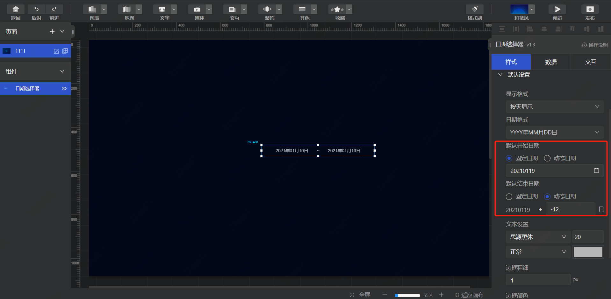

默认设置可设置显示格式，日期格式，默认日期，文本设置，边框设置。

显示格式

包含按天显示、按月显示、按年显示；

日期格式

日期的显示格式，包括 “YYYY年MM月DD日”，“YYYY-MM-DD”，“YYYY/MM/DD”三种格式；

默认日期

当前组件在展示时的默认日期，包括固定日期和动态日期。固定日期选中后不再变化；动态日期设置后数据根据设置的时间随当前日期变化，动态变化增减日期仅可输入整数，单位随上方选中的日期格式变化；(默认日期的设置可以在样式-默认设置中设置，也可以在数据进行设置，以数据设置为准)

文本设置

可以对日期选择器中的文本的字体，字号，粗细，大小进行设置。

边框设置

可以对边框粗细，边框颜色以及背景颜色进行设置。

### 数据设置

.png)

数据字段包含：startDate和endDate两个数据字段。

startDate：设置的是日期选择器的起始时间。

endDate：设置的是日期选择器的终止时间。

在下方表格中可输入或复制粘贴所需要的数据。其中，每一列数据对应一个数据字段，第一行为该列数据字段名，需要在上方进行映射设置。

目前，数据接入表格支持复制、粘贴、修改、删除数据。选中需要进行改动的数据后，可以点击右键进行操作，也可以使用ctrl+c等快捷键进行操作。当点击列序号或行序号是，会对该列或行全部选中，点击末尾的红色按钮可对该行或列进行删除操作，也可以点击右键对该行或列进行其他操作。

当点击红框内的放大按钮时，会出现放大输入窗口，方便用户进行操作。窗口内操作方式相同，修改数据完成后点击完成即可保存并进行后续字段映射。

当点击高级输入时，用户需在输入框中输入json格式的数据。

### 交互设置

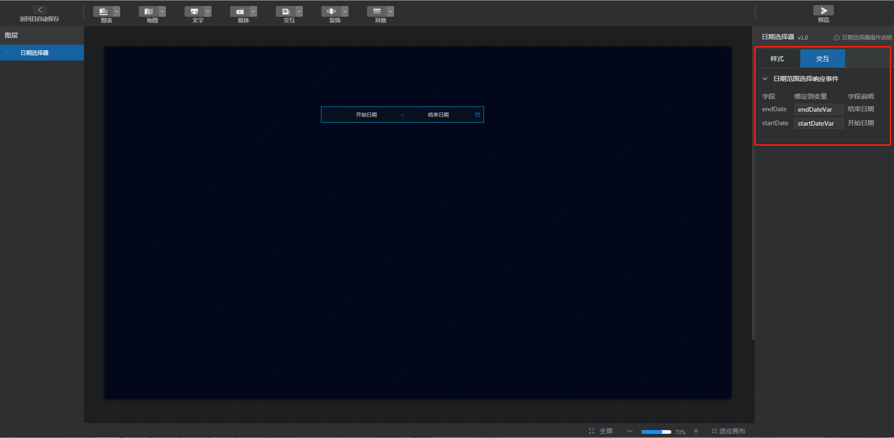
时间范围选择响应事件

时间范围选择响应事件默认开启。

>   可将适建范围选择组件选择的时间范围按照绑定到变量中，那么在当前大屏中则存在此变量，即可在当前大屏的其他组件使用此变量。其他组件使用时仅可在API和数据库配置时使用变量，通过
>   “：变量名称”的方式使用变量，完成数据的动态展示。

## Tab组件

tab交互组件是以标签的形式为用户提供数据筛选的交互组件。用户可以自定义tab标签的个数以及名称，进而通过点击不同标签筛选相应的数据。例如：用户将标签编辑为不同类型蔬菜，来对蔬菜售出情况进行筛选。

tab组件使用示例教学视频如下：

<video width="740" controls="" preload="none" poster="http://storage.360buyimg.com/video-tutorial/video_screenshot/tab.png">
      <source src="http://storage.360buyimg.com/video-tutorial/tab.mp4">
      </video>


### 样式设置


Tab组件目前支持默认样式、选中样式、图表位置和图标尺寸这四大类的配置项。

Tab组件的默认样式设置包含tab排列方向、文本设置、对齐方式、标签间距、边框粗细、边框颜色、背景颜色、和背景图片。

tab排列方向：包含横向和纵向；

Tab组件的选中样式包含背景颜色，边框设置，文本设置这三个配置项

文本设置

字体：支持微软雅黑、宋体、黑体、隶书、幼圆、楷体和系统默认字体；

字号：可输入字号调整；

字体粗细：字体的粗细，有正常、细体、粗体、更粗四个选项；

字体颜色：字体的颜色，鼠标悬停后出现颜色选择框，选择颜色即可，如下图：

.png)

对齐方式：文字的对齐方式，有居左、居中、居右三个选项；

标签间距：可以对tab标签之间的间距进行设置

边框设置：可设置边框的粗细及边框的颜色。

背景设置：可选择颜色背景或图片背景。

选中样式

tab标签的选中样式可以设置文本，边框及背景。

文本设置

字体：支持微软雅黑、宋体、黑体、隶书、幼圆、楷体和系统默认字体；

字号：可输入字号调整；

字体粗细：字体的粗细，有正常、细体、粗体、更粗四个选项；

字体颜色：字体的颜色，鼠标悬停后出现颜色选择框，选择颜色即可

边框设置：可设置边框的粗细及边框的颜色。

背景设置：可选择颜色背景或图片背景。

### 数据设置


数据字段

.png)

tab的数据字段包括：option，value

value：tab的编码值，需要将数据与图表中的字段进行映射；

option：tab的显示内容，也需要将数据与图表进行映射；

在下方表格中可输入或复制粘贴所需要的数据。其中，每一列数据对应一个数据字段，第一行为该列数据字段名，需要在上方进行映射设置。

目前，数据接入表格支持复制、粘贴、修改、删除数据。选中需要进行改动的数据后，可以点击右键进行操作，也可以使用ctrl+c等快捷键进行操作。当点击列序号或行序号是，会对该列或行全部选中，点击末尾的红色按钮可对该行或列进行删除操作，也可以点击右键对该行或列进行其他操作。

当点击红框内的放大按钮时，会出现放大输入窗口，方便用户进行操作。窗口内操作方式相同，修改数据完成后点击完成即可保存并进行后续字段映射。

当点击高级输入时，用户需在输入框中输入json格式的数据，数据格式如下。

``` js
[
    {
        "value":1,
        "option":"Tab1"
    },
    {
        "value":2,
        "option":"Tab2"
    },
    {
        "value":3,
        "option":"Tab3"
    }
]
```


### 交互设置

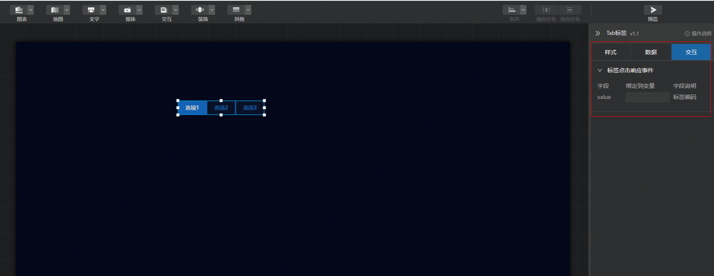

标签点击响应事件

标签点击响应事件默认开启。

>   可将tab的value绑定到变量中，那么在当前大屏中则存在此变量，即可在当前大屏的其他组件使用此变量。其他组件使用时仅可在API和数据库配置时使用变量，通过
>   “：变量名称”的方式使用变量，完成数据的动态展示。

## 多选框

多选框组件为用户提供自定义选择所需要展示选项的功能，用户可以在多个选项中任意选择一个或多个约束条件来进行数据筛选。适用场景：用户设定多选框以对时间维度数据进行筛选，用户可任意选择前年，去年和今年中想展示出的数据。

多选框使用示例教学视频如下：


<video width="740"  controls="" preload="none" poster="http://storage.360buyimg.com/video-tutorial/video_screenshot/multiple_choice.png">
      <source src="http://storage.360buyimg.com/video-tutorial/multiple.mp4">
      </video>


### 样式设置


默认样式：


默认样式中，可对多选框的排列方向，文本设置，对齐方式，图标大小，图标与文本间距进行设置。

多选框的排列方向：支持横向和纵向两个方向

文本设置：支持字体、字号、粗细和颜色进行配置

对齐方式：支持居左、居中和居右

### 数据设置


数据字段

.png)

多选框的数据字段包括：option，value和iconColor

option：多选框显示的内容；

value：多选框代表的值；

iconColor（选填）：可对图标颜色分别进行设置。

在下方表格中可输入或复制粘贴所需要的数据。其中，每一列数据对应一个数据字段，第一行为该列数据字段名，需要在上方进行映射设置。

目前，数据接入表格支持复制、粘贴、修改、删除数据。选中需要进行改动的数据后，可以点击右键进行操作，也可以使用ctrl+c等快捷键进行操作。当点击列序号或行序号是，会对该列或行全部选中，点击末尾的红色按钮可对该行或列进行删除操作，也可以点击右键对该行或列进行其他操作。

当点击红框内的放大按钮时，会出现放大输入窗口，方便用户进行操作。窗口内操作方式相同，修改数据完成后点击完成即可保存并进行后续字段映射。

当点击高级输入时，用户需在输入框中输入json格式的数据，数据格式如下。

``` js
[
  {
    "value":1,
    "option":"选项1"
  }, {
    "value":2,
    "option":"选项2"
  }, {
    "value":3,
    "option":"选项3"
  }
]
```

### 交互设置


节点选中响应事件

>   这里可以自定义一个变量名，可实现下拉框组件当前选择的值与变量绑定，在当前大屏中则存在此变量，即可在当前大屏的其他组件使用此变量。其他组件使用时仅可在API和数据库配置时使用变量，通过
>   “：变量名称”的方式使用变量，完成数据的动态展示。

## 输入框

输入框是通过用户输入的信息来对数据进行筛选的交互组件。适用场景：用户在输入框中输入想要查找的时间范围，如第一季度第二季度等，图表可显示第一季度第二季度相应的销售数据。

输入框使用示例教学视频如下：


<video width="740" controls="" preload="none" poster="http://storage.360buyimg.com/video-tutorial/video_screenshot/input.png">
      <source src="http://storage.360buyimg.com/video-tutorial/input.mp4">
      </video>


### 样式设置

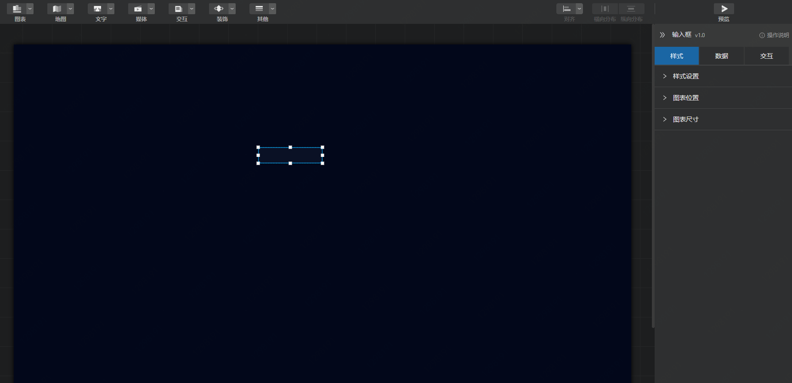


样式设置中包含边框设置，背景设置，圆角设置和文本设置；

边框设置包含粗细和颜色设置；

背景设置为颜色设置；

圆角设置为输入框圆角曲度设置；

文本设置包含：

文本样式

字体：支持微软雅黑、宋体、黑体、隶书、幼圆、楷体和系统默认字体；

字号：可输入字号调整；

字体粗细：字体的粗细，有正常、细体、粗体、更粗四个选项；

字体颜色：字体的颜色，鼠标悬停后出现颜色选择框，选择颜色即可，如下图：

.png)

对齐方式：文字的对齐方式，有居左、居中、居右三个选项；

### 数据设置


数据字段

.png)

tab的数据字段包括：value

value：value为输入的内容

在下方表格中可输入或复制粘贴所需要的数据。其中，每一列数据对应一个数据字段，第一行为该列数据字段名，需要在上方进行映射设置。

目前，数据接入表格支持复制、粘贴、修改、删除数据。选中需要进行改动的数据后，可以点击右键进行操作，也可以使用ctrl+c等快捷键进行操作。当点击列序号或行序号是，会对该列或行全部选中，点击末尾的红色按钮可对该行或列进行删除操作，也可以点击右键对该行或列进行其他操作。

当点击红框内的放大按钮时，会出现放大输入窗口，方便用户进行操作。窗口内操作方式相同，修改数据完成后点击完成即可保存并进行后续字段映射。

当点击高级输入时，用户需在输入框中输入json格式的数据，数据格式如下。

``` js
[{"value":""}]
```

### 交互设置

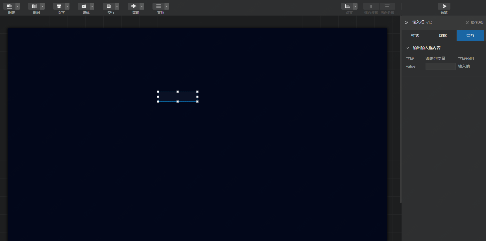

标签点击响应事件

标签点击响应事件默认开启。

>   可将输入框的value绑定到变量中，那么在当前大屏中则存在此变量，即可在当前大屏的其他组件使用此变量。其他组件使用时仅可在API和数据库配置时使用变量，通过
>   “：变量名称”的方式使用变量，完成数据的动态展示。

## 启动按钮

启动按钮是用来触发交互组件进行交互的，需要与其他交互组件捆绑使用。适用场景：当设置好交互组件交互配置后，不想点击交互组件后立刻对数据进行交互展示，而是需要再次点击确认后进行交互。

启动按钮使用示例教学视频如下：

<video width="740" controls="" preload="none" poster="http://storage.360buyimg.com/video-tutorial/video_screenshot/start.png">
      <source src="http://storage.360buyimg.com/video-tutorial/start_button.mp4">
      </video>


### 样式设置

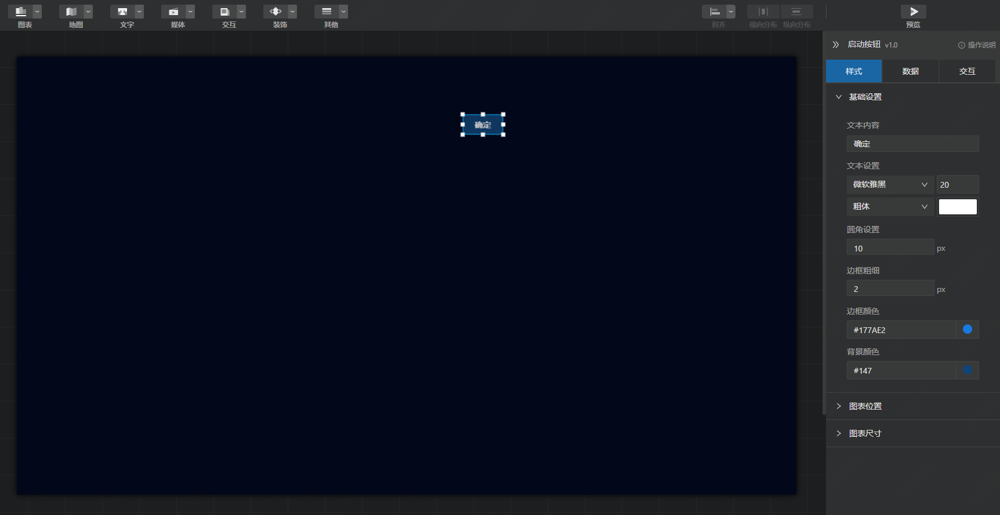

样式设置中包含文本内容，文本设置，圆角设置和边框设置；

边框设置包含粗细和颜色设置；

背景设置为颜色设置；

圆角设置为输入框圆角曲度设置；

文本内容即该按钮在预览页面展示的文字信息；

文本设置包含：

文本样式

字体：支持微软雅黑、宋体、黑体、隶书、幼圆、楷体和系统默认字体；

字号：可输入字号调整；

字体粗细：字体的粗细，有正常、细体、粗体、更粗四个选项；

字体颜色：字体的颜色，鼠标悬停后出现颜色选择框，选择颜色即可，如下图：

.png)

对齐方式：文字的对齐方式，有居左、居中、居右三个选项；

### 数据设置

启动按钮负责做延迟交互操作，不存在数据设置

### 交互设置

该组件无交互设置，它主要的功能是让其他存在交互设置的组件延迟传参(统一事件传参)

当用户在其他组件下的交互设置中勾选“开启延迟交互”，则用户在这些组件的变量值发生改变时，将不会立刻感知参数的传递，而是在点击启动按钮后，这些交互组件才会进行参数的传递，同时完成数据拾取和展示。

## 城市选择组件

城市选择器交互组件是用来选择任意城市从而完成交互行为的组件，他是在当数据涉及到城市信息时使用的组件。例如：用户可以在城市选择组件中选择不同城市用以来展示不同城市的人口情况。

### 样式设置


城市选择组件的样式设置包含默认设置和选择器设置两种。

默认设置


默认设置包含：默认城市，文本设置，边框设置。

默认城市：为城市选择组件的默认值，省、市、区县，三级联动。

文本设置

字体：支持微软雅黑、宋体、黑体、隶书、幼圆、楷体和系统默认字体；

字号：可输入字号调整；

字体粗细：字体的粗细，有正常、细体、粗体、更粗四个选项；

字体颜色：字体的颜色，鼠标悬停后出现颜色选择框，选择颜色即可

边框设置

可设置边框的粗细，边框颜色及背景颜色。

选择器设置


选择器设置中可以设置文本，边框粗细，边框颜色及背景颜色。

### 数据设置

该组件暂无数据设置。

### 交互设置


城市选择响应事件

城市选择响应事件默认开启。

>   可将城市选择组件选择的城市id绑定到变量中，那么在当前大屏中则存在此变量，即可在当前大屏的其他组件使用此变量。其他组件使用时仅可在API和数据库配置时使用变量，通过
>   “：变量名称”的方式使用变量，完成数据的动态展示。

## 开关按钮

开关按钮是协助用户对某一事件在数据展示时是否执行的组件。用户可自定义这一事件并对其进行文字说明，然后通过编写sql语句来实现其逻辑动能。例如：用户可以设置开关按钮为是否显示第一季度信息来完成对第一季度数据的开关查看。

开关按钮使用示例教学视频如下：

<video width="740" controls="" preload="none" poster="http://storage.360buyimg.com/video-tutorial/video_screenshot/switch.png">
      <source src="http://storage.360buyimg.com/video-tutorial/switch_button.mp4">
      </video>


### 样式设置

.png)

开关按钮样式设置中包含默认选择状态，中间背景颜色，选左北京颜色，选右背景颜色，圆角设置，边框设置；

边框设置包含粗细和颜色设置；

圆角设置为输入框圆角曲度设置；

### 数据设置

数据字段
开关按钮一共有两个数据字段。
.png)
leftVlue：开关按钮在左边时的值。
rightValue：开关按钮在右边时的值。

在下方表格中可输入或复制粘贴所需要的数据。其中，每一列数据对应一个数据字段，第一行为该列数据字段名，需要在上方进行映射设置。

目前，数据接入表格支持复制、粘贴、修改、删除数据。选中需要进行改动的数据后，可以点击右键进行操作，也可以使用ctrl+c等快捷键进行操作。当点击列序号或行序号是，会对该列或行全部选中，点击末尾的红色按钮可对该行或列进行删除操作，也可以点击右键对该行或列进行其他操作。

当点击红框内的放大按钮时，会出现放大输入窗口，方便用户进行操作。窗口内操作方式相同，修改数据完成后点击完成即可保存并进行后续字段映射。

当点击高级输入时，用户需在输入框中输入json格式的数据，数据格式如下。

``` js
{"onValue":1,"offValue":2}
```

交互设置
.png)
标签点击响应事件

标签点击响应事件默认开启。

>   可将输入框的value绑定到变量中，那么在当前大屏中则存在此变量，即可在当前大屏的其他组件使用此变量。其他组件使用时仅可在API和数据库配置时使用变量，通过
>   “：变量名称”的方式使用变量，完成数据的动态展示。

## 搜索输入框

### 样式设置

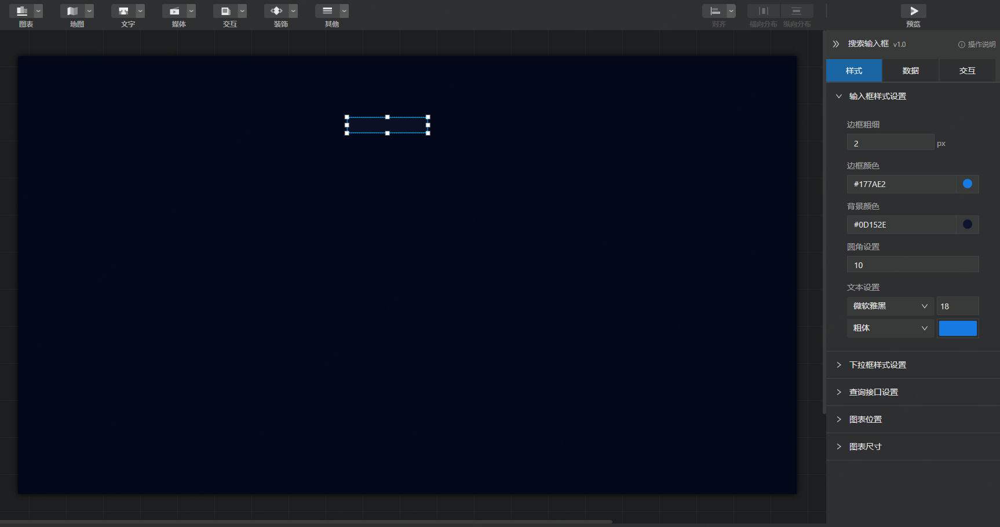

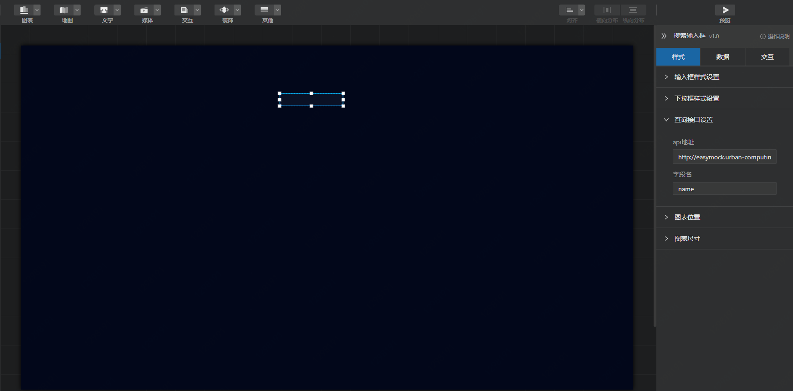

输入框样式设置中包含边框设置，背景设置，圆角设置和文本设置；

边框设置包含粗细和颜色设置；

背景设置为颜色设置；

圆角设置为输入框圆角曲度设置；

文本设置包含：

文本样式

字体：支持微软雅黑、宋体、黑体、隶书、幼圆、楷体和系统默认字体；

字号：可输入字号调整；

字体粗细：字体的粗细，有正常、细体、粗体、更粗四个选项；

字体颜色：字体的颜色，鼠标悬停后出现颜色选择框，选择颜色即可，如下图：

.png)

对齐方式：文字的对齐方式，有居左、居中、居右三个选项；

下拉框样式设置中包含最大行数设置，边框设置，背景设置，圆角设置和文本设置；

最大行数设置是搜索出的模糊查询结果的最大展示行数；

查询接口设置包含：API地址和字段名设置

其中API即为获取模糊查询结果的api地址，字段名即为在该api下拿取数据的字段名称。


### 数据设置

数据字段

.png)

tab的数据字段包括：value

value：value为输入的内容

在下方表格中可输入或复制粘贴所需要的数据。其中，每一列数据对应一个数据字段，第一行为该列数据字段名，需要在上方进行映射设置。

目前，数据接入表格支持复制、粘贴、修改、删除数据。选中需要进行改动的数据后，可以点击右键进行操作，也可以使用ctrl+c等快捷键进行操作。当点击列序号或行序号是，会对该列或行全部选中，点击末尾的红色按钮可对该行或列进行删除操作，也可以点击右键对该行或列进行其他操作。

当点击红框内的放大按钮时，会出现放大输入窗口，方便用户进行操作。窗口内操作方式相同，修改数据完成后点击完成即可保存并进行后续字段映射。

当点击高级输入时，用户需在输入框中输入json格式的数据，数据格式如下。

``` js
[{"value":""}]
```

### 交互设置

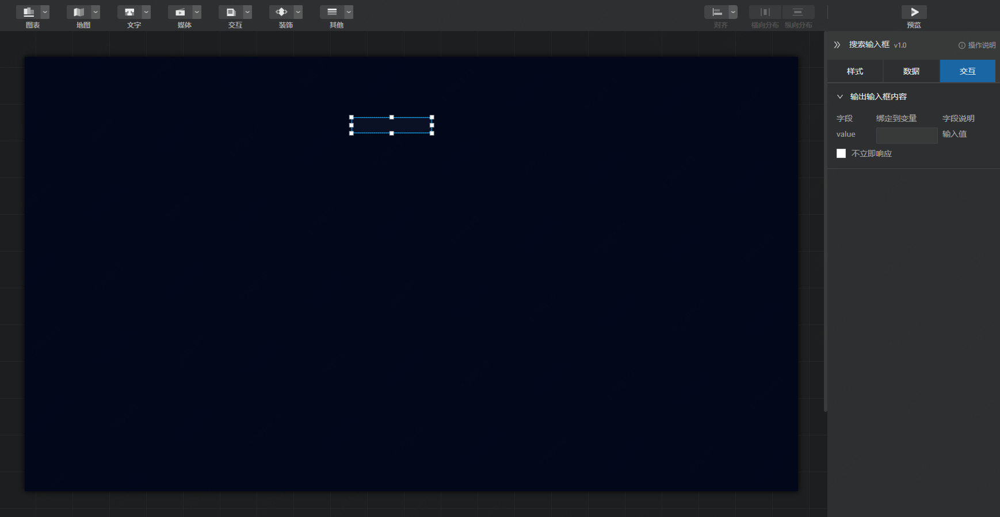

标签点击响应事件

标签点击响应事件默认开启。

>   可将输入框的value绑定到变量中，那么在当前大屏中则存在此变量，即可在当前大屏的其他组件使用此变量。其他组件使用时仅可在API和数据库配置时使用变量，通过
>   “：变量名称”的方式使用变量，完成数据的动态展示。

## 下拉框

下拉框为接触下拉展示效果为用户提供交互及数据筛选的组件。用户点击下拉按钮，就可以在下拉展示中选择需要选择的数据维度。

下拉框使用示例教学视频如下：


<video width="740" controls="" preload="none" poster="http://storage.360buyimg.com/video-tutorial/video_screenshot/drop.png">
      <source src="http://storage.360buyimg.com/video-tutorial/drop.mp4">
      </video>


### 样式设置


下拉框组件的样式设置包含背景颜色、边框颜色、文本设置、图表位置和图表尺寸。

**背景颜色，边框颜色**

> 可以通过后面的颜色选择器对背景和边框设置自定义的样色；

.png)

**文本设置**

> 可以对文字的字号、字体、字体颜色、字体粗细进行设置；

### 数据设置

数据字段

.png)

时间轴的数据字段包括：option，value

option：下拉框显示的内容；

value：下拉框代表的值；

在下方表格中可输入或复制粘贴所需要的数据。其中，每一列数据对应一个数据字段，第一行为该列数据字段名，需要在上方进行映射设置。

目前，数据接入表格支持复制、粘贴、修改、删除数据。选中需要进行改动的数据后，可以点击右键进行操作，也可以使用ctrl+c等快捷键进行操作。当点击列序号或行序号是，会对该列或行全部选中，点击末尾的红色按钮可对该行或列进行删除操作，也可以点击右键对该行或列进行其他操作。

当点击红框内的放大按钮时，会出现放大输入窗口，方便用户进行操作。窗口内操作方式相同，修改数据完成后点击完成即可保存并进行后续字段映射。

当点击高级输入时，用户需在输入框中输入json格式的数据，数据格式如下。

``` js
[
  {
    "value":1,
    "option":"选项1"
  }, {
    "value":2,
    "option":"选项2"
  }, {
    "value":3,
    "option":"选项3"
  }
]
```

### 交互设置

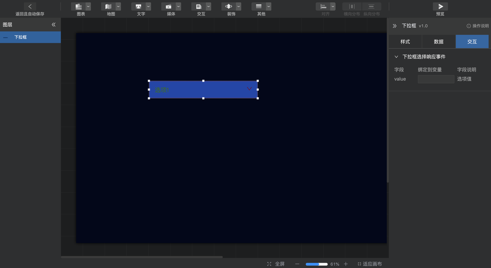

节点选中响应事件

>   这里可以自定义一个变量名，可实现下拉框组件当前选择的值与变量绑定，在当前大屏中则存在此变量，即可在当前大屏的其他组件使用此变量。其他组件使用时仅可在API和数据库配置时使用变量，通过
>   “：变量名称”的方式使用变量，完成数据的动态展示。

## 时间控件


时间控件交互组件是用来选择某一特定时间的交互组件。用户可使用时间控件组件实现某一特定时间筛选的功能，例如：用户想查看2020年6月18日的销售情况。同时也可以通过使用两个时间控件组件来实现某一时间范围的筛选。例如：用户选择2020年1月1日到2020年6月18日的销售数据来查看公司上半年的销售情况。此时，时间控件功能与日期选择器相同，只是两者的呈现形式略有差异。

### 样式设置


时间控件的样式设置包含默认设置和选择器设置。默认设置，支持显示格式，日期格式，默认日期，文本设置和边框设置。

显示格式：支持按天显示，按月显示和按年显示三种。

日期格式：支持三种常用的日期格式。

默认日期：可以设置时间控件的默认显示时间。如果数据中也对该项进行设置了的话，以数据中的设置为准。

文本设置：可设置字体字号颜色粗细。

边框设置：可设置边框粗细，边框颜色和边框背景颜色。


选择器设置，可设置文本和边框。

文本设置：可设置字体字号颜色粗细。

边框设置：可设置边框粗细，边框颜色和边框背景颜色。

### 数据设置


时间控件只有一个数据字段：

date：时间选择器的显示日期。

在下方表格中可输入或复制粘贴所需要的数据。其中，每一列数据对应一个数据字段，第一行为该列数据字段名，需要在上方进行映射设置。

目前，数据接入表格支持复制、粘贴、修改、删除数据。选中需要进行改动的数据后，可以点击右键进行操作，也可以使用ctrl+c等快捷键进行操作。当点击列序号或行序号是，会对该列或行全部选中，点击末尾的红色按钮可对该行或列进行删除操作，也可以点击右键对该行或列进行其他操作。

当点击红框内的放大按钮时，会出现放大输入窗口，方便用户进行操作。窗口内操作方式相同，修改数据完成后点击完成即可保存并进行后续字段映射。

当点击高级输入时，用户需在输入框中输入json格式的数据，数据格式如下。


``` js
[{"date":"2020-01-01"}]
```


### 交互设置


这里可以自定义一个变量名，将时间控件上当前选择的时间与变量绑定，在当前大屏中则存在此变量，即可在当前大屏的其他组件使用此变量。其他组件使用时仅可在API和数据库配置时使用变量，通过
‘：变量名称’的方式使用变量，完成数据的动态展示。


# 装饰组件

## 边框

适用场景

要展示的信息维度较多时，可通过边框的加入实现屏幕的分区展示，增加大屏的易读性和美观度。

### 样式设置


边框的样式设置包括边框样式，图表位置，图表尺寸。

边框样式


点击边框样式后的


加号，弹出系统预置的6类边框，选择需要的边框即可；

### 数据设置

该组件暂无数据设置

## 标题

适用场景：

每个大屏都会有一个主题，标题能够瞬间让用户注意到并理解大屏内展示内容。便于用户对大屏内呈现信息的理解。

### 样式设置


标题的样式设置包括标题样式，标题名称，文本样式，图表位置，图表尺寸。

标题样式


点击边框样式后的


加号，弹出系统预置的5类标题，选择需要的标题即可；

标题名称

标题名称即为文字内容，在输入框中输入即可；

文本样式

字体：支持微软雅黑、宋体、黑体、隶书、幼圆、楷体和系统默认字体；

字号：可输入字号调整；

字体粗细：字体的粗细，有正常、细体、粗体、更粗四个选项；

字体颜色：字体的颜色，鼠标悬停后出现颜色选择框，选择颜色即可，如下图：

.png)

目前颜色选择支持设置色值以及透明度，如上图所示，红框①处拖动可调整色值，红框②处拖动可调整透明度。

对齐方式：文字的对齐方式，有居左、居中、居右三个选项；

### 数据设置

该组件暂无数据设置

## 线条

适用场景：

通过线条的使用，可实现大屏区域的划分，从而使展示信息更加易读；以及增加大屏的美观度。

### 样式设置


线条的样式设置包括线条的主题样式，主题颜色、图表位置，图表尺寸。

主题样式：包含四种样式，实线、虚线、分隔线、带箭头的线条；

主题颜色：可对线条进行颜色设置；

### 数据设置

该组件暂无数据设置

## 形状

适用场景：

形状组件的加入使得用户对大屏样式上的调整更为灵活便捷。莫奈预制一些常用的形状样式，方便用户的选择。此外，形状组件中可以添加文字，免去用户设置形状组件和文字组件图层的复杂操作。

### 样式设置

.png)

样式设置包括边框样式，文本样式，背景设置，边框设置

边框样式

这里提供12种边框样式，分别是12种不同的边框形状。文本内容可以输入形状组件上显示的文本。

文本样式

字体：支持微软雅黑、宋体、黑体、隶书、幼圆、楷体和系统默认字体；

字号：可输入字号调整；

字体粗细：字体的粗细，有正常、细体、粗体、更粗四个选项；

字体颜色：字体的颜色，鼠标悬停后出现颜色选择框，选择颜色即可，如下图：
.png)

对齐方式：文字的对齐方式，有居左、居中、居右三个选项；

背景设置

.png)

背景来源可以设置颜色背景或者图片填充背景。

当选择颜色背景时可以需要设置渐变方向，有水平方向和垂直方向。颜色设置可以设置和添加需要进行渐变的各种颜色。

当选择图片填充时，需要设置所填充的图片。

边框设置

.png)
边框设置中可以设置边框的线条的粗细，颜色以及线条类型。线条类型包括实线，虚线和点线。

### 数据设置

该组件暂无数据设置


## 图标

适用场景：

图标组件是用户在配置大屏时可以使用的一种装饰组件，可以提升大屏的美观性。

### 样式设置

.png)

图标组件的样式设置可以选择图标的样式。

点击加号，选择样式即可，如下图：
.png)


### 数据设置

该组件暂无数据设置

# 其他组件

## 内嵌网页

适用场景：

可以通过内嵌网页加载别的网站的内容，方便页面展示的同时不干扰页面其他内容，此外，可通过内嵌网页实现当前大屏与其它大屏的交互。

### 样式设置


内嵌网页即iframe，将网址链接粘贴到样式设置中的链接地址中即可显示网页。

### 数据设置

.png)

数据设置包括url一个字段，代表网页的url地址。

在下方表格中可输入或复制粘贴所需要的数据。其中，每一列数据对应一个数据字段，第一行为该列数据字段名，需要在上方进行映射设置。

目前，数据接入表格支持复制、粘贴、修改、删除数据。选中需要进行改动的数据后，可以点击右键进行操作，也可以使用ctrl+c等快捷键进行操作。当点击列序号或行序号是，会对该列或行全部选中，点击末尾的红色按钮可对该行或列进行删除操作，也可以点击右键对该行或列进行其他操作。

当点击红框内的放大按钮时，会出现放大输入窗口，方便用户进行操作。窗口内操作方式相同，修改数据完成后点击完成即可保存并进行后续字段映射。

当点击高级输入时，用户需在输入框中输入json格式的数据。

## 弹出框

### 样式设置

.png)

样式设置中包含基础设置和样式设置与图表位置、图表尺寸的配置。

其中基础配置包含文本设置、对齐方式和默认显示状态的配置

样式设置包含弹出框的宽度和高度的配置

### 数据设置

数据设置中包含text和url两个字段的配置

.png)

url字段指的是点击弹出框之后，生成界面的url地址。

数据设置包括url一个字段，代表网页的url地址。

在下方表格中可输入或复制粘贴所需要的数据。其中，每一列数据对应一个数据字段，第一行为该列数据字段名，需要在上方进行映射设置。

目前，数据接入表格支持复制、粘贴、修改、删除数据。选中需要进行改动的数据后，可以点击右键进行操作，也可以使用ctrl+c等快捷键进行操作。当点击列序号或行序号是，会对该列或行全部选中，点击末尾的红色按钮可对该行或列进行删除操作，也可以点击右键对该行或列进行其他操作。

当点击红框内的放大按钮时，会出现放大输入窗口，方便用户进行操作。窗口内操作方式相同，修改数据完成后点击完成即可保存并进行后续字段映射。

当点击高级输入时，用户需在输入框中输入json格式的数据。

``` js
[{"text":"弹出框文字","url":"https://monet.urban-computing.cn/#/screen?key=7c75144b1e8b4e38a20da1f492d544e9"}]
```

## 轮播组件

适用场景：

想在大屏内相同位置展示多个维度的信息：如多张图表，多张图片，多个页面等，可使用轮播组件，加深信息展现维度。

### 样式设置

.jpg)

样式设置中包含标题栏设置，切换按钮设置，动画设置。

其中标题栏设置包含标题高度，文本设置，以及边框和背景的设置。

.png)

切换按钮设置包括按钮大小，边距和颜色设置，还有按钮位置设置。

.png)

动画设置包括循环翻页和首页暂停。

### 数据设置

数据设置中包含text和url两个字段的配置

.png)


数据设置包括url一个字段，代表网页的url地址。

在下方表格中可输入或复制粘贴所需要的数据。其中，每一列数据对应一个数据字段，第一行为该列数据字段名，需要在上方进行映射设置。

目前，数据接入表格支持复制、粘贴、修改、删除数据。选中需要进行改动的数据后，可以点击右键进行操作，也可以使用ctrl+c等快捷键进行操作。当点击列序号或行序号是，会对该列或行全部选中，点击末尾的红色按钮可对该行或列进行删除操作，也可以点击右键对该行或列进行其他操作。

当点击红框内的放大按钮时，会出现放大输入窗口，方便用户进行操作。窗口内操作方式相同，修改数据完成后点击完成即可保存并进行后续字段映射。

当点击高级输入时，用户需在输入框中输入json格式的数据。

``` js
[{"title":"标题1","url":"https://monet.urban-computing.cn/#/screen?key=7c75144b1e8b4e38a20da1f492d544e9"},{"title":"标题2","url":"https://monet.urban-computing.cn/#/screen?key=7c75144b1e8b4e38a20da1f492d544e9"},{"title":"标题3","url":"https://monet.urban-computing.cn/#/screen?key=7c75144b1e8b4e38a20da1f492d544e9"}]
```

## 滚动通知栏组件

适用场景：

对于一些不止一条的简短的讯息，新闻类信息，希望实现动态展示时可以使用滚动通知栏组件。

### 样式设置


滚动通知栏组件的样式设置包含：单条设置，标题，描述，标签1，标签2。

单条设置


单条设置可以对条与条之间的间距，轮播时间以及内填充，背景图，条高度进行设置。

背景图

可以选择是否显示背景图片，选择是时可以自行导入你想要的背景图片。

标题


可以对标题显示与否，字号，高度，是否单独成行，字体颜色，字体粗细，对齐方式进行设置。

描述


可以对描述内容样式进行设置：可设置是否显示，字体，字号，颜色，粗细；描述的高度以及文本对齐方式。

标签1


可对标签1的字体，字号，颜色，粗细，对齐方式，以及左边距，右边距，文字是否显示等进行设置。

标签2


可对标签2的字体，字号，颜色，粗细，对齐方式，文字是否显示进行设置。

### 数据设置

.png)

数据字段包含4个：title,text，tag1，tag2

title：设置标题的内容

text：设置描述中的内容

tag1：设置标签1中的内容

tag2：设置标签2中的内容

数据源类型支持静态数据，数据库，API三种接入方式。

数据设置包括url一个字段，代表网页的url地址。

在下方表格中可输入或复制粘贴所需要的数据。其中，每一列数据对应一个数据字段，第一行为该列数据字段名，需要在上方进行映射设置。

目前，数据接入表格支持复制、粘贴、修改、删除数据。选中需要进行改动的数据后，可以点击右键进行操作，也可以使用ctrl+c等快捷键进行操作。当点击列序号或行序号是，会对该列或行全部选中，点击末尾的红色按钮可对该行或列进行删除操作，也可以点击右键对该行或列进行其他操作。

当点击红框内的放大按钮时，会出现放大输入窗口，方便用户进行操作。窗口内操作方式相同，修改数据完成后点击完成即可保存并进行后续字段映射。

当点击高级输入时，用户需在输入框中输入json格式的数据。

``` js
[{"title":"【执法类型1】","text":"执法内容显示执法内容显示执法内容显示执法内容显是","tag1":"2020-01-03","tag2":"对应委办局名称"},{"title":"【执法类型2】","text":"执法内容显示执法内容显示执法内容显示执法内容显示 示执法内容显示执法内容显示。","tag1":"2020-01-03","tag2":"对应委办局名称"},{"title":"【执法类型3】","text":"执法内容显示执法内容显示执法内容显示执法内容显是","tag1":"2020-01-03","tag2":"对应委办局名称"},{"title":"【执法类型4】","text":"执法内容显示执法内容显示执法内容显示执法内容显示 示执法内容显示执法内容显示。","tag1":"2020-01-03","tag2":"对应委办局名称"},{"title":"【执法类型5】","text":"执法内容显示执法内容显示执法内容显示执法内容显示 示执法内容显示执法内容显示。","tag1":"2020-01-03","tag2":"对应委办局名称"},{"title":"【执法类型6】","text":"执法内容显示执法内容显示执法内容显示执法内容显是","tag1":"2020-01-03","tag2":"对应委办局名称"},{"title":"【执法类型7】","text":"执法内容显示执法内容显示执法内容显示执法内容显是","tag1":"2020-01-03","tag2":"对应委办局名称"},{"title":"【执法类型8】","text":"执法内容显示执法内容显示执法内容显示执法内容显是","tag1":"2020-01-03","tag2":"对应委办局名称"},{"title":"【执法类型9】","text":"执法内容显示执法内容显示执法内容显示执法内容显是","tag1":"2020-01-03","tag2":"对应委办局名称"},{"title":"【执法类型10】","text":"执法内容显示执法内容显示执法内容显示执法内容显是","tag1":"2020-01-03","tag2":"对应委办局名称"}]
```

## 自定义组件

适用场景

自定义组件，允许用户通过自己写js代码并将莫奈可访问的资源链接配置进资源地址，实现在莫奈前端的展示。适用于现有组件不满足需求情况下，支持用户自定义开发满足自己需求的组件。

### 样式设置

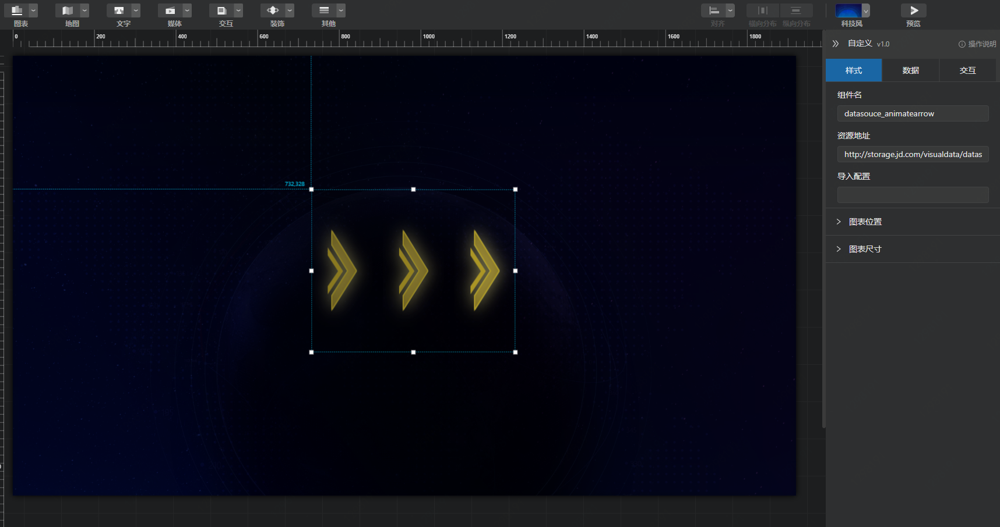

自定义组件的样式设置包含：组件名、资源地址和导入配置

在实际使用中，必须保证组件名和资源地址对应的资源名称一致，否则将无法识别。

同时资源链接中的js规范必须遵循莫奈studio代码规范，详情请联系ERP: wuxiaolong20

导入配置中，允许用户通过写代码实现对资源地址中js配置的修改。

# 开放平台

## 什么是开放平台？

​	莫奈开放平台是京东城市自主研发的数据可视化组件快速搭建平台，它预置了一套具有一定完备性、支持快速开发、组装和部署组件到莫奈产品的体系。基于能力开放的要求，进一步简化服务的复杂性，在保障安全稳定的前提下，向合作伙伴提供能力或者聚合合作伙伴的优质能力，形成莫奈产品生态链，为莫奈提供底层服务。基于开放平台的统一标准服务，开发者可以通过获得平台有关资源、信息、数据、安全等方面的专业化支持，开发自己的组件。

## 为什么要有开放平台？

#### （1）变化莫测的客户需求对标准数据可视化工具的要求越来越高。

​	在数据可视化项目交付落地过程中，往往会遇到非常多定制化要求极高的需求，这些需求往往开发周期长、交付时间紧，项目组在使用莫奈标准版产品或者莫奈行业版中无法实现这些交付需求，因此需要莫奈开发者对需求进行评估并对组件做升级或者新增。莫奈官方开发者的开发资源是有限的，而随着团队承接的项目越来越多，对于客户的支持就不再能保证足额的时效性，因此，亟需开放莫奈能力，让更多的开发者加入到莫奈组件打造的进程中，以满足客户源源不断的新需求。

#### （2）各项目之间定制化开发组件互通性差

​	以往各项目组做的定制化开发组件，往往都只限项目组内使用，这导致很多制作精良的组件无法被更多人使用，而当有类似的需求出现时，由于信息不互通，项目组往往会出现重复开发的问题。因此亟需一个平台，让所有用户都能互通有无，各项目组新增的组件都应该与莫奈生态中其他的使用者共享，提高自定义组件的复用率，减少重复开发造成的时间和人力成本。

#### （3）开放、合作、共荣是互联网实现业务创新的大趋势

​	莫奈开放平台旨在为开发者提供一个规范、合作、创新、能够实现各自价值的开放社区平台。通过能力的开放吸引合作伙伴入驻，通过合作共建，可以让产品越走越好。

## 产品应用场景

#### （1）第三方开发者通过莫奈开放平台打造组件满足项目需求

背景介绍：某市一数据可视化大屏产品选用莫奈作为工具进行搭建，在与客户进行需求确认时发现有需求莫奈当前功能无法实现。

解决方案：项目组中的产品经理充分理解需求，画出原型给到前端开发人员，前端开发通过莫奈开发平台定制化开发新组件，并上传至组件集市，由配屏人员添加到编辑器中并完成配屏交付。

#### （2）用户通过组件集市获取其他第三方开发者发布的组件并交付项目

背景介绍：某市一数据可视化大屏产品选用莫奈作为工具进行搭建，在与客户进行需求确认时发现有需求莫奈当前功能无法实现，但是在组件集市中发现了能满足需求的其他项目组开发的组件。

解决方案：在组件集市中，将已有的第三方组件添加到编辑器中，并完成配屏交付。

## 怎么使用开放平台？

### 开发者指引

​	莫奈开放平台提供了完备的开发者指引，任何个人开发者都可以通过开发者手册的教程学会莫奈组件搭建过程，并能自主开发组件。对于开发者而言，只需要少量的时间对莫奈开发插件进行学习，就可以开始开发自己的组件并支持项目。

​	点击开放平台首页开发者手册按钮，即可进入开发者指引页面：

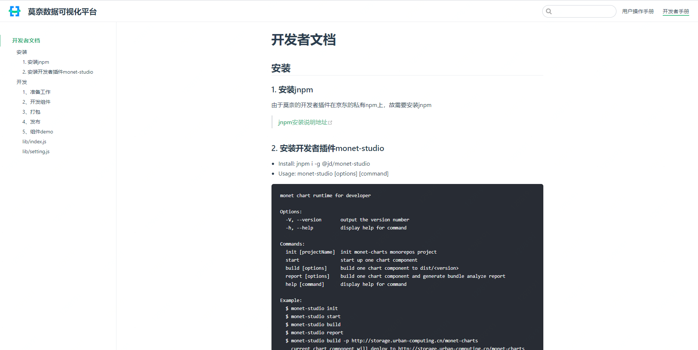

### 组件集市

​	莫奈开放平台的组件集市为用户提供了一个对开发者已发布的组件进行浏览和添加的入口，用户可以在组件集市浏览已有组件，与第三方开发者进行互动，减少了重复开发相同组件的可能，提高了组件复用率。


#### 组件浏览

​	组件集市为用户提供了一个已发布的自定义组件的浏览，让用户可以通过组件集市迅速找到符合自己需求的组件。

#### 组件添加

​	在组件集市能够看见的所有自定义组件，都可以通过点击进入二级页面，并浏览当前组件的详细介绍，如果用户觉得符合预期，可以直接添加到我的组件空间，并由莫奈标准版可视化编辑器中拖入到编辑器。

### 我的组件

​	我的组件模块为用户提供了一个能够快速查看已被添加到个人编辑器组件的入口，用户可以在该模块对已经添加到编辑器的自定义组件进行查看和管理。

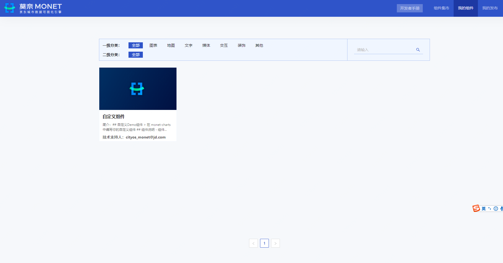

#### 组件管理

​	与组件集市类似，我的组件模块提供已添加组件的浏览和删除，允许用户对已添加的组件进行删减。

### 我的发布

​	我的发布模块是主要面向开发者的模块，在这个模块，用户主要可以对新开发的组件进行上传和更新，同时，可以对个人已经发布的组件进行查看。

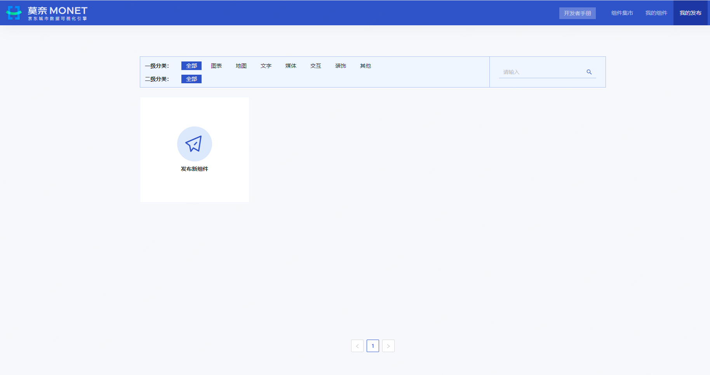

#### 新增发布

​	新增发布模块允许用户对已打包的组件进行发布，在发布中，需要提供组件的：名称、技术支持人、组件类型、组件包、预览icon、组件封面和简介，上传后组件就可以在组件集市和我的发布中浏览到。

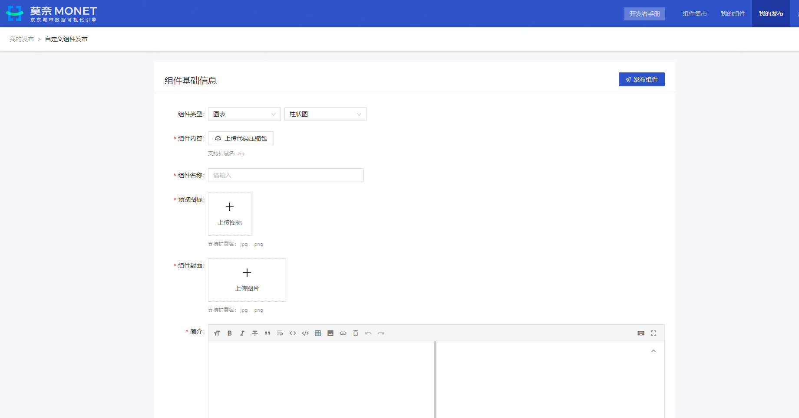

#### 浏览我发布的组件

​	与组件集市类似，我的发布模块提供该用户已发布组件的浏览功能。