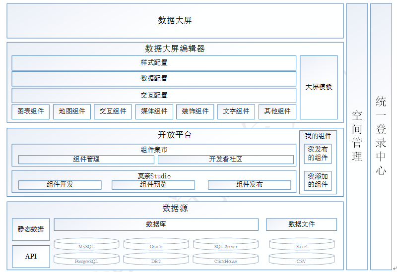

# 产品架构

产品功能架构如下图所示：

京东城市莫奈标准版如上图所示，主要包括数据源、开放平台、数据大屏编辑器、数据大屏、空间管理、统一登录中心六个部分。

数据源：支持结构化数据源的连接，支持关联Oracle、SQLServer、MySQL等主流数据源，支持Excel、CSV、JSON等文本类型文件直接作为数据源导入，极大程度解决了客户多年所累积的日志、报表等文件梳理难的问题。

开放平台是基于莫奈Studio插件作为底层，配合为开发者提供的开发者指引，为开发者提供了组件的开发、预览和发布能力。被发布的组件会进入组件集市，组件集市除了为用户提供了组件的浏览和添加能力外，还为开发者提供了相应的社区功能，让优秀的组件和优秀的开发者得到更多的关注。同时，所有用户/开发者也可以在“我的组件”查看自己发布或者添加的组件。

数据大屏编辑器：支持7大类目，60+组件及各类行业通用型大屏模板供选择，提供配置组件样式、数据、交互的配置面板。通过样式面板可以配置组件的图表尺寸、位置、颜色和其他属性样式；通过数据面板可以配置组件所使用的数据源；通过交互面板可以配置组件之间的交互事件。

数据大屏：将布局搭建完成的实时数据可视化大屏内容进行全方位展示。

空间管理：对项目空间进行管理，隔离不同空间下的大屏。

统一登录中心：支持对接不同的登录体系，满足系统集成的需求。