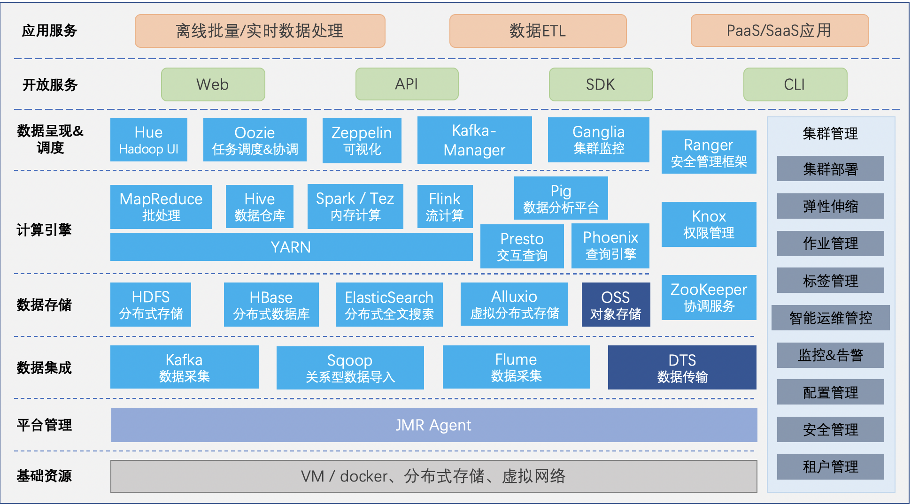

# 产品概述

京东云弹性MapReduce（简称JMR）是一个管托集群平台，是运行在京东智联云平台上的一种大数据处理的系统解决方案，帮助您快速构建分布式数据分析系统。

## 简介

京东云弹性MapReduce结合云技术构建在云主机之上，基于开源的Apache Hadoop和Apache Spark，让您可以方便地使用Hadoop和Spark生态系统中的其他周边服务（例如，Apache Hive、Apache Pig和Apache HBase等），您可以通过云端在数分钟内创建安全可靠的专属 Hadoop 集群，进行安全、低成本、高可靠、可弹性伸缩的大规模分布式数据处理和海量数据的分析。同时，JMR还可以方便的与京东云其他的云数据存储系统和数据库系统进行数据传输（例如，OSS和RDS等）。

## 功能特性

- 弹性 MapReduce 提供了强大的扩展能力和弹性伸缩能力，解决了Hadoop安装部署成本和管理复杂性等问题，可以让您不必关注基础架构管理，而更加专注数据分析、处理和应用本身，任何的开发者或者公司只需要较低的成本就可以进行大规模的数据分析和处理工作；
- 弹性 MapReduce 的组件源于开源社区，您可以将现有的大数据集群无缝平滑迁移至京东云上。弹性 MapReduce 产品中集成了多款常用的组件，包括但不限于 Hadoop、Hive、HBase、Spark、Presto、Sqoop、Hue、Tez、Oozie 等，可以满足您对大数据在线业务、离线数据仓库、实时流式计算等全方位场景的需求；
- 弹性 MapReduce 无缝集成了京东云对象存储（OSS）服务，您可将原本存储于 HDFS 中的文件放置在可无限扩展、存储成本低且高可靠的 OSS 中，实现计算存储分离。依托于 OSS，您可以在需要的时候创建集群，并在任务完成后销毁集群。与此同时，您无需担心数据的丢失。按需创建的集群，可以大幅度降低您的大数据处理成本；
- 弹性 MapReduce 定义了3种节点类型：Master 节点、Core 节点、Task 节点。各类型节点作用，请参见 [节点类型说明](./Node-Desc.md)。

## 产品架构

产品架构如下图所示：

从上图可以看出，弹性 MapReduce 集群是基于Hadoop的生态环境、运行在京东云IAAS的基础服务之上，构建的大数据基础服务平台，包含目前主流的大数据基础及管理服务。在服务平台层之上，使用Web/API/SDK/CLI等方式提供对外服务；基于JMR平台，可以运行各类大数据应用。同时，可以与对象存储OSS进行无缝数据交换；与云数据库等云服务进行对接，方便您将数据在多个系统之间进行共享和传输，以满足不同业务类型的访问需要。
