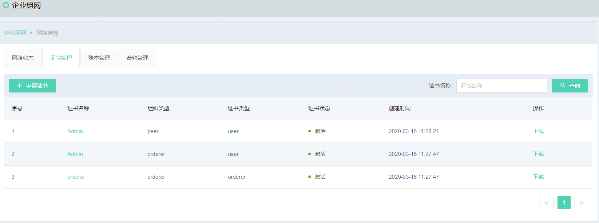
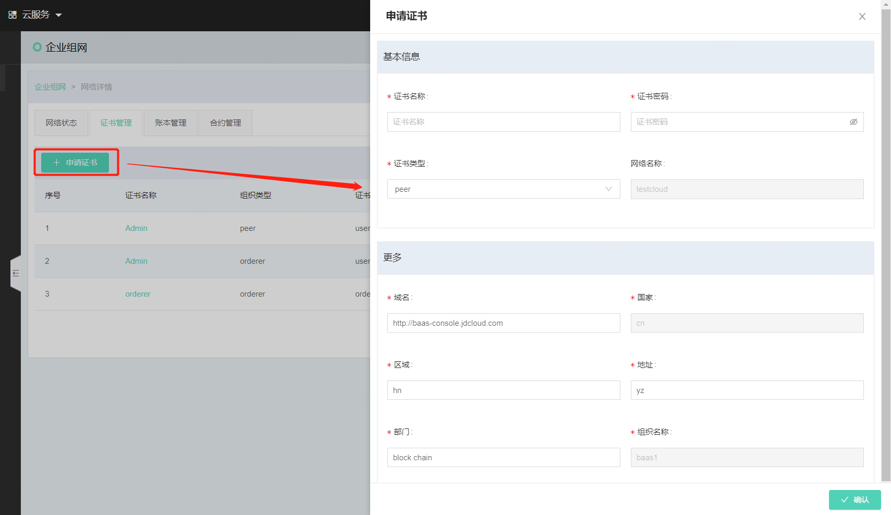
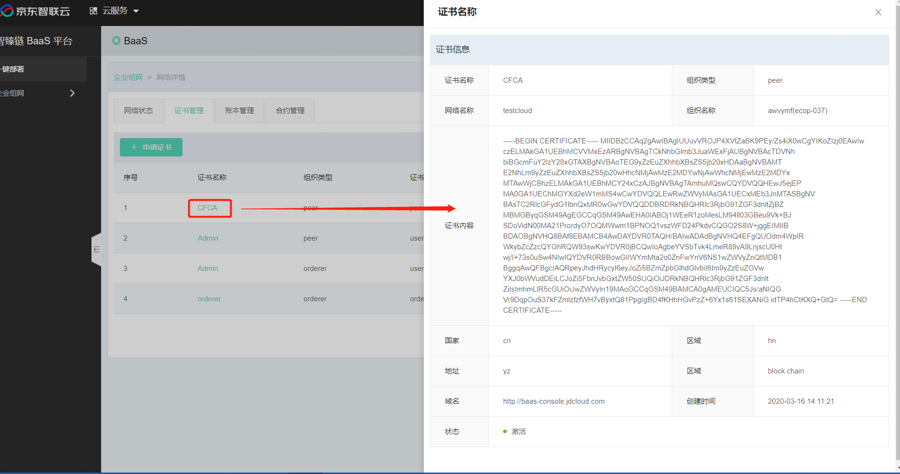

# 证书管理
在京东云版本中，区块链网络创建完毕后系统会自动申请创建网络所必要的基本证书。打开证书管理Tab页即可看到所有证书列表，在此页面可以查看证书详情或者下载证书，如要新申请证书，需要在证书管理Tab页上点击**申请证书**按钮，即可申请。同时，可以输入证书名称，点击**查询**按钮，查询符合名称要求的证书。

证书申请页面分为基本信息和更多信息部分，具体展示如下：

此页面字段说明如下：

|参数名|	必填项|	规则|
|----------|:----------:|------|
|证书名称|	是|	可以输入证书名称，必须英文，不超过20|
|证书密码|	是|	证书密码，数字输入|
|证书类型|	是|	现只可选择用户类型，用于通过SDK发起交易时的用户凭证 |
|域名	|是|	如有域名的特殊要求，可以写入域名|
|区域	|是|	有特殊的区域要求，可以输入区域信息|
|地址|	是|	有特殊的地址需求，可以输入地址信息|
|部门|	是|	有特殊的部门需求，可以输入部门信息|

完成证书创建后，可以在列表页面查看到证书信息，在此页面，可以点击**详情**查看证书的详细内容。

同样，针对每一个证书，都有响应的操作权限，证书管理的操作权限仅为下载。点击**下载**按钮，可以下载证书内容至本地保存。