# 合约管理

智能合约做为应用和区块链交互的重要桥梁，也是JDT BaaS区块链技术服务能力的核心之一。利用JDD BaaS平台的合约管理功能，可以有效的管理上传、部署合约，同时进行版本的管理。点击合约管理页签，可以看到合约管理列表页面，在区块链网络创建不包含合约的创建，所以需要手工创建一个合约。同时该列表页提供合约查询功能，输入合约名称后点击*查询*按钮可以查询到符合条件的合约信息。

点击*安装*按钮，可以打开合约创建的页面。页面输入信息如下:

|参数名|	必填项|	规则|
|----------|:----------:|------|
|受邀人|	是|	选择一个受邀人，受邀人必须已经加入到合约创建的账本中。|
|账本名称	|是|	可选项，选择当前网络下的所有账本名称，合约将建立在所选账本下|
|合约名称|	是|	输入合约名称，只能英文输入，字符长度不大于20|
|合约版本|	是	|输入合约版本，只能数字输入，长度不超过5|
|参数|	是|	输入合约参数|
|合约文件|	是|	在本地系统中上传一个合约文件，要求文件必须为.zip格式|
|受邀人列表|	是|	当前登录账号下所有节点，选择合约在哪些节点生效|

为合约添加受邀人需要点击*受邀人*按钮，系统会将当前网络下的人员全部抓取并以列表显示。
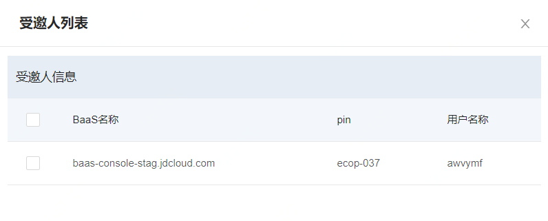

在此页面选择需要邀请的受邀人（包括自己）之后点击屏幕下方的*添加*按钮，即可完成账本人员的邀请。 如选错可以重新勾选去掉“√”标记。

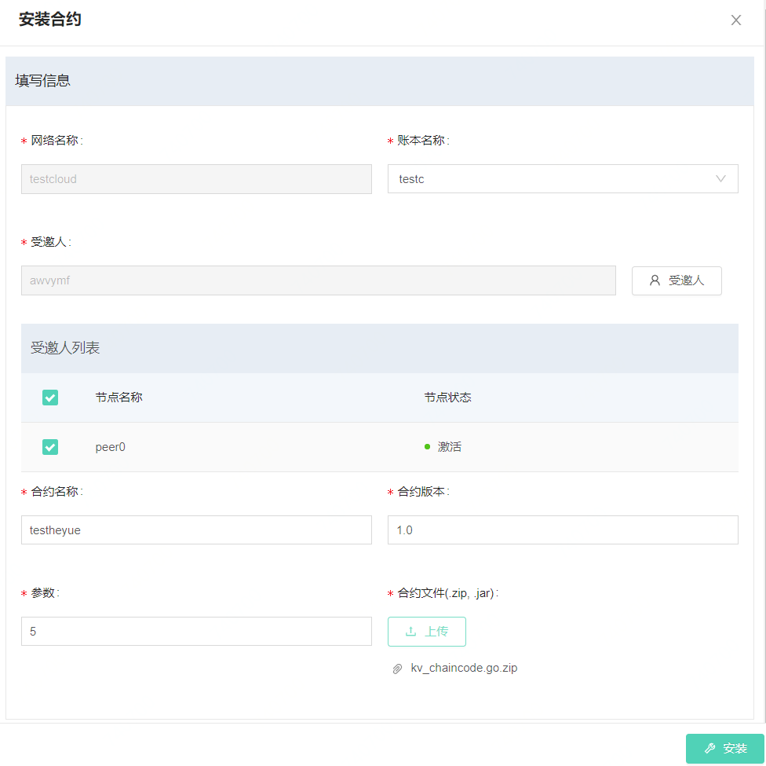合约上传必须是.zip文件，选择完毕文件后，系统会从本地将文件上传服务器，在出现下图所示状态时表示合约上传完毕。
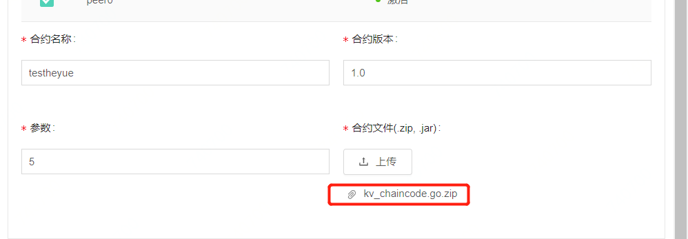

如要删除合约可以将鼠标移动至合约名称上，点击按钮进行合约删除。如无问题可以进行下一步安装，此时可以点击*删除*按钮进行安装操作。

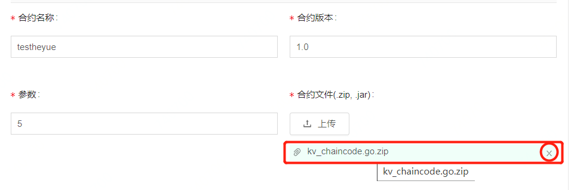
合约建立完毕后可以在列表页面查看，合约列表页面与区块链网络、账本一样，区分了不同的权限页签，方便用户快速找到自己需要的合约信息，下面将分页签介绍各个列表的功能和操作权限。

* **我创建的合约**：此页签下可以对本账号创建的合约进行查看，因为是合约的创建者，所以拥有较多的操作权限，合约的公开/隐藏、准入、更新、操作、节点信息均可以在此页面进行操作。公开和隐藏可以操作合约的状态，是否在该账本下所有参与方都可以看到并申请加入该合约。公开状态下的合约可以被查看并申请加入。
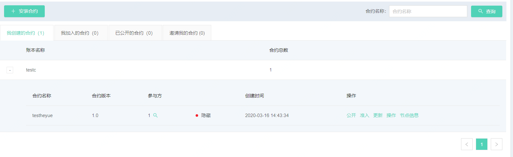

准入功能用来审核需要加入合约的组织，只有认为有必要的情况下，才会准入共同执行一段合约。准入页面打开后，可以看到申请人的姓名和公司，可以选择同意或拒绝对方加入该合约。
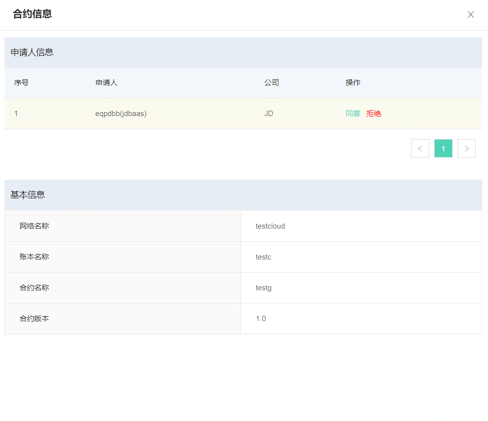

列表中点击按钮，查看参与方功能，此功能可以让用户快速知道合约的参与方信息。
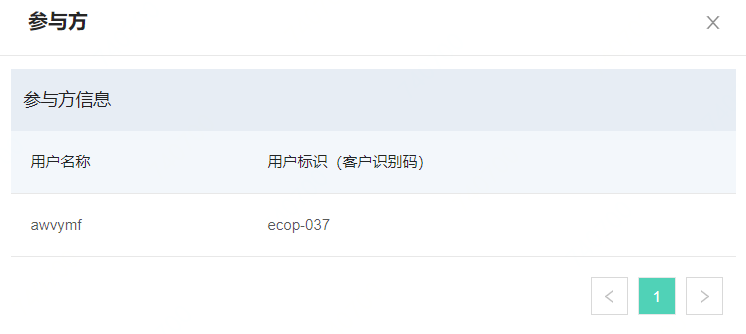

合约更新功能可以让合约的创建者随时更新合约内容，更新合约不必再次选择受邀人，只需更新合约名称、版本、参数及合约程序。
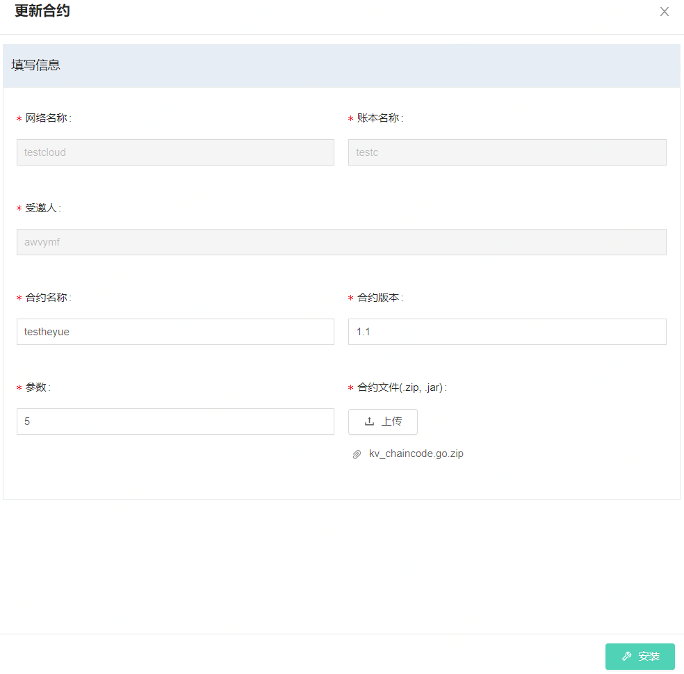

合约操作为系统提供一个合约的试调用过程，用户可以在页面中输入合约方法以及参数，系统会试运行合约，返回一个值。

节点信息功能可以让用户更方便的查看合约下的节点情况，目前提供order和peer的信息查询功能。

* **我加入的合约**：受邀请并且同意加入后，合约呼显示在此页面，在此版本中，自建合约也会显示在此页面中，此页面可以操作合约，对合约进行一个试调用。同时也会显示节点信息，保证用户查看合约节点情况。更新合约需要输入的信息如下：

|参数名|	必填项|	规则|
|----------|:----------:|------|
|合约名称	|是|	输入合约名称，只能英文输入，字符长度不大于20
|合约版本|	是|	输入合约版本，只能数字输入，长度不超过5
|参数|	是|	输入合约参数
|合约文件|	是|	在本地系统中上传一个合约文件，要求文件必须为.zip格式

对于安装完毕的合约，可以在此页面进行一个简单调用，输入对应的合约方法可以查看参数调用是否正确。合约操作为系统提供一个合约的试调用过程，用户可以在页面中输入合约方法以及参数，系统会试运行合约，返回一个值。

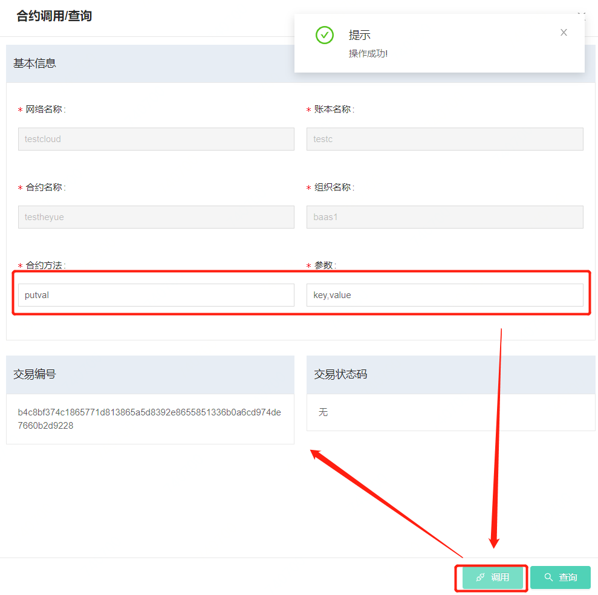

节点信息功能可以让用户更方便的查看合约下的节点情况，目前提供order和peer的信息查询功能。
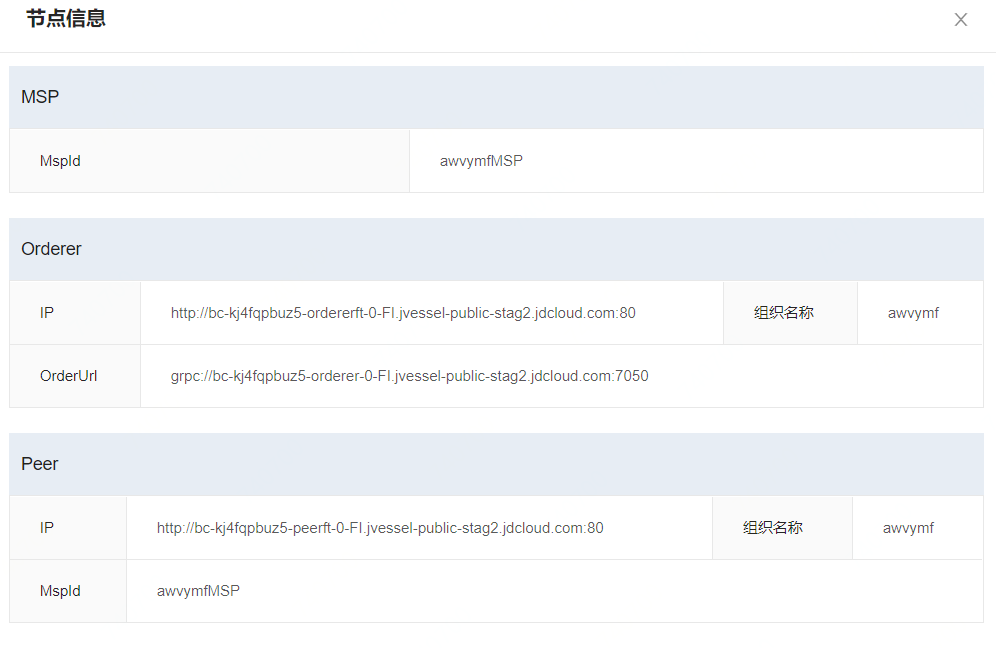

* **已公开的合约**：此页签下显示账本内所有已经公开的合约信息，对于不是本账号创建的合约可以申请加入，加入对于是本账号创建的合约只能查看节点信息。

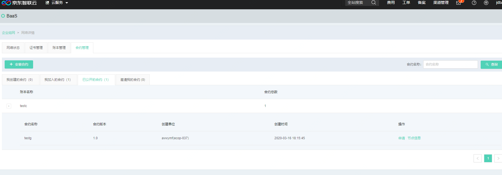

点击*申请*按钮后，可以看到合约详情页面，信息无误可以点击按钮，开始申请加入合约。

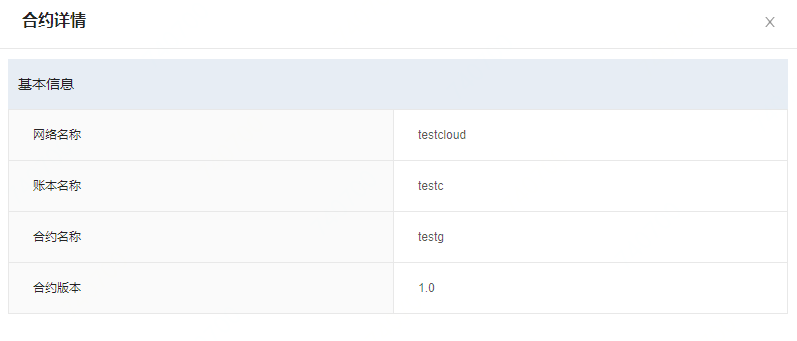

在合约创建方同意加入后，在已公开的合约页面可以看到操作按钮变为安装，点击按钮，可以打开合约安装页面。在合约安装页面中选择本账号下需要安装合约的节点，之后点击*安装合约*按钮，开始合约安装，安装完毕后，右上提示框会弹出提示，示意合约安装完成。

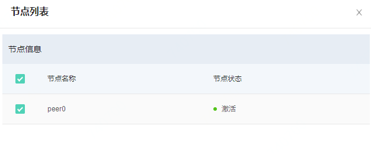

安装完成的合约会出现在我加入的合约中，具体操作可以参考上文。

* **邀请我的合约**：在邀请我的合约中，可以看到受邀请加入的合约，可以点击概览按钮查看合约信息，并决定是否加入，加入可以选择按钮，不加入可以选择按钮，加入后，合约信息将在已安装的合约中显示。

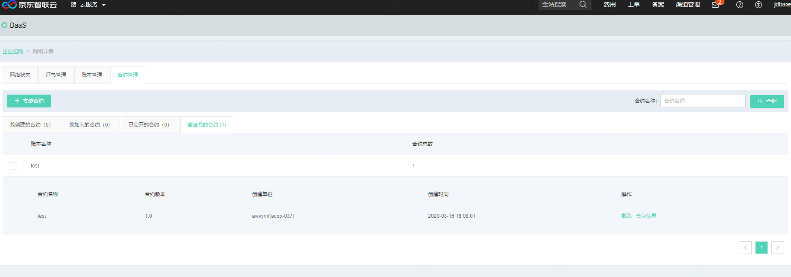

点击概览按钮后会弹出合约详情页面，此处需要选择为本账号下的哪些节点安装合约。
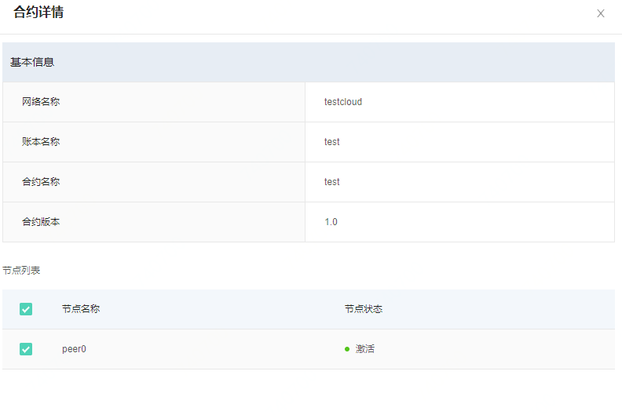

节点信息功能可以让用户更方便的查看合约下的节点情况，目前提供order和peer的信息查询功能。
