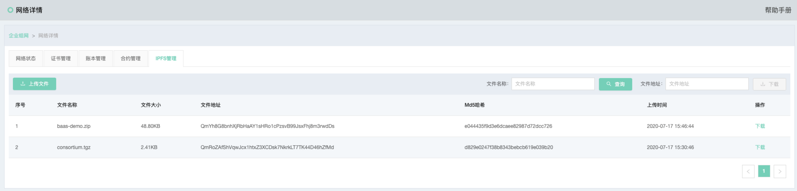

# IPFS管理
IPFS管理用于当前用户管理名下上传的大文件。

> 该功能仅限安装了IPFS模块的网络

## 文件列表
文件列表中列出了当前用户往IPFS网络中上传的所有文件，相关字段解释如下：

* 文件名称：文件本地上传时的名称
* 文件大小：文件大小，动态根据文件大小切换显示单位
* 文件地址：文件在IPFS网络中的唯一标识
* Md5哈希：文件的MD5哈希值
* 上传时间：文件上传时的系统时间
* 下载：提供文件下载功能

## 上传文件
管理员可通过**上传文件**按钮，打开文件上传窗口，如下：

选择本地文件，即可将文件上传至IPFS网络。

> 注：单文件大小不得超过100M
