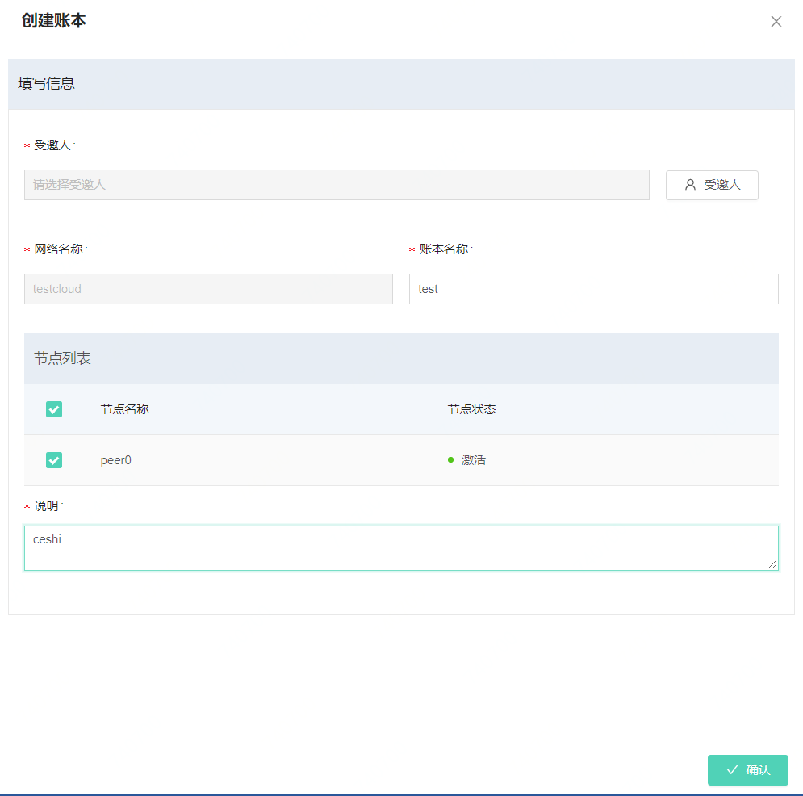
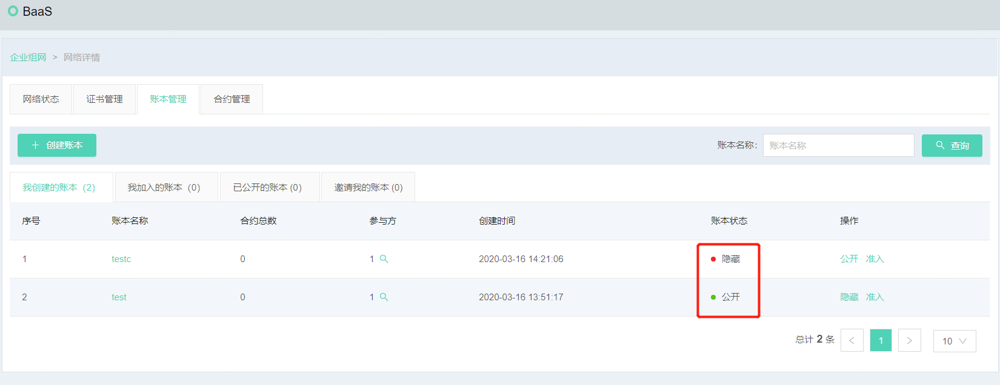
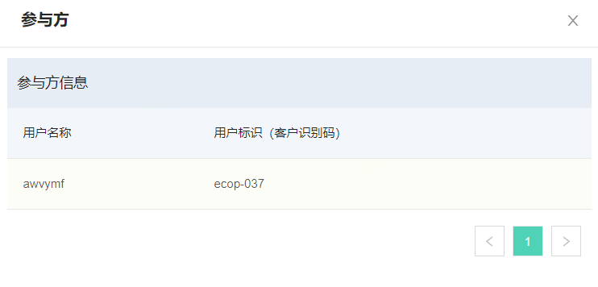
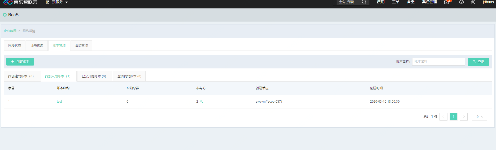
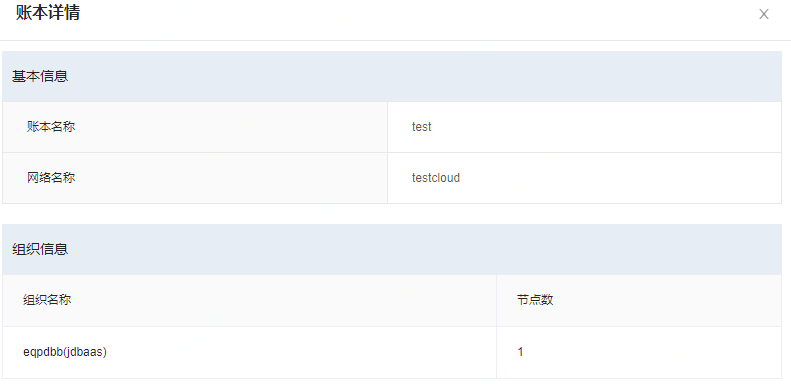
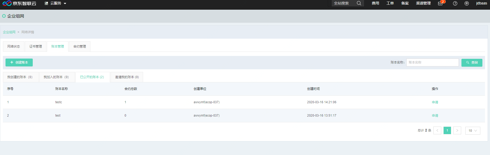
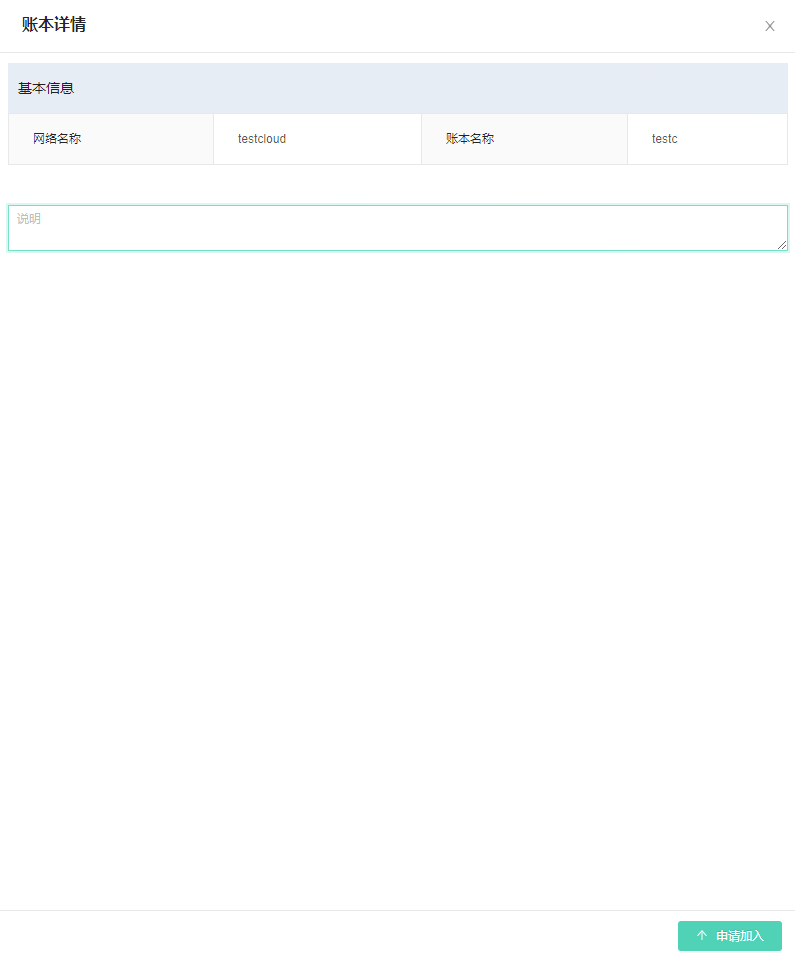
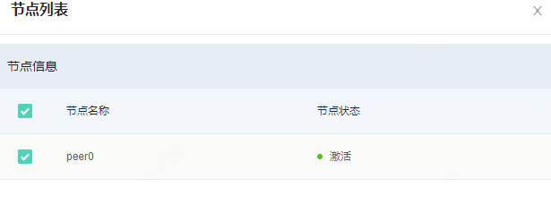
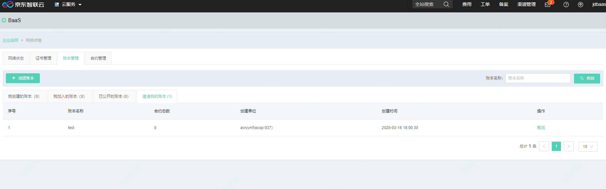
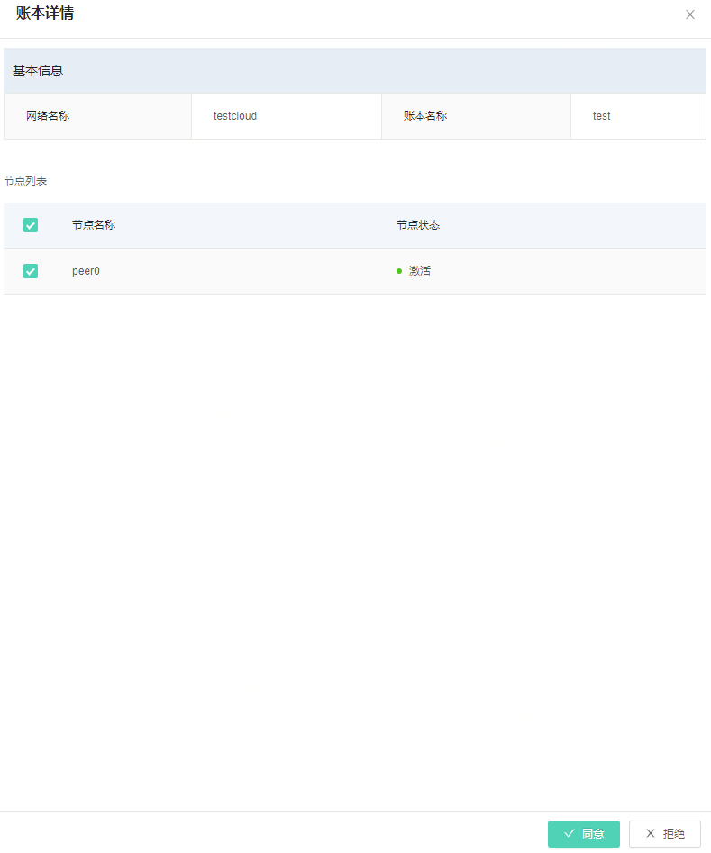

# 账本管理

账本管理是区块链服务中的一项基本服务，账本管理可以帮助用户创建、加入、邀请加入、以及对账本的一系列操作，在每个区块链网络中都有账本管理的tab页面。首次进入时需要创建账本，点击**创建账本**按钮即可进行账本的创建，创建账本需要输入的信息如下:

|参数名|	必填项|	规则|
|----------|:----------:|------|
|受邀人	|是	|选择一个受邀人，受邀人必须已经加入到创建账本的区块链网络中|
|账本名称	|是	|输入账本名称，只能英文输入，字符长度不大于20|
|账本说明	|是	|中文或者英文账本说明，字数不超过200|
|节点列表	|是|	选择同网络下同步账本的节点|

账本创建时需要进行人员邀请，点击**受邀人**按钮，系统会将当前网络下的人员全部抓取并以列表显示。

在此页面选择需要邀请的受邀人（包括自己）之后点击屏幕下方的**添加**按钮，即可完成账本人员的邀请。 如选错可以重新勾选去掉“√”标记。

账本创建的页面如下，输入完毕所有信息后，可以点击**确认**按钮完成账本的创建。创建成功后右上角会有创建成功的提示。

账本创建后，可以在账本列表中查询相关信息，账本列表与区块链网络列表一样，进行了详细的Tab页面区分，为了方便查看，以下根据不同的Tab页进行列表功能的详细描述。

* **我创建的账本**：我创建的账本列表，可以对账本进行一些授权操作，包括公开/隐藏、待办。公开/隐藏功能可以控制账本是否在区块链网络中都可见。待办功能可以同意其它同加入账本的申请。同时点击**参与方**按钮，可以查看当前账本的参与节点。

在列表页面点击**参与方**按钮，可以查看当前账本的参与节点。

在列表页面点击**详情**按钮，可以查看账本基本信息。

待办功能可以对申请加入账本的节点进行审核，当有申请加入的节点时，点击准入按钮，右侧弹开页面中可以查看申请信息。

此页面可以对申请加入账本的节点进行审核，同意按钮表示同意节点加入，拒绝按钮表示拒绝节点加入。无论哪个按钮，点击并操作成功后，系统右上角会弹出提示。

* **我加入的账本**：在我加入的账本下可以查看账本信息，点击账本名称链接，同样可以进入账本查看详情信息。

* **已公开的账本**：账本创建者在创建完成账本后，对账本进行公开操作，公开的账本在相同网络下可以查看。

已公开的账本下，可以申请加入一个公开账本，点击申请按钮，右侧弹出界面，可以查看账本的基本信息。输入说明后，点击**申请加入**按钮，可以申请加入账本。

在对方同意申请时，此处按钮会变为**加入**，点击加入按钮，选择本账号下需要加入的节点后点击**加入**按钮，即可加入账本。

点击**加入**按钮后，如加入成功，右上角会提示成功。

* **邀请我的账本**：账本的创建者在创建账本时，或者在账本创建后。可以邀请同网络下的其它成员加入账本。受邀人员在“邀请我的”Tab下可以看到受邀信息。点击概览按钮，可以查看邀请信息。
* 

如确定是否要加入账本，如要加入，点击概览按钮，查看加入账本标签页，可以点击**同意**或者**拒绝**按钮加入或者拒绝加入账本。同时需要选择本账号下的节点，选择哪些节点加入到这个账本中。

