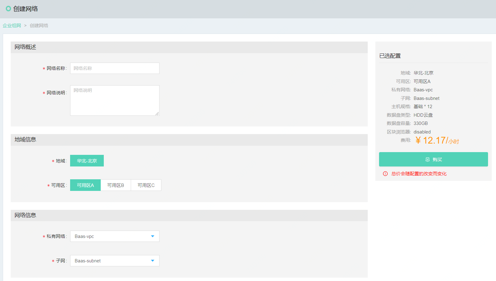
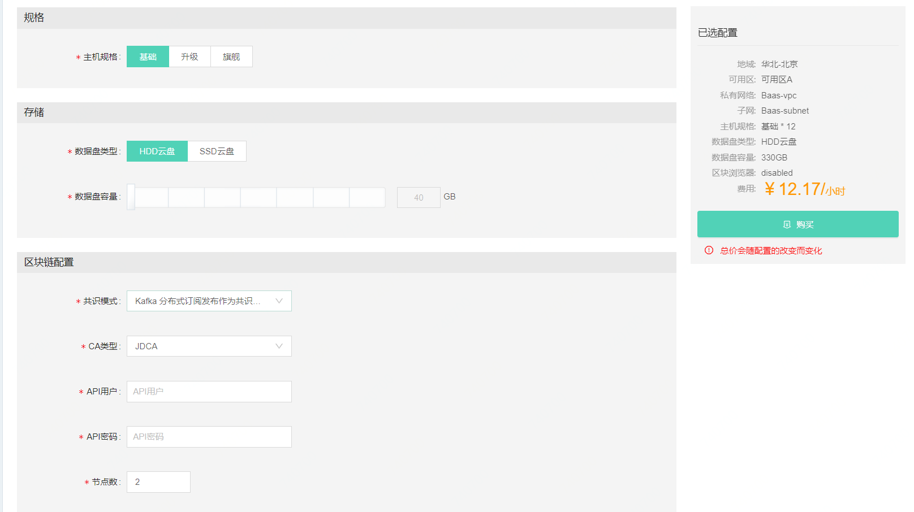
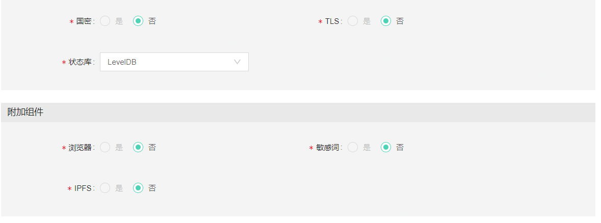
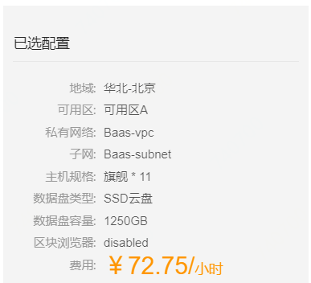
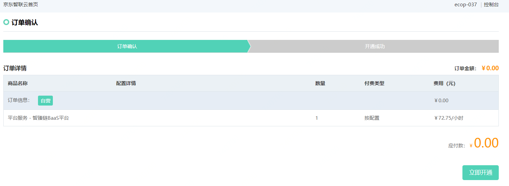
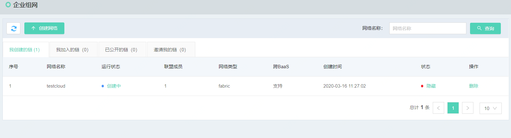
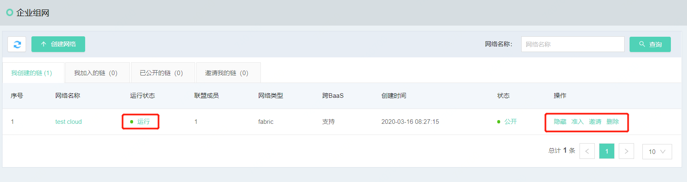
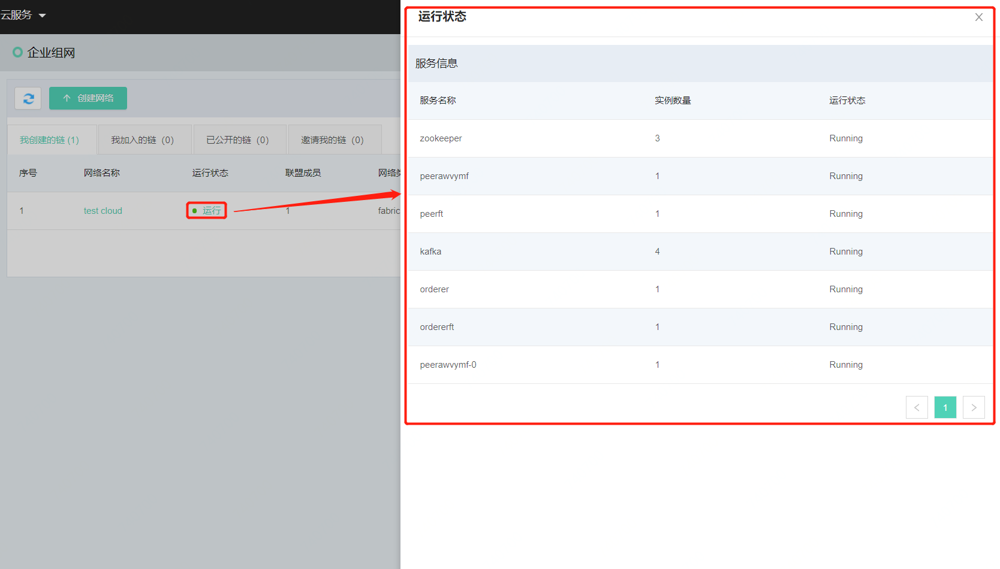
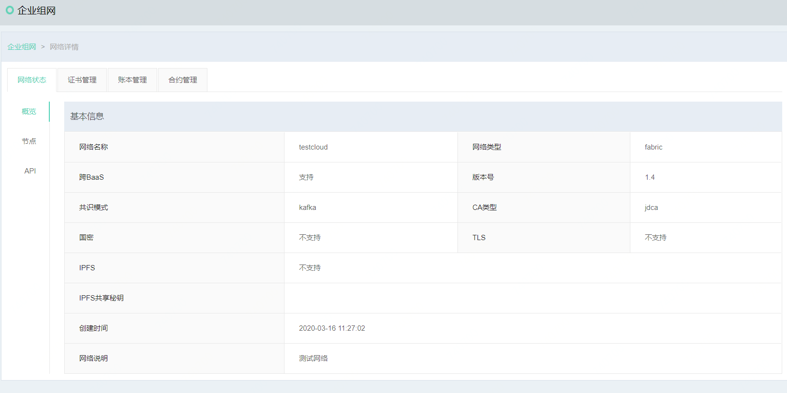

# 区块链网络创建
在企业组网页面中，联盟链的创建已经成为BaaS类平台必备的功能之一，因此，更加便捷易懂的组网流程也是BaaS平台的核心竞争力。在网络操作者登录系统后，进入区块链管理页签，点击*创建网络*按钮，即可开始联盟链的创建。具体创建页面如下图。在创建网络后，可以开始邀请或者受邀加入网络。

创建网络需要填写信息包括7个部分，从上至下分别为网络概述、地域信息、网络信息、规格、存储、区块链配置、附加组件。每一部分需要输入不同的信息，保证整个信息的完整性。具体参数输入的规则如下表:

| 分类 | 参数名 | 必填项 | 规则 |
|----------|----------|:------:|--------------------------------------------------|
| 网络概述 | 网络名称 | 是 | 网络名称只得包含小写字母与数字，且不能以数字开头 |
| | 网络说明 | 是 | 中文或者英文，长度不超过200字 |
| 地域信息 | 地域 | 是 | 选择服务器所在地域 |
| | 可选区 | 是 | 选择该地域下可用的服务器区域 |
| 网络信息 | 私有网络 | 是 | |
|  | 子网 | 是 | |
| 规格 | 主机规格 | 是 | 可选主机规格，根据所选规格的不同，在右方显示详细配置 |
| 存储 | 数据盘类型 | 是 | 可选HDD与SSD云盘 |
|  | 数据盘容量 | 是 | 选择数据盘容量，最小40，最大400 |
| 区块链配置 | 共识模式 | 是 | 目前支持基于Fabric的Kafka |
| | CA类型	| 是 |	目前支持JDCA，京东智臻链证书|
|  |	API用户	| 是| 用来调用API接口的用户名称，应用系统调用时需要使用该用户调用|
| |	API密码	|是|	API用户的密码，文字与字母组合|
||	节点数|	是|	本端设定的区块链共识节点数|
||	国密|	是|	选择是否支持国密算法，目前版本暂不支持|
||	TLS|	是|	选择是否支持TLS，目前版本暂不支持|
||	状态库|	是|	LevelDB和couchDB 中选择一项|
|附加组件|	浏览器|	是|	选择是否启用浏览器功能，目前版本暂不支持|
||	敏感词|	是|	选择是否启用敏感词功能，目前版本暂不支持|
||	IPFS|	是|选择是否启用IPFS功能，目前版本暂不支持|

在填写完毕所有信息后，可以在右侧看到系统信息及价格，信息确认无误可以点击*购买*按钮，进行下一步配置。

点击按钮后，进入信息确认页面，此页面分为两个步骤，分别是订单确认与开通成功页面，在订单确认页面中可以确认订单金额信息。确认无误后点击*立即开通*按钮，完成确认步骤。

进入开通成功页面后，如账号中金额足够，系统会提示恭喜开通成功的提示，之后页面会在5秒后自动跳转回网络列表页面。

在网络列表页面中，可以查看到网络状态，当运行状态变为“运行”且后端操作按钮全部出现时，网络创建成功。

此时点击运行按钮，可以查看节点运行状态:

网络创建完毕后，可以点击网络名称链接，进入网络详情页面:

