# 企业组网网络列表
如上文所述，企业组网可以帮助用户在京东云版的BaaS平台中创建一条联盟链网络，联盟链是目前最广泛的一种区块链网络搭建形式，可以结合多个节点，使这些互不授信的节点组合起来，在同样的规则下传递可信的数据信息。JDD BaaS平台为用户提供便捷的联盟链组建、配置页面，让用户能够像“拉朋友圈”一样快速增减区块链网络内节点。

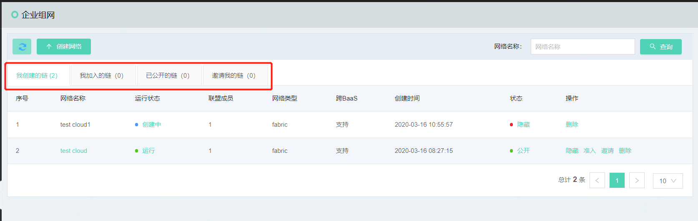

联盟链的展示分为4个tab页，每个tab页的展示信息不同，具体如下:

* **我创建的链**：默认展示界面，由当前账号创建的链全部在此tab页下展示，此页面下，对链的操作权限也有不同。在此tab页下，可以对自己创建的区块链进行公开\隐藏、准入、邀请、删除操作，每项操作意义如下
	* 公开\隐藏：是否将链公开，如选择公开，使用JDD BaaS平台并接入互联网的企业都可以查看到该区块链网络的基本信息（基本信息指名称和创建单位，不包含业务信息），并可以申请计加入到该区块链网络中
	* 准入：点击准入后，可以在页面中查询申请加入链的信息，并根据申请信息决定是否运行伙伴加入此链。按钮表示同意加入网络，按钮表示不允许加入网络。任何按钮点击成功后，右上角均会弹出操作成功提示
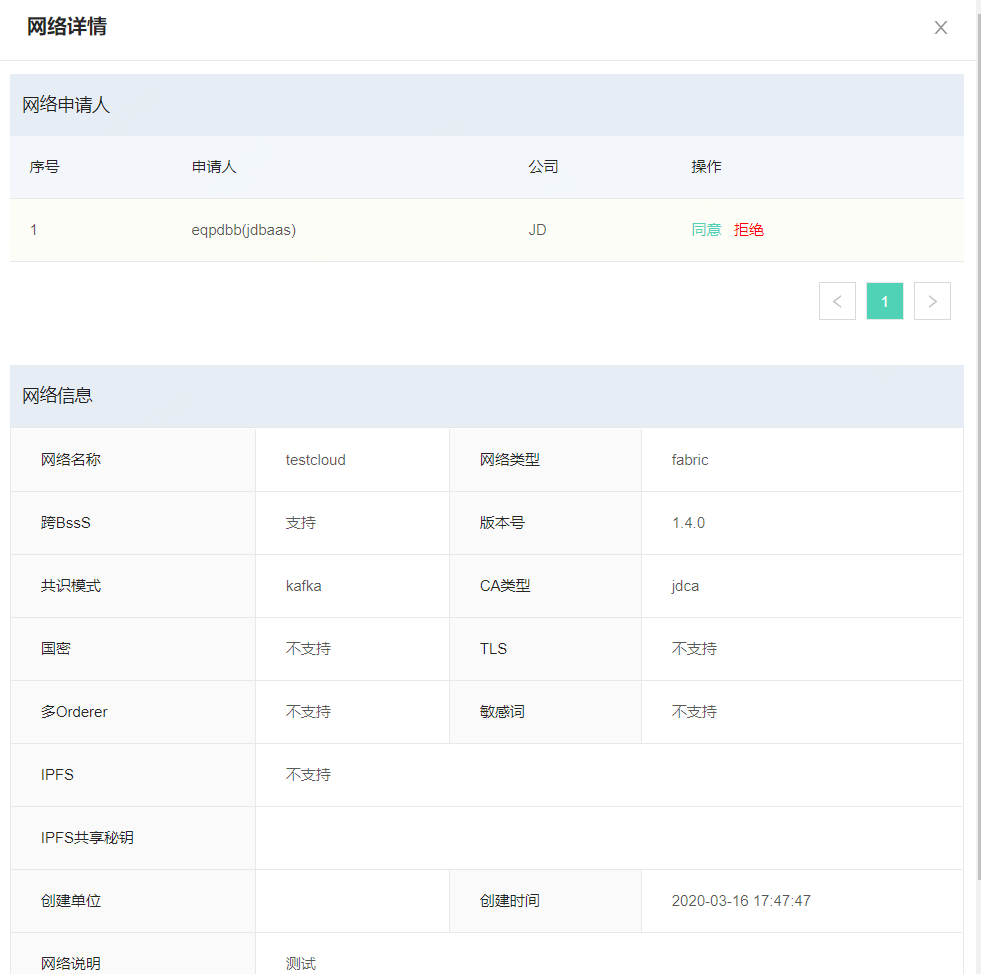
	* 邀请：在链的运行过程中，依然可以邀请新的合作伙伴加入区块链网络，此功能允许链的创建者邀请人员加入网络，点击后页面如下。
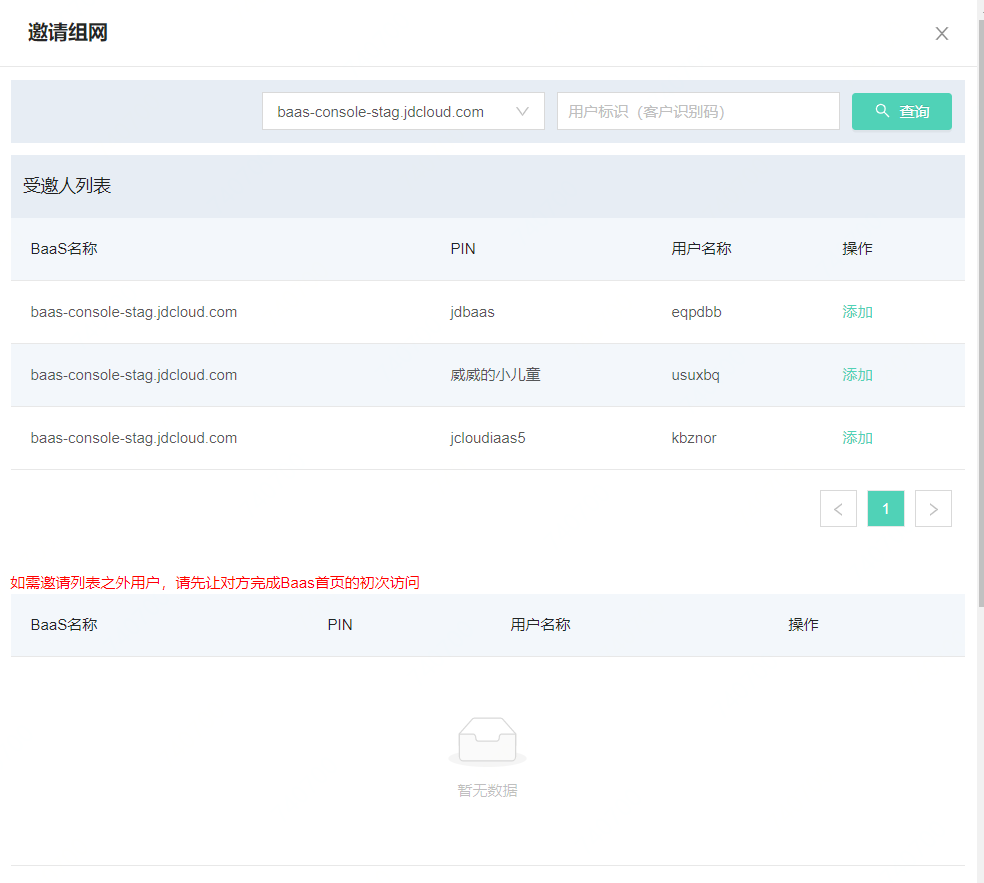进入页面后，系统中默认查出京东云网络中可以组网的节点，可以点击添加按钮进行邀请操作。添加后的人员出现在下方列表中。如邀请人添加错误，可以点击删除按钮删除该邀请人。此页面一次可以邀请多人。
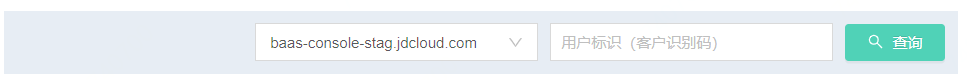如需要邀请特定人员，可以选择网络，之后输入用户标识（用户识别码）。之后点击*查询*按钮，查到的信息会出现在结果列表中，点击添加按钮进行邀请操作。
	* 删除：此按钮针对网络的创建者，可以将没有用处的网络删除，节省空间。注意，如果是网络发起者，那么需要所有参与方均退出网络后，才可以开始进行删除，否则删除网络不会成功。
* **我加入的链**：对于加入的区块链网络，可以在此tab页面下查看，并进入该区块链网络，查看更详细的信息。此页面中的网络，因不是账号登录这发起操作，因此没有过多的操作权限。
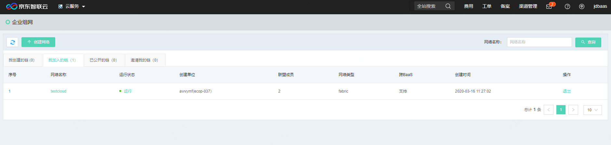此页面中仅可以对已经加入的网络进行“退出”操作，点击退出按钮，弹出页面中确认推出，即可退出当前网络：
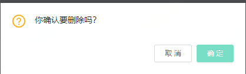
* **已公开的链**：对于点击了公开按钮的区块链网络，可以在此tab中查看，在此页面中，对于非登录账号创建的区块链网络，可以选择加入网络，如果区块链网络是本账号创建的，那么不会出现按钮。申请入网点击后，可以看到该网络的详细信息，确认无误可以点击申请加入按钮，申请加入网络。
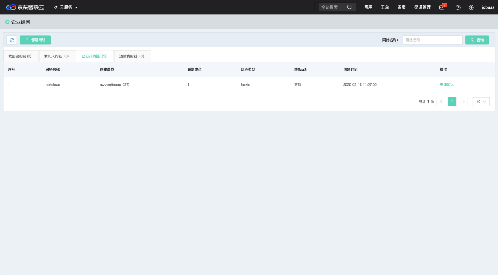点击申请加入按钮后，可以查看公开链的详细信息，确认无误后点击*申请加入*按钮，申请信息即发送至区块链网络发起方。
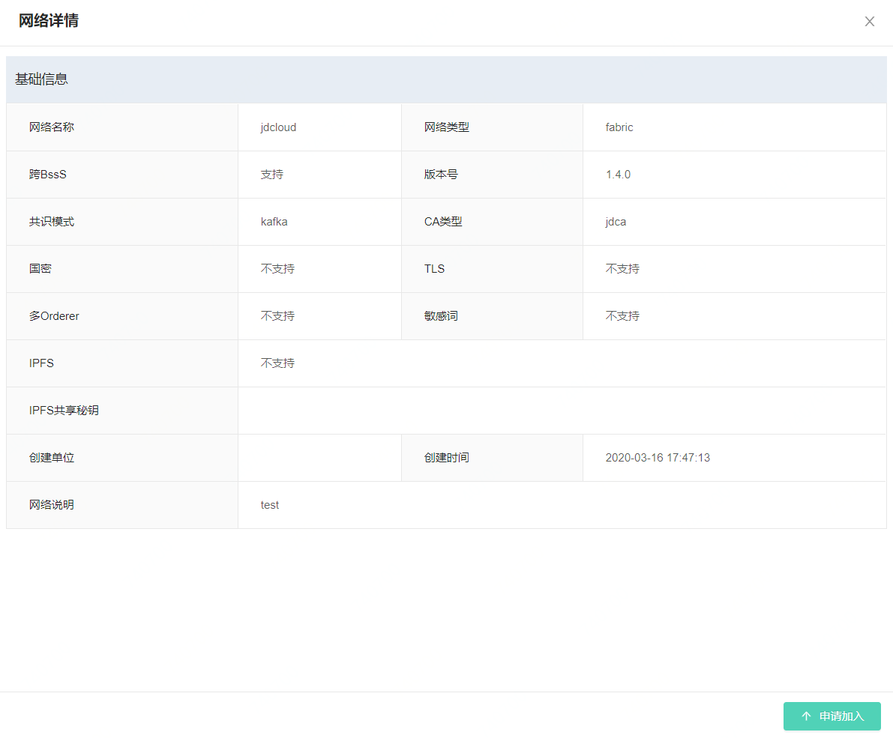
当区块链网络的创建方同意加入后，此页面操作按钮变为，点击按钮后，开始进入节点启动界面。与网络创建页面不同的是，节点启动页面会首先展示区块链网络基本信息，之后才会要求用户输入信息细节。
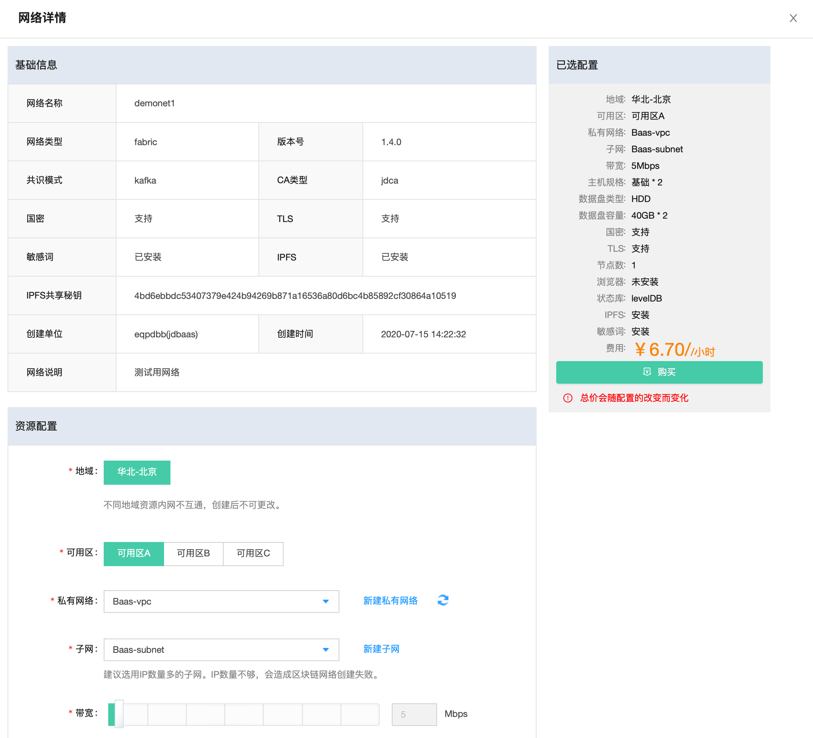
下端为申请加入链配置的信息，需要输入的项目如表：

| 分类 | 参数名 | 必填项 | 规则 |
|----------|----------|:------:|--------------------------------------------------|
| 地域信息 | 地域 | 是 | 选择服务器所在地域 |
| | 可选区 | 是 | 选择该地域下可用的服务器区域 |
| 网络信息 | 私有网络 | 是 | |
|  | 子网 | 是 | |
| 规格 | 主机规格 | 是 | 可选主机规格，根据所选规格的不同，在右方显示详细配置 |
| 存储 | 数据盘类型 | 是 | 可选HDD与SSD云盘 |
|  | 数据盘容量 | 是 | 选择数据盘容量，最小40，最大400 |
| 区块链配置 |	API用户	| 是| 用来调用API接口的用户名称，应用系统调用时需要使用该用户调用|
| |	API密码	|是|	API用户的密码，文字与字母组合|
||	节点数|	是|	本端设定的区块链共识节点数|
||	状态库|	是|	LevelDB和couchDB 中选择一项|
||	浏览器|	是|	选择是否启用浏览器功能，目前版本暂不支持|

输入不同的信息配置，右侧配置项中会详细显示价格。信息输入完毕后，点击*购买*按钮，开始进行购买操作。
点击按钮后，进入信息确认页面，此页面分为两个步骤，分别是订单确认与开通成功页面，在订单确认页面中可以确认订单金额信息。确认无误后点击*立即开通*按钮，完成确认步骤。
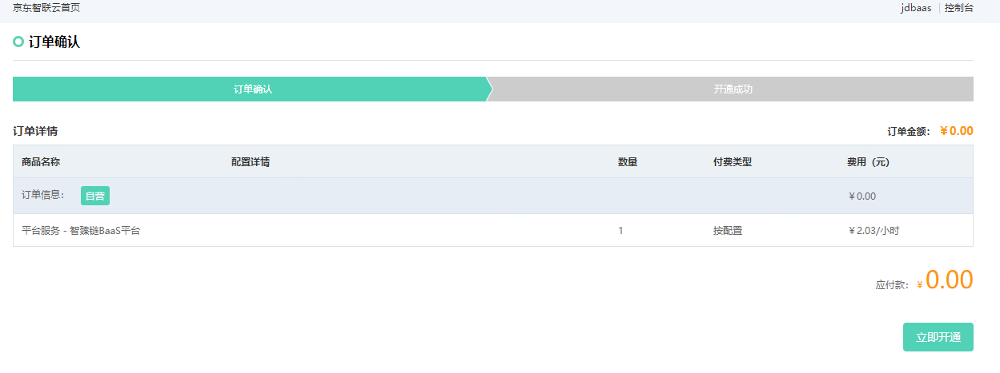

进入开通成功页面后，如账号中金额足够，系统会提示恭喜开通成功的提示，之后页面会在5秒后自动跳转回网络列表页面。

在我加入的网络列表页面中，可以查看到网络状态，当运行状态变为“运行”且后端操作按钮全部出现时，网络创建成功。我加入的链页面具体操作可参考前文“我加入的链”。注意，只有加入成功，才能点击区块链网络名称进入详细页面。
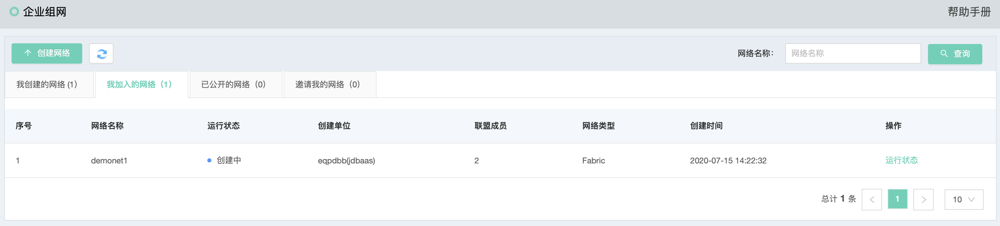

* **邀请我的链**：被邀请的情况下，此tab页中会展示邀请方区块链网络信息。可进行的操作有概览，当已经接受加入链或者拒绝加入后，页面清空。点击概览按钮后，弹出输入信息页面，此页面上端为区块链基本信息。

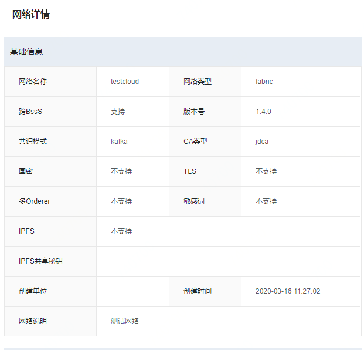

下端为受邀方配置的信息，需要输入的项目如表：

| 分类 | 参数名 | 必填项 | 规则 |
|----------|----------|:------:|--------------------------------------------------|
| 地域信息 | 地域 | 是 | 选择服务器所在地域 |
| | 可选区 | 是 | 选择该地域下可用的服务器区域 |
| 网络信息 | 私有网络 | 是 | |
|  | 子网 | 是 | |
| 规格 | 主机规格 | 是 | 可选主机规格，根据所选规格的不同，在右方显示详细配置 |
| 存储 | 数据盘类型 | 是 | 可选HDD与SSD云盘 |
|  | 数据盘容量 | 是 | 选择数据盘容量，最小40，最大400 |
| 区块链配置 |	API用户	| 是| 用来调用API接口的用户名称，应用系统调用时需要使用该用户调用|
| |	API密码	|是|	API用户的密码，文字与字母组合|
||	节点数|	是|	本端设定的区块链共识节点数|
||	状态库|	是|	LevelDB和couchDB 中选择一项|
||	浏览器|	是|	选择是否启用浏览器功能，目前版本暂不支持|

输入不同的信息配置，右侧配置项中会详细显示价格。信息输入完毕后，点击*购买*按钮，开始进行购买操作。
点击按钮后，进入信息确认页面，此页面分为两个步骤，分别是订单确认与开通成功页面，在订单确认页面中可以确认订单金额信息。确认无误后点击*立即沟通*按钮，完成确认步骤。

进入开通成功页面后，如账号中金额足够，系统会提示恭喜开通成功的提示，之后页面会在5秒后自动跳转回网络列表页面。

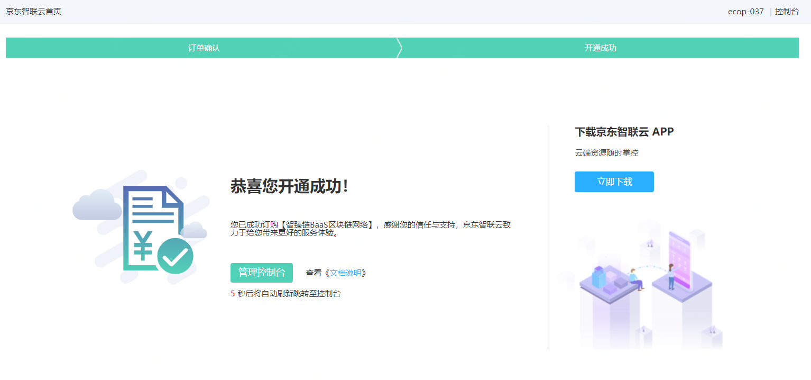

在我加入的网络列表页面中，可以查看到网络状态，当运行状态变为“运行”且后端操作按钮全部出现时，网络创建成功。我加入的链页面具体操作可参考前文“我加入的链”。注意，只有加入成功，才能点击区块链网络名称进入详细页面。
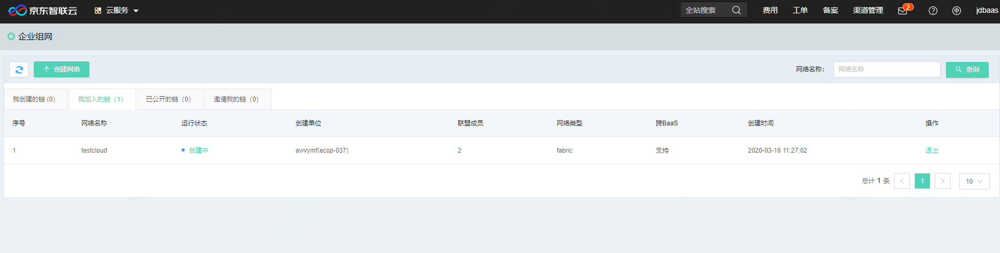