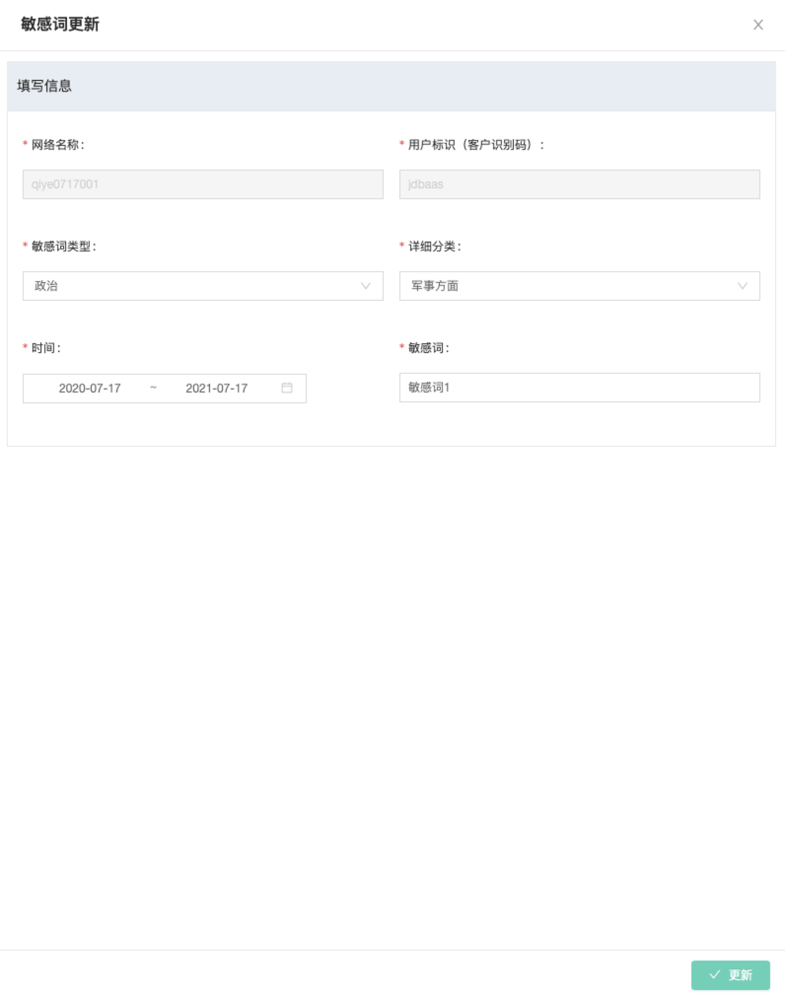
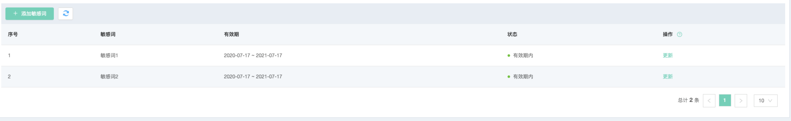
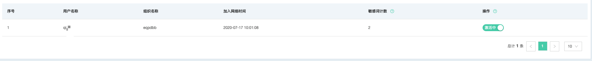
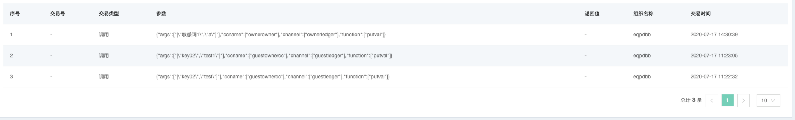
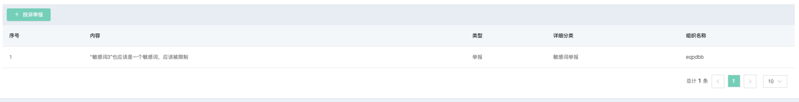
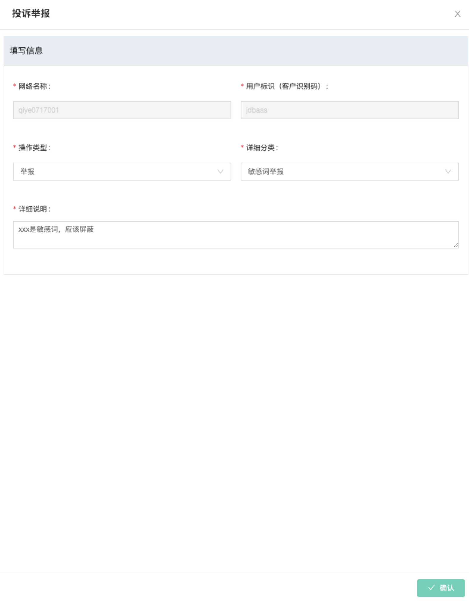
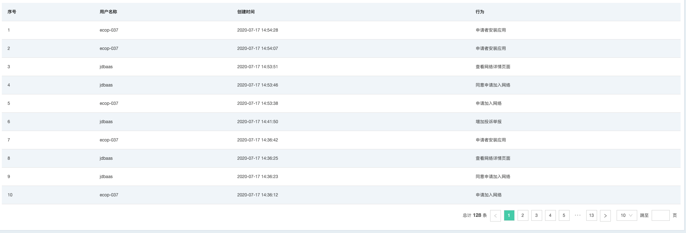

# 敏感词
为满足企业级应用对监管、审计的需求，智臻链区块链BaaS平台提供敏感词管理功能，支持敏感词交易过滤、黑名单及操作日志等功能。

## 敏感词管理
当前区块链网络的发起者（创建者）可以通过敏感词管理功能Tab进行敏感词管理，当前支持的操作有：**添加敏感词**及**敏感词更新**。

> 该功能仅限区块链网络发起者（创建者）

### 添加敏感词
管理员可通过管理界面中的**添加敏感词**按钮，打开敏感词添加界面，如图所示：

可选择的敏感词类型及分类如下：

* 政治
    * 军事方面
    * 机密内容
* 公共
    * 暴力倾向
    * 黄赌毒倾向

时间区间取值范围为（ 开始时间00:00:00, 结束时间23:59:59 )（开区间），默认时间跨度为1年。
> 如当前日期不在时间区间内，敏感词不会生效

### 敏感词列表
区块链网络中已存在的敏感词会以列表的形式展示，主要字段有：

* 敏感词：管理员添加的希望被过滤的词汇
* 有效期：敏感词对应的有效时间区间
* 状态：实时显示敏感词是否正被使用
* 操作：可用于更新敏感词相关属性

### 敏感词更新
用于二次更新敏感词属性，可更新的字段有：

* 敏感词类型
* 敏感词分类
* 敏感词有效期
* 敏感关键词

> 如想删除敏感词，可将敏感词有效期置于昨日之前
> 更新操作成功之后，敏感词过滤将于5分钟后生效

## 敏感词用户管理
敏感词用户管理主要用于列出当前网络中已经被监控的API操作用户（即网络创建及加入过程中填写的API用户）。

> 该功能仅限区块链网络发起者（创建者）

列表主要显示字段有：

* 用户名称：API用户名
* 组织名称：API用户归属的组织
* 加入网络时间：当前用户何时加入当前网络
* 敏感词计数：该用户在敏感词过滤功能开启以后，发起了多少次包含敏感词的交易
* 操作：用于将当前API用户挂起或激活

> 注意：
> 
> * 当敏感词计数大于100次时，系统自动将用户挂起，用户挂起后将不能发起交易。而管理员将用户重新激活后，敏感词计数清零，重新计数。
> * 当用户处于激活中状态可正常读写账本调用合约；当用户处于挂起中状态不可读写账本调用合约。

## 敏感交易管理
敏感交易管理用于列出被拦截的交易列表，用于管理员进行排查追责。

> 该功能仅限区块链网络发起者（创建者）

列表主要显示字段有：

* 交易号：交易前被拦截，显示*-*；交易后被拦截，显示交易号
* 交易类型：共有两种交易类型，调用 及 查询。对应到区块链的写或者读
* 参数：交易提交时的交易参数，如果交易后被拦截，参数显示*-*
* 返回值：交易执行后的返回值，如果交易前被拦截，返回值显示*-*
* 组织名称：标记是哪个组织发起的交易
* 交易时间：试图发起交易的具体时间

## 投诉举报管理
网络参与者可以对当前网络中存在的问题进行提出，供网络创建者决策。

可操作的具体类型有：

* 投诉
    * 业务投诉
    * 内容投诉
* 举报
    * 敏感词举报
    * 重大事务举报

    

## 操作日志管理
网络参与者在BaaS控制台的任意操作，都会被记录，用于支持审计功能。

> 该功能仅限区块链网络发起者（创建者）

现阶段记录数据字段有：

* 用户名称：当前京东云登录用户PIN
* 创建时间：触发该动作的具体时间
* 行为：具体在网络中做了什么操作

    