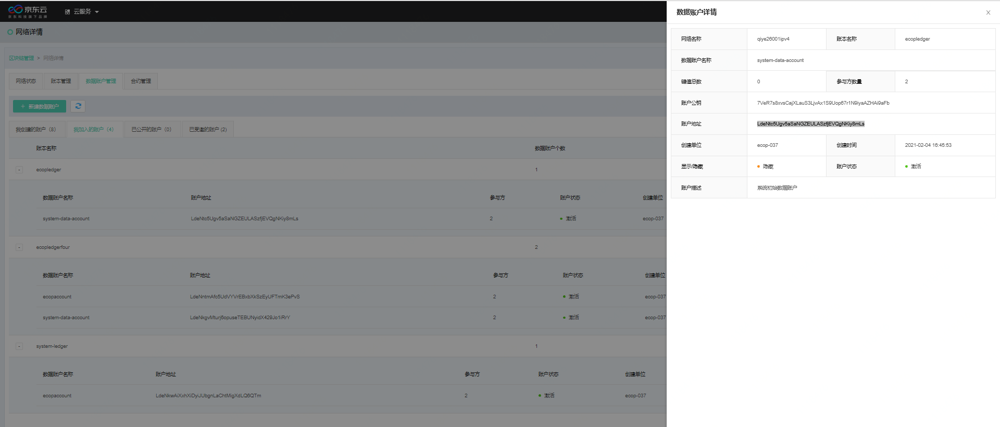
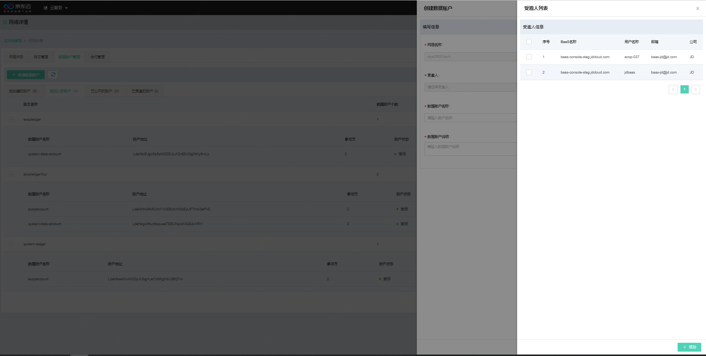
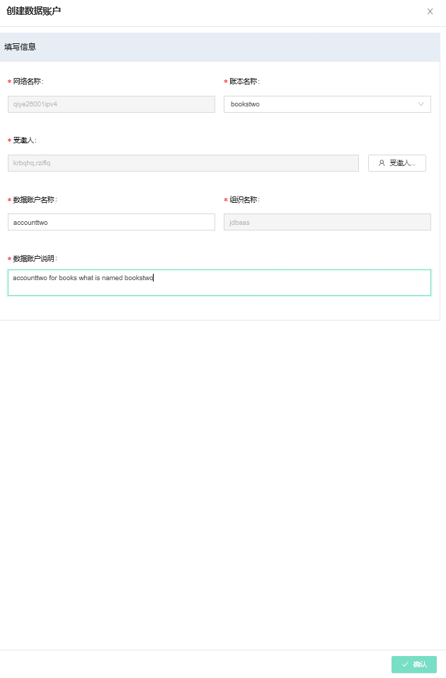
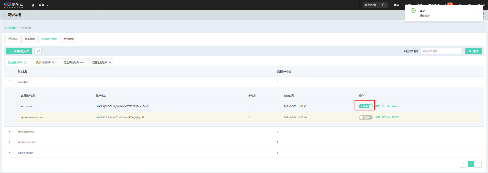
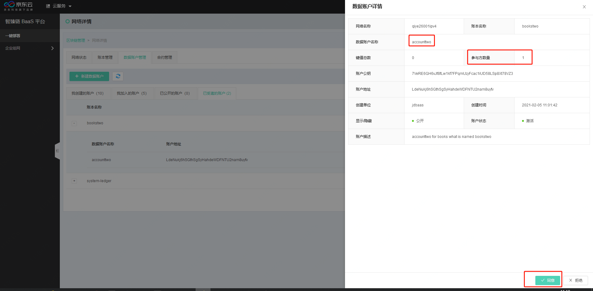
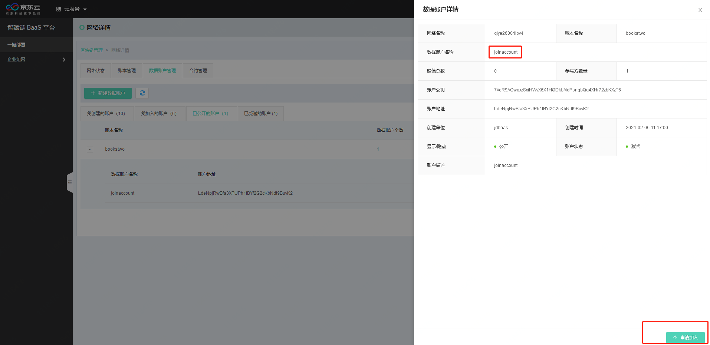
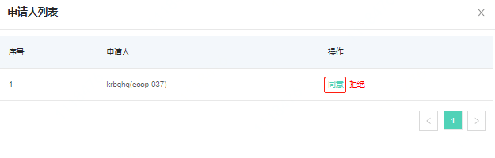
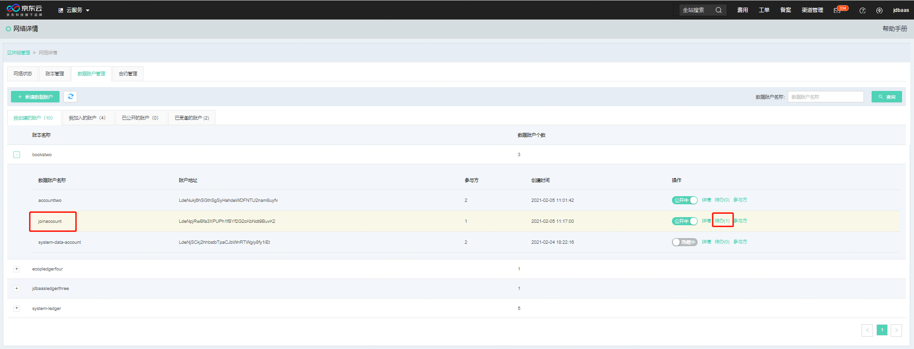

# 数据账户管理
数据账户是JDChain区块链组网独有的一种类型，如果将账本类比为数据库的话，数据账户可以类比为数据库中的表，用于存储数据，实现数据隔离的作用；所以数据账户是从属于账本之下的一种资源类型；

如果一条链下有多个账本，那么每个账本下都最少有一个数据账户，具体展示如下：

数据账户详情说明如下：

|参数名|	说明|
|----------|:----------:|
|网络名称|该区块链网络的名称|
|账本名称|该数据账户所在的账本名称|
|账户名称|该数据账户的名称|
|键值总数|该数据账户中所写入的交易总量（kv对总数）|
|参与方数量|一共有多少个参与方共同拥有该数据账户|
|账户公钥|识别该数据账户的身份信息|
|账户地址|该数据账户的地址，一般用于JDCchain sdk调用|
|创建单位|该数据账户的创建者|
|创建时间|该数据账户的创建时间|
|显示/隐藏|当该字段为显示时，账本下其他参与方会看到该数据账户；为隐藏时则不能；|
|账户状态|激活状态则可用，反之则不可用|
|账户描述|用于描述该数据账户的说明信息|

数据账户可以通过两种方式加入：创建者在创建数据账户时，*邀请*多个用户同时加入数据账户；另外，申请者还可以在数据账户创建之后*申请加入*数据账户。

##创建者邀请
数据账户创建时需要进行人员邀请，点击**受邀人**按钮，系统会将当前网络下的人员全部抓取并以列表显示;在此页面选择需要邀请的受邀人（包括自己）之后点击屏幕下方的**添加**按钮，即可完成账本人员的邀请。 如选错可以重新勾选去掉“√”标记。

数据账户创建的页面如下，输入完毕所有信息后，可以点击**确认**按钮完成数据账户的创建。创建成功后右上角会有创建成功的提示。

数据账户创建后，可以在数据账户列表中查询相关信息，数据账户列表与区块链网络列表一样，进行了详细的Tab页面区分，为了方便查看，以下根据不同的Tab页进行列表功能的详细描述。

* **我创建的数据账户**：我创建的账数据账户列表，可以对数据账户进行一些授权操作，包括公开/隐藏、待办。公开/隐藏功能可以控制数据账户是否在账本中可见。待办功能可以同意其它用户加入数据账户的申请。同时点击**参与方**按钮，可以查看当前数据账户的参与节点。

###受邀方加入
* **已受邀的账户**：账户的创建者在创建数据账户时，或者在账本创建后。可以邀请同网络下的其它成员加入账本。受邀人员在“邀请我的”Tab下可以看到受邀信息。点击概览按钮，可以查看邀请信息。

##申请者申请加入
* **已公开的数据账户**：数据账户创建者在创建完成数据账户后，对数据账户进行公开操作，公开的数据账户在相同账本下可以查看。

已公开的数据账户下，可以申请加入一个公开的数据账户，点击申请按钮，右侧弹出界面，可以查看数据账户的基本信息。点击**申请加入**按钮，可以申请加入该数据账户。

申请者申请加入数据账户时，需要*数据账户创建者*同意申请后，方可加入。

###创建者审核

待办功能可以对申请加入数据账户进行审核，当有申请加入的节点时，点击准入按钮，右侧弹开页面中可以查看申请信息。

此页面可以对申请加入数据账户的节点进行审核，同意按钮表示同意节点加入，拒绝按钮表示拒绝节点加入。无论哪个按钮，点击并操作成功后，系统右上角会弹出提示。

