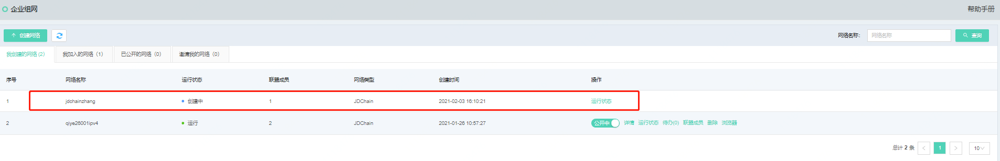
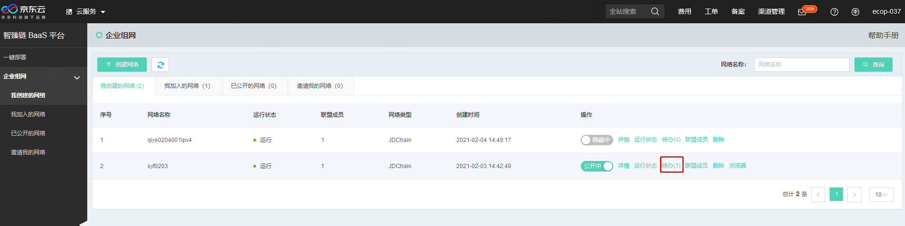
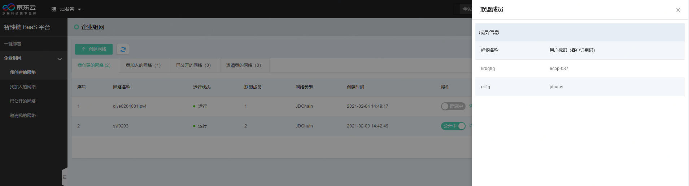
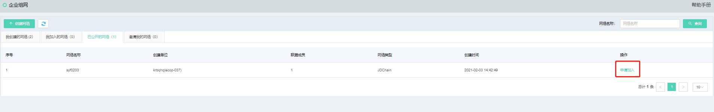
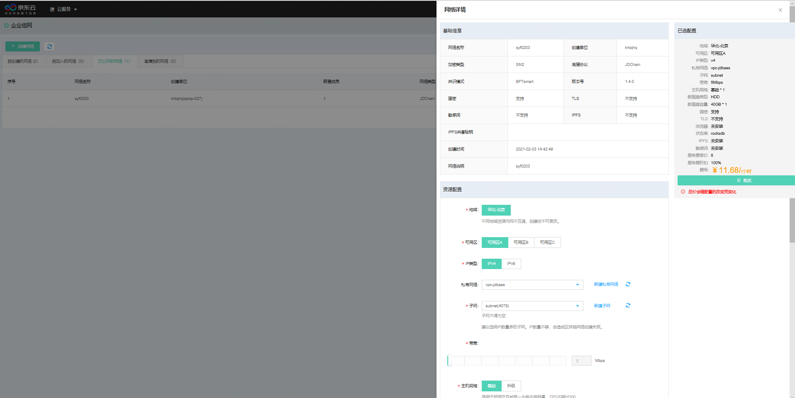
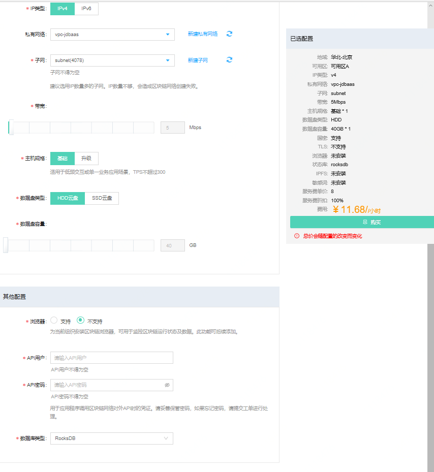
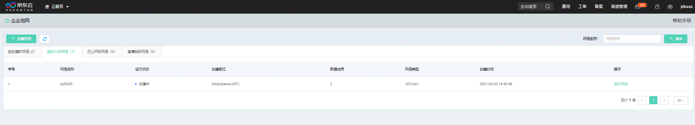

# 企业组网网络列表
如上文所述，企业组网可以帮助用户在京东云版的BaaS平台中创建一条联盟链网络，联盟链是目前最广泛的一种区块链网络搭建形式，可以结合多个节点，使这些互不授信的节点组合起来，在同样的规则下传递可信的数据信息。智臻链区块链BaaS平台为用户提供便捷的联盟链组建、配置页面，让用户能够像“拉朋友圈”一样快速增减区块链网络内节点。

联盟链的展示分为4个Tab页，每个Tab页的展示信息不同，具体如下:

* **我创建的网络**：默认展示界面，由当前账号创建的区块链网络全部在此Tab页下展示，此页面下，对链的操作权限也有不同。在此Tab页下，可以对自己创建的区块链进行公开\隐藏、详情、运行状态、待办、联盟成员、删除、浏览器等操作，每项操作意义如下
	* 公开\隐藏：是否将链公开，如选择公开，使用智臻链区块链BaaS平台并接入互联网的企业都可以查看到该区块链网络的基本信息（基本信息指名称和创建单位，不包含业务信息），并可以申请加入到该区块链网络中
	* 详情：点击详情操作，可以进入该网络进行网络内管理
	* 运行状态：可实时查看当前区块链网络节点各组件的运行情况
	* 待办：可以在页面中查询申请加入网的信息，并根据申请信息决定是否允许申请人加入此链。*同意*按钮表示同意加入网络，*拒绝*按钮表示不允许加入网络。任何按钮点击成功后，右上角均会弹出操作成功提示

	* 联盟成员：可通过此操作，了解网络中现有的所有联盟成员

	* 删除：将无用的区块链网络删除。注意，如果是网络发起者，那么需要所有参与方均退出网络后，才可以开始进行删除，否则删除网络动作不会成功。
* **我加入的网络**：通过申请加入的区块链网络，可以在此Tab页面下查看，相较于自己创建的网络，加入的网络相对权限较少。仅可以查看运行状态、联盟成员以及退出当前联盟。

* **已公开的网络**：对于点击了公开按钮的区块链网络，可以在此Tab中查看。在此页面中，对于非登录账号创建的区块链网络，可以选择加入网络；如果区块链网络是本账号创建的，则不会出现在该Tab。申请入网点击后，可以看到该网络的详细信息，确认无误可以点击申请加入按钮，申请加入网络。
点击申请加入按钮后，可以查看公开链的详细信息，确认无误后点击*申请加入*按钮，申请信息即发送至区块链网络发起方。

当区块链网络的创建方同意加入后，进入节点启动界面。与网络创建页面不同的是，节点启动页面会首先展示区块链网络基本信息，之后才会要求用户输入信息细节。

下端为申请加入链配置的信息，需要输入的项目如表：

| 分类 | 参数名 | 必填项 | 规则 |
|----------|----------|:------:|--------------------------------------------------|
| 资源配置| 地域 | 是 | 选择服务器所在地域，不同地域资源内网不互通，创建后不可更改 |
| | 可用区 | 是 | 选择该地域下可用的服务器区域 |
|  | 私有网络 | 是 | |
|  | 子网 | 是 | 建议选用IP数量多的子网，IP数量不够，会造成区块链网络创建失败|
| | 带宽 | 是 | 公网带宽，默认5Mbs |
|  | 主机规格 | 是 | 可选主机规格，根据所选规格的不同，在右方显示详细配置。 基础版适用于低频交互或单一业务场景，TPS不超过300；升级版适用于高频交易或多业务应用场景，峰值TPS可达到1000+  |
|  | 数据盘类型 | 是 | 可选HDD与SSD云盘 |
|  | 数据盘容量 | 是 | 选择数据盘容量，最小40G，最大400G。此处选取的是单组件磁盘容量，总用量可参考右边已选配置 |
|其他配置|	浏览器|	是|	为当前组织安装区块链浏览器，可用于监控区块链运行状态及数据。此功能可后续添加。|
|  |	API用户	| 是| 用来调用API接口的用户名称，应用系统调用时需要使用该用户调用|
| |	API密码	|是|	API用户的密码，请妥善保管密码，如果忘记密码，请提交工单进行处理 |
||	数据库类型|	是|现支持状态库引擎RocksDB。|

输入不同的信息配置，右侧配置项中会详细显示价格。信息输入完毕后，点击*购买*按钮，开始进行购买操作。
点击按钮后，进入信息确认页面，此页面分为两个步骤，分别是订单确认与开通成功页面，在订单确认页面中可以确认订单金额信息。确认无误后点击*立即开通*按钮，完成确认步骤。

进入开通成功页面后，如账号中金额足够，系统会提示恭喜开通成功的提示，之后页面会在5秒后自动跳转回网络列表页面。

在*我加入的网络*列表页面中，可以查看到*运行状态*，当运行状态变为“运行中”且后端操作按钮全部出现时，网络创建成功。

