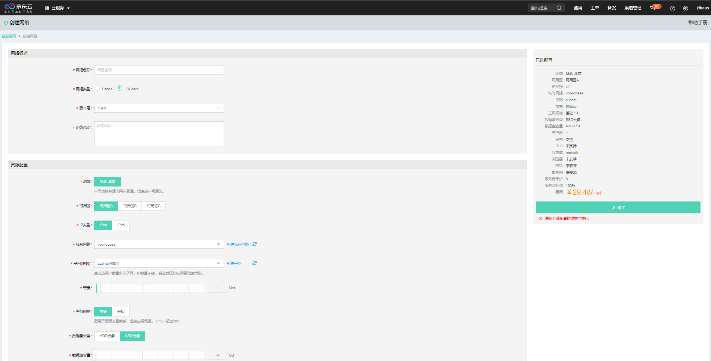
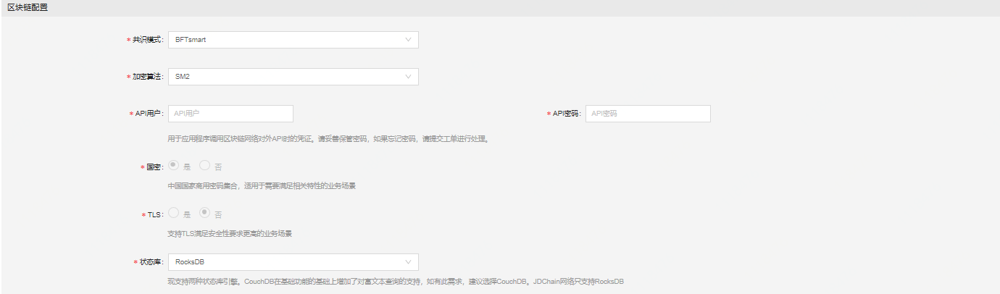
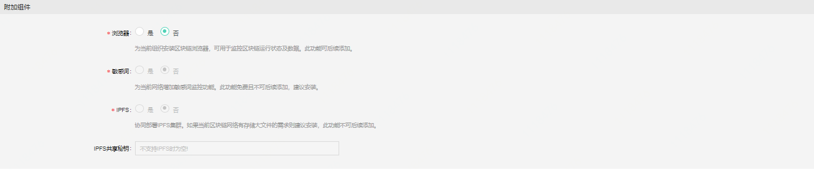
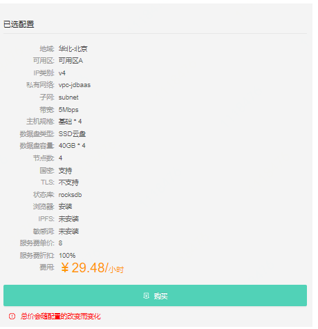
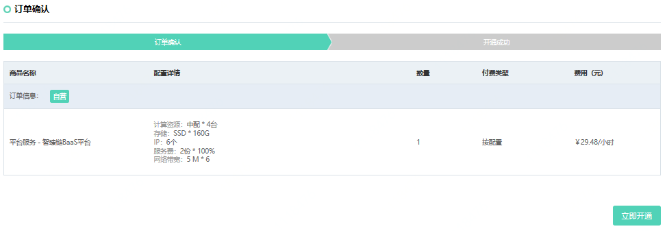
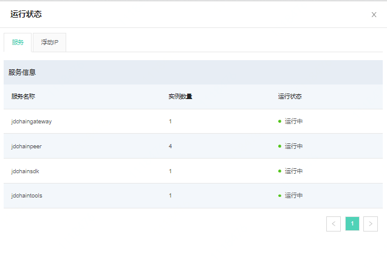
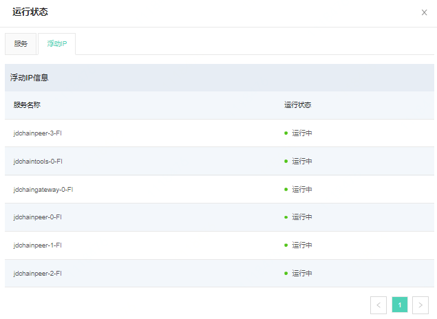
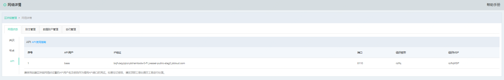
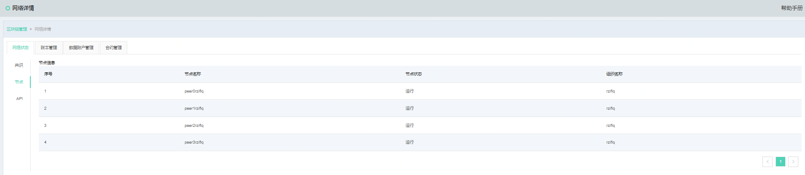
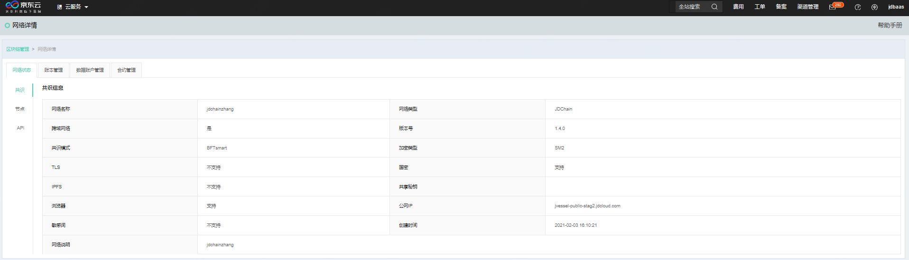

# 区块链网络创建
在企业组网页面中，组建JDChain网络可在网络操作者登录系统后，进入区块链管理页签，点击*创建网络*按钮，并在*网络类型*处选择*JDChain*即可开始JDChain联盟链的创建。具体创建页面如下图。在创建网络后，可以开始邀请或者受邀加入网络。

创建网络需要填写信息包括4个部分，从上至下分别为网络概述、资源配置、区块链配置、附加组件。每一部分需要输入不同的信息，保证整个信息的完整性。具体参数输入的规则如下表:

| 分类 | 参数名 | 必填项 | 规则 |
|----------|----------|:------:|--------------------------------------------------|
| 网络概述 | 网络名称 | 是 | 网络名称只得包含小写字母与数字，且不能以数字开头 |
| | 网络说明 | 是 | 中文或者英文，长度不超过200字 |
| 资源配置 | 地域 | 是 | 选择服务器所在地域，不同地域资源内网不互通，创建后不可更改 |
| | 可用区 | 是 | 选择该地域下可用的服务器区域 |
|  | 私有网络 | 是 | |
|  | 子网（IP数） | 是 | 建议选用IP数量多的子网，IP数量不够，会造成区块链网络创建失败|
| | 带宽 | 是 | 公网带宽，默认5Mbs |
|  | 主机规格 | 是 | 可选主机规格，根据所选规格的不同，在右方显示详细配置。 基础版适用于低频交互或单一业务场景，TPS不超过300；升级版适用于高频交易或多业务应用场景，峰值TPS可达到1000+ |
|  | 数据盘类型 | 是 | 可选HDD与SSD云盘 |
|  | 数据盘容量 | 是 | 选择数据盘容量，最小40G，最大400G。此处选取的是单组件磁盘容量，总用量可参考右边已选配置 |
| 区块链配置 | 共识模式 | 是 | 目前JDChain支持基于BFTsmart共识 |
| | 加密算法	| 是 |	目前支持SM2 国密算法|
|  |	API用户	| 是| 用来调用API接口的用户名称，应用系统调用时需要使用该用户调用|
| |	API密码	|是|	API用户的密码，请妥善保管密码，如果忘记密码，请提交工单进行处理 |
||	国密|	是|	中国国家商用密码集合，适用于需要满足相关特性的业务场景，默认是|
||	TLS|	是|	支持TLS满足安全性要求更高的业务场景，默认否|
||	状态库|	是|现支持RocksDB|
|附加组件|	浏览器|	是|	为当前组织安装区块链浏览器，可用于监控区块链运行状态及数据。此功能可后续添加。|
||	敏感词|	是|	为当前网络增加敏感词监控功能。此功能免费且暂不可后续添加，建议安装。|
||	IPFS|	是|协同部署IPFS集群。如果当前区块链网络有存储大文件的需求则建议安装，此功能暂不可后续添加。|

在填写完毕所有信息后，可以在右侧看到系统信息及价格，信息确认无误可以点击*购买*按钮，进行下一步配置。

点击按钮后，进入信息确认页面，此页面分为两个步骤，分别是订单确认与开通成功页面，在订单确认页面中可以确认订单金额信息。确认无误后点击**立即开通**按钮，完成确认步骤。

点击**运行状态**按钮，可以查看节点运行状态，当所有状态变成*运行中*时，网络创建成功。

网络创建完毕后，点击**详情**按钮，进入网络详情页面:

