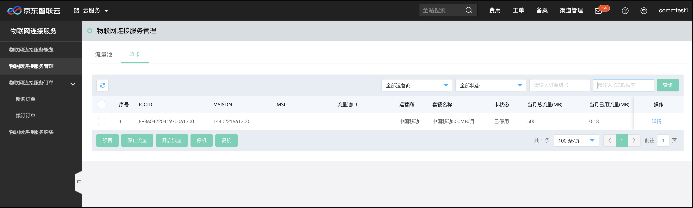
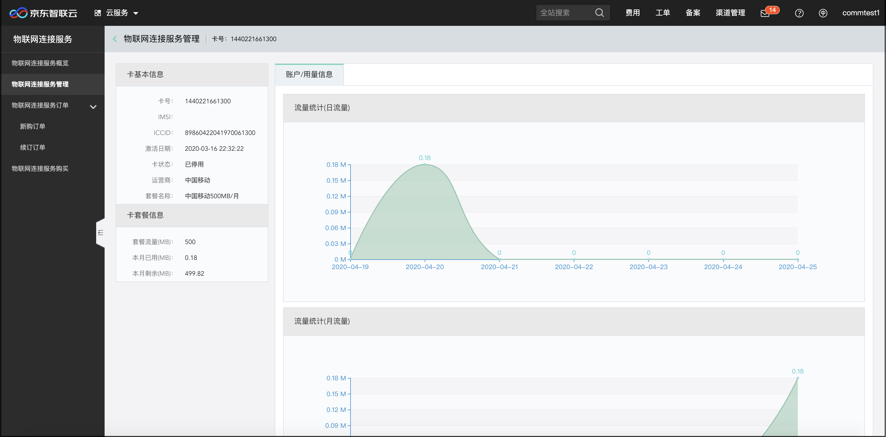
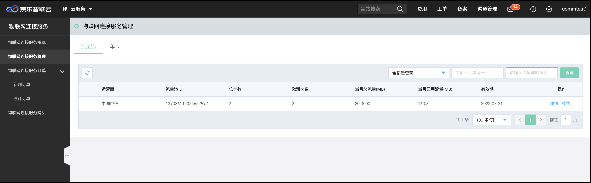

# 物联网连接服务管理

进入“物联网连接服务管理”页面，可对物联网连接服务和流量池进行管理。

## 单卡

您可以根据不同的条件查询已购买的物联网连接服务，您可以对这些服务进行管理，包含服务续订、停止流量、开启流量、激活，也可以做停机和复机操作。

点击物联网连接服务列表“操作”列中的“详情”连接，您可查看对应物物网连接服务的详细信息，主要包含卡信息、套餐信息、流量使用等信息。

## 流量池

您可以根据不同的条件查询已购买的流量池，您可对流量池进行续费和查询详情操作。

点击流量池列表“操作”列中的“详情”连接，您可查看流量池内的物联网连接服务信息，同时可对流量池内的物联网连接服务进行停止流量、开启流量，也可以做停机和复机操作。

