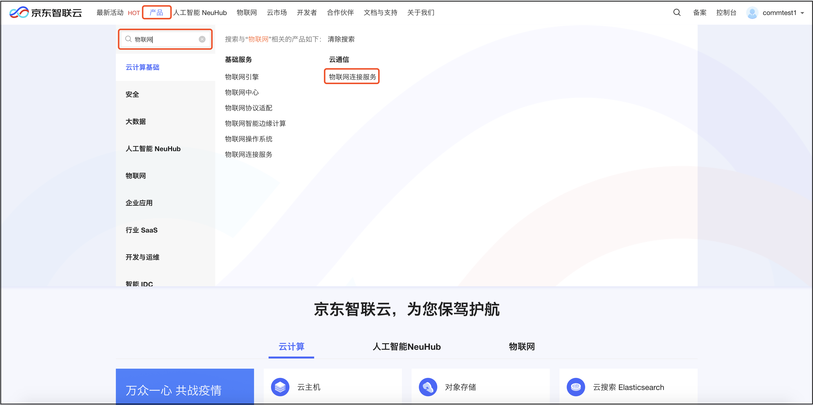
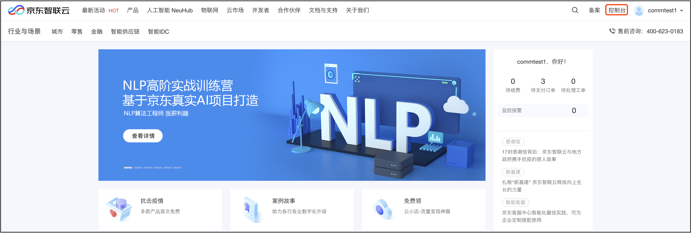

# 购买流程

本文介绍 物联网卡 实例的购买入口。

## 入口一：产品介绍页

1. 登录京东云官网[https://www.jdcloud.com/](https://www.jdcloud.com/)。
2. 通过页头导航，鼠标滑到 “产品“ 菜单上，在弹出产品列表左上角的搜索框中输入“物联网连接服务”，在右侧的搜索结果中再点击“云通信”下的“物联网连接服务”便可进入物联网连接服务平台介绍页面。

3. 在产品介绍页，点击**立即使用**，进入物联网连接服务平台。

4. 进入物联网连接服务平台，在左侧的菜单栏点击“物联网连接服务购买”，进入物联网连接服务购买页面，参见：[物联网连接服务购买](../Operation-Guide/Purchase.md)。

## 入口二：控制台

1. 登录京东云官网[https://www.jdcloud.com/](https://www.jdcloud.com/)。
2. 点击“控制台“>“云服务“，在弹出的产品列表左上角的搜索框中输入“物联网连接服务”，在下方的搜索结果中再点击“云通信”下的“物联网连接服务”便可进入物联网连接服务平台。

3. 进入物联网卡服务平台，在左侧的菜单栏点击“物联网连接服务购买”，进入物联网连接服务购买页面，参见：[物联网连接服务购买](../Operation-Guide/Purchase.md)。

