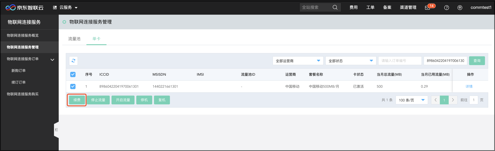

# 续费流程

本文介绍物联网卡续费入口。

1. 进入[京东智联云](https://console.jdcloud.com/overview)并登录。
2. 通过页头导航，鼠标滑到 “产品“ 菜单上，在弹出产品列表左上角的搜索框中输入“物联网连接服务”，在右侧的搜索结果中再点击“云通信”下的“物联网连接服务”便可进入物联网连接服务平台。

也可以通过控制台，进入物联网连接服务平台。

点击“控制台“>“云服务“，在弹出的产品列表左上角的搜索框中输入“物联网连接服务”，在下方的搜索结果中再点击“云通信”下的“物联网连接服务”便可进入物联网连接服务平台。

3. 进入物联网连接服务平台，点击左侧“物联网连接服务管理”菜单，进入管理页面，在管理页面选择需要续费的连接服务，点击“续费“按钮，进入续费页面。

