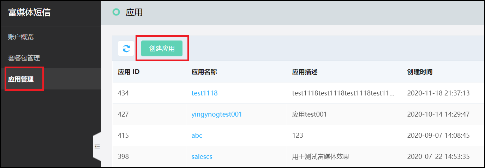
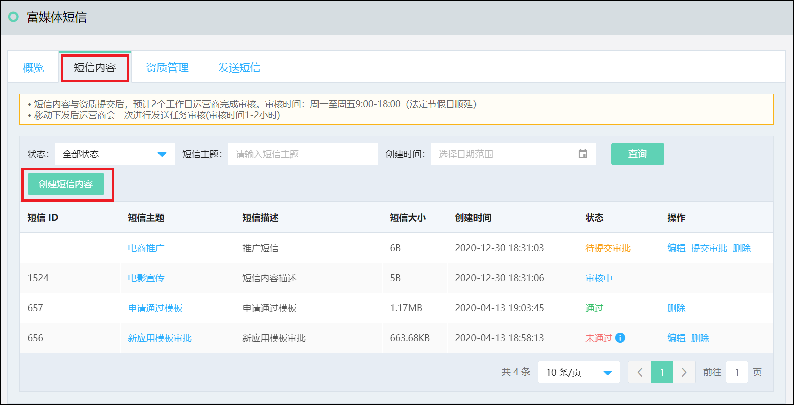
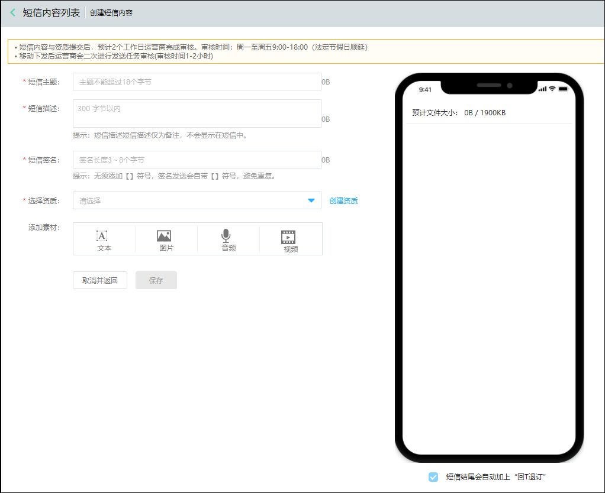
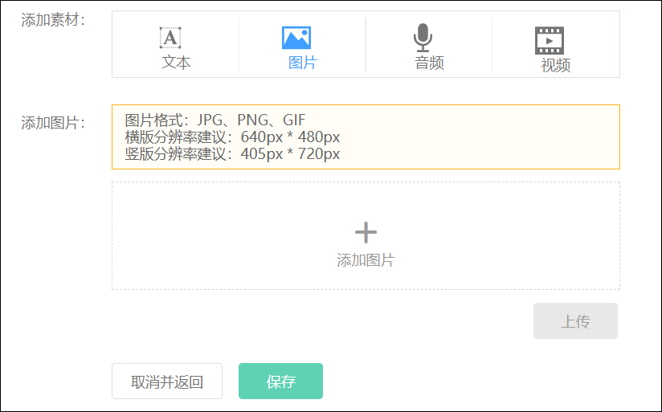
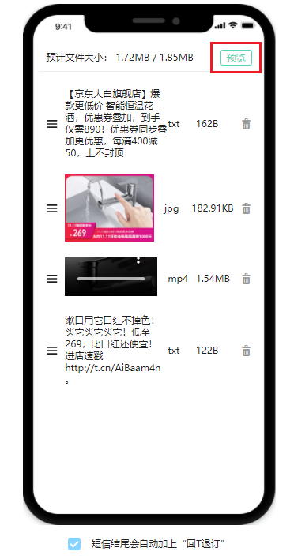
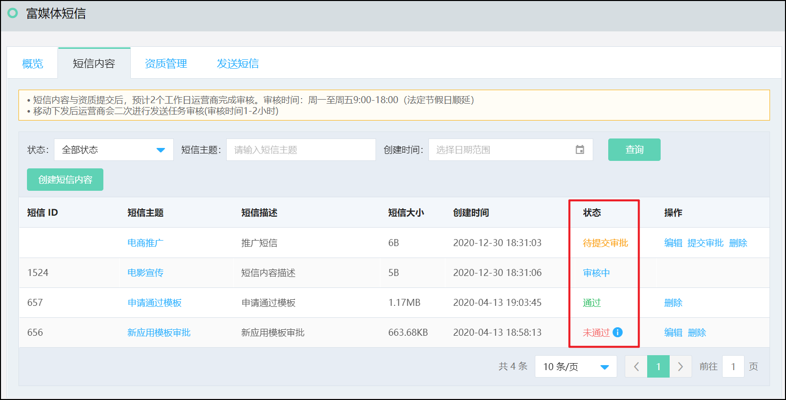

## 短信内容  

登录富媒体短信服务后，首先您要先创建应用。  
  

创建应用后，在短信内容TAB页，点选 ‘创建短信内容’，如下图 
  

点击 “创建短信内容” 后进入到富媒体短信内容创建页面。 
  

**短信主题：** 
手机用户收到富媒体短信时显示的主题内容，位于短信首行。 
示例：主题：双12最新商品上架  
**短信描述：** 
短信描述不会出现在手机用户短信，仅供企业备忘使用。  
**短信签名：** 
短信签名是附加在短信正文内容前面的标识，用于标识公司或业务，根据用户属性来创建符合自身属性的签名信息。 
注：填写时无须添加【】符号，签名发送会自带【】符号，避免重复。  
**选择资质：** 
可选择该应用下已创建资质，也可点击 “创建资质” 按钮跳转到添加资质界面进行创建。  
**添加素材：** 
您可以上传文本、图片、音频、视频，点击上传后，附件将进入到右侧编辑区域，可以多次上传附件，但文件总量不能超过 1.9MB。 
  
附件要求如下： 
文本要求： 
第一个文本内容必须以【签名】开始，如：【京东云】为您定制短信服务 
由于运营商管控严格，目前富媒体短信暂不支持变量  
图片要求： 
格式：JPG、PNG、GIF 
分辨率建议：横版640px * 480px，竖版405px * 720px  
音频要求： 
格式：MP3 
音频建议：比特率32kbs，大小200kb-500kb，时长60s左右  
视频要求： 
格式：MPEG-4 
编码格式：H.264 
视频建议：比特率410kbs，大小1.3M-1.6M，时长30s左右  

**短信内容编辑：** 
上传后的附件都会在短信内容编辑区显示，您可以通过调节附件上下位置进行排版，点击“预览”按钮可以预览短信效果。  
   
注：不通手机机型显示会有所不同： 
- iOS预览居左显示，短信标题加粗 
- Android预览居左显示，短信标题加粗，每个短信内容之间有数字分隔  

短信编辑完成后，点击保存返回列表页。提交审批后您可以在短信列表页查看审核状态，审核通过后的短信，才能用于发送。 

