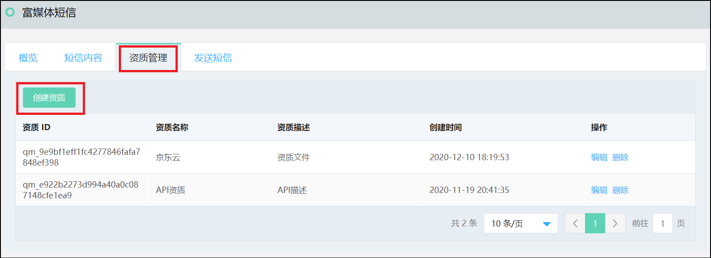
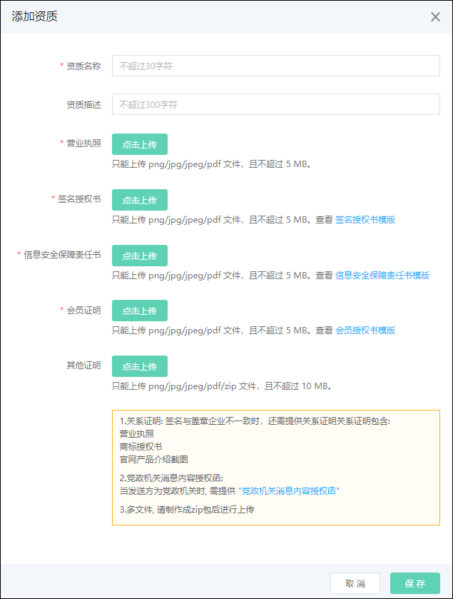
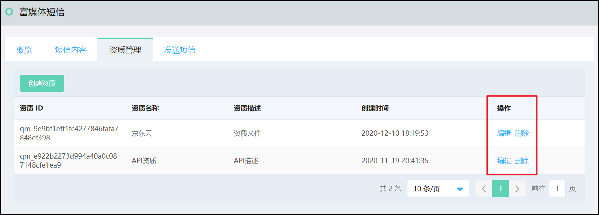

## 资质管理  

在资质管理TAB页，点选 ‘创建资质’，如下图 
  

根据提示内容填写并上传资料证明，包括营业执照、签名授权书、信息安全保障责任书、会员证明等，点击保存后可在资质管理列表内查看。 
  

注意： 
签名与盖章企业不一致时，还需提供关系证明，包含：营业执照、商标授权书、官网产品介绍截图 
当发送方为党政机关时，需提供 “党政机关消息内容授权函” 
多文件请制作成zip包后再进行上传  

资质管理列表中的资质可在创建短信内容时使用，可以对其进行编辑或删除操作。 

