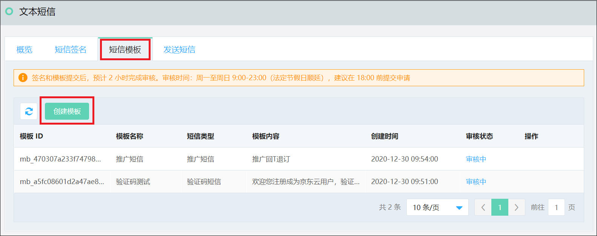
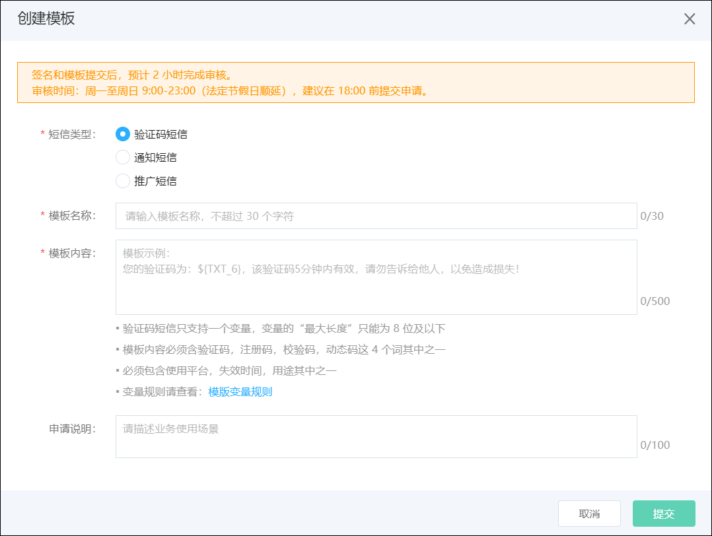
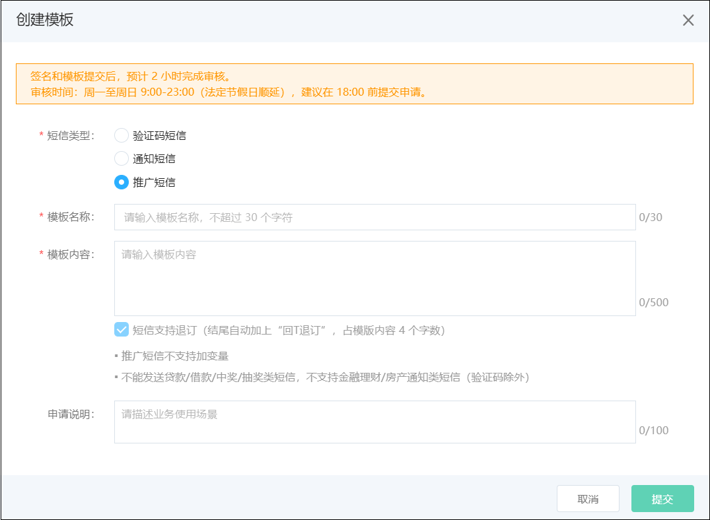
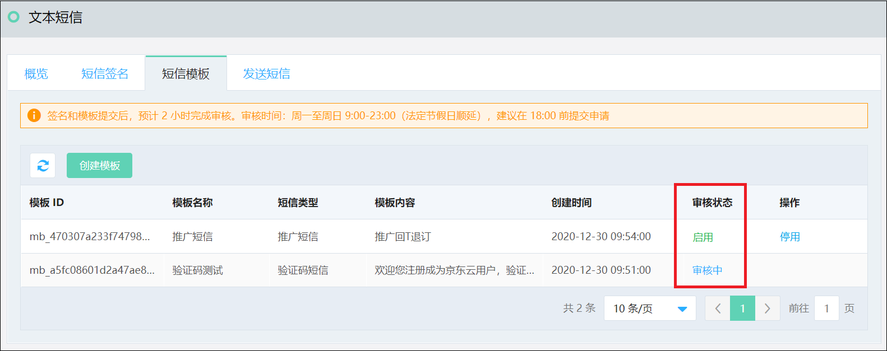

## 短信模板   

 

最终用户收到的短信样式如下： 
【京东云】您已成功注册成为京东云会员  

在短信模板TAB页，点选 ‘创建模板’，如下图 
  

根据提示内容填写模板内容，点击提交后等待运营人员进行模板审核。 
国内文本短信分为三个类型： 
* 验证码短信 
* 通知短信 
* 推广短信  

**验证码短信：**  
   
验证码短信示例： 
【京东云】欢迎您注册成为京东云用户，验证码为：${NUM_6}，5分钟内有效！ 
其中： 
【京东云】 为短信签名  
欢迎您注册成为京东云用户，验证码为：${NUM_6}，5分钟内有效！ 为短信模板  
${NUM_6} 为模板变量   
验证码短信只支持一个变量，变量的最大长度只能为8位及以下 
模板内容必须含验证码，注册码，校验码，动态码这 4 个词其中之一 
必须包含使用平台，失效时间，用途其中之一  

**通知短信：** 
  
通知短信示例: 
【京东云】我是京东小哥${TXT_5}，您的生鲜订单${TXT_10}即将送达，请您准备收货！ 
其中： 
【京东云】 为短信签名 
我是京东小哥${TXT_5}，您的生鲜订单${TXT_10}即将送达，请您准备收货！  为短信模板 
${TXT_5} ${TXT_10} 为模板变量  
不允许出现相同的变量名称 
不支持变量与变量、短链接与变量直接组合的格式  

**推广短信：** 
 
推广短信不支持加变量 
不能发送贷款/借款/中奖/抽奖类短信，不支持金融理财/房产通知类短信（验证码除外）  

提交审核后您可以在短信模板列表页查看审核状态，审核通过后启用状态的短信模板可用于短信发送。 
 

注： 
验证码短信和通知短信需要通过API或SDK调用。 
推广短信和通知类短信可以通过控制台 “发送短信” 页面进行在线发送，在线发送不支持带变量的短信内容。 
API和SDK所需要的相关信息在概览页获取 

