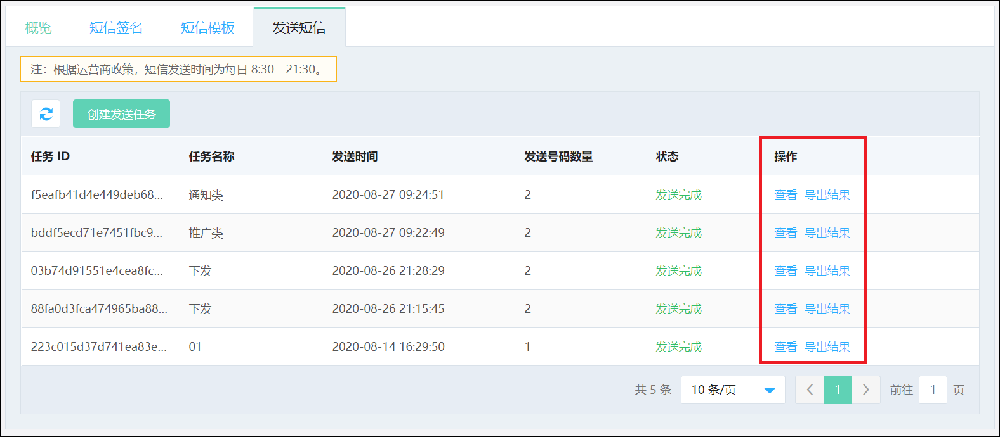

## 发送短信  

推广短信和不带变量的通知类短信可以通过控制台 “发送短信” 页面进行在线发送。 
验证码短信和带变量的通知短信需要通过API或SDK调用。 
详细请参考 https://docs.jdcloud.com/cn/?act=3  

短信签名和短信模板审核通过后，就可以开始发送短信了，在发送短信TAB页，点选 ‘创建发送任务’，如下图 
  

在内容设置界面中填写相关资料，并选择已审核通过的 ‘短信签名’ 和 ‘短信模板’，设置发送时间并根据格式要求上传手机号后，点击下一步 
 
注： 
推广短信发送时间：每日 8:30 – 21:30 
定时发送时间限制：仅可选择当前时刻后推14天内的时间  

核对发送的信息后，点击确认发送，完成短信任务创建 
 
注：系统将自动过滤掉重复的手机号 

您可以在发送短信列表页查看短信发送状态，并且可以导出结果查看各手机号发送情况。 

