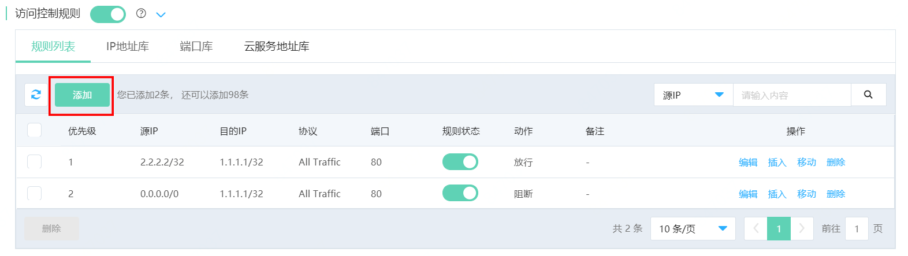
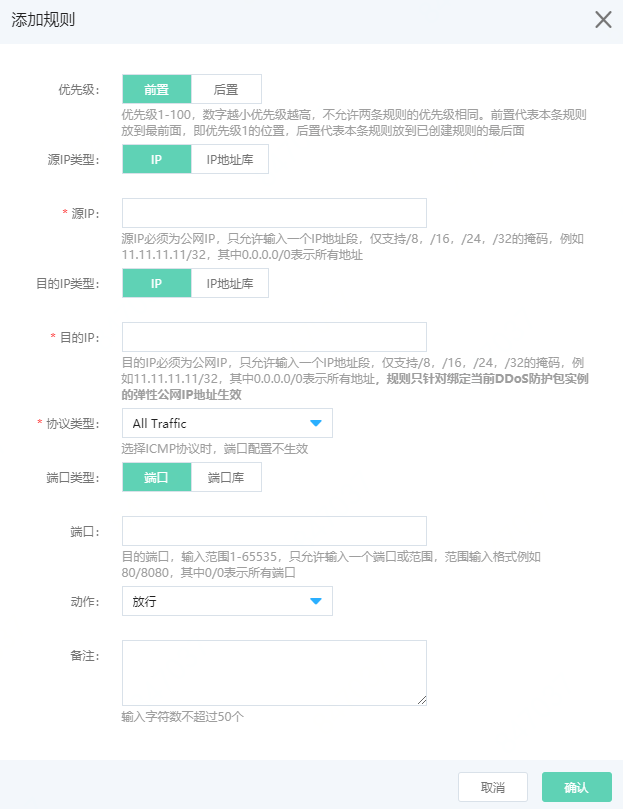

# 规则列表

DDoS防护包支持访问控制功能，允许用户进行 **南北向从外到内** 的流量管控，互联网访问流量进入京东云机房时根据访问控制规则进行过滤后，再将流量转发到用户VPC内，**其生效优先于ACL和安全组规则**。

**需要注意的是，访问控制规则只针对绑定当前DDoS防护包实例的弹性公网IP地址生效，并且单个实例允许添加的规则总数不超过1万条（规则总数=源IP数 x 目的IP数 x 目的端口数 x 访问控制规则条数）。**

## 添加规则

1、进入京东云控制台-DDoS基础防护产品界面，菜单栏选择防护包列表，点击防护包实例或防护对象设置按钮，进入防护对象设置页面。

2、在访问控制规则中，点击 **添加** 按钮，进行规则添加。

3、在弹窗中进行规则设置。

规则字段解释如下：

- 优先级：防护规则默认分配优先级1-100，数字越小优先级越高，不允许两条规则的优先级相同。前置代表本条规则放到所有已创建规则最前面，即优先级1的位置，后置代表本条规则放到已创建规则的最后面。例如添加第一条规则，无论选择前置或后置优先级都默认为1，添加第二条规则时，如选择前置，则该条规则优先级为1，已创建的规则优先级自动变为2，如选择后置，则该条规则优先级为2。

- 源IP类型：支持选择IP或IP地址库。

- 源IP：如源IP类型选择IP，则支持输入IP地址，输入地址必须为公网IP，且只允许输入一个IP地址段，仅支持/8，/16，/24，/32的掩码，例如11.11.11.11/32，其中0.0.0.0/0表示所有地址。如源IP类型选择IP地址库，则支持引用已创建的IP地址库或云服务地址库。

- 目的IP类型：支持选择IP或IP地址库。

- 目的IP：如目的IP类型选择IP，则支持输入IP地址，输入地址必须为公网IP，且只允许输入一个IP地址段，仅支持/8，/16，/24，/32的掩码，例如11.11.11.11/32，其中0.0.0.0/0表示所有地址，**规则只针对绑定当前DDoS防护包实例的弹性公网IP地址生效**。如目的IP类型选择IP地址库，则支持引用已创建的IP地址库。

- 协议类型：支持All Traffic、TCP、UDP、ICMP，All traffic指代所有协议。当选择ICMP协议时，由于协议与端口无关，端口选项禁止输入。

- 端口类型：支持选择端口或端口库。

- 端口：如端口类型选择端口，则支持输入目的端口，输入范围1-65535，只允许输入一个端口或范围，范围输入格式例如80/8080，其中0/0表示所有端口。如端口类型选择端口库，则支持引用已创建的端口库。

- 动作：访问控制规则支持放行或阻断流量。

- 备注：支持最多输入50各字符的说明。

## 编辑规则

