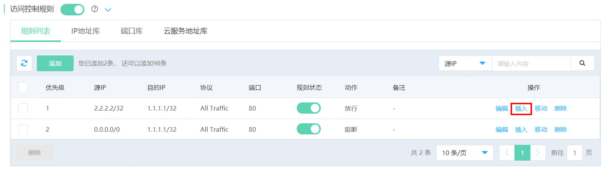
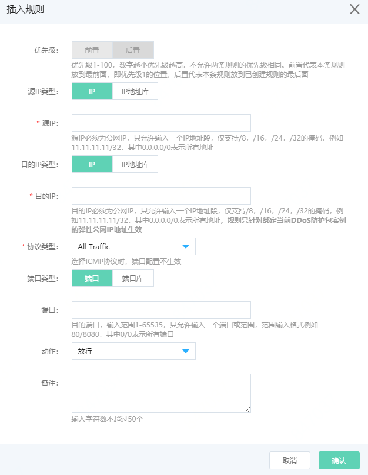

# 插入规则

优先级由系统自动分配，对已创建规则编辑功能无法修改优先级，新增规则也只支持将该规则放到优先级最高或优先级最低位置，而访问控制规则随着业务变更需要不断增加，因此访问控制规则支持用户插入新的规则。

## 操作步骤

1、在规则列表中，选择需要插入规则的位置，点击操作栏 **插入** 按钮。

2、在弹出窗口中编辑插入规则，点击确定即可完成操作。

**注意，插入操作是在点击插入按钮的规则之前插入优先级更高的规则。**

举例说明，用户需要在优先级1和2的规则中间插入，则点击优先级2规则的插入按钮，插入完成后，插入的新规则优先级为2，原优先级为2及其后的规则优先级自动+1。

