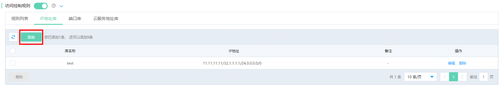
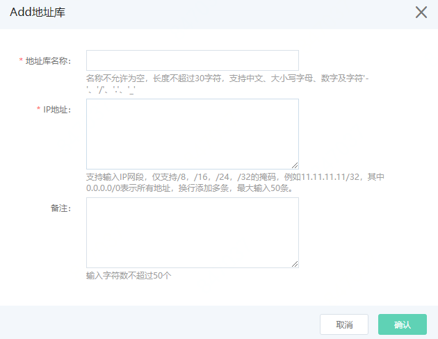

# IP地址库

支持用户添加IP地址库，便于规则中源和目的IP引用。最多允许添加10条。

## 操作步骤

1、在访问控制规则中选择 **IP地址库** ，点击 **添加** 按钮。

2、弹出窗户中，输入地址库名称，IP地址和备注后，点击确定完成操作。

字段解释如下：

- 地址库名称：名称不允许为空，长度不超过30字符，支持中文、大小写字母、数字及字符'-'、'/'、'.'、'_' 。

- IP地址：支持输入IP网段，仅支持/8，/16，/24，/32的掩码，例如11.11.11.11/32，其中0.0.0.0/0表示所有地址，换行添加多条，最大输入50条。**注意，IP地址必须为公网IP，内网IP添加后被规则引用也无法生效**。

- 备注：输入字符数不超过50个。

3、添加的库支持编辑和删除。
