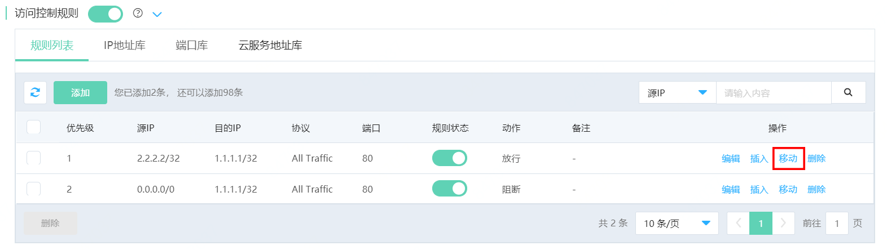

# 移动规则

如用户需要对已创建规则调整优先级，可对该规则进行移动操作。

## 操作步骤

1、在规则列表，查询需要调整优先级的规则，点击操作栏 **移动** 按钮。

2、在弹出窗口中，设置当前规则需要移动的目标优先级位置。

举例说明，如果将原优先级5的规则移动到优先级2，移动完成后，则原优先级2，3，4的规则优先级自动+1。如果将原优先级2的规则移动到优先级5，移动完成后，则原优先级3，4，5的规则优先级自动-1。

**注意，所有已创建规则按照连续的优先级排列，因此只支持该规则在已创建规则的优先级范围内移动，例如当前规则列表中有3条规则，则当前优先级可移动范围为1-3。**

