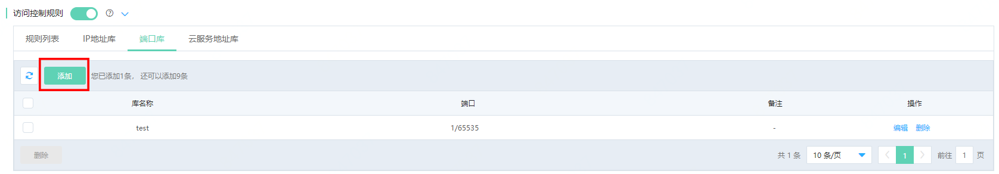
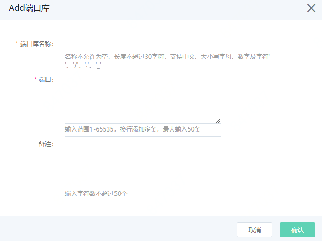

# 端口库

支持用户添加端口库，便于规则中端口引用。最多允许添加10条。

## 操作步骤

1、在访问控制规则中选择 **端口库** ，点击 **添加** 按钮。

2、弹出窗户中，输入端口库名称，端口和备注后，点击确定完成操作。

字段解释如下：

- 端口库名称：名称不允许为空，长度不超过30字符，支持中文、大小写字母、数字及字符'-'、'/'、'.'、'_' 。

- 端口：输入范围1-65535，换行添加多条，添加格式支持输入单个端口或范围，例如80，80/81，其中1/65535和0/0均表示全部端口，最大输入50条。

- 备注：输入字符数不超过50个。

3、添加的库支持编辑和删除。
