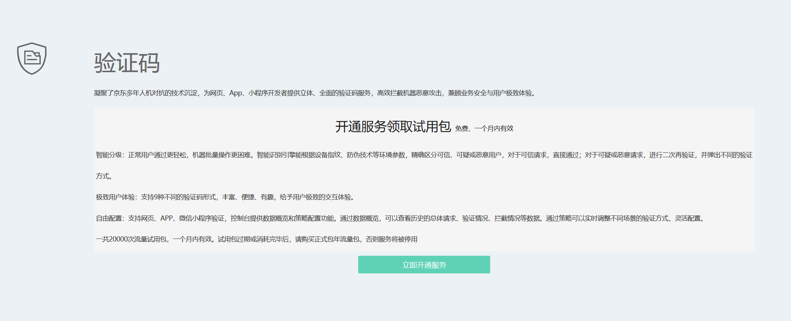
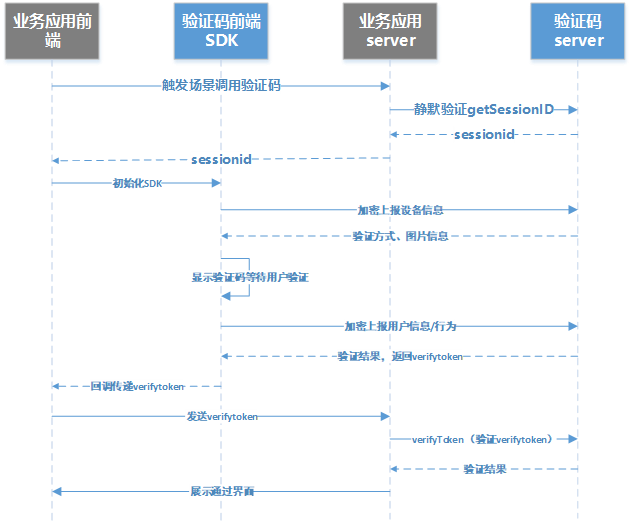
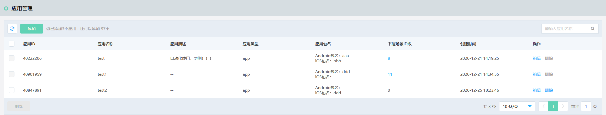
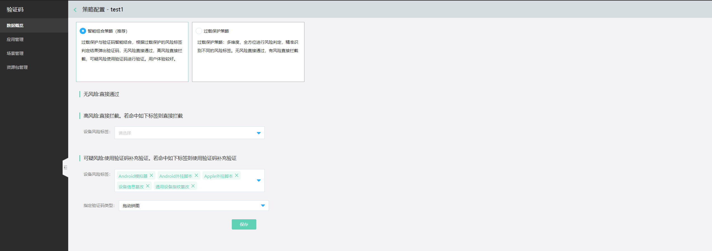

## **快速接入验证码服务**

1、开通服务。进入京东智联云控制台，选择**云安全-验证码**页面进入验证码产品开通页，点击**立即开通服务**。产品开通后即可领取免费试用包，20000次调用服务，一个月内有效。

   

2、创建AccessKey和AccessKeySecret。到个人中心的AccessKey管理处，手动创建AccessKey和AccessKeySecret，作为调用服务的鉴权票据。

3、客户端接入。验证码客户端接入，请参照[APP端接入SDK](https://docs.jdcloud.com/cn/captcha/androidsdk)、[PC/M端接入SDK](https://docs.jdcloud.com/cn/captcha/browser-sdk)、[小程序接入SDK](https://docs.jdcloud.com/cn/captcha/miniprograms-sdk)

4、服务端接入。服务端接入通过OpenAPI接口进行调用，请参照[服务器端接入](https://docs.jdcloud.com/cn/captcha/getSessionId)。验证码前后端调用时序图如下：

5、打开京东智联云验证码控制台，选择**云安全-验证码**页面，查看统计数据、应用管理、场景管理、流量包管理等信息。

## 添加应用》添加场景》配置策略

## 应用管理

您可以在验证码控制台添加和查看应用。

### 操作步骤

1. 登录京东智联云控制台，点击**云安全-验证码**，进入验证码控制台。

2. 在左侧导航栏，单击**应用管理**。

3. 可以查看应用名称/ID、应用描述、应用类型、应用包名、下属场景ID数及创建时间，并可进行添加、编辑和删除管理操作。如图

   

## 场景管理

您可以在验证码控制台添加和查看场景。

### 操作步骤

1. 登录京东智联云控制台，点击**云安全-验证码**，进入验证码控制台。

2. 在左侧导航栏，单击**场景管理**。

3. 可以查看场景名称/ID、场景密钥、场景描述、所属应用、场景类型、预估QPS及创建时间，并可进行添加、编辑和删除管理操作。如图

   

## 策略管理

1. 登录京东智联云控制台，点击**云安全-验证码**，进入验证码控制台。

2. 在左侧导航栏，单击**场景管理**。

3. 进入场景管理页面后，点击**策略配置**，选择智能组合策略，推荐配置如下，也可根据需要设置不同的验证码类型
   

