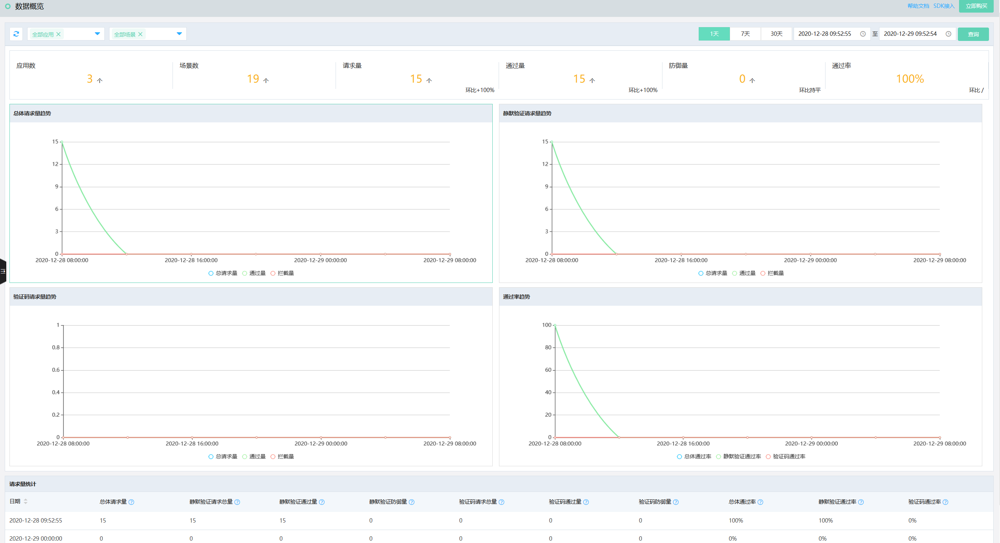

## 数据概览

您可以在验证码控制台查看验证码的统计分析数据。

### 操作步骤

- 登录京东智联云控制台，点击**云安全-验证码**，进入验证码控制台。

- 在左侧导航栏，单击**数据概览**。

- 在**数据概览**页面，选择应用、场景及查询时间，并单击**查询**。支持查询的时间段为最近3个月内。支持设置的时间跨度为1个月。如下图

   

   **数据说明：**

   总体请求量=静默验证请求总量+验证码请求总量 
   静默验证请求总量=静默验证通过量+静默验证防御量 
   静默验证通过量为通过静默验证的请求量 
   静默验证防御量为未通过静默验证的请求量 
   验证码请求总量=验证码通过量+验证码防御量 
   验证码通过量为通过验证码验证的请求量 
   验证码防御量为未通过验证码验证及用户放弃验证的请求量 
   总体通过率=(静默验证通过量+验证码通过量)/总体请求量 
   静默验证通过率=静默验证通过量/静默验证请求总量 
   验证码通过率=验证码通过量/验证码请求总量 

