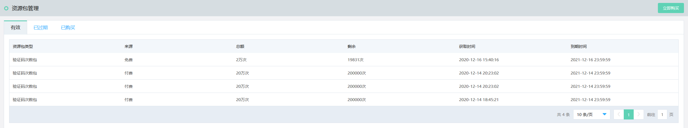
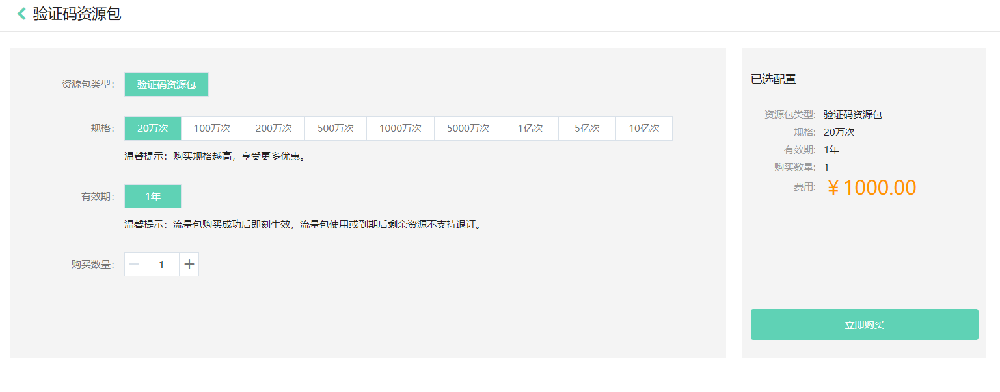

## 资源包管理

资源包管理页面支持购买资源包、查看有效资源包、过期资源包以及购买记录。

操作步骤：

1. 登录京东智联云控制台，点击**云安全-验证码**，进入验证码控制台。

2. 在左侧导航栏，单击**资源包管理**页面，可以查看有效资源包信息。 有效资源包页面可以查看当前账户下有效的资源包情况，包括：资源类型，来源，总额，剩余量，资源获取时间、到期时间。

   

3. 点击**已过期**标签，可以查看过期资源包信息，包括：资源包类型、来源、总额、已使用量、资源获取时间，到期时间。

4. 点击**已购买**标签，可以查看所有已购买资源包信息。包括：资源包类型、规格、有效期、价格、付款时间。

5. 点击**立即购买**按钮，跳转到购买页面，可以按照您的业务需求，选择合适类型的资源包。

   
