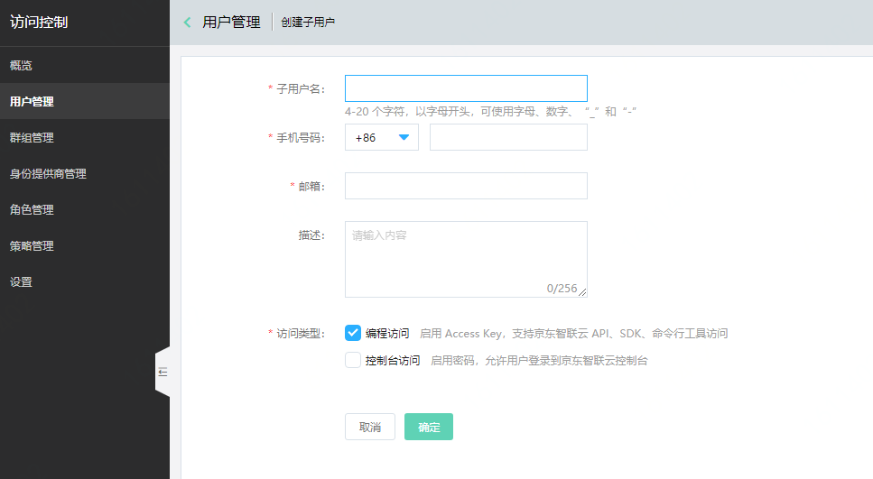
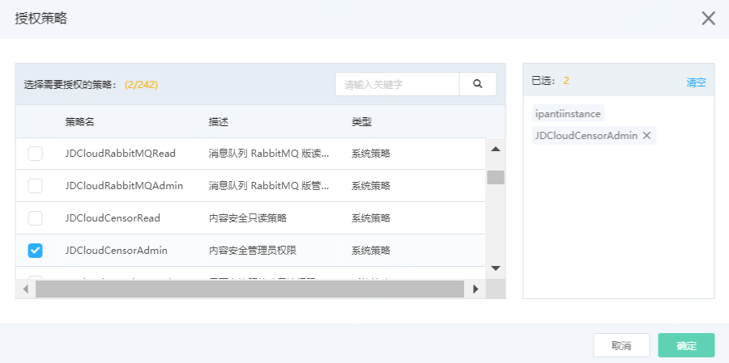

## 子账号接入

内容检测API支持您通过RAM用户（即京东智联云子账号）的方式进行调用。要使用RAM用户调用内容检测API，您需要创建RAM用户并完成授权。

## 操作步骤

1. 登录[RAM控制台](https://iam-console.jdcloud.com/summary)，创建RAM用户， 并选择生成AccessKeyID和AccessKeySecret。创建后请妥善保存该AccessKeyID和AccessKeySecret，后续使用SDK时需要提供。

   更多关于创建RAM用户的操作，请参见[创建RAM用户](https://docs.jdcloud.com/cn/iam/subuser-management)。

   
   
2. 完成RAM用户授权。只有完成RAM用户授权，您的RAM用户才能够调用相关API。您需要向RAM用户授权以下系统策略权限：`JDCloudCensorAdmin`。

   更多关于RAM用户授权的操作，请参见[为RAM用户授权](https://docs.jdcloud.com/cn/iam/subuser-management)。

   
   

