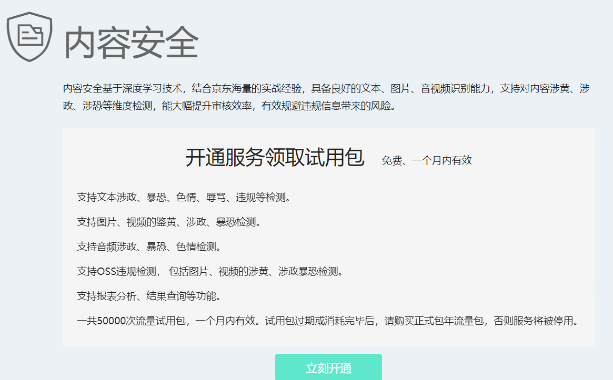
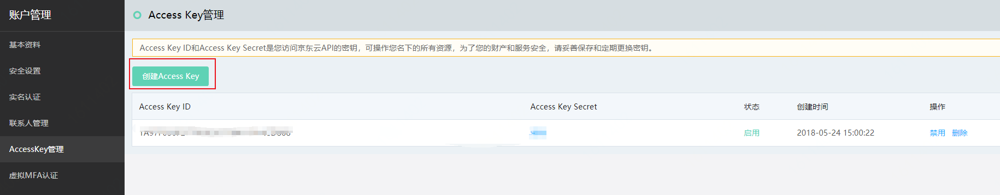

## **接入内容安全服务**

1、开通服务。进入京东云控制台，选择**云安全-内容安全**页面进入内容安全产品开通页，点击**立即开通**。产品开通后即可领取免费试用包，50000次调用服务，包含文本、图片、音视频调用及OSS违规检测，一个月内有效。

   

2、创建AccessKey和AccessKeySecret。到个人中心的AccessKey管理处，手动创建AccessKey和AccessKeySecret，作为调用服务的鉴权票据。

3、调用API服务。参照API文档，开发并调用内容安全服务。

4、查看统计数据和检测结果。打开京东云内容安全控制台，选择**云安全-内容安全**页面，查看统计数据、检测结果、流量包管理等信息。