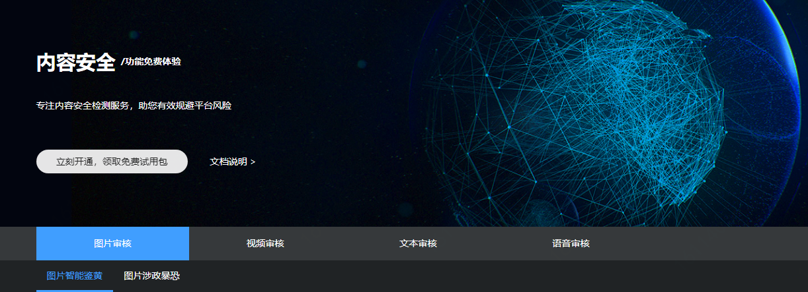
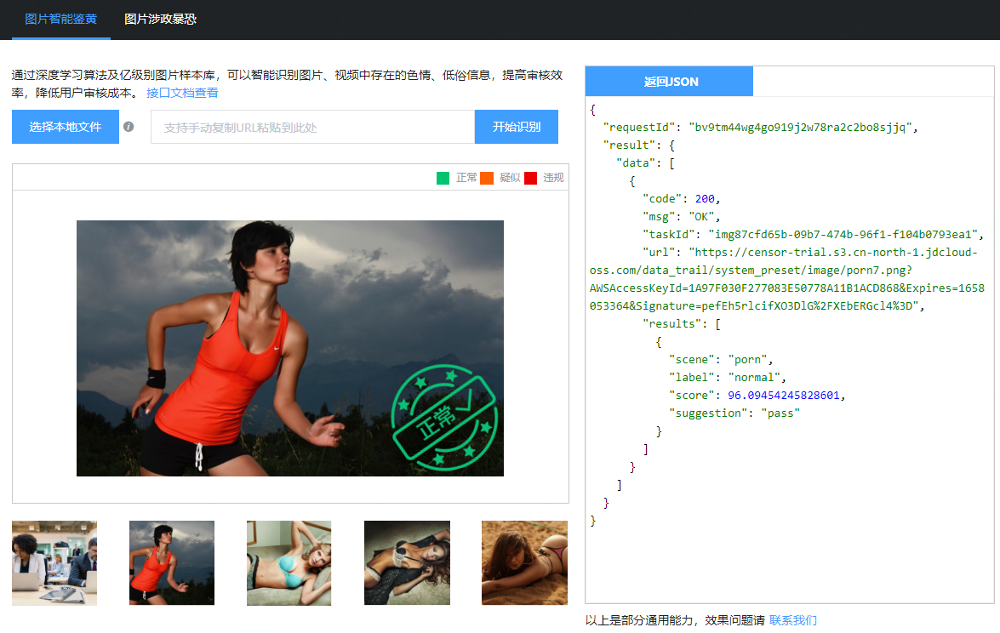
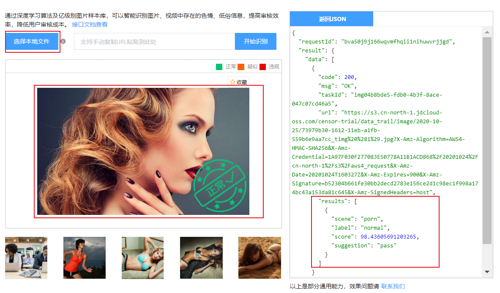
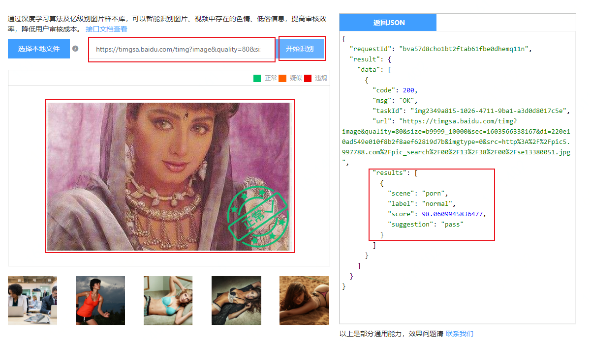

# 试用内容安全API检测服务

本文介绍了内容安全功能免费体验页面的使用方法。您可以通过功能免费体验页面试用内容检测API，直观了解内容检测API的检测能力。如果您希望快速集成内容检测服务到您的应用中，请参见API参考和SDK参考。

## 背景信息

内容安全提供[检测免费体验页面](https://censor-trial.jdcloud.com/index)，您可以无需编码就可以直观体验内容检测API的检测能力。您可以通过浏览器直接体验以下检测功能及场景。

| 功能         | 场景                                                         | 描述                                                         | 操作说明                                                     |
| :----------- | :----------------------------------------------------------- | :----------------------------------------------------------- | :----------------------------------------------------------- |
| 图片审核     | 图片鉴黄                                                     | 识别图片中的色情成分及量化色情程度。                         | 提供测试用图片，选择图片后直接内部发起调用，返回识别结果；也支持上传本地图片或粘贴图片URL进行识别。 |
| 暴恐涉政     | 识别图片中的暴恐、涉政成分，如暴恐旗帜、人物和场景以及敏感政治人物。 |                                                              |                                                              |
| 视频审核     | 视频鉴黄                                                     | 从截帧画面、声音、文字多维度分析，识别视频中的色情成分及量化色情程度。 | 不提供测试用视频，仅支持上传本地视频文件（.mp4格式）或粘贴视频URL进行检测。 |
| 视频暴恐涉政 | 从截帧画面、声音、文字多维度分析，识别视频中的暴恐、涉政成分。 |                                                              |                                                              |
| 语音审核     | 语音审核                                                     | 结合语音识别和文本反垃圾能力，识别语音中存在的涉黄、涉政、广告等违规信息。 | 不提供测试用语音，仅支持上传本地语音文件或粘贴语音URL进行检测。 |
| 文本审核     | 文本审核                                                     | 识别文本中存在的色情、暴恐涉政、广告、辱骂等垃圾信息。       | 支持随机生成文本或粘贴文本进行检测。                         |

下文以图片审核功能下的图片鉴黄场景为例，介绍使用默认的测试图片、上传本地图片、粘贴图片URL进行功能体验的具体操作。其他检测功能及场景的体验方法与之类似。

## 操作步骤

1. 访问[内容安全功能免费体验页面](https://censor-trial.jdcloud.com/index)并登录您的京东云账号。

2. 选择要体验的检测功能和场景。本示例中选择**图片审核** > **图片智能鉴黄**。

   

3. 选择一种操作方式进行图片鉴黄审核。

   - 识别默认测试用图片：从测试用图片中单击一张，直接进行识别。

     

   - 识别本地图片：单击**选择本地文件**，并上传要识别的图片。上传后直接进行识别。

     

   - 识别网络上图片：手动粘贴要识别图片的URL到输入框中，并单击**开始识别**。

4. 查看识别结果，左侧显示识别结果摘要，右侧显示具体的JSON返回参数。

   本示例（图片鉴黄场景）中，识别结果包括图片是否违规（**suggestion**）、机器审核结果的分类（**label**）和可信度（**rate**）等参数。

   **说明** 关于返回参数的含义，请单击试用模块上方的**接口文档查看**，跳转到当前检测场景对应的接口描述文档。

## 后续步骤

了解如何集成内容检测服务到您的应用中，具体请参见[API 概览](https://docs.jdcloud.com/cn/content-moderation/api-overview)。