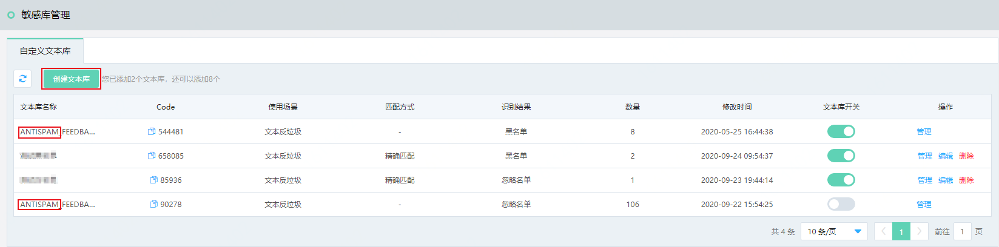
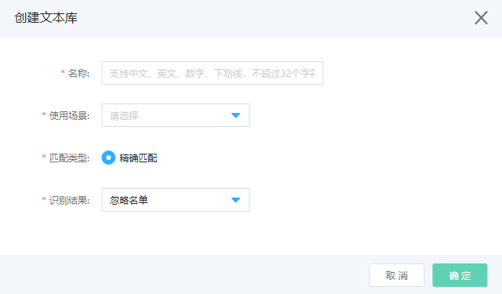
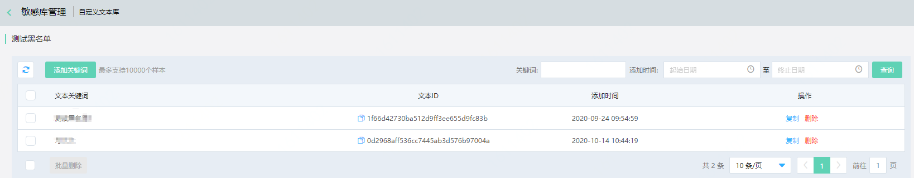
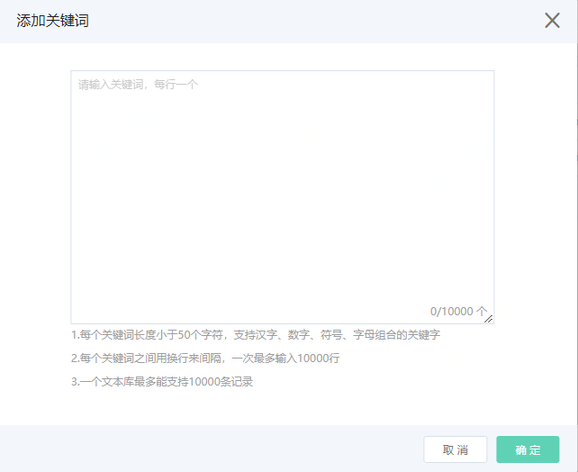

# 自定义文本库

内容安全默认依据京东全局风险文本库为您提供检测服务，可以满足大部分的常规检测需求。为了使检测结果更贴合您的实际业务，内容安全也支持自定义文本库。您可以使用自定义文本库来管理需要针对性地拦截、放行（忽略）、人工审核的文本，应对突发的管控需求。

## 背景信息

自定义文本库包括系统回流文本库和用户创建文本库。

- 系统回流文本库由您的自助审核记录自动生成，默认应用于所有同类场景的检测。您可以管理系统回流文本库中的文本，不可以操作系统回流文本库，例如停用或删除文本库。关于自助审核，请参见**自助审核**。
- 用户创建文本库由您自行添加，可用于某次检测或某类检测场景。您可以管理用户创建文本库中的文本，也可以操作用户创建文本库。

**说明** 您可以创建10个自定义文本库（不含系统回流文本库）。

在内容检测API中，自定义文本库适用于以下场景：文本反垃圾。

下文介绍了在内容安全控制台管理内容检测API自定义文本库的操作方法。

## 文本类型

自定义文本库的文本类型支持关键词类型。

- 关键词是针对短小词语进行防控的一种方式。您可以将其理解为：一句话或者一段文本里面是否包含某个既定词语，当包含该词语时，则表明命中该关键词。不同的业务场景支持配置不同的关键词。

## 使用限制

| 类型       | 项目                   | 限制                                                         |
| :--------- | :--------------------- | :----------------------------------------------------------- |
| **文本库** | 库个数                 | 不超过10个（不含系统回流文本库）                             |
| **文本库** | 库名长度               | 不超过30个字符                                               |
| **关键词** | 关键词类型             | 支持中文关键词支持用字母和数字作为关键词**说明** 检测时字母和数字会被当作整体进行分词。暂不支持英文关键词 |
| **关键词** | 单个文本库中关键词个数 | 不超过10000个                                                |
| **关键词** | 关键词最大长度         | 50个字符（包括符号）                                         |
| **关键词** | 中文关键词编码类型     | UTF-8                                                        |
| **关键词** | 关键词格式             | 不允许包含以下特殊字符（包括全角）：@ # $ % ^ * ( ) < > / ?, . ; _ + - = ‘ “ 空格 tab键 |

## 创建和管理自定义文本库

1. 登录[京东云内容安全控制台](https://censor-console.jdcloud.com/overview)。

2. 在左侧导航栏，单击**内容检测API** > **敏感库管理**。

3. 在**敏感库管理**页面，单击**自定义文本库**页签。

4. 单击**创建文本库**。

   

5. 在**创建自定义文本库**对话框，完成文本库配置，并单击**确认**。

   

   | 参数         | 说明                                                         |
   | :----------- | :----------------------------------------------------------- |
   | **名称**     | 为文本库命名。                                               |
   | **使用场景** | 选择文本库的使用场景。取值：**文本反垃圾**：[文本反垃圾](https://docs.jdcloud.com/cn/content-moderation/text-synchronous-detection-api) |
   | **匹配类型** | 取值：**精确匹配**：待检测文本中包括与库中的词完全一样的内容时才命中。 |
   | **识别结果** | 选择文本库的用途。取值： **黑名单**：若命中文本库中样本，则机审结果返回违规。 **疑似名单**：若命中文本库中样本，则机审结果返回疑似。 **忽略名单**：不检测文本库中样本，但是会检测除了样本库以外的其他内容。 |

   成功创建文本库后，您可以在文本库列表中查看新建的文本库。

6. 可选： 

   管理文本库中的文本。

   以下步骤以关键词文本库为例，介绍管理文本库中关键词的操作方法。

   1. 定位到要操作的文本库，单击其操作列下的**管理**。

   2. 在**文本库管理**页面，维护文本库内的关键词。

      

      **文本库管理**页面展示了所有已添加的关键词信息。

      **说明** 在文本库新增、删除关键词，大约需要15分钟生效。

      - 单击**新增关键词**，按照页面提示在文本库中增加关键词。

        

      - 选中不需要的关键词，单击**批量删除**，删除关键词。您也可以单击不需要的关键词下的**删除**，单独将其删除。

7. 删除、修改、停用文本库。回到文本库列表，选择要操作的文本库，单击其操作列下**删除**、**修改**、**停用**可以分别删除目标文本库、修改文本库的配置、停用文本库。