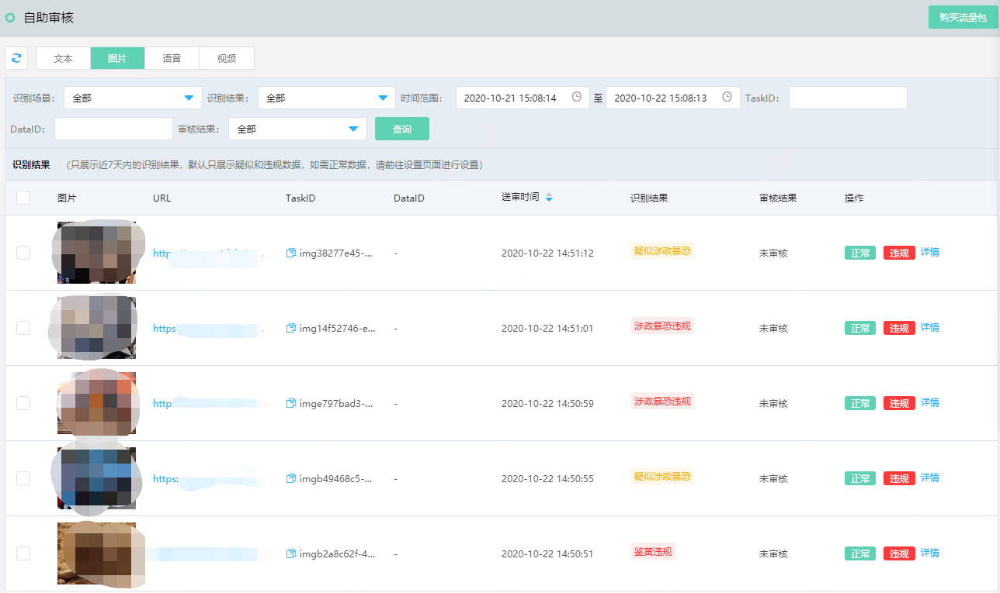
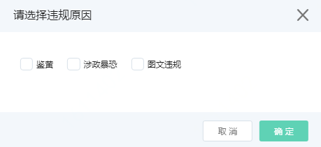
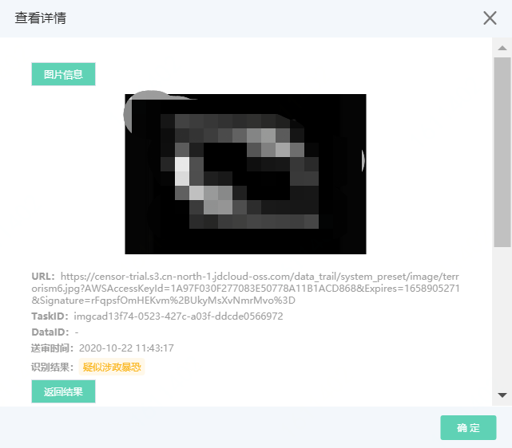
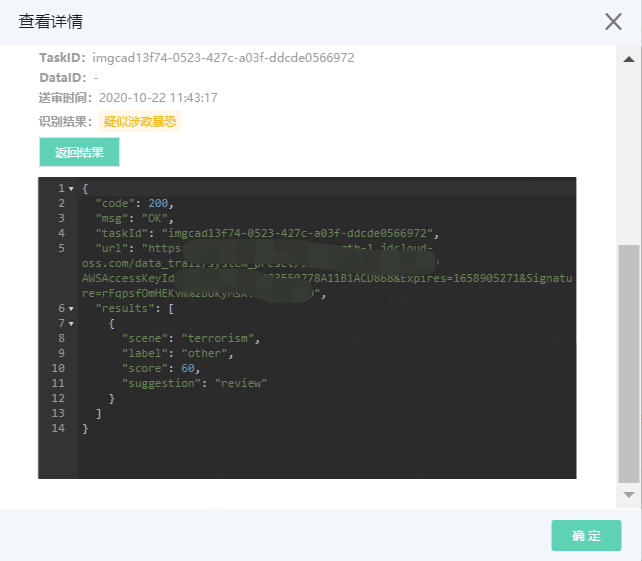
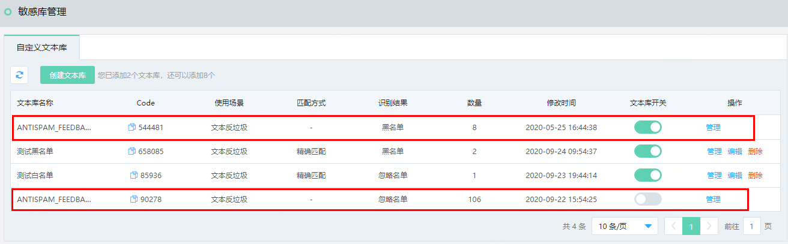
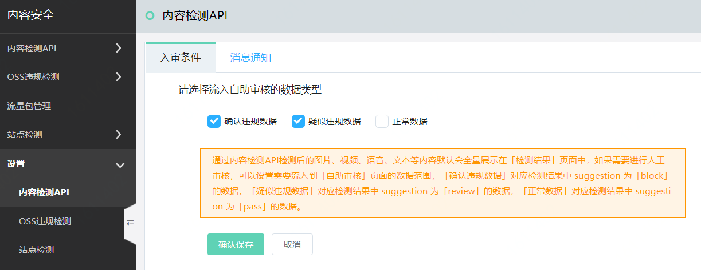
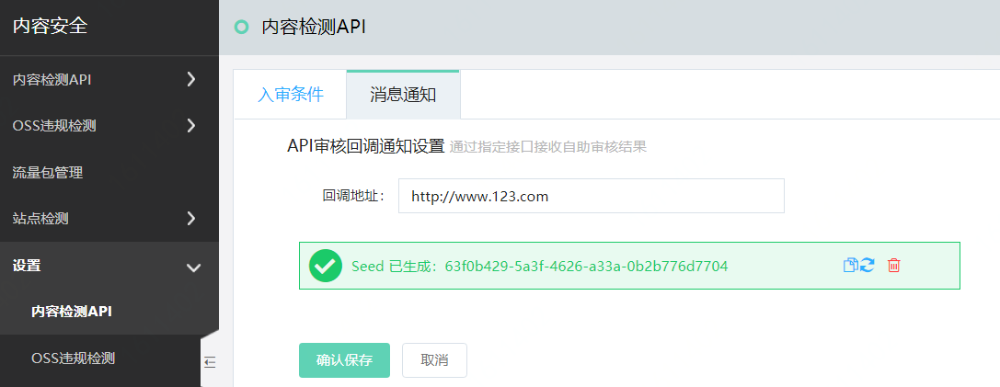

# 自助审核

内容安全控制台中呈现了内容检测API检测出的数据结果。针对您的业务场景，您可以对机器的检测结果进行二次人工审核；人工审核后，下次同样的检测内容识别出的结果会与您设置的结果保持一致。本文介绍了自助审核的使用方法。

## 背景信息

- 自助审核默认只展示机器审核结果为疑似（review）或者违规（block）的数据。如需设置入审数据类型，请参考本页内容。
- 机器的检测数据只保留最多7天，请及时处理。

## 操作步骤

1. 登录[京东云内容安全控制台](https://censor-console.jdcloud.com/overview)。

2. 前往**内容检测API** > **自助审核**页面。

3. 通过页签选择要审核的内容的类型（**图片**、**视频**、**文本**、**语音**），单击进入审核页面。

4. 按照以下方式进行标记。

   **说明** 仅以图片标记为例，其他类型内容的标记方法与之类似。

   

   - 对于您认为正常，却被识别为违规（block）或者疑似（review）的样本，将其标记为**正常**。

   - 对于您认为需要管控，却被识别为疑似（review）或者正常（pass）的样本，将其标记为**违规**，并选择违规原因：**涉黄**、**暴恐涉政**、**图文广告**。

     

   - 支持勾选多张图片后进行批量处理，如**批量标记正常**、**批量标记违规**。

   - 单击样本图片，查看其**详细信息**。

     

     

   

   对于被标记的图片样本的检测结果将会按照您的标记结果实时纠正，下次同样的图片将返回人工审核后的结果。

   被标记的文本样本同理，且样本返回到系统自定义文本库。

   

## 设置入审数据类型及消息通知

1. 登录[京东云内容安全控制台](https://censor-console.jdcloud.com/overview)。

2. 前往**设置**>**内容检测API**页面。

3. 选择**入审条件**页签，您可以选择流入自助审核的数据类型，默认选择确认违规数据和疑似违规数据。选择完毕后点击**确认保存**。

4. 选择**消息通知**页签，您可以填写回调地址，用于接收自助审核的检测结果。输入完毕后，点击**确认保存**。其中Seed表示京东云给接口传数据的认证，接收端请保存。

   

 

