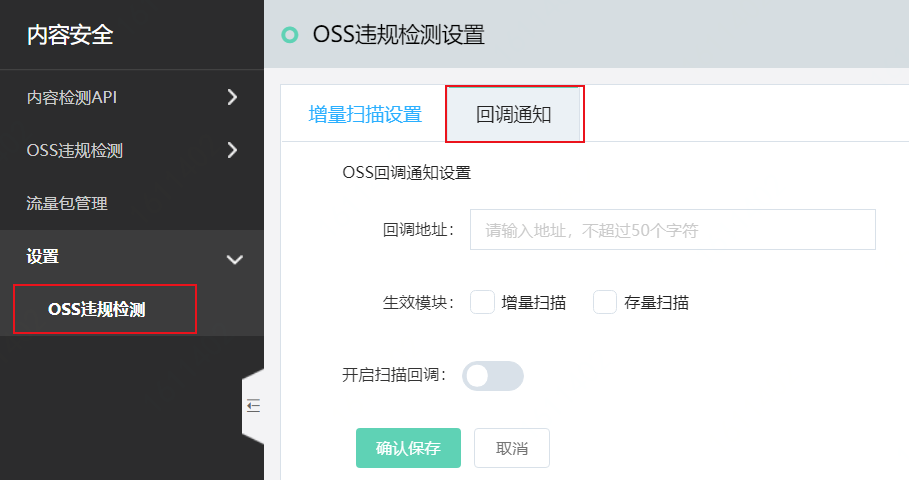
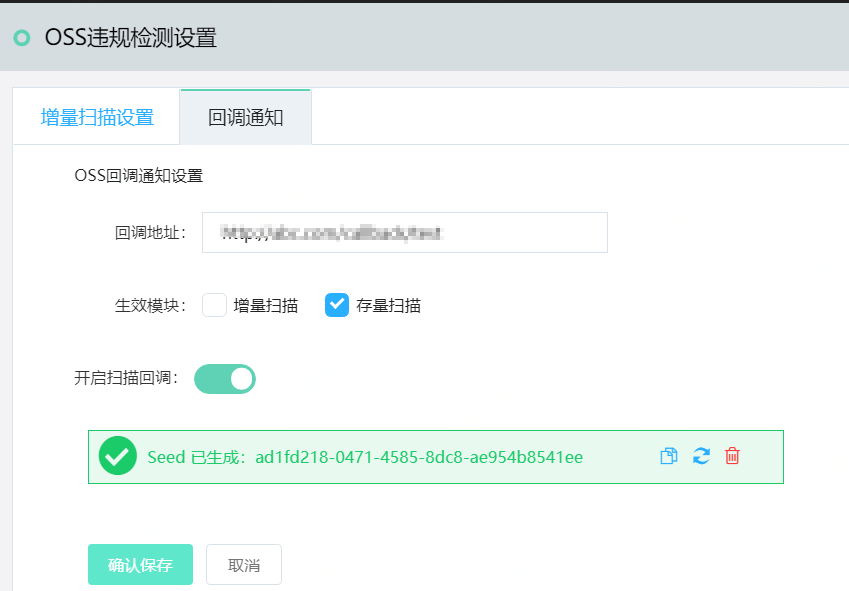

## 回调通知

内容安全支持以异步消息通知的方式向您发送机器内容识别的结果。若您的业务需要使用或集成相关数据，您需要配置回调通知。本文介绍了配置OSS违规检测回调通知的具体操作。

## 背景信息

内容安全回调通知是指扫描结果回调通知。

- 扫描结果回调通知：内容安全完成检测请求后，服务端将机器识别的结果以POST请求的方式，发送到您设置的HTTP回调通知地址。

## 相关概念

在配置回调通知前，请了解下表中描述的相关概念。

| 名称     | 说明                                                         |
| :------- | :----------------------------------------------------------- |
| 回调地址 | 回调地址是您在内容安全控制台配置的服务端地址，通常是您自己的业务服务器的公网地址。回调地址需要满足以下要求： 1. 回调地址应为HTTP, HTTPS协议接口的公网可访问的URL。 2. 回调方法：支持POST方法  3.支持传输数据编码采用UTF-8。 4. 回调格式为application/x-www-form-urlencoded。 5. 支持表单参数checksum和content。 |
| Seed     | Seed值用于校验发送到您设置的HTTP回调通知地址的请求是否来自内容安全服务端。 |
| 回调次数 | 您的服务端接收到内容安全推送的回调消息后，若返回的HTTP状态码为200，表示接收成功；若返回其他的HTTP状态码，均视为接收失败。若接收失败，内容安全服务端会重复推送回调消息，直至您接收成功。内容安全最多重复推送回调消息16次。 |
| 回调数据 | 回调数据是内容安全服务端向您设置的回调通知地址返回的数据内容。回调数据的结构描述见下表。 |

| 名称         | 类型   | 描述                                                         |
| :----------- | :----- | :----------------------------------------------------------- |
| **checksum** | String | 由用户uid + seed + content拼成字符串，通过SHA256算法生成。用户uid即账号ID，可以在[京东云控制台](https://censor-console.jdcloud.com/overview)上查询。**说明** 为防篡改，您可以在获取到推送结果时，按此算法生成字符串，与**checksum**做一次校验。 |
| **content**  | String | 字符串格式保存的JSON对象，请自行解析反转成JSON对象。关于**content**解析成JSON后的结构，请参见下文Content说明。 |

## 扫描结果回调通知

1. 登录[内容安全控制台](https://censor-console.jdcloud.com/overview)。

2. 前往 **设置**  > **OSS违规检测** 页面，并打开**回调通知**页签。

   

   

   回调通知配置的描述如下：

   |配置项       |  说明                                               |
   | :--------------- | :------------------------------------------------------ |
   | 回调地址     | 填入回调通知地址。                                      |
   | 生效模块     | 勾选要应用回调设置的功能模块，取值：增量扫描 / 存量扫描 |
   | 开启扫描回调 | 是否开启扫描结果回调。                                  |

   设置完成后，系统自动生成Seed。Seed值用于校验您的回调接口收到的请求来自京东云。请保存自动生成的Seed，根据需要应用于您的业务。	

   

## Content说明

启用回调通知后，内容安全将按照回调配置发送OSS违规检测的回调通知。扫描结果根据检测对象（图片、视频）的不同，结构有差异 。

图片与内容检测API图片异步检测通知回调的content相同。

视频与内容检测API视频异步检测通知回调的content相同。

