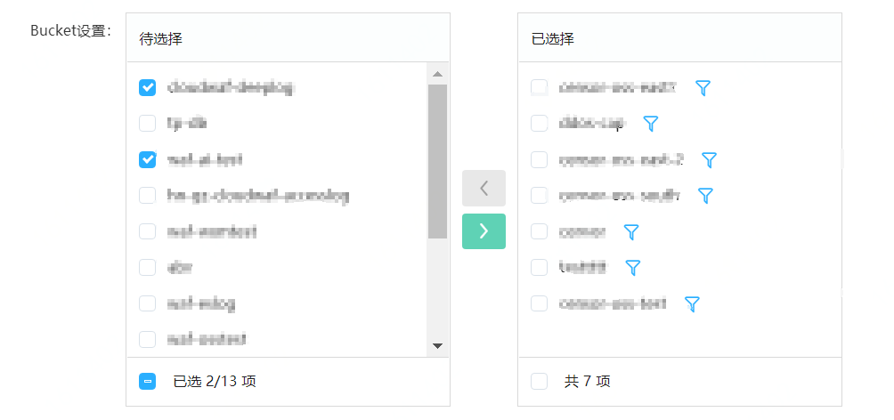
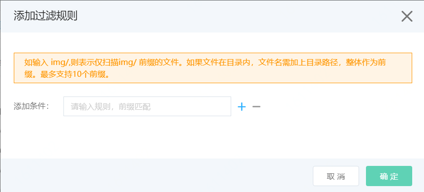
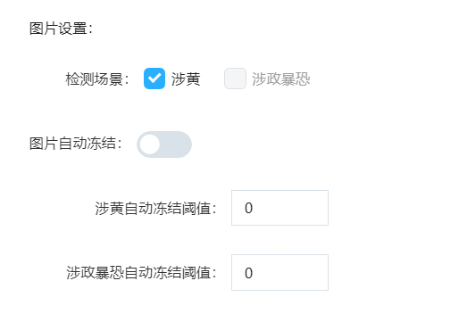
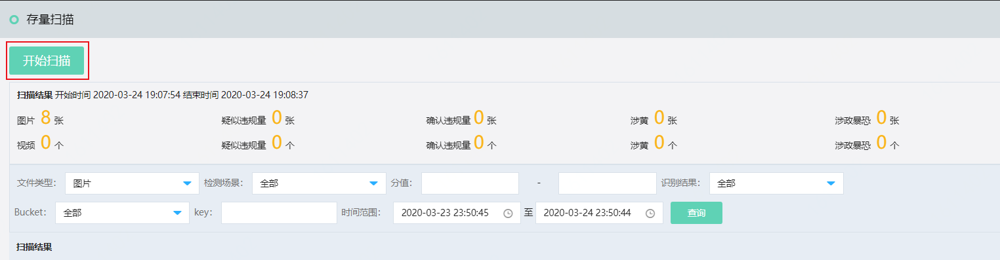
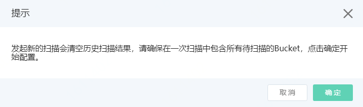
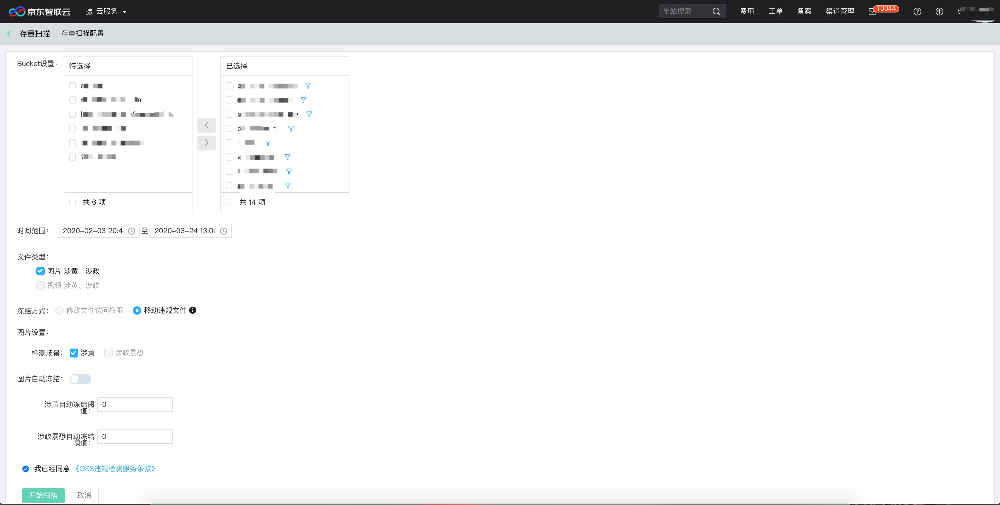
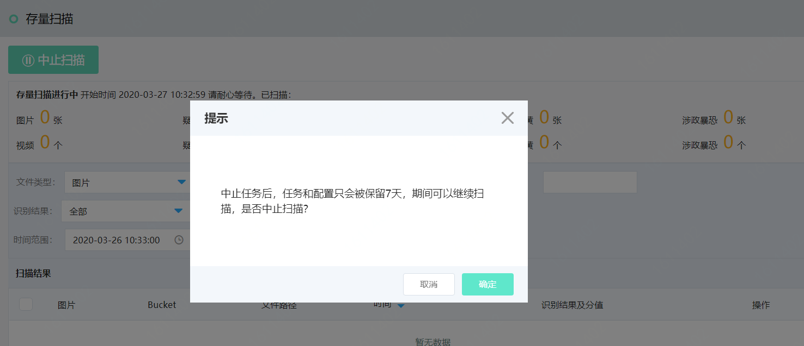

## 扫描设置

OSS违规检测支持检测OSS Bucket中的增量内容和存量内容。

- 增量内容（图片、视频）支持自动检测。增量检测一次配置即可长期生效。
- 存量内容（图片、视频）不支持自动检测。如果要对存量图片、视频进行检测，您需要手动设置要检测的Bucket和时间范围，并执行存量扫描。

### 设置增量扫描

增量扫描只需配置一次即可，配置完成后，每当您的Bucket中有新增的内容，系统会自动对其进行检测。

1. 登录[京东智联云内容安全控制台](https://censor-console.jdcloud.com/overview)。

2. 在左侧导航栏，单击**设置** > **OSS违规检测**。

3. 在**增量扫描**页签下，完成增量扫描配置。配置描述如下：

   步骤一、配置扫描对象Bucket设置。从左侧**待选择**框中勾选需要检测的Bucket，将其添加到右侧的**已选择**框中。**待选择**框中罗列了当前京东云账号在OSS中的可检测到的所有Bucket，选择需要检测的Bucket，移动到右侧已选择列表，完成选择。

   
   
   单击已选择bucket旁边的漏斗，可以设置规则。仅扫描指定前缀或者目录的文件，例如，如果填写img/，则表示在该Bucket里仅扫描img/开头的文件；如果您要扫描的文件在一个名叫 document/2019/文件夹下且前缀为img，可以添加ducument/2019/img。一个Bucket最多填写10条规则，填写如下图。
   
   

​	  步骤二、文件类型选择。支持对图片、视频进行检测，选择您需要的文件检测类型。

​	 步骤三、选择是否需要自动冻结。目前仅支持移动违规文件，将您的Bucket中违规的文件移动到您					Bucket中的备份目录下（bucket/censor_oss_backup/），并删除原路径下的文件。

​	 步骤四、配置图片和视频。图片可以选择鉴黄和涉政暴恐场景的检测。图片自动冻结功能可以选择开关打开或者关闭。当开启图片自动冻结时，默认涉黄、涉政暴恐违规阈值是99，您可以自行调整阈值范围。

​	  步骤五、勾选**已同意《OSS违规检测服务条款》**，**保存**扫描配置。

### 执行存量扫描

存量扫描为一次性的扫描动作，需要您手动配置并启动扫描。

1. 登录[京东智联云内容安全控制台](https://censor-console.jdcloud.com/overview)。

2. 前往**OSS违规检测** > **存量扫描**页面。

3. 单击**开始扫描**，并在提示对话框中单击**确认**。

   

   

   

4. 在**存量扫描设置**侧边页完成存量扫描配置。配置内容与增量扫描一致。

   

5. 单击**开始扫描**，立即启动扫描任务。

   扫描对象的数量越多，扫描需要的时间越久。请耐心等待扫描完成。

6. 可选： 

   中止/继续扫描。

   在存量扫描过程中，您可以随时**中止扫描**。

   

   