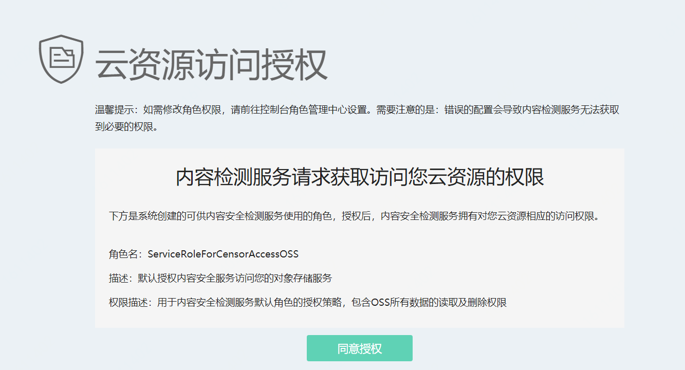

## OSS违规检测介绍

OSS违规检测使用人工智能技术帮助您检测京东智联云对象存储服务OSS中的图片、视频是否包含色情、涉政暴恐等违规内容，并支持自动冻结检测出的违规内容。通过扫描设置，您可以为OSS Bucket开启增量扫描，让内容安全自动扫描Bucket中的增量图片、视频；或者执行存量扫描，一次性扫描Bucket中的存量图片、视频。

## 背景信息

- OSS违规检测只向开通了京东智联云OSS（Object Storage Service对象存储服务）的用户提供服务。使用OSS违规检测前，您需要在内容安全控制台通过RAM授权内容安全服务读取OSS Bucket的权限。

  **说明** 您在首次登录内容安全控制台并访问OSS违规检测页面时，可以一键完成该操作。

- OSS违规检测支持检测OSS Bucket中的增量内容和存量内容。

  - 增量内容（图片、视频）支持自动检测。增量检测一次配置即可长期生效。
  - 存量内容（图片、视频）不支持自动检测。如果要对存量图片、视频进行检测，您需要手动设置要检测的Bucket和时间范围，并执行存量扫描。

- OSS违规检测支持对图片和视频对象应用多种场景的违规检测。

  - 支持的图片检测场景如下：涉黄、涉政暴恐
  - 支持的视频检测场景如下：涉黄、涉政涉政暴恐、语音反垃圾

- OSS违规检测支持检测特定格式后缀的文件。

  - 支持检测的图片格式如下：jpg、png、jpeg、gif、bmp
  - 支持检测的视频格式如下：.mp4、.m4v、.mkv、.webm、.mov、.avi、.wmv、.mpg、.flv、.3gp

- OSS违规检测目前支持扫描以下endpoint中的OSS Bucket：

  -  s3.cn-north-1.jdcloud-oss.com （华北-北京）
  -  s3.cn-south-1.jdcloud-oss.com （华南-广州）
  -  s3.cn-east-2.jdcloud-oss.com （华东-上海）
  -  s3.cn-east-1.jdcloud-oss.com （华东-宿迁）

## 使用授权

OSS违规检测只向开通了京东云OSS的用户提供服务，在使用OSS违规检测前请确保您已开通OSS。如果您还未开通OSS，请前往[OSS控制台](https://oss-console.jdcloud.com)

**说明** 如果您已开启OSS防盗链，则您必须在[OSS控制台](https://oss-console.jdcloud.com)将`https://censor-console.jdcloud.com `增加至Referer白名单。更多信息，请参见设置**防盗链**。

您只有通过RAM授权云盾内容安全读取OSS Bucket的权限后，才能使用OSS违规检测。授权步骤如下：

1. 登录[京东智联云内容安全控制台](https://censor-console.jdcloud.com/overview)。

2. 在左侧导航栏，单击**OSS违规检测**。

3. 根据页面提示，单击**授权**，授权京东智联云内容安全检测您的OSS图片。

   **说明** 如果您已授权内容安全检测 OSS，则此处没有提示。

4. 在**云资源访问授权**页面，单击**同意授权**，完成访问授权。

​		