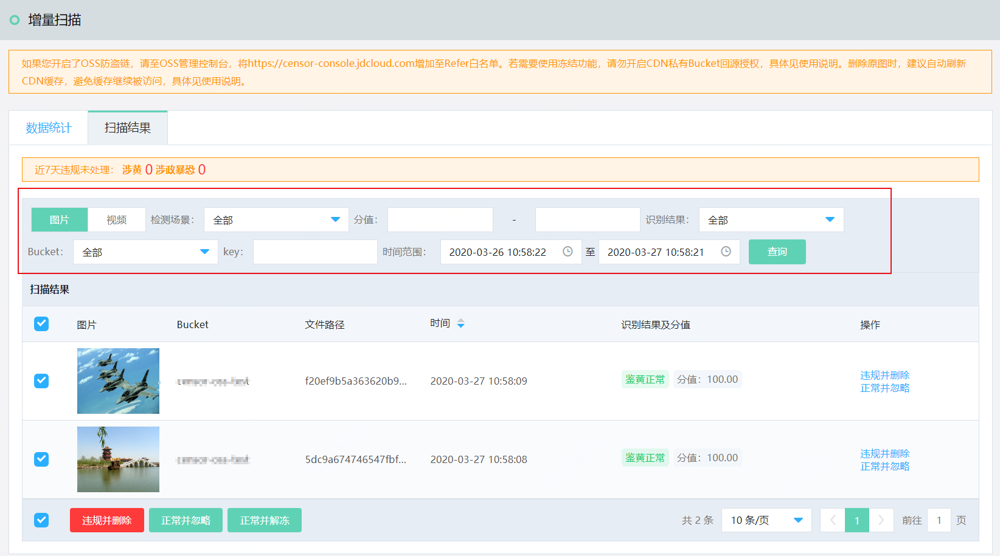

## 检测结果与自助审核

OSS内容检测任务执行完成后，您可以在控制台查询检测结果，并根据检测结果执行人工抽检和审核。本文以增量检测结果页面为例介绍了结果查询和自助审核的具体操作，存量检测结果的相关操作与之类似。

## 操作步骤

1. 登录[内容安全控制台](https://censor-console.jdcloud.com/overview)。

2. 前往**OSS违规检测** > **增量扫描** 页面，并打开**扫描结果**页签。

3. 设置查询条件，查询指定结果。

   您可以通过以下筛选项过滤结果数据，直接查看您希望看到的结果：**图片**/**视频**、**涉黄**/**涉政暴恐**、**分值**范围、**识别结果**、**Bucket**、**Key**值、上传的时间范围。其中，

   - 分值范围：每一张图片下方会有违规检测服务检测出的风险分值，分值范围是0~100，分值越高，代表文件违规的概率越大。
   - 识别结果：违规、疑似、正常。
   - Bucket：筛选扫描的Bucket。
   - Key：Bucket中文件（或文件夹）的完整路径。

4. 检测内容的下方会显示与该内容对应的操作项。您可以进行以下操作：

   - 单击**违规并删除**，可将图片/视频从内容安全控制台和OSS Bucket中一并删除。
   - 单击**正常并忽略**，则忽略该检测结果。忽略后该图片/视频将不再在控制台展示，并不影响存储在OSS Bucket中的图片/视频。
   - 选中一个或多个图片/视频后，单击**违规并删除**可将选中的图片/视频全部删除；单击**正常并忽略**可将选中的图片/视频全部忽略。
   - 若您设置了自动冻结功能，则还可以在选中图片/视频后单击**正常并解冻**，将已冻结的图片/视频解冻。

​    