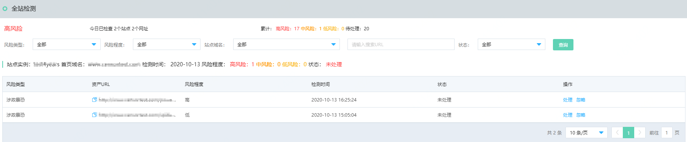
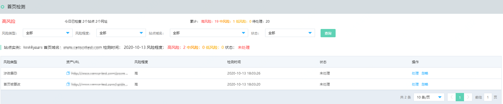

# 查看检测结果

启用站点检测服务后，您可以在内容安全控制台查看站点检测的结果。

## 操作步骤

1. 登录[京东云内容安全控制台](https://censor-console.jdcloud.com/overview)。
2. 在左侧导航栏，选择**站点检测-> 首页监测**，查看最近一次首页检测结果；或者选择**站点检测->全站监测**，查看最近一次全站检测结果。
   
   
3. 单击存在风险的URL，查看并确认风险。
   - 消除风险后，单击**已处理**，完成处理。
   - 如果您对结果有异议，您可以单击**纠错**或**问题反馈**，通过表单将问题反馈给我们。在确认问题后，我们将在算法层面进行优化改进。