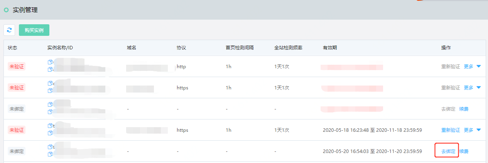
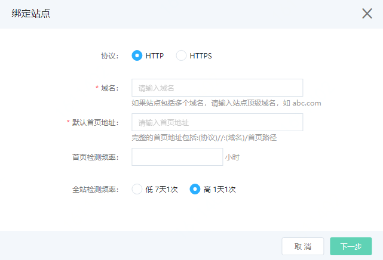
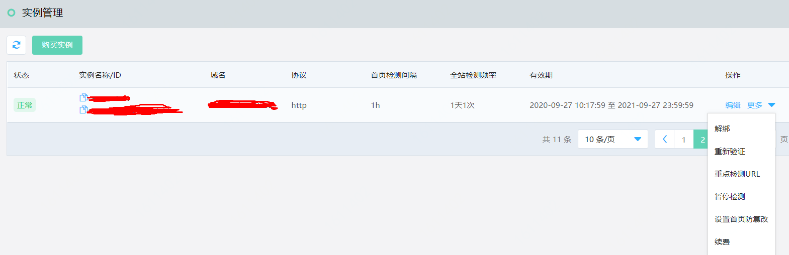

# 启用站点检测

购买站点检测实例后，您可以将实例绑定到您的网站，为网站启用站点检测服务。

## 前提条件

已开通内容安全服务并购买站点检测实例。具体操作请参见[开通与购买](https://docs.jdcloud.com/cn/content-moderation/purchase-process)。

## 操作步骤

1. 登录[京东云内容安全控制台](https://censor-console.jdcloud.com/overview)。

2. 前往**站点检测**>**实例管理**页面。

3. 选择一个有效的且处于**未绑定**状态的实例，单击其操作列下的**去绑定**，绑定站点。
   

4. 在**绑定站点**对话框中，完成网站信息和检测频率配置，并单击**下一步**。配置说明如下。

   

   | 配置             | 说明                                                         |
   | :--------------- | :----------------------------------------------------------- |
   | **协议**         | 勾选**HTTP**或者**HTTPS**，表示您的网站协议。**说明** 如果您的网站通过HTTP和HTTPS协议分别响应的内容差异较大，建议您使用两个实例，分别绑定网站的HTTP协议和HTTPS协议。 |
   | **域名**         | 填写您站点的域名，填写时不要包含`http://`或者`https://`。如果您的网站有多个频道子域名，建议您在这里填写根域名。假设您的网站有www.example.com、news.example.com、sports.example.com等多个频道内容需要检测，建议您在这里输入example.com。如果您只想检测news频道的内容news.example.com，您可以输入news.example.com。 |
   | **默认首页地址** | 填写完整的站点首页网址。输入的网址必须在您要绑定的域名下。   |
   | **首页检测间隔** | 设置每隔多少小时，访问您的网站首页进行一次检测。             |
   | **全站检测频率** | 选择执行全站检测的频率，可选值：**低：7天1次**、**高：1天1次**。**说明** 站点检测频率越高，检测占用的带宽及产生的带宽费用也越多。如果您的网站内容比较多，且网站带宽不足的话，过高的检测频率可能影响您网站的正常访问速度。如果您不希望影响网站性能，建议您选择较低的检测频率。 |

5. 在**验证站点**对话框，用主机文件验证的方式，参照对话框中的验证说明完成相应操作，然后单击**立即验证**。通过站点验证，证明您对站点的管理权，防止未经授权的检测。如果您暂时不方便进行验证，您可以单击**稍后验证**。

   验证通过后，完成站点绑定和检测设置，目标实例自动开始检测。

6. 可选： 

   回到**实例管理**页面，选择已启用的实例，在其**操作**列下，根据需要执行以下操作。

   - **暂停/启动检测**：如果您不希望在当前时间执行检测，您可以暂停检测；已暂停的检测，通过启动检测可以恢复。

   - **设定首页防篡改基准**、**添加重点监控URL**：添加的url支持优先检测，防止检测遗漏。

   - **重新验证**：如果您的验证失效或在步骤5中选择了**稍后验证**，您可以重新验证对站点的管理权。

   - **编辑站点**：修改实例绑定的站点和检测频率信息。

     > **说明** 如果您修改了站点或首页地址，需要重新验证。

   - **续费**：为目标实例续费，可以延长其使用时长。

   - **解除绑定**：如果您不希望继续向已绑定的站点提供检测服务，您可以解除绑定。

     > **说明** 解除绑定后，已购买的实例不会释放，但是您可以将其绑定到别的站点，为别的站点提供检测服务。

   

## 后续步骤

**查看检测结果**。