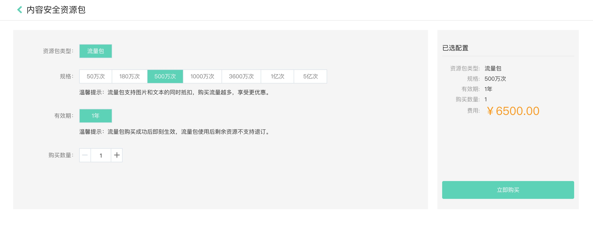

## 		购买方式

内容安全产品的内容检测API可以使用流量包抵扣。您可以预先购买一个固定额度的流量包，后续使用过程中产生的图片、文本检测费用从流量包中抵扣。

流量包购买流程如下：

方式一：**官网购买**

1. 登录您的京东云账号。
2. 进入京东云官网，选择**产品-云安全-内容安全**，点击立刻购买，前往**内容安全资源包购买页**。
3. 选择流量包规格。
4. 点击**立即购买**，并完成支付。

  方式二：**控制台购买**

​	 1、登录您的京东云账号。

​	 2、进入京东云控制台，选择**云安全-内容安全**-**流量包管理**页面，点击**购买流量包**，前往**内容安全资源包购买页**。

​	 3、选择流量包规格。

​	 4、点击**立即购买**，并完成支付。

流量包说明如下表：

| 类型/说明 | 资源包类型                                                   | 资源包规格                                                   | 购买时长                                                     |
| :-------- | :----------------------------------------------------------- | :----------------------------------------------------------- | :----------------------------------------------------------- |
| 流量包    | 一次性流量包。使用完或者到期即失效，可以购买多个，按照购买的时间顺序抵扣。 | 规格无法升级或降级，也无法续费。可以一次购买多个（规格越高，折扣越大）。 | 购买成功后即刻生效。一年后流量包到期。未用完的流量包不支持退订。 |

