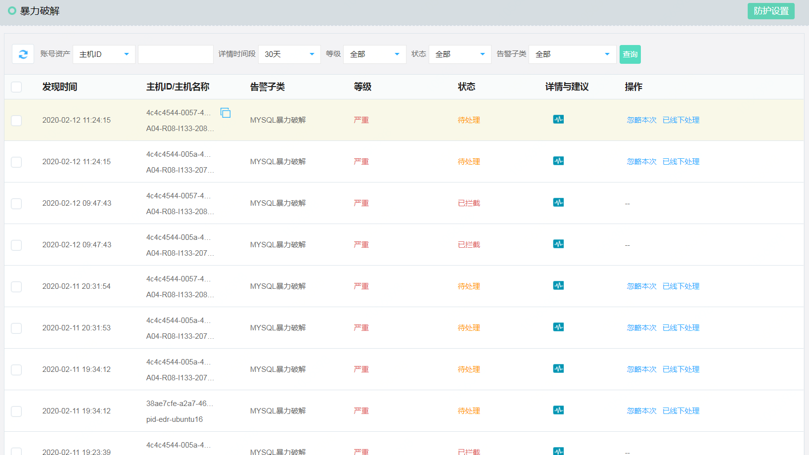
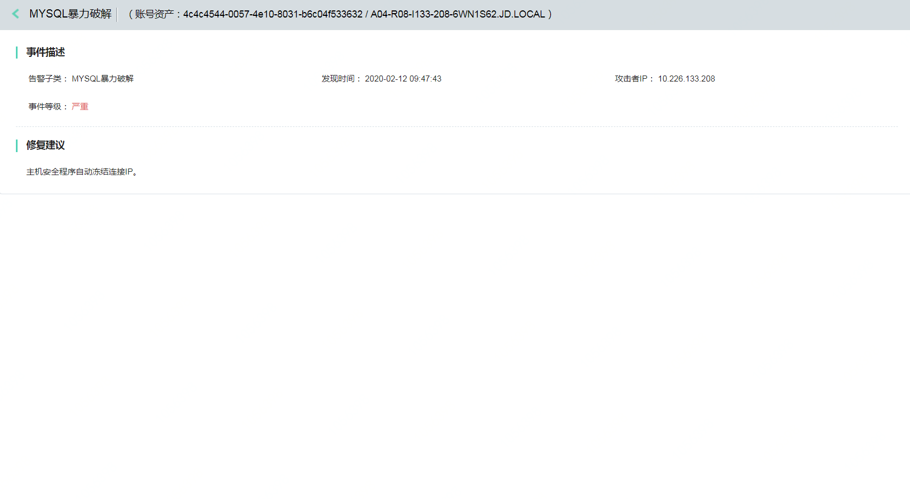

## 暴力破解

#### 功能描述

包括远程登录暴力破解、数据库防暴力破解、通过系统日志、网络数据包协议分析、端口等方式获取尝试暴力破解的IP，并判断其是否满足防护规则，若满足规则，则进行拦截并上报专有云平台。
支持列表：

| 功能大项 | 具体功能项|基础版 | 企业版 | 
|---- |-----|----| ----| 
| 暴力破解       |   SSH暴力破解    | * | * |
|         | RDP暴力破解     | * | * |
|         | MYSQL暴力破解     | * | * |
|         | SQLServer暴力破解     | * | * |
| 暴力破解成功       |   SSH暴力破解成功    |   | * |
|         | RDP暴力破解成功     |  | * |

#### 产品功能入口

进入控制台->【主机安全】->【风险发现】->【暴力破解】 

#### 操作指导

点击详情与建议，可查看具体安全事件详情和修复建议。

点击【防护设置】，对暴力破解功能设置开关，是否拦截，以及拦截策略，例外的IP白名单。

